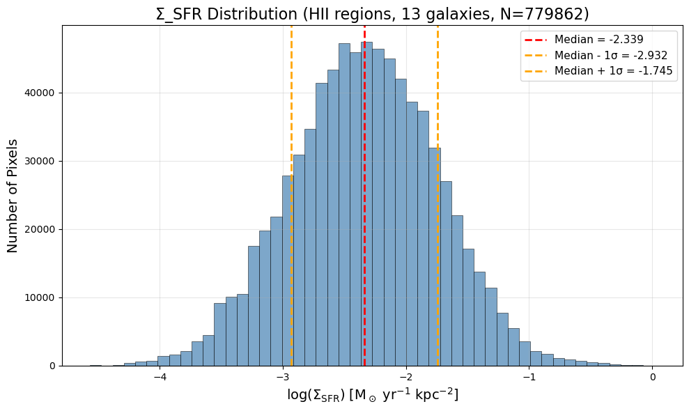
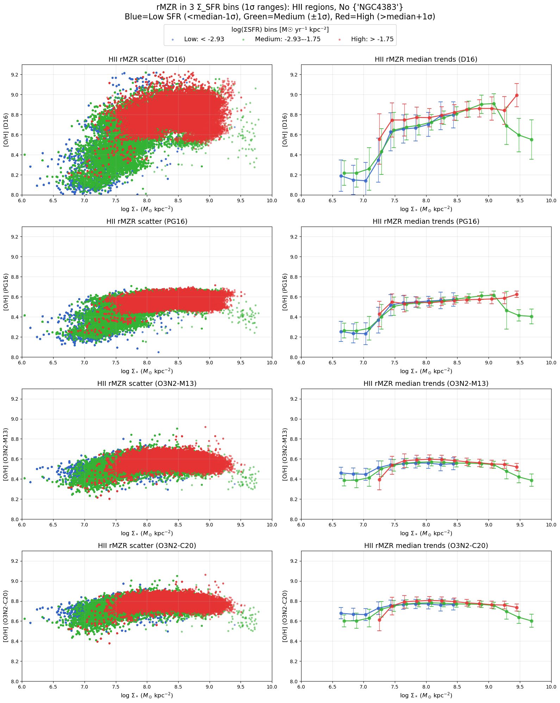
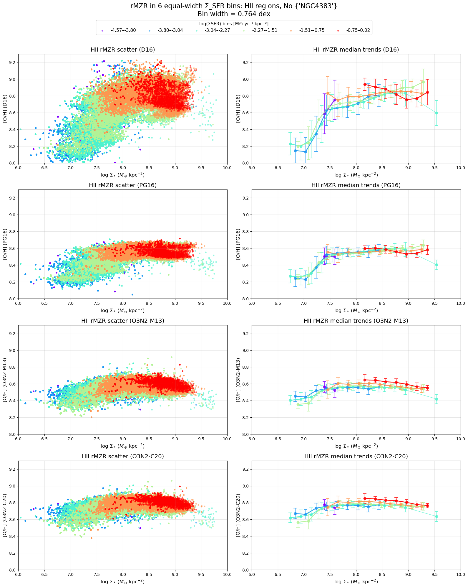
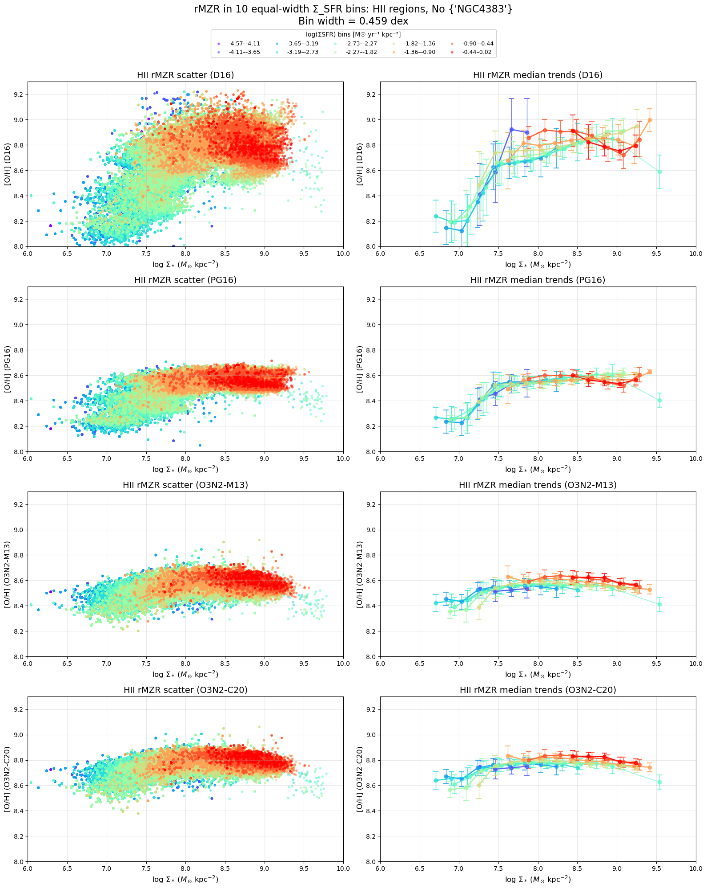
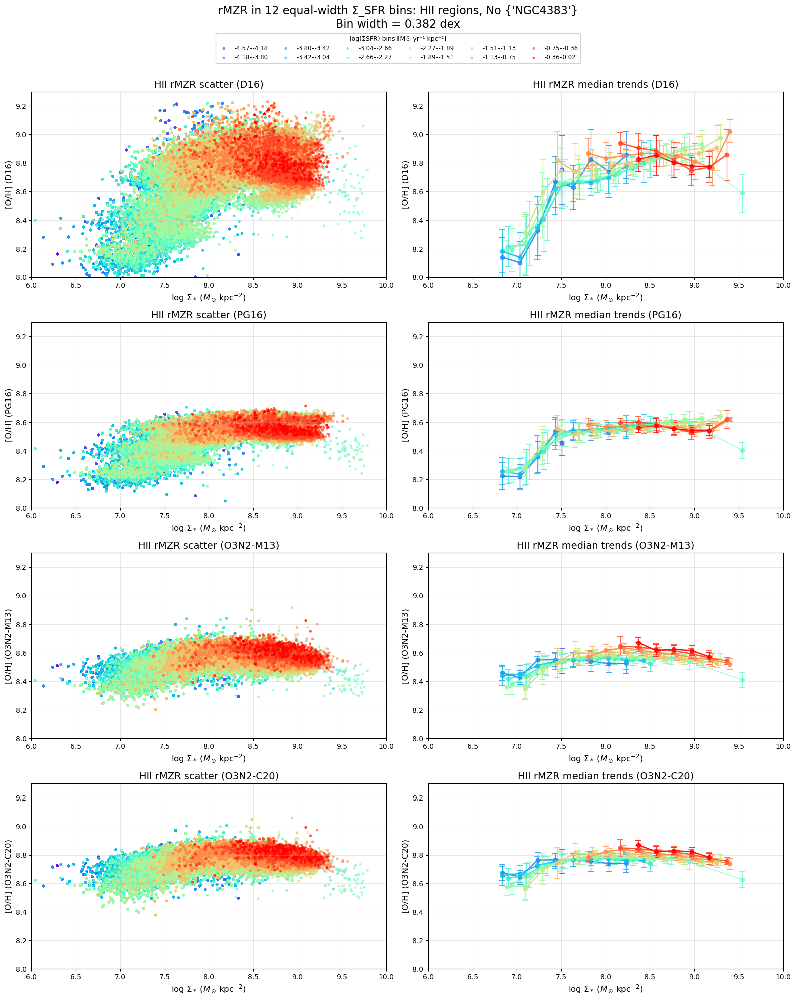
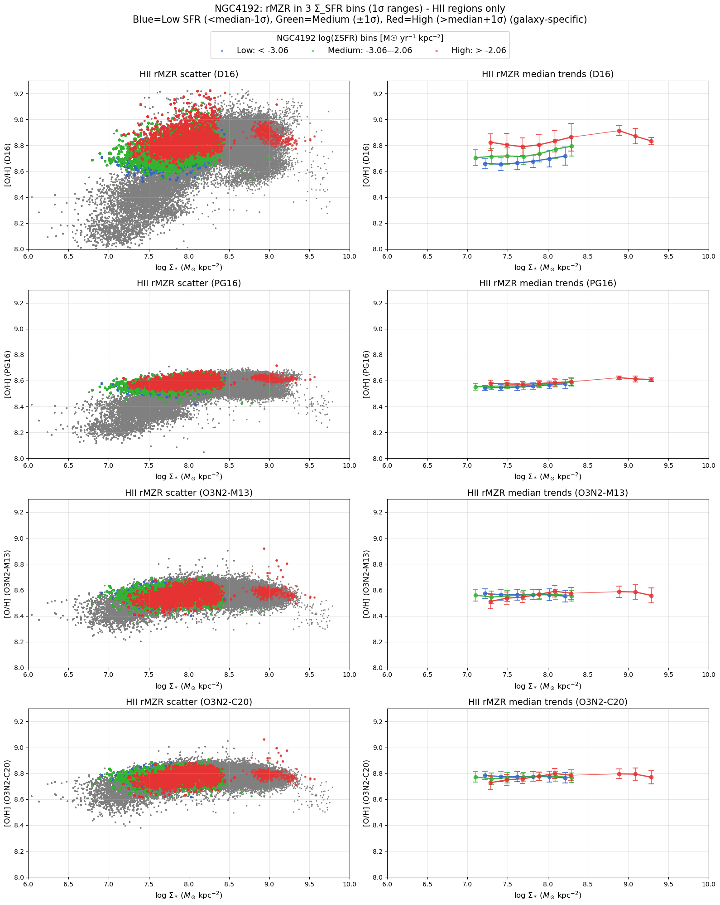
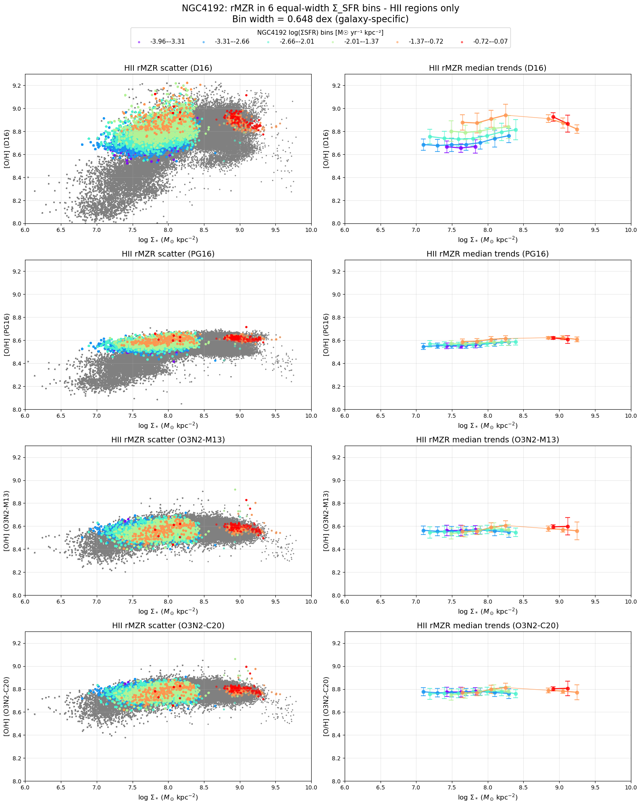
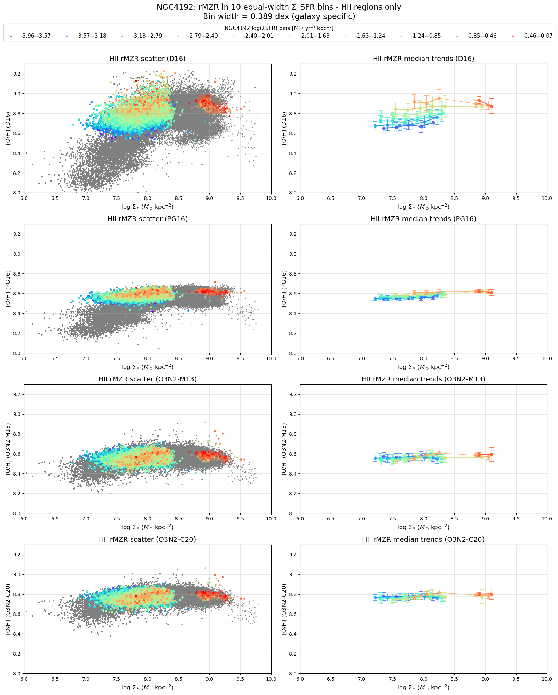
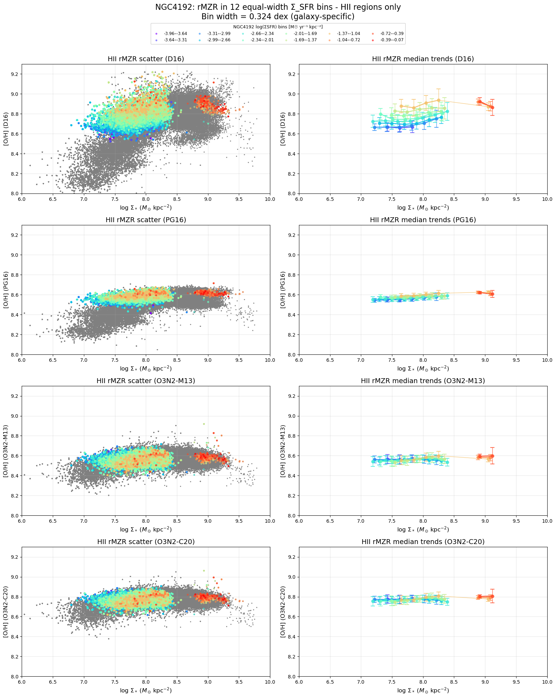

# 202051008 rMZR in HII But No NGC4383 Binning Effect

## $\Sigma_\mathrm{SFR}$ histogram

First, check the $\Sigma_\mathrm{SFR}$ histogram. 

Ok, so it is Gaussian shape and not surprising.

Then, we can seperate into 3 $\Sigma_\mathrm{SFR}$ bins in this case to check the rMZR. 

It looks like the inversion is still there. 

## Equal binwidth, bins = 6, 10, 12

In general, all looks fine. 

## NGC4192

However, the problem is that we can not tell if NGC4192 truely shows the inversion feature. For 3 bins, it still shows inversion; while for higher bins, the inversion looks vanish. 

