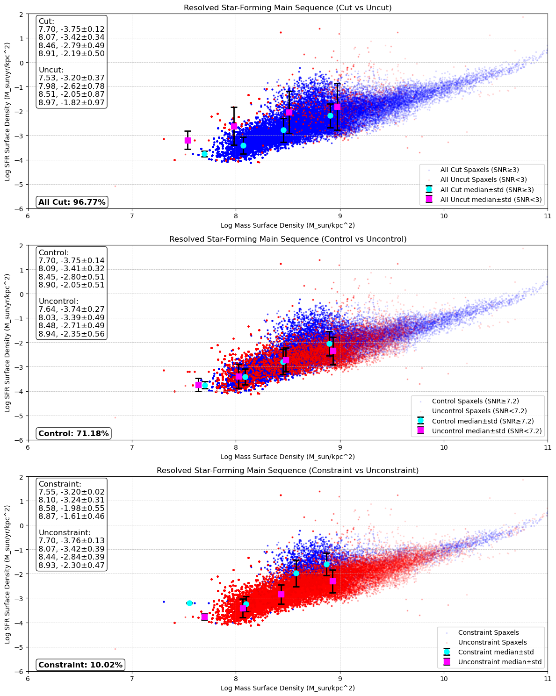
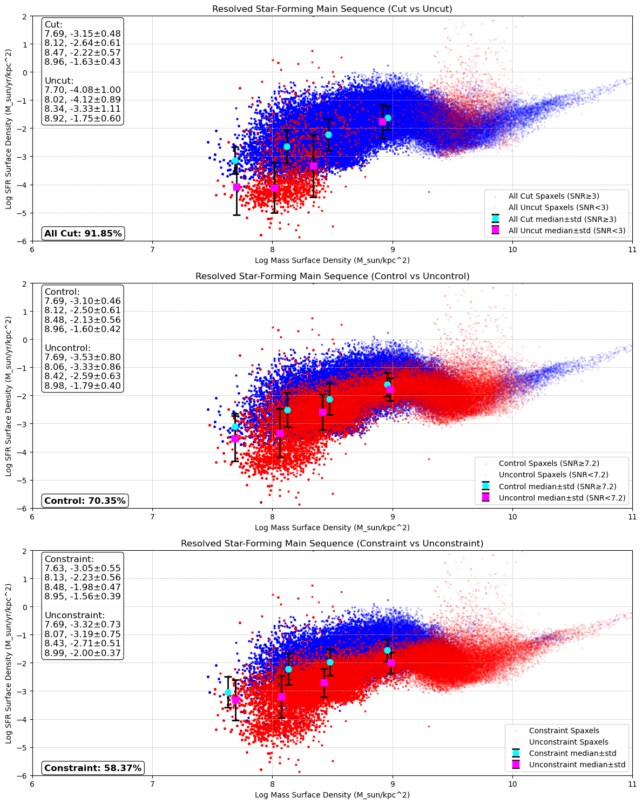

# 20250625 Check Median pm Std

The mian idea here is to see if the quality control (QC) creates an upper limit in resolved SFMS plot. 

## 1. Two different appraoches of QC

### 1. Uniform QC at all lines ("Cut" and "Control")

In this way, I require all emission lines need to have S/N higher than a particular value. If a spaxel has all lines' S/N higher than that value. I call it "Control" (or "Cut"), otherwise will be "Uncontrol" (or "Uncut"). In this experiment, I set $\rm S/N \geq 3$ for "Cut", while $\rm S/N \geq 7.2$  for "Control".

### 2. Adaptive QC at all lines ("Constraint")

Instead of setting a uniform value at all lines, I adopt another QC based on the error bar on both [N II] and [S II] BPT diagrams. That is, for each point on both BPT diagram, as long as its errorbars are all within a same region, I call it "Constraint". That means I have 68% confident to say that those "Constraint" spaxels can be located in a region on both BPT diagrams. Below is the example of this QC (blue dots are constaint, while red dots are not constraint):

## 2. Upper limit due to QC or not?

Now we have three different cases of QC: 

1. "Cut" or "Uncut": $\rm S/N \geq 3$ or "$\rm S/N \leq 3$"
2. "Control" or "Uncontrol": $\rm S/N \geq 7.2$ or "$\rm S/N \leq 7.2$"
3. "Constraint" or "Unconstraint": all error bars within same region or not

Then I can show the resolved SFMS plots of these three cases (upper, middle and lower panels) for all 14 galaxies. In each panel, I show the median values of each mass bin and the scatter (standard deviation) as the error bars. 

### 2.1 IC3392

### 2.2 NGC4064

### 2.3 NGC4192

### 2.4 NGC4293

### 2.5 NGC4298

### 2.6 NGC4330

### 2.7 NGC4383

### 2.8 NGC4396

### 2.9 NGC4419

### 2.10 NGC4457

### 2.11 NGC4501

### 2.12 NGC4522

### 2.13 NGC4694

### 2.14 NGC4698

## 3. Maybe 3 of them?

Most all them look fine for me, but only 3 of them may be showed as upper limit after QC: NGC4330, NGC4396 and NGC4522. 
