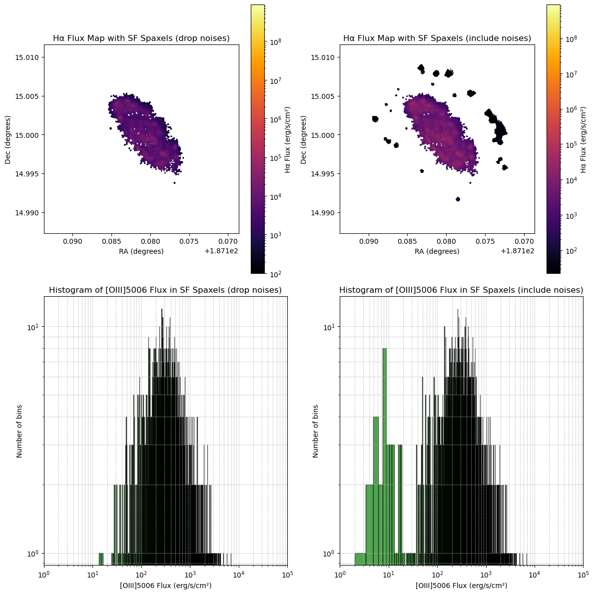
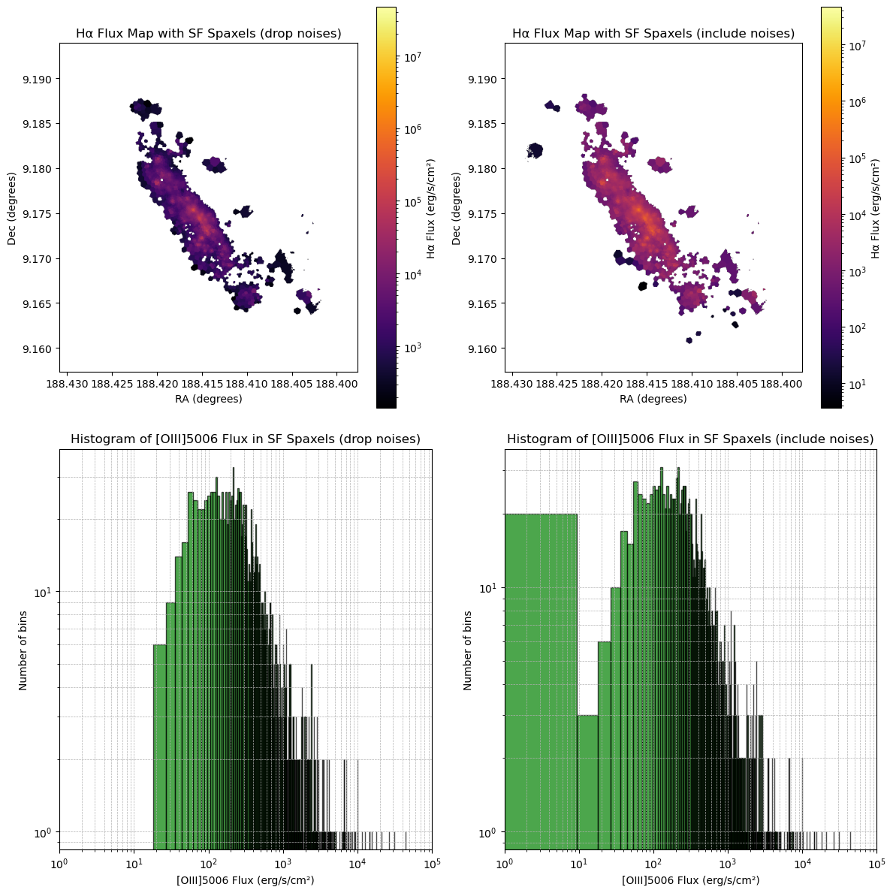

# 20250626 Noise Cut

Notice that even after applyting a basic all lines $\rm Flux/Flux_{err}\geq3$ cut, I still get some annoying spaxels look like noises. They are mostly in the outskirts of the galaxies and very low flux, so they are likely the noise. Hence, I add an additional basic cut on flux to remove these spaxels: any spaxels with all 6 lines' $\rm Flux \geq 10$ (in the unit of $10^{-20}$ erg/s) are signals, otherwise are noises and will be droped. As a result, now I have a QC that $\rm Flux/Flux_{err}\geq3$ & $\rm Flux \geq 10\times10^{-20}erg/s$. 

Below I show the comparison of including and removing noises (all lines $\rm Flux \geq 10\times10^{-20}erg/s$ or not) in SF (all lines $\rm Flux/Flux_{err}\geq3$ & constraint in both BPT & classified as SF in both BPT) spaxels. Upper panels are H$\alpha$ flux, while lower panels are histograms of [OIII], because noises are primary very low flux in [OIII]. 

I think 10 is good enough. For those galaxies that have a clear inner compact structure with some spaxels in the outer region (e.g., IC3392, NGC4064, NGC4298, NGC4330, NGC4419, NGC4694), I think this cut works well. 

## 2.1 IC3392

## 2.2 NGC4064

## 2.3 NGC4192

## 2.4 NGC4293

## 2.5 NGC4298

## 2.6 NGC4330

## 2.7 NGC4383

## 2.8 NGC4396

## 2.9 NGC4419

## 2.10 NGC4457

## 2.11 NGC4501

## 2.12 NGC4522

## 2.13 NGC4694

## 2.14 NGC4698

