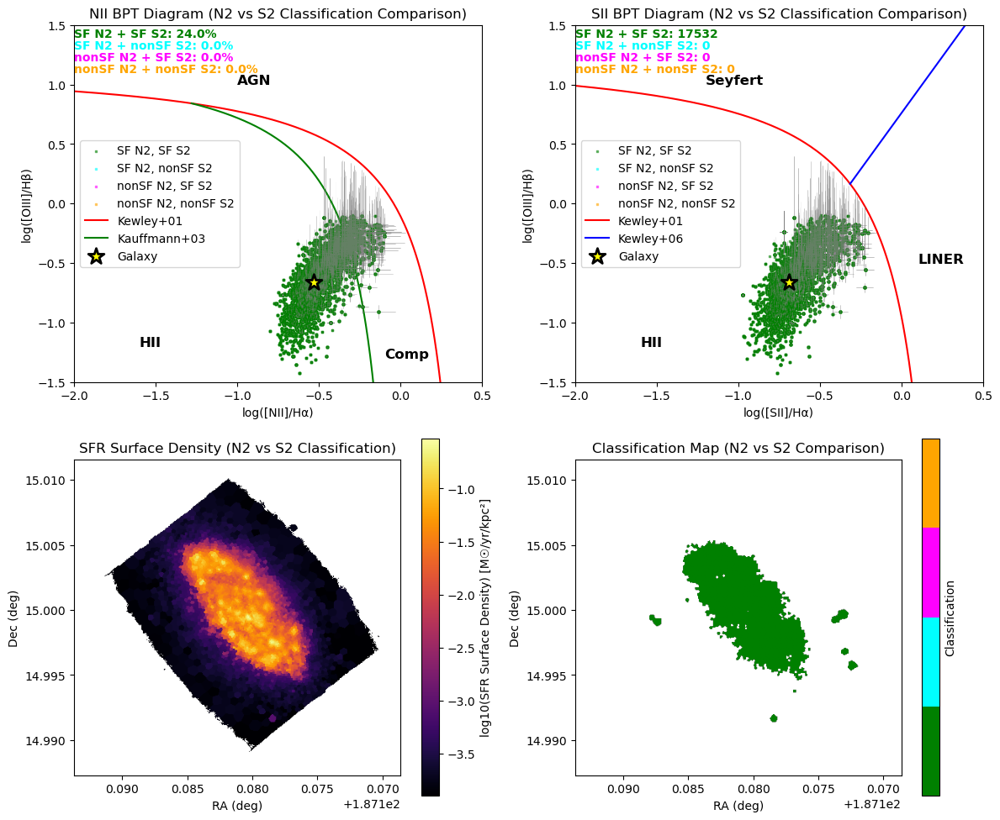
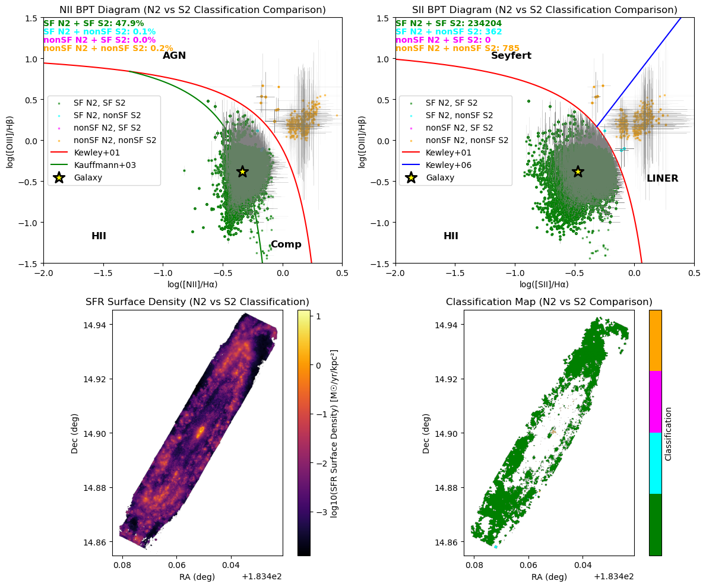
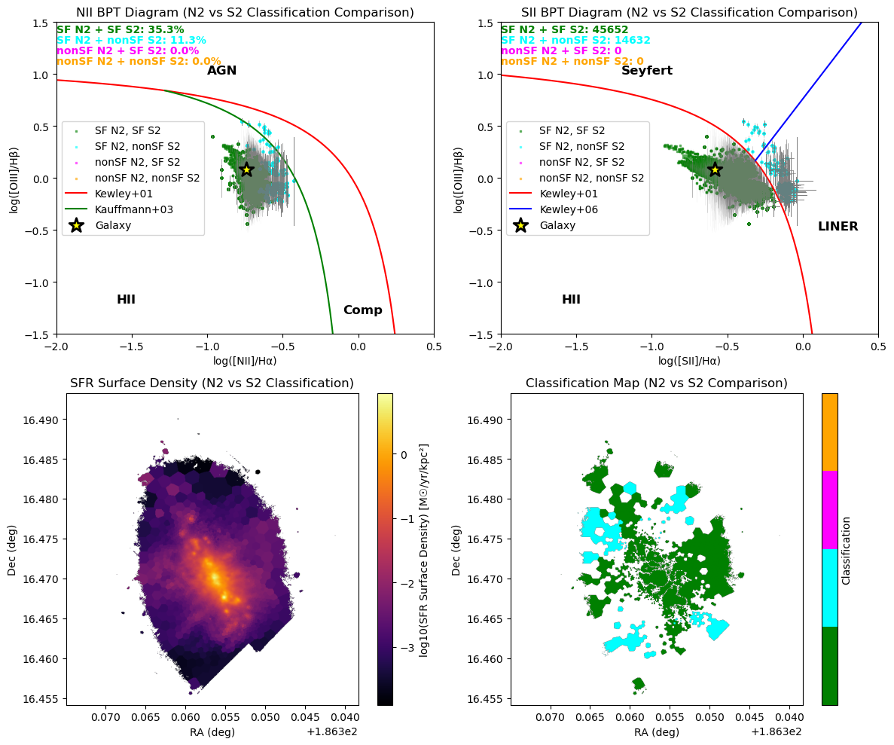

# 20250702 Consistency in [NII] and [SII] BPT

## 1. 4 catalogs (updated)

I have the QC for each line: $\rm FLUX/FLUX_{ERR} \geq 3$ and $\rm FLUX \geq 20\times10\ erg/s/cm^2$. 

Now I have divided all non-nan spaxels into 4 catalogs (here I use [NII] BPT as an example):

1. `Upper` (in color blue): not detected in Balmer lines, i.e., either H$\alpha$ or H$\beta$ or both does not pass the QC. 
2. `Unclassified` (in color red): detected in Balmer lines, but error bars are too large to locate the spaxel's position on the [NII] BPT diagram. 
3. `nonSF` (in color orange): detected in Balmer lines, constrainted on [NII] BPT diagram, and above the Kewley+2001 curve (red curve). 
4. `SF` (in color green): detected in Balmer lines, constrainted on [NII] BPT diagram, and below the Kewley+2001 curve (red curve). 

## 2. Consistency on [NII] and [SII] BPT

Now I want to see if `SF` and `nonSF` are consistent on [NII] and [SII] BPT diagrams, so in the `classified` spaxels in both BPT diagrams, I further have: 

```python
mask_SF_N2_SF_S2 = mask_classified_both & mask_SF_N2 & mask_SF_S2
mask_nonSF_N2_nonSF_S2 = mask_classified_both & mask_nonSF_N2 & mask_nonSF_S2
mask_nonSF_N2_SF_S2 = mask_classified_both & mask_nonSF_N2 & mask_SF_S2
mask_SF_N2_nonSF_S2 = mask_classified_both & mask_SF_N2 & mask_nonSF_S2
```

As expected, most of them are `SF` and they are consistent on both [NII] and [SII] BPT (in green), while there is 0 spaxels `SF` on [SII] but `nonSF` on [NII] BPT. However, the case that is `SF` in [NII] but `nonSF` on [SII] BPT become sifnificant in NGC4383, NGC4396, NGC4522. I can see that they are still not far from the boundary between HII and Comp, so I think they may be due to ambigus classification of SF region and harder ionisation.  

### 2.1 IC3392



### 2.2 NGC4064


### 2.3 NGC4192



### 2.4 NGC4293


### 2.5 NGC4298


### 2.6 NGC4330


### 2.7 NGC4383



### 2.8 NGC4396


### 2.9 NGC4419


### 2.10 NGC4457


### 2.11 NGC4501


### 2.12 NGC4522


### 2.13 NGC4694


### 2.14 NGC4698


