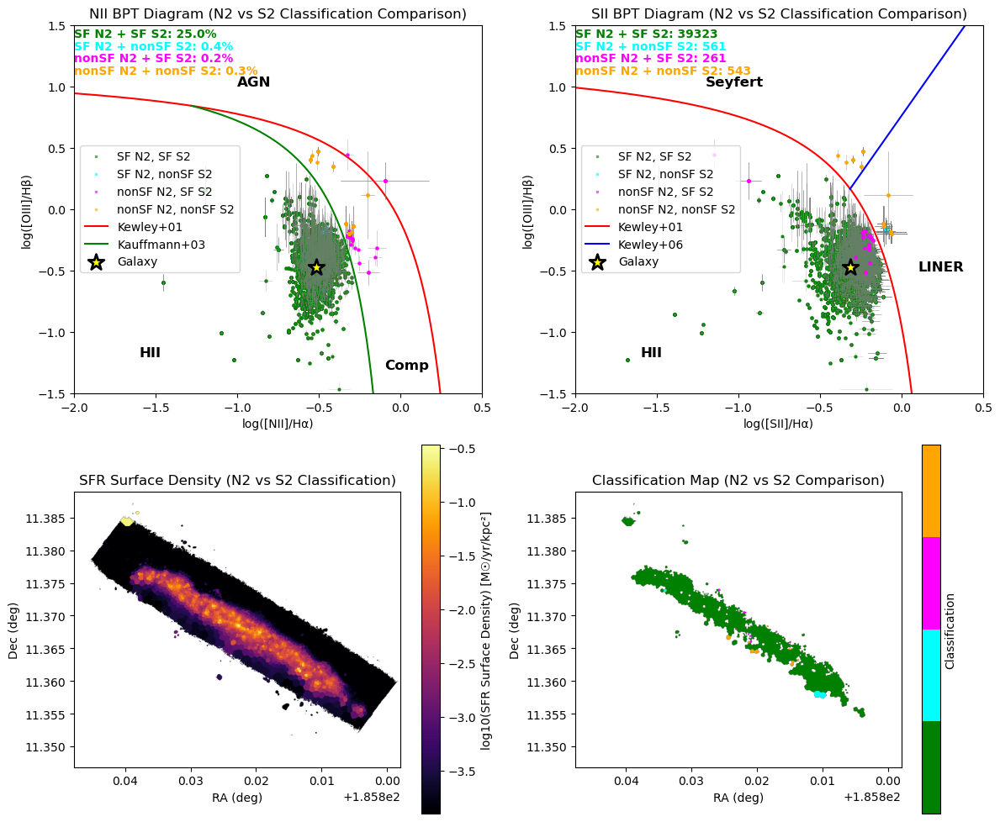

# 20250703 Consistency in NII and SII BPT (Comp is nonSF)

Now I try to see what if I set `Comp` to be `nonSF` as well.

## Consistency on [NII] and [SII] BPT

### 2.1 IC3392

### 2.2 NGC4064

### 2.3 NGC4192

### 2.4 NGC4293

### 2.5 NGC4298

### 2.6 NGC4330

### 2.7 NGC4383

### 2.8 NGC4396

### 2.9 NGC4419

### 2.10 NGC4457

### 2.11 NGC4501

### 2.12 NGC4522

### 2.13 NGC4694

### 2.14 NGC4698

