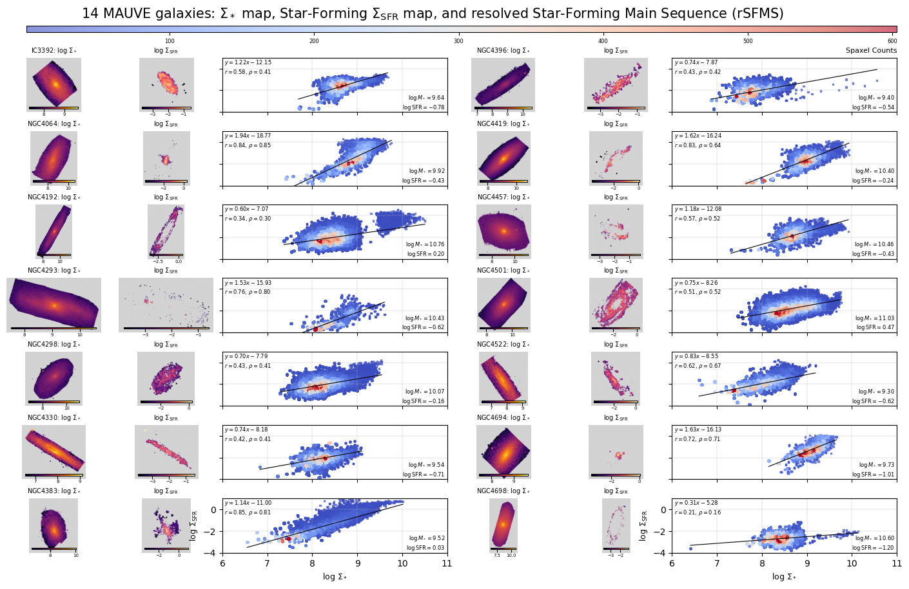
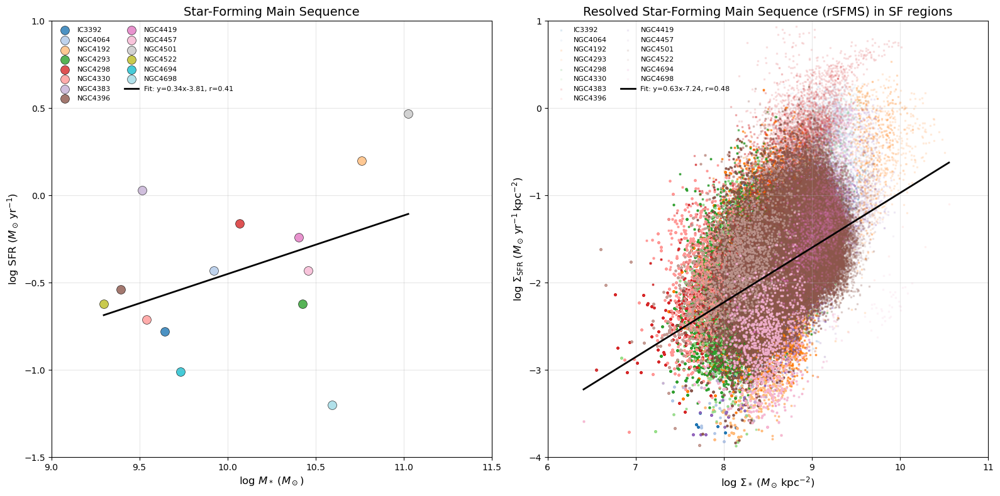

6-month proposal — **why** the Virgo-cluster data set is ideal for testing how galaxies “self-regulate,” **what** concrete hypotheses we will test, and **how** each data product (MUSE, VERTICO CO, WALLABY H I, etc.) fits into that plan. 

------

## 1 · Over-arching science question

Galaxies appear to sit on a quasi-equilibrium self-regulating “bathtub” model: gas inflow fuels star formation; stellar/AGN feedback launches outflows; the balance fixes the gas reservoir and thus the metallicity Z. The simplest analytic form predicts a tight three-parameter surface,

$Z = f\bigl(M_\star, \; SFR,\; \dot M_{\rm in/out}\bigr),$

which observationally translates into the **fundamental metallicity relation** (FMR) between stellar mass, SFR, and gas-phase metallicity. ([Belfiore et al. 2019](https://academic.oup.com/mnras/article/487/1/456/5487519))

Yet the exact dependence—and whether SFR is merely a proxy for *gas mass*—remains contested ([Bothwell et al. 2013](https://arxiv.org/abs/1304.4940)). They found a tight HI-FMR (HI mass to replace SFR). 

MZR and FMR behave differently in different galaxies, especially on **kpc scales** and in dense environments, ([Bulichi et al. 2023](https://arxiv.org/abs/2309.07919)): We find that both the MZR and FMR exhibit different behaviours within different star-forming regions of the galaxies. 

### Why Virgo?

- It supplies a wide dynamic range in external pressure, ram-pressure stripping, and tidal forces
- VERTICO and MAUVE-ALMA adds matched-resolution CO(2-1) maps; MAUVE/MUSE provide optical IFU cubes—an unrivalled multi-phase view. May also consider MEERKAT to add H I. 

Hence Virgo lets us ask: **does the resolved FMR break in regions where environment throttles the gas supply?**

------

## 2 · Some notes

| Topic                                               | Consensus                                                    | Open Issues                                                  |
| --------------------------------------------------- | ------------------------------------------------------------ | ------------------------------------------------------------ |
| **stellar/gas FMR**                                 | [Looser et al. 2024](https://academic.oup.com/mnras/article/532/2/2832/7700710): stellar fundamental metallicity relation (FMR), a smooth relation between stellar mass, star formation rate, and the light-weighted stellar metallicity of galaxies, analogous to the well-established gas-phase FMR. | Using stellar metallicity instead of gas-phase metallicity is interesting. May be worth to look at. |
| **Resolved FMR** (∼1 kpc) This is my first project. | Several IFU surveys (CALIFA, MaNGA, SAMI) find an $\Sigma_*$–$Σ_{\rm SFR}$–Z plane. | Ok, so what if we consider the environmental effects? Our hypothesis is that they may not form a plane. |
| **Bathtub models**                                  | Capture radial metallicity gradients when inside-out growth and SFE gradients are added. ([Belfiore et al. 2019](https://academic.oup.com/mnras/article/487/1/456/5487519)) | No issue, but we mention bathtub model just to act as a big picture of my project. |
| **Virgo environment**                               | Cluster dwarfs show suppressed Z at fixed M⋆, hinting at pristine-gas accretion in filaments vs stripping in core. ([Chung et al. 2021](https://ar5iv.labs.arxiv.org/html/2110.07836)): We find that, at a given stellar mass, SFDGs in the Virgo filaments show lower metallicity and higher sSFR than those in the Virgo cluster on average. | This could be a hint for my project.                         |
| **Gas vs SFR**                                      | HI-selected work suggests HI mass explains Z scatter better than SFR. Gas-selected samples hint that *gas mass* produces an even tighter relation (HI-FMR). ([Bothwell et al. 2013](https://arxiv.org/abs/1304.4940)) | Whether **H₂** (CO) plays the same role on kpc scales is still unclear. |

------

## 3 · Specific gaps that my thesis can fill

1. **Does the resolved “plane” truly exist in Virgo Cluster environment?** This is my first project clearly!!!
2. **Is $\Sigma_{\rm SFR}$ fundamental, or does replacing it with $\Sigma{\rm HI}$ or $\rm H_2$ tighten the relation?**
4. **Are gas-phase and stellar-phase FMRs coupled or divergent on sub-kpc scales?** 
