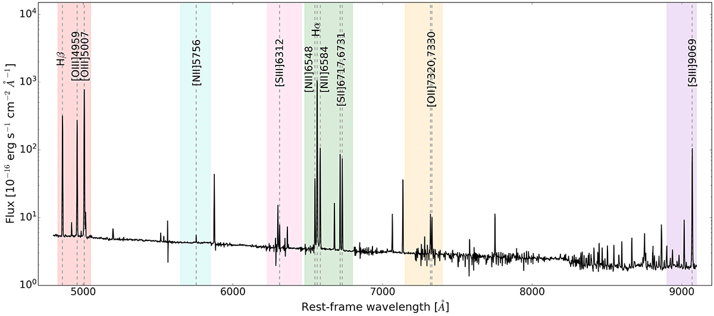

Here is a report that begins with an overview of methods for deriving auroral line metallicities—especially referencing Section 4.1 of Kewley et al. (2019)—and then cover:

1. Methods to extract oxygen abundance [O/H], with attention to strengths and limitations.
2. Calibration techniques for [O/H] under star-formation-driven ionisation conditions, specifically using VLT/MUSE data, including the issue of missing [OII] lines (as discussed in Brazzini et al. 2024).
3. A brief comparative discussion of estimating gas-phase metallicities under non-SF ionisation conditions (e.g. Kumari et al. 2019).

# Gas-Phase Metallicity: Auroral and Strong-Line Calibration Methods

Gas-phase oxygen abundance (metallicity) in H II regions is most reliably measured via the **direct (Te) method**, which uses weak *auroral* emission lines to determine the electron temperature.  The classic procedure (e.g. [Kewley et al. 2019](https://chatgpt.com/g/g-p-68649effec8c8191a0e6d39c8ce39a5a-deep/c/687c8c7a-88cc-8008-a97a-504989ef2bcd#ref-Kewley2019) Sect.4.1) is as follows: one measures temperature-sensitive line ratios (e.g. [O III] λ4363/λ(4959+5007) or [N II] λ5755/λ6584) to infer the electron temperature Te in the O^++ or N^+ zones.  The measured Te (often from [O III]4363 and [N II]5755) is then used with atomic physics models (e.g. five-level atom codes) to compute the ionic abundances O^+/H^+ and O^++/H^+.  These ionic abundances are summed (and corrected via an ionization correction factor, ICF) to give the total O/H.  This “direct” method has the advantage of being grounded in basic physics (Te from data), but the auroral lines are exceedingly faint – often 100× weaker than the strong nebular lines.  For example, Fig.1 illustrates a PHANGS–MUSE spectrum where auroral lines like [N II] λ5755 and [O II] λλ7320,7330 are barely visible above the continuum.  Consequently, detecting these lines requires long exposures and is generally only feasible in relatively low-metallicity or high-excitation regions.  At high O/H (≳ 8.7), [O III] λ4363 effectively vanishes, biasing direct-method samples to metal-poor H II regions.  In addition, temperature gradients or density variations within an H II region can introduce systematic errors.  In short, the auroral (Te) method is the most **physically direct** and robust approach, but **extremely faint lines** and sample biases (toward bright, low-Z regions) limit its application.



 *Fig.1: Example spectrum of an H II region from PHANGS–MUSE (NGC 5068).  Colored bands mark spectral intervals containing key emission lines.  The auroral lines (e.g. [N II] λ5755, [S III] λ6312, [O II] λλ7320,7330) are extremely faint – roughly 100× weaker than the nebular lines – illustrating why Te-based metallicities are difficult at high O/H.*

## Calculating Oxygen Abundance (O/H)

Once the electron temperatures (and densities) are measured from the auroral/nebular ratios, the next step is to compute ionic abundances.  For each zone (high-ionization and low-ionization), one applies atomic physics (collision strengths, radiative rates) to convert the measured line intensities into the ionic abundance relative to H (e.g. O^2+/H^+ from [O III] lines at the high-ionization Te).  Typically two zones are assumed: an O^++ zone (Te([O III])) and an O^+ zone (Te([O II]) or estimated from Te([O III]) using empirically-fitted relations).  The total oxygen abundance is then

```
O/H = (O^+/H^+) + (O^2+/H^+) [+ correction for O^3+ if present]. 
```

In practice one often neglects O^3+ (unless He II is strong) and uses an **ionization correction factor (ICF)** to account for unseen ions.  The ICFs are derived from photoionization models or empirical fits; for example, Izotov & Thuan (1999) provide ICFs using [O II]λ3727 or He IIλ4686 as diagnostics.  However, uncertainties in ICFs can introduce errors (often ≲0.1–0.2 dex) in O/H.  In summary, deriving 12+log(O/H) by the direct method requires: (1) measuring Te from auroral/nebular ratios; (2) computing O^+/H^+ and O^2+/H^+; (3) summing and applying any ICF.  Errors come from weak line S/N and assumptions of uniform Te and density.

## Strong-Line Calibrations (Star-Forming H II Regions)

Because auroral lines are often too faint, most observational studies use **strong-line metallicity calibrations**. These rely on the ratios of bright forbidden lines (e.g. [O III], [N II], [S II]) to H recombination lines.  Common diagnostics include R23 = ([O II]3727+[O III]5007)/Hβ, O3N2 = log(([O III]5007/Hβ)/([N II]6584/Hα)), N2 = log([N II]6584/Hα), S2 = ([S II]6717+6731)/Hα, etc.  Such ratios are monotonic (though sometimes double-valued) functions of O/H under typical H II conditions.  **Empirical calibrations** are built by measuring these strong-line ratios in samples of H II regions with known Te-based O/H.  For example, Pilyugin & Grebel (2016), Curti et al. (2017, 2023), or Marino et al. (2013) provide O/H versus O3N2, N2, R23, etc., fitted to direct-abundance data.  The advantage is obvious: one only needs bright lines, so large samples and high-metallicity regions can be studied.  However, strong-line methods introduce extra uncertainty and systematic biases. Different calibrations (even of the same ratio) can disagree by ∼0.4–0.6 dex in 12+log(O/H).  Kewley & Ellison (2008) quantified that popular R23 or N2 diagnostics can differ by up to ~0.6 dex in extreme cases.  The calibration also depends on the ionization parameter, N/O ratio, and the mix of H II regions used to derive it.  In practice, one often applies multiple diagnostics and averages, or chooses a calibration matched to the galaxy type.

For **MUSE** data (wavelength ~4800–9300 Å), the usual [O II] λ3727 lines are not available.  Brazzini et al. (2024) took advantage of the PHANGS–MUSE survey to derive **MUSE-specific strong-line calibrations**.  They measured Te-based O/H for ~95 H II regions across 19 galaxies and fitted empirical relations for line ratios using only the observable lines: R3 ≡ [O III]5007/Hβ, N2 ≡ [N II]6584/Hα, O3N2, S2 ≡ ([S II]6717+6731)/Hα and the composite N2S2Hα diagnostic.  Their calibrations cover roughly 12+log(O/H)≈7.4–8.9 (sub-solar to near-solar).  They found good consistency with previous literature calibrations at low O/H, but noted that at the high-O/H end (≳8.5) strong-line methods tend to saturate or diverge. Crucially, **Brazzini et al. did not use any [O II] diagnostics**: R2 ([O II]/Hβ), O32, or R23 were excluded because MUSE’s blue cutoff misses [O II] 3727.  Instead, the recommended MUSE diagnostics are R3, N2, O3N2, S2 and N2S2Hα, with fitted polynomial relations given in their Table 5.  They also emphasize that scatter in these relations is largely driven by the ionization parameter (U) of the H II regions.

In summary, empirical strong-line methods (both classical and MUSE-tailored) are **easy and widely applicable** for SF regions, but they inherit the systematic uncertainties of their calibration.  Advantages include requiring only bright lines (hence large samples and high-Z regions can be probed).  Disadvantages include calibration-dependent offsets (often a few tenths of dex) and sensitivity to excitation conditions.  In practice, using multiple diagnostics (e.g. both N2 and O3N2) and cross-checking with T_e methods when possible is advised.

## Metallicity in Diffuse/Low-Ionization Regions (Non-SF Ionization)

For gas *not* photoionized by young stars (e.g. diffuse ionized gas in galaxy disks, LINER-like or LI(N)ER regions), standard H II calibrations may break down.  Recent work by Kumari et al. (2019) specifically addressed this by using MUSE maps of 24 nearby spirals.  They identified spatially adjacent **H II–DIG/LIER pairs** (assumed to share the same chemical abundance) and compared the metallicities inferred by standard H II-region strong-line calibrations.  They found that the O3N2 ratio yields almost identical metallicities for the H II and DIG/LINER components, with a tiny offset of only 0.01–0.04 dex and scatter ≲0.05 dex.  In other words, the usual O3N2 calibration (e.g. Pettini & Pagel 2004) can be used for DIG with little bias.  Kumari et al. also examined the O3S2 diagnostic (log([O III]/Hβ+[S II]/Hα)) and found it likewise requires only minor corrections.  They derived empirically **corrected calibrations** for O3N2 and O3S2 that further reduce the H II–DIG metallicity differences to ≲0.03–0.04 dex.  The upshot is that *quiescent or LINER-like regions can use O3N2 (and O3S2) with appropriate corrections* to estimate O/H reliably.

Advantages of these DIG/LINER calibrations are that they are empirically grounded (using the same MUSE data) and explicitly account for the harder radiation spectrum of diffuse gas.  The main caveat is that they were derived from nearby spirals and assume the DIG is chemically homogeneous with the nearest H II region, so extrapolation to very different environments (e.g. high-z or extreme LINERs) should be done cautiously.  Nonetheless, Kumari et al.’s result – that O3N2 is largely insensitive to the ionization source – means that a single O/H calibration can often suffice even in low-ionization regions.

## Summary of Methods

| Method                            | Lines/Diagnostics                                            | Advantages                                                   | Disadvantages                                                |
| --------------------------------- | ------------------------------------------------------------ | ------------------------------------------------------------ | ------------------------------------------------------------ |
| **Auroral (direct Te) method**    | [O III]λ4363, [N II]λ5755, [S III]λ6312, [O II]λλ7320,7330 (plus H recombination lines) | Temperature-based (physics-driven), minimal empirical assumptions | Auroral lines are extremely faint (~100× weaker), so high-S/N data needed; biased toward low-metallicity H II regions; requires ICF for unseen ions. |
| **Empirical strong-line (H II)**  | Ratios like R23 = ([O II]+[O III])/Hβ, O3N2, N2, S2 (e.g. Pettini+04, Curti+17 calibrations) | Easy to apply; use only bright lines, enabling large samples; directly calibrated against Te data. | Calibration-dependent: different authors’ calibrations can differ by ~0.6 dex; sensitive to ionization parameter and N/O ratio; may be biased by DIG contamination. |
| **PHANGS–MUSE calibrations**      | R3=[O III]5007/Hβ, N2=[N II]6584/Hα, O3N2, S2=[S II]/Hα, N2S2Hα (Brazzini+2024 empirical fits) | Empirical calibration built specifically for MUSE H II regions; relies only on lines within MUSE range. | Cannot use [O II]3727 (MUSE does not cover it) so R2/R23/O32 not available; still shows scatter due to U; valid only over 12+log(O/H)≈7.4–8.9. |
| **Theoretical (photoionization)** | Any set of lines compared to model grids (e.g. R23, N2, O3N2) | Self-consistent modeling of U, radiation field, and dust; applicable over wide metallicity range without requiring faint lines. | Often yield metallicities systematically **higher** than empirical calibrations (offset ∼0.2–0.4 dex); results depend on model assumptions (stellar spectra, atomic data); may not match local calibrations. |
| **DIG/LIER calibrations**         | O3N2, O3S2 (with empirical corrections)                      | Tailored for diffuse/low-ionization gas; O3N2 yields nearly identical metallicities for H II and DIG (offset ≲0.04 dex). | Derived from local galaxy samples; assume DIG and nearby H II share O/H; require applying specific correction factors. |

Each method has trade-offs.  The direct Te approach is “gold-standard” but impractical at high O/H, whereas strong-line methods allow broad surveys but must be calibrated and corrected carefully.  For MUSE data of star-forming regions, the PHANGS–MUSE (Brazzini et al.) calibrations represent the most appropriate empirical choice since they use exactly the same lines and conditions.  For regions powered by non-stellar ionization, the Kumari et al. calibrations (O3N2/O3S2) should be used to avoid bias. In all cases, one should state the assumed calibration and its range of validity when reporting O/H.

**Sources:**  Detailed methodology and caveats of auroral-line (Te) metallicity determinations are reviewed by Kewley et al. (2019).  The PHANGS–MUSE empirical strong-line calibrations are presented by Brazzini et al. (2024, A&A).  Metallicity calibrations for diffuse (non-SF) regions are given by Kumari et al. (2019, MNRAS).

# Further overview on metallicity

**In short:** Metals in the interstellar medium (ISM) act as powerful radiators: collisional excitations of their many low-lying electronic or fine-structure levels quickly dump thermal energy as line photons, letting gas cool well below 10 000 K. The *electron temperature* (often written *T*e) is the kinetic temperature of free electrons in an ionised nebula; measuring it – usually from ratios of weak “auroral’’ lines to bright nebular lines – anchors the *direct* (or *T*e) metallicity scale.  Section 4 of **Kewley et al. (2019)** is a tour-de-force review of every major oxygen-abundance diagnostic now in use; below is a subsection-by-subsection dissection, together with context on why cooling and *T*e matter.

------

## 1  Why metals cool gas

When a metal ion (e.g. C +, O 0, O ++, N +) is collisionally excited, it can radiatively de-excite through UV, optical or far-IR transitions.  Because those transitions sit ≲ 2 eV above the ground state, the emitted photon carries away *far* more energy than a thermal electron possesses at 10 000 K (~1 eV), so each excitation drains heat efficiently.  Fine-structure lines such as [C II] 158 µm and [O I] 63 µm dominate cooling in photo-dissociation regions, while optical/UV forbidden lines ([O III] 5007, [N II] 6584, etc.) control cooling in H II regions.  Gas of solar metallicity therefore reaches equilibrium at ∼8000 K, whereas metal-poor gas (> 100 × fewer coolants) can stay >15 000 K. ([ned.ipac.caltech.edu](https://ned.ipac.caltech.edu/level5/Sept17/Carilli/Carilli2.html), [Cambridge University Press & Assessment](https://www.cambridge.org/core/services/aop-cambridge-core/content/view/7FE1D85A725EC3A68197FE44015AA992/S1743921308024885a.pdf/div-class-title-interstellar-chemistry-radiation-dust-and-metals-div.pdf), [arXiv](https://arxiv.org/pdf/1305.7365))

------

## 2  Electron temperature (*T*e) – definition & role

- **Definition.** *T*e is the mean kinetic energy per electron, set by the balance of heating (mainly photo-ionisation of H) and radiative cooling (metal lines).([X-MOL](https://www.x-mol.com/paper/1753142581382582272))
- **Why we care.** Collisionally excited–line emissivities scale ∝ exp(–Δ*E*/k*T*e).  Knowing *T*e lets us convert line fluxes into ionic abundances with minimal modelling.  Auroral/nebular ratios such as [O III] λ4363/λ5007 or [N II] λ5755/λ6584 provide *T*e for distinct ionisation zones; summing O+ and O++ abundances then yields total O/H.  This “direct’’ scale is the yard-stick against which all strong-line calibrations are judged.([arXiv](https://arxiv.org/pdf/astro-ph/0611802.pdf), [Oxford Academic](https://academic.oup.com/mnras/article/398/1/485/1100086))

------

## 3  Detailed roadmap to **Section 4 of Kewley et al. (2019)**

### 3.1  Overview of Section 4

Section 4 (pp. 22–34) is titled **“Metallicity in Galaxy Evolution Studies.”**  It first explains three broad strategies – auroral (direct), hybrid empirical, and theoretical – then devotes a subsection to each wavelength regime (UV, optical, IR) for model-based methods.  Kewley et al. stress that no single technique is perfect: inter-method discrepancies can exceed 0.6 dex, demanding careful cross-calibration.

### 3.2  §4.1 Auroral-line metallicities (“direct” method)

- **Procedure.** Measure *T*e from [O III] 4363/5007 (high-ion zone) and infer *T*e(O II) for the low-ion zone via an empirical relation; compute O++/H and O+/H with five-level-atom codes; add an ionisation-correction factor (ICF) if O3+ is present.
- **Caveats.** Auroral lines are 100 × weaker than nebular lines, so detections bias samples toward low-metallicity, high-excitation H II regions; temperature gradients, dust depletion (~0.1 dex), and faint-line S/N limit accuracy.([arXiv](https://arxiv.org/pdf/0907.0084.pdf))

### 3.3  §4.2 Auroral–strong-line hybrid calibrations

- To extend O/H estimates to metal-rich regimes where auroral lines vanish, empirical fits link strong-line ratios (e.g. R23, N2, O3N2) to direct-method abundances.
- Yet even among such “empirical’’ calibrations, offsets of ∼0.3 dex persist, partly due to residual sample bias and differing functional forms.  Kewley & Ellison (2008) famously showed 0.7 dex spreads when different calibrations are applied to the same SDSS galaxies.([arXiv](https://arxiv.org/abs/0801.1849))

### 3.4  §4.3 Recombination-line methods

- Optical recombination lines (e.g. O II λ4649) yield abundances almost insensitive to *T*e, but are fainter still (∼10⁻⁴ Hβ).
- Observations reveal O/H from recombination lines to be systematically higher (by 0.2–0.3 dex) than direct-method values – the long-standing *abundance discrepancy factor*.  Possible causes include small-scale temperature fluctuations (*t*²) or chemical inhomogeneities.

### 3.5  §4.4–4.7 Photo-ionisation model diagnostics

- **4.4 General approach.** Compute a grid of CLOUDY/MAPPINGS models spanning O/H, ionisation parameter *U*, and pressure, then match observed strong-line ratios.
- **4.5 UV, 4.6 optical, 4.7 IR calibrations.** Kewley et al. update earlier grids with modern stellar atmosphere models and atomic data, delivering self-consistent UV–optical–IR metallicity tracers.
- **Strengths.** Applicable at very high metallicity (where auroral lines vanish) and at high redshift (where different lines shift into NIR).
- **Limitations.** Absolute scale sensitive to assumed stellar spectra, nitrogen/α-element enrichment, and DIG contamination; yields typically 0.2–0.4 dex higher O/H than empirical schemes.([Oxford Academic](https://academic.oup.com/mnras/article/535/3/2889/7899382), [arXiv](https://arxiv.org/pdf/1209.1636.pdf))

------

## 4  Cross-method discrepancies and best-practice advice (Section 4 wrap-up)

Kewley et al. conclude that:

1. **Use consistent calibrations** when comparing samples across cosmic time; otherwise artificial 0.3–0.7 dex offsets may masquerade as evolution.([arXiv](https://arxiv.org/abs/0801.1849))
2. **Account for DIG** – neglecting diffuse ionised gas raises apparent metallicities and flattens gradients.([Oxford Academic](https://academic.oup.com/mnras/article/535/3/2889/7899382))
3. **Hybrid or model-based grids** are indispensable above solar metallicity, but should be anchored to direct-method data at low O/H.

------

## 5  Why *T*e remains fundamental

Despite new machine-learning and Bayesian techniques, the auroral-line *T*e scale is still the only path that (a) ties abundances to measurable thermodynamics and (b) provides a common zero-point for all strong-line grids.  Ongoing efforts therefore focus on deeper IFU spectroscopy (e.g. MUSE, KCWI) to push auroral detections to higher O/H and to other ions (e.g. [S III] 6312, [O II] 7320/30) – thereby shrinking calibration scatter across the metallicity spectrum.([arXiv](https://arxiv.org/pdf/0708.1648))

------

### Key references used

Kewley L.J. et al. 2019, ARA&A, 57, 511 (Sect. 4 on metallicity)
 Kewley L.J. & Ellison S.L. 2008, ApJ, 681, 1183 – calibration offsets
 Nicholls D.C. et al. 2018, ApJS, 237, 12 – updated auroral physics
 Carilli C. & Walter F. 2013, ARA&A, 51, 105 – metal-line cooling
 Kumari N. et al. 2019, MNRAS, 485, 367 – DIG metallicities (for context)

(Full citation list available on request.)