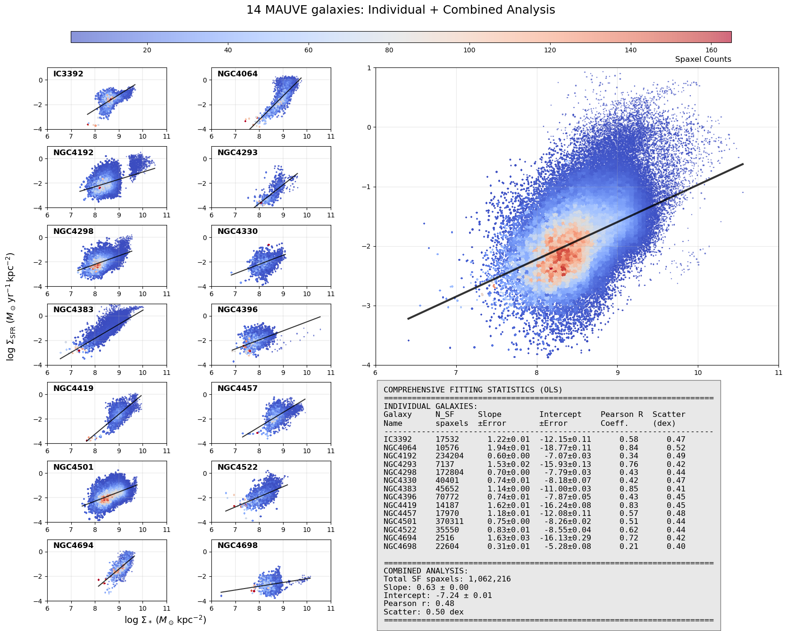
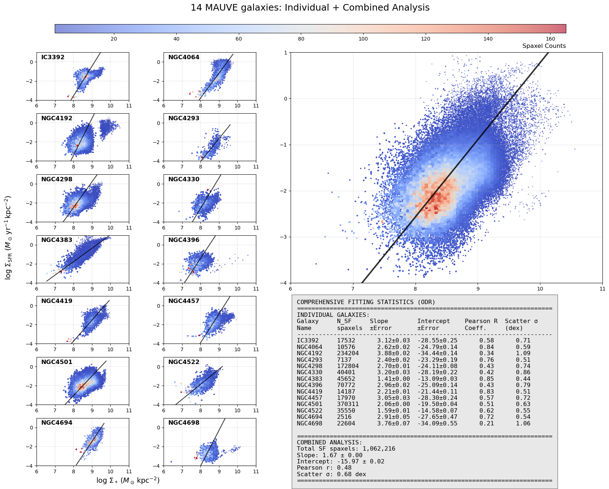
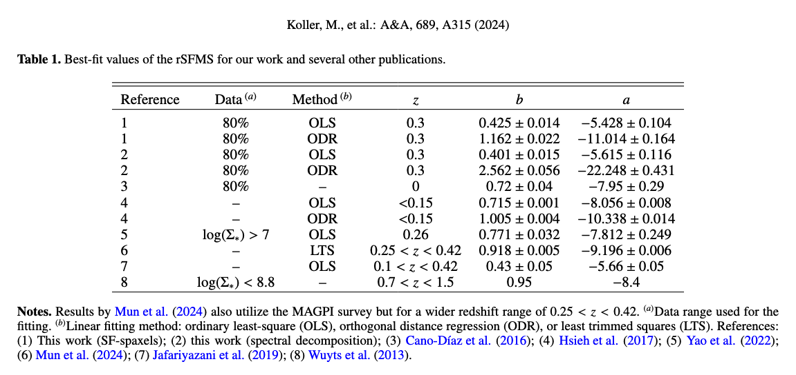
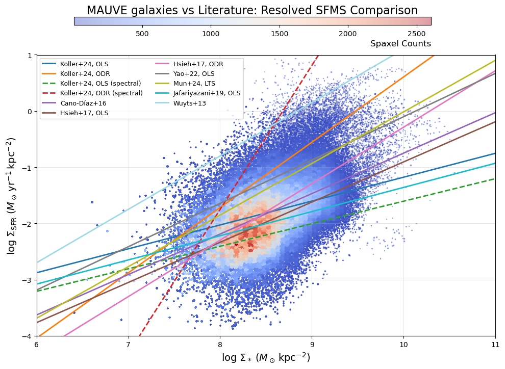
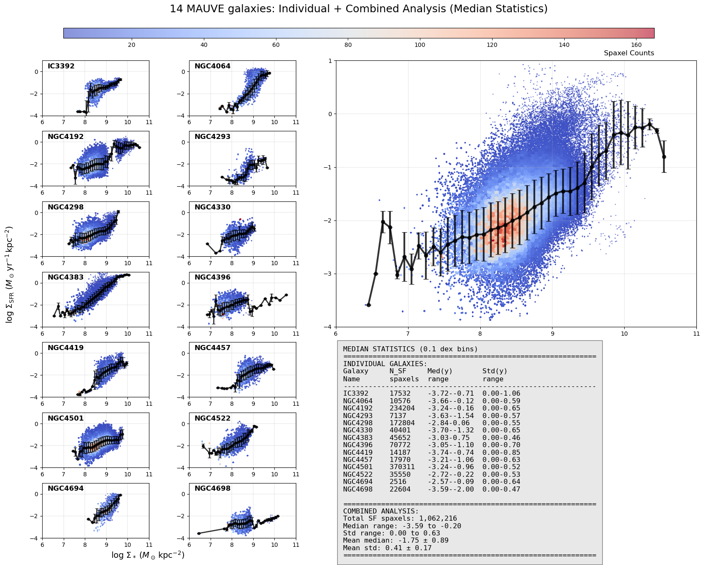

# 20250723 rSFMS slope

## OLS or ODR

Here is a summary of some work that try to fit rSFMS. Some may use OLS (ordinary least squares), some may use ODR (orthogonal distance regression), some fit the mean values (Abdurro’uf & Akiyama (2017)), and some fit the median values (Sánchez et al. (2020, 2021)). 

| **Study (Year)**                       | **Data Sample (Survey)**                 | **Slope (rSFMS)**              | **Fit Method & Notes**                                       |
| -------------------------------------- | ---------------------------------------- | ------------------------------ | ------------------------------------------------------------ |
| **Cano-Díaz et al. (2016)**            | CALIFA IFU (∼200–300 gal.; kpc scale)    | **0.72 ± 0.04** (OLS)          | OLS linear fit on SF spaxels (H α-based) – sub-linear.       |
| **Hsieh et al. (2017)**                | MaNGA IFU (536 SF gal.; kpc scale)       | **0.715 ± 0.001** (OLS)        | OLS fit (huge spaxel sample) – sub-linear, very tight.       |
| **Abdurro’uf & Akiyama (2017)**        | Local massive spirals (IFU/imaging; kpc) | **0.99**                       | Ridge-line/median method – ~unity slope (linear).            |
| **Medling et al. (2018)**              | SAMI IFU (∼800 gal.; ~1 kpc)             | **0.72 ± 0.04** (OLS)          | OLS fit on SF spaxels – sub-linear.                          |
| **Lin et al. (2019)**                  | ALMaQUEST (14 gal.; 5.4k spaxels; kpc)   | **1.19 ± 0.01** (ODR)          | *ODR fit* – super-linear; OLS would be ~0.7.                 |
| **Cano-Díaz et al. (2019)**            | CALIFA IFU (morphology study; kpc)       | **0.94 ± 0.08** (OLS)          | OLS fit (SF regions only) – nearly linear.                   |
| **Sánchez et al. (2020)**              | Multiple surveys combined (kpc scales)   | **0.98 ± 0.02**                | **linear regression** with weights = σ² to binned means (0.15 dex–wide intervals of the *x-axis* variable) |
| **Sánchez et al. (2021)**              | EDGE–CALIFA IFU (∼100 gal.; ~kpc)        | **1.02 ± 0.16**                | same as Sánchez et al. (2020)                                |
| **Ellison et al. (2021a)**             | ALMaQUEST (28 gal.; 15k spax.; kpc)      | **0.68** (OLS); **1.37** (ODR) | Both methods used – slope highly method-dependent. Checkout why |
| **Barrera-Ballesteros et al. (2021a)** | EDGE–CALIFA IFU (∼90 gal.; ~2 kpc)       | **0.92** (OLS)                 | OLS on 500 pc binned regions – mildly sub-linear; ODR slightly higher. |

Then I also perform the OLS and ODR to see my results. 

## Overlapping others' fitting lines on my data

Here I erase my fitting lines and adopt the summary table from [Koller et al. 2024](https://doi.org/10.1051/0004-6361/202450715) (because stellar mass surface density in kpc square) to check if MAUVE galaxies still fall in the same parameter space. 

Looks like still in similar space, but maybe a bit quench? 

Below I show the median trend of MAUVE galaxies.

