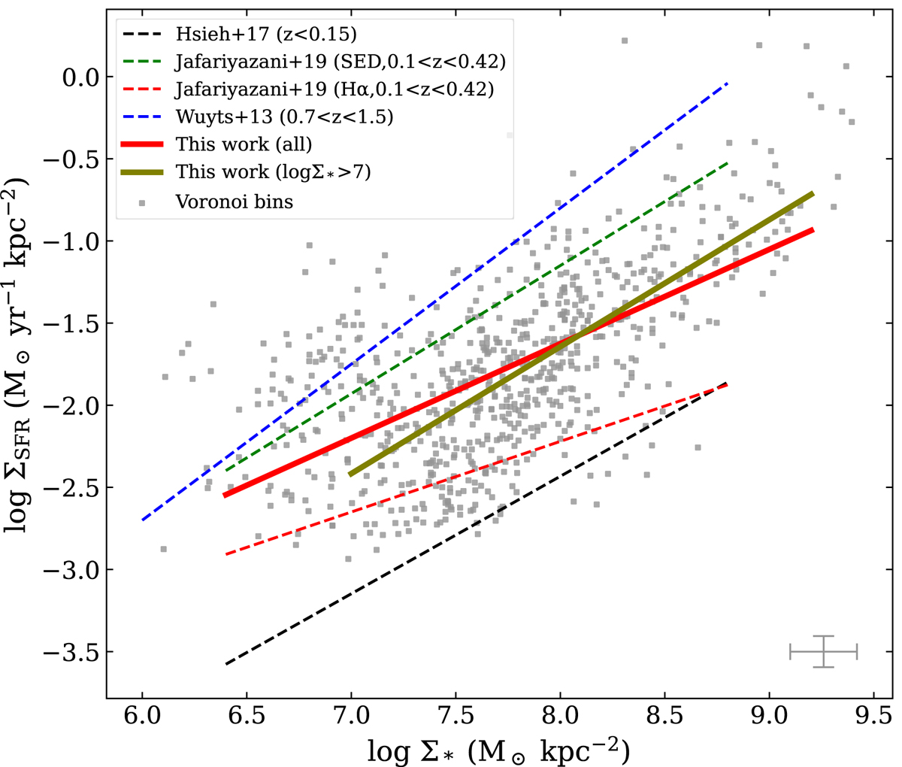

# 20250724 Others' rSFMS.md

I also put the integrated stellar mass and SFR on the bottom right and that should be helpful to check the influence from global properties. Perhape need more global properties?

But before that I need to check the discrepency between lines (not the lines, but the parameter spaces that they occupy). First is the convertion from observables to surface densities, although I suspect this effect should be minor because they should be just some tiny offset in x and y axis (at least from chabrier to kroupa IMF it just changes less than 0.03 dex in SFR). Second is the data selection, and I guess this should be the primary reason, but again still need to check. But look at individual galaxies, they already occupy different parameter space, so it looks like data itself matters more. But at least it indeed looks like rSFMS is not universal for single galaxy. 

Then I can try to remove those least relevant lines and i can compare my parameter space to those compareable studies. 

And then I can try to answer if the scatter truely driven by global properties.  

## Check properties' convertion

### [Koller+2024](https://ui.adsabs.harvard.edu/abs/2024A%26A...689A.315K/abstract)

MAGPI. 

Redshift: $0.28<z<0.25$. 

Mass: $M_*>7\times10^{10}M_\odot$.

SF selection: 6299 SF spaxels in [NII] BPT. I think we can ignore the sample using spectral decomposition. 

Resolved selection: $6.87\lesssim\log{\Sigma_*}\lesssim8.33$, containing 80% of the data to exclude outliers.

SSP: BC03. 

Extinction: Calzetti+01 (Cardelli et al. (1989)), $R_V=3.1$. 

IMF and SFR conversion: Kennicutt (1998)+Salpter to Charbrier, $7.9/1.53\times10^{-42} = 5.16\times10^{-42}$. 

### [Cano-Diaz+2016](https://ui.adsabs.harvard.edu/abs/2016ApJ...821L..26C)

CALIFA. 

Redshift: $0.005<z<0.03$. 

Mass: $10^{9.7}<M_*<10^{11.4}M_\odot$. 

SF selection: 90786 SF spaxels in [NII] BPT. 

Resolved selection: 80% of the data 

SSP: CF13. WTF?

Extinction: Cardelli et al. (1989), $R_V=3.1$.

IMF and SFR conversion: Kennicutt (1998)+Salpter, $7.9\times10^{-42}$. 

### [Hsieh+2017](https://ui.adsabs.harvard.edu/abs/2017ApJ...851L..24H/abstract)

MaNGA. 

Redshift: $0.01<z<0.15$. 

Mass: $10^{9}M_\odot<M_*$. 

SF selection: Galaxies with an SSFR greater than −10.6 log(SFR ) and those with an SSFR less than −11.4 log(SFR ) are selected as the star-forming and quiescent populations, respectively.

Resolved selection: N/A

SSP: MILES

Extinction: Calzetti+2001, $R_V=4.5$.

IMF and SFR conversion: they provide results without mentioning which specifically. But i can convert it manually: $5.5\times10^{-42}$. I dont like it.

### [Yao+2022](https://ui.adsabs.harvard.edu/abs/2022A%26A...661A.112Y/abstract)

MUSE-Wide. 

Redshift: $z\sim0.26$. 

Mass: N/A

SF selection: MUSE-WIDE catalog is already SF under Kewley+01 curve

Resolved selection: all sample and subset of $\log(\Sigma_*)\geq7$

SSP: They used SED fitting to get $M_*$

Extinction:  Calzetti et al. (2000)

IMF and SFR conversion:  Kennicutt (1998), $4.4\times10^{-42}$. 

### [Vulcani+2020](https://doi.org/10.3847/1538-4357/aba4ae)

GASP. 

Redshift: $0.04<z<0.1$. 

Mass: $10^{9}M_\odot<M_*<10^{11.5}M_\odot$. 

SF selection: 

Resolved selection: 

SSP: They used SED fitting to get $M_*$

Extinction:  Calzetti et al. (2000)

IMF and SFR conversion:  Kennicutt (1998), $4.6\times10^{-42}$. 

