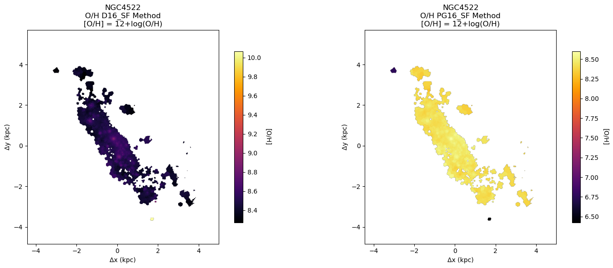
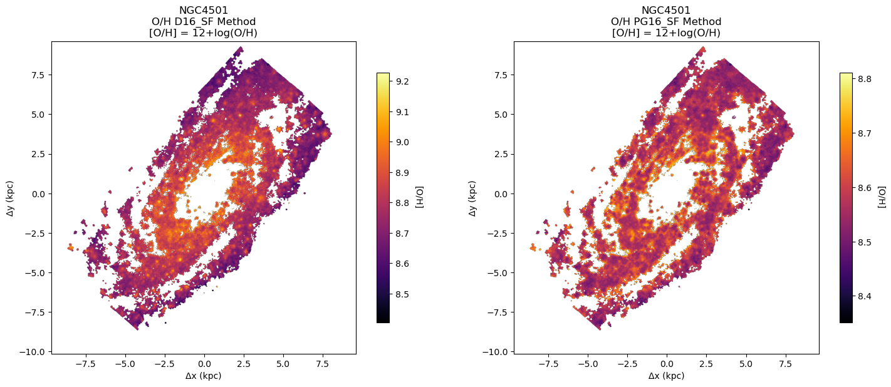

# 20250729 Metallicity by D16 and PG16

Before everything, I guess the [N II]$\lambda6484$ line I seen in some papers is actually the historical typo of [N II]$\lambda6584$ in D16, right?

## D16 & PG16 to get [O/H] and comparison with Adam's paper

Below is copy from Adam's paper: "We adopt two different metallicity calibrations to ensure the robustness of our results. The first is the calibration of Dopita et al. ([2016](https://doi.org/10.1007/s10509-016-2657-8)), which uses the [N II]$_{6583}$⁠, H$\alpha$, and [S II] lines. The second is the ‘Scal’ calibration from Pilyugin & Grebel ([2016](https://doi.org/10.1093/mnras/stw238)), which uses the ⁠[O III], H$\beta$, ⁠[N II], and [S II] lines, and we use [O III] = 1.33[O III]$_{5007}$ and ⁠[N II] = 1.34[N II]$_{6583}$."

I apply exactly the same way to NGC4383 to see if I can recreate the metallicity gradient map shown in Figure 7 of Adam's paper. For D16, I use 5th order polunomial calibration.  

Note that I dont see why it is 1.33 and 1.34 here, is it a common sense here? Also it seems that Adam use a customized colormap. 


I also show the maximum value inside a 2-arcsec square at the galaxy’s centre for each calibration: 8.661 and 8.442 (Adam says 8.65 and 8.44). Simiarly, I see D16 reports more prominent gradient. Also, [O/H] by D16 seems to span in broaded range:  

```python
O_H_D16_SF - Min: 8.0765, Max: 8.6614
O_H_PG16_SF - Min: 8.1901, Max: 8.4423
```

## All 14 galaxies

So NGC4383 looks fine for me and I am sure my code is correct, but thing is getting crazy when applying to other galaxies. 





Ok, first I realise that they must be only valid in proper [O/H] range. 

It seems that D16 only say they are linear from 7.6 to 9.05, while PG16 are very confident: “The oxygen and nitrogen abundances estimated through the suggested calibrations agree with the $\rm T_e$‑based abundances within $\sim0.1$ dex over the whole metallicity range of H II regions.” But I think as suggested by Kewley+2019, we may limit both between 7.63 and 9.23. But here is the question, for those outside this range, should we just simply drop them or maybe still assign some values to them and call them upper/lower limits? 

## Redo Calculation

My idea is remove those points do rerun my code and indeed looks better. 





## How about other calibration?

It looks MUSE data is still sufficient to use direct $\rm T_e$ method instead of those strong line calibrations? 