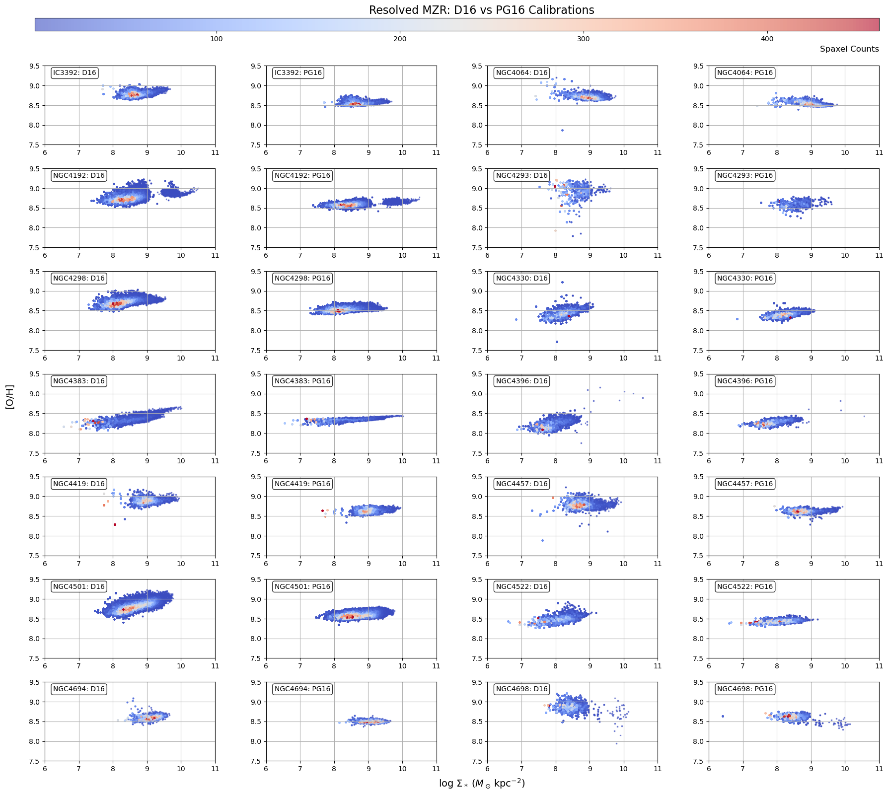
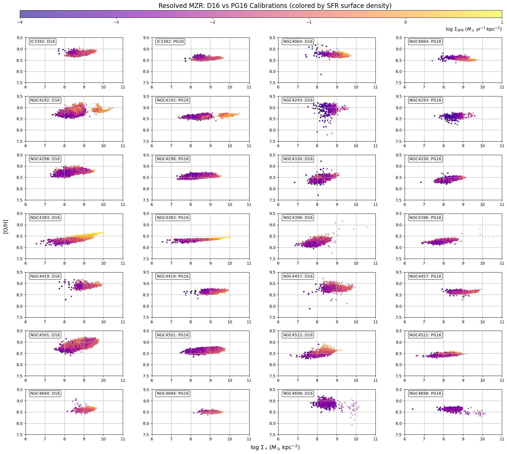
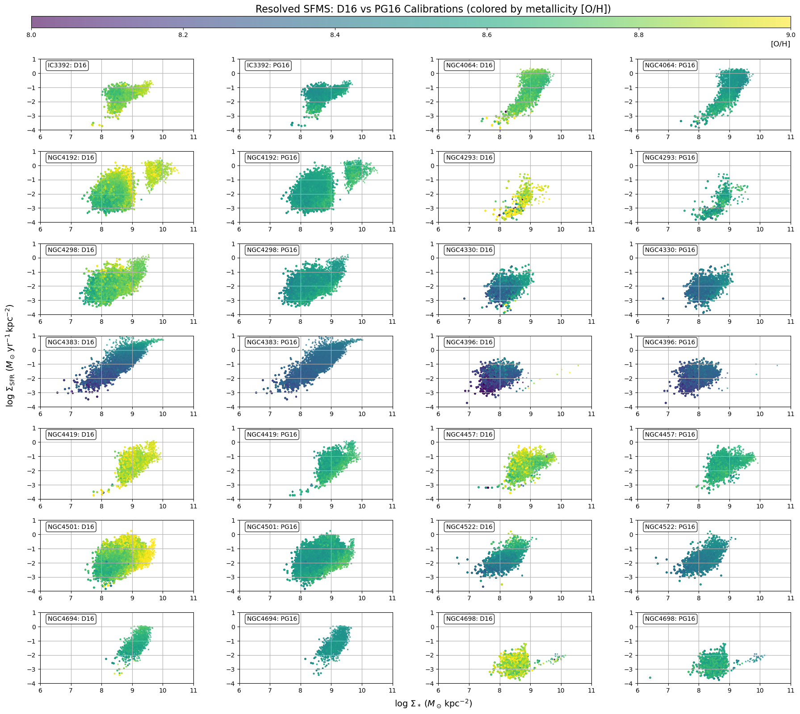

# 20250729 rMZR by D16 and PG16

## Comparison of rMZR calibrated by D16 and PG16, color-coded by spaxel counts

## Comparison of rMZR calibrated by D16 and PG16, color-coded by SFR surface density

## Comparison of rSFMS, color-coded by [O/H] calibrated by D16 and PG16

