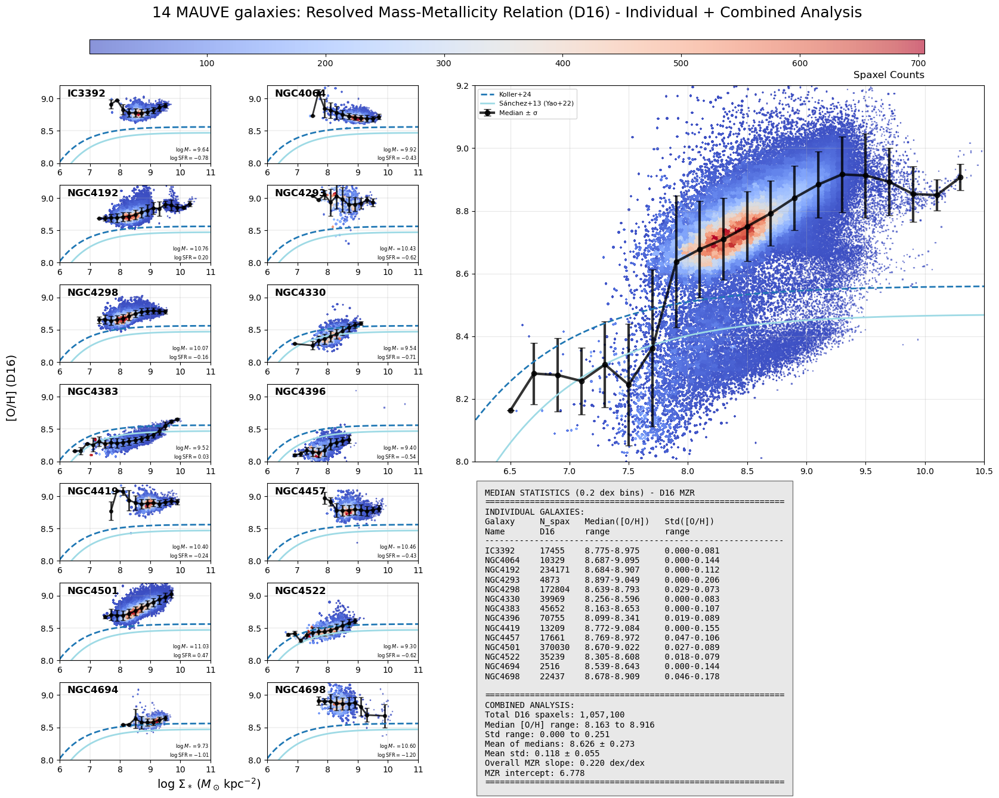
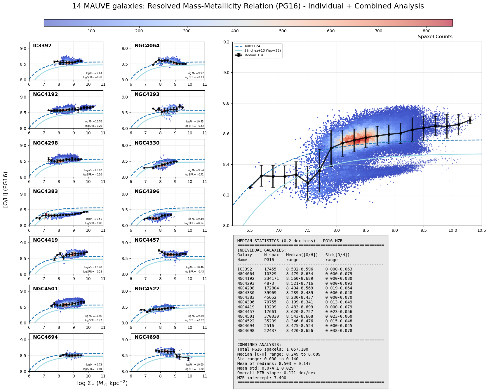
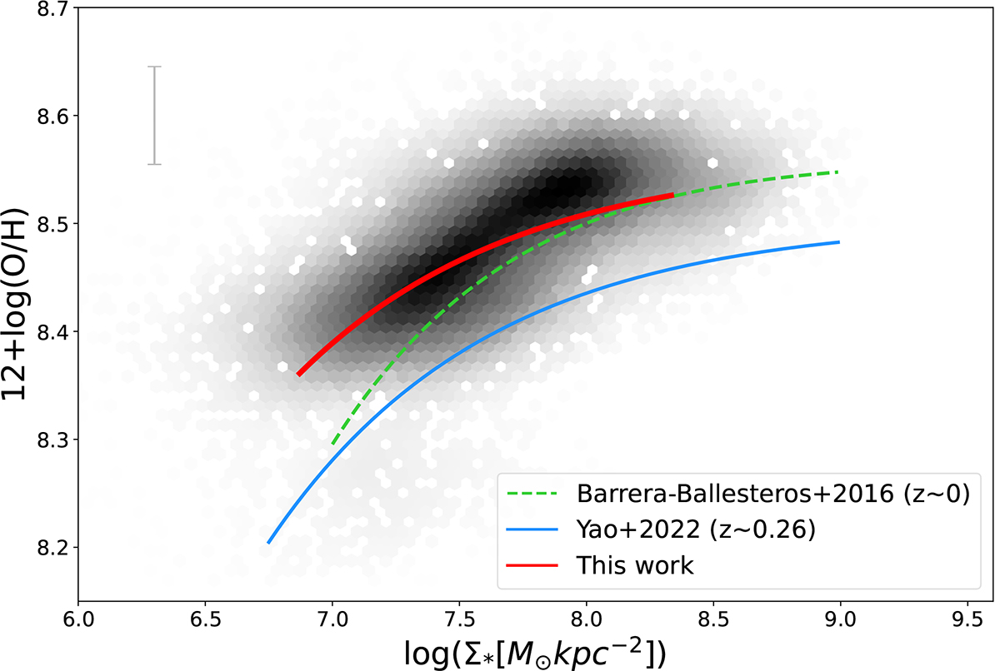
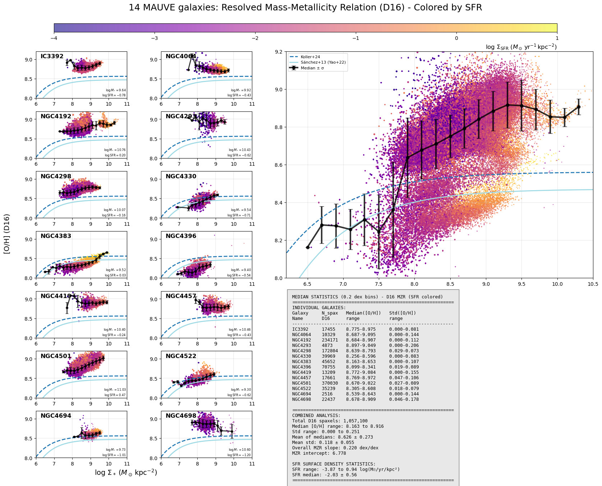
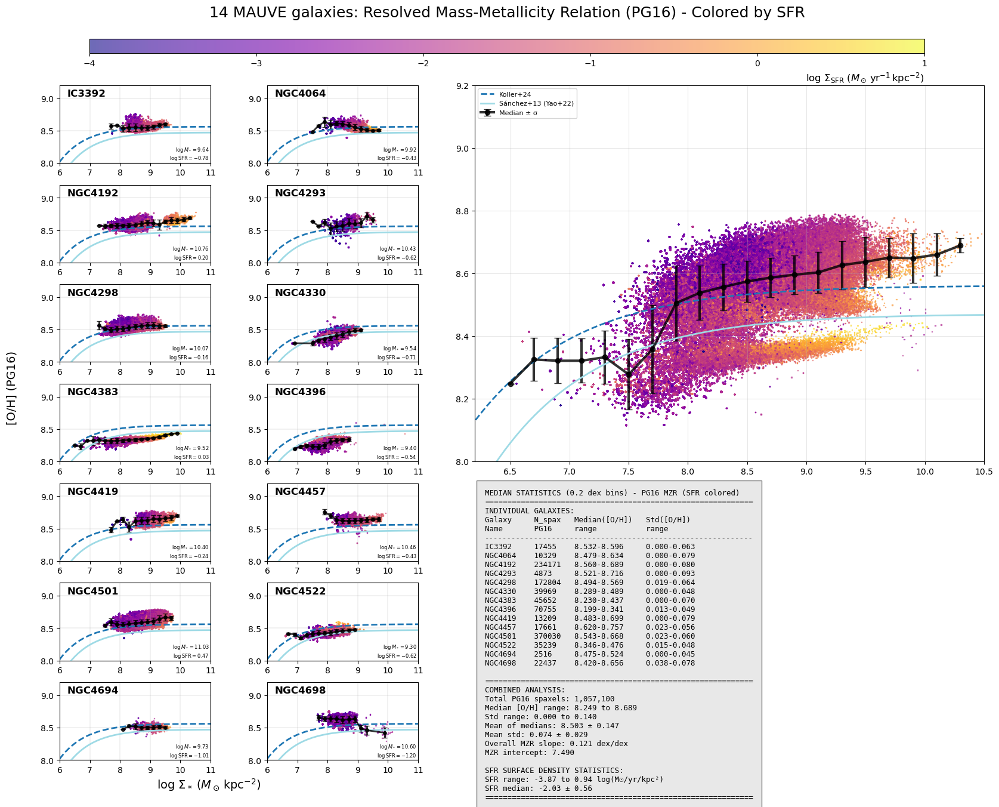
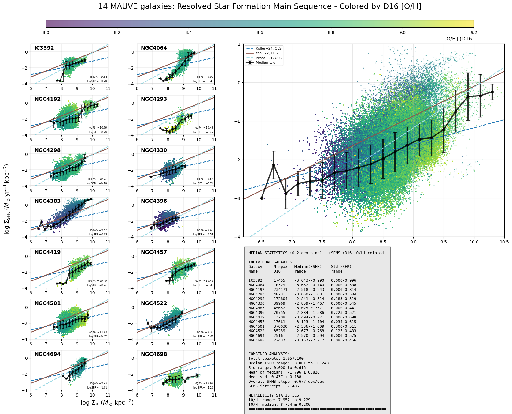
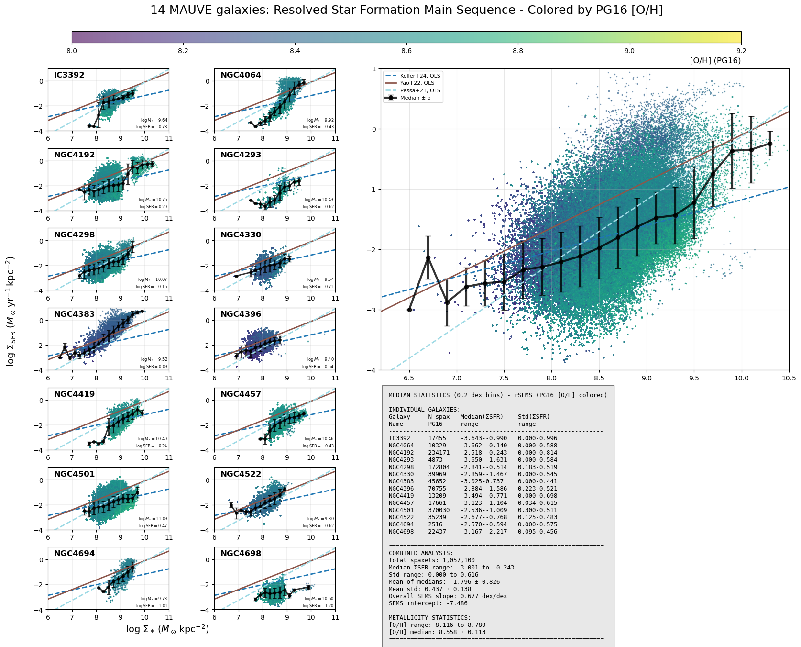
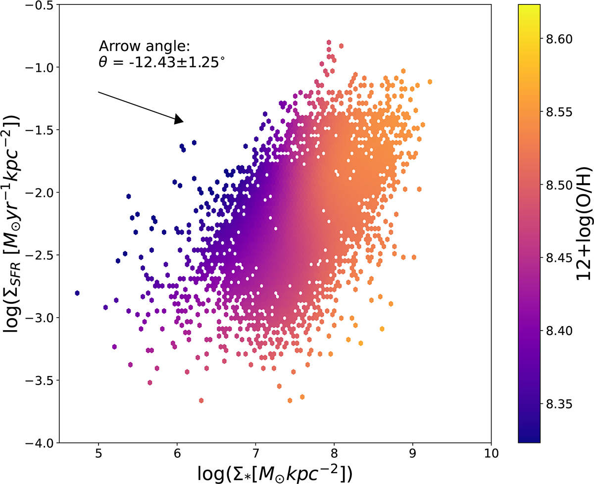

# 20250803 rMZR by D16 and PG16

Similar to what I done for rSFMS, I show rMZR for each galaxy in individual plot and all galaxies in a combined plot, as well as median trend and fitting curves from other works. 

So as expected, results by D16 show higher and steeper rMZR than PG16, because  strong line calibrations by model tend to give metallicity higher than those calibrated by observations. However, the overall trend remains the same. It seems that D16 shows more details or structure, so now I prefer this one. Note that many studies (e.g., Barrera-Ballesteros+2016, Yao+2022, Baker+2023, Koller+2024) adopt strong line calibration by observation, so we should use PG16 when comparing to other works. 

Overall, it seems that our samples are more metal-rich than other works. I also attached rMZR from Koller+2024 here, which also contains comparison with other works.

It seems that PHANGS still haven't look at rMZR, while Baker+2023 using MaNGA only shows some lines of rMZR:

Koller+2024 also did that:

Interestingly, we can see that NGC4383 and NGC4386 form a lower trend while the other 12 galaxies stay in main trend. So i also update my plots to be color-coded by SFR surface density to check.

Ok, I cannot tell what make these two galaxies offset from the others. Probably, they are just intrinsically metal-pooper than others? My idea is that it doesn't mean rMZR forms two trends. In stead, these two galaxies just occupy lower positions in this rMZR "bubble". But for the reason why they are in the lower bubble, still unknown. 

Below I also show rSFMS color-coded by [O/H]. 

Ok, now everything looks as familiar as Baker+2023:

And Koller+2024: 

I guess next steps before we go to the rFMR plane are 1) show rMZR in different SFR surface density bin; 2) regroup by total stellar mass, and perfrom the PCC and arrow angle analysis. 

