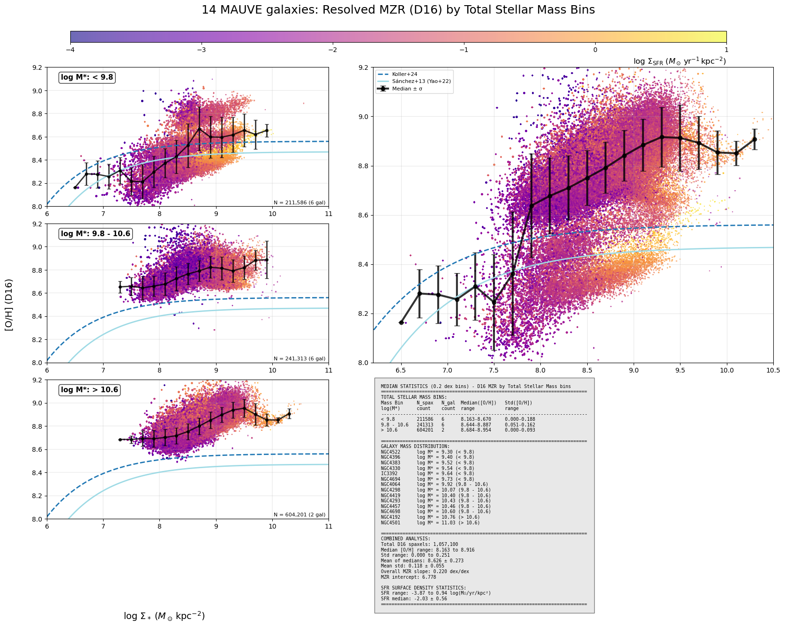

# 20250804 rMZR by D16 and PG16

## NGC4396

I go back to check NGC4396, but I dont spot anything unusual. I guess if we want to check radiation field, we may need to calcualte the ionization parameters, etc. 

## rMZR dependent on local property $\rm \Sigma_{SFR}$? 

Instead of showing rMZR of individual galaxy, I regroup them in different SFR bins. 

Unfortunately, I do not observe any anti-correlation between $\rm \Sigma_{SFR}$ and [O/H]. I suspect this may due to lack of complete data in $\Sigma_*<7.8M_\odot/kpc^2$, which is the regime that Koller+2024 report that anti-correlation:

## rMZR dependent on global property $\log(M_*)$? 

Actually, it seems that rMZR is still sensitive to total stellar mass: low-mass galaxies are a bit metal-poorer? 

Also show the rSFMS in different total stellar mass bins:

As a comparison, below is Figure 7 from Baker+2023:

