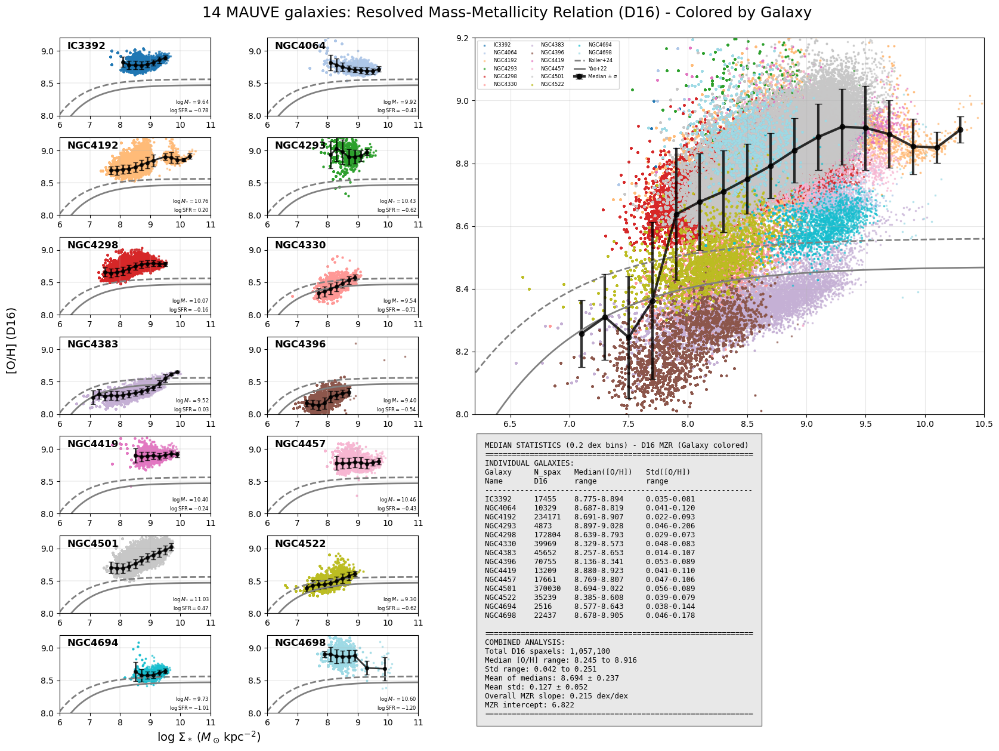
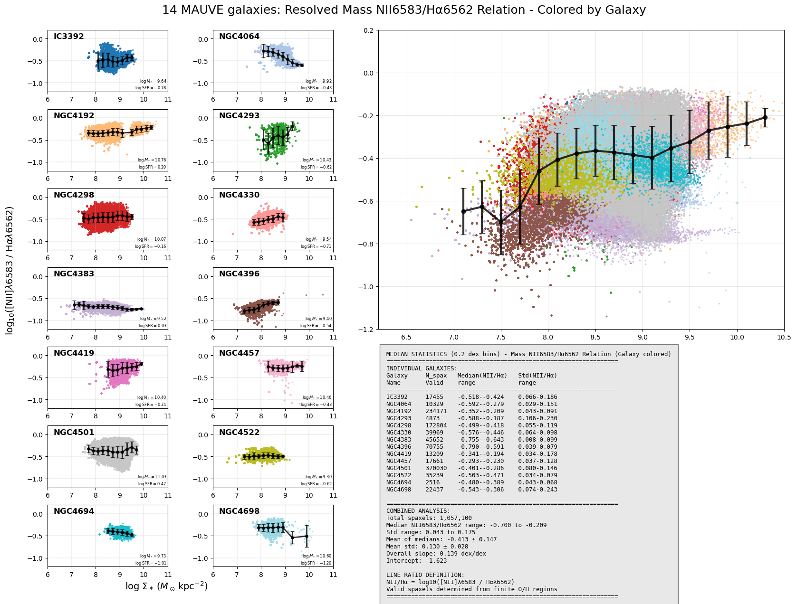
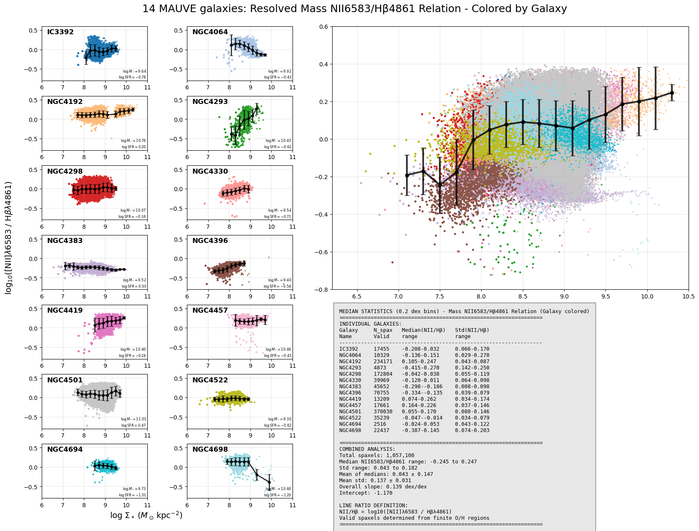
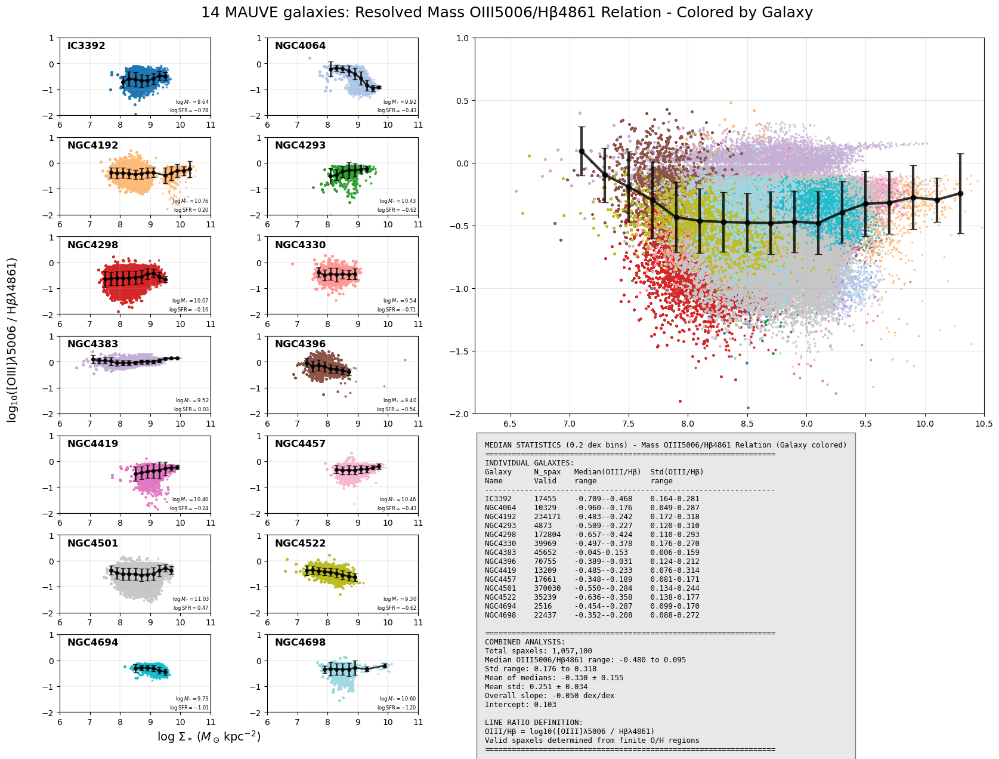
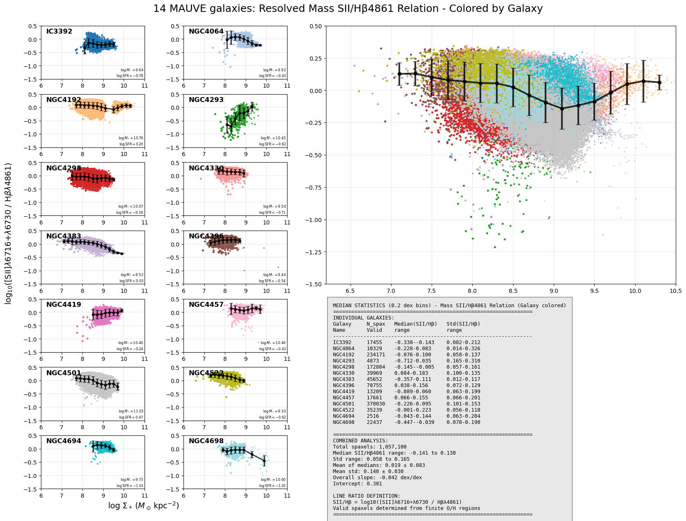
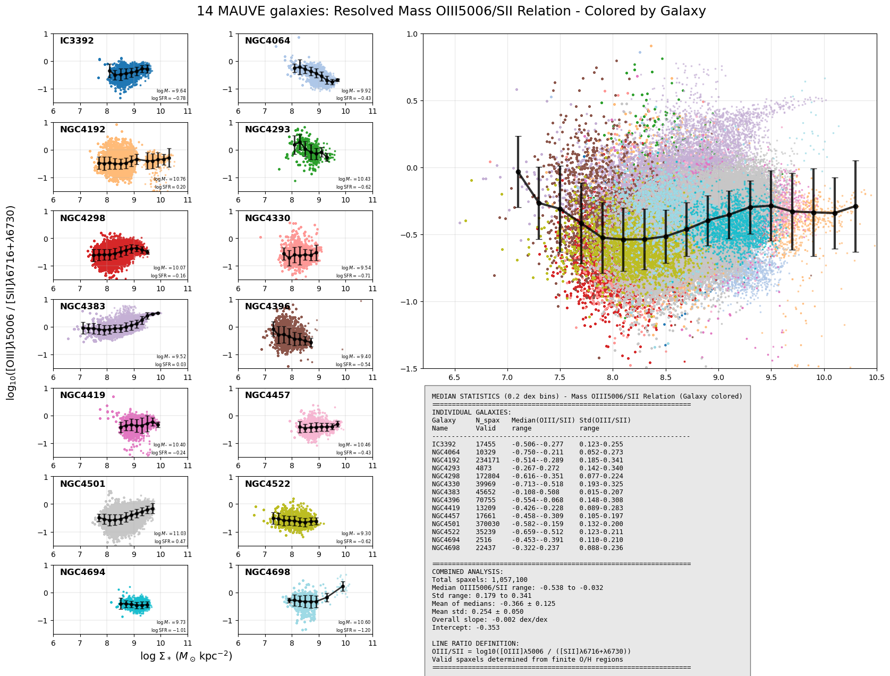
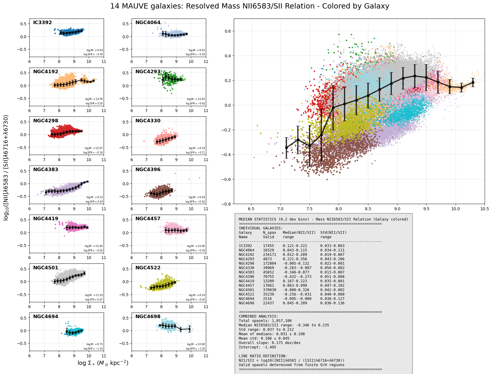
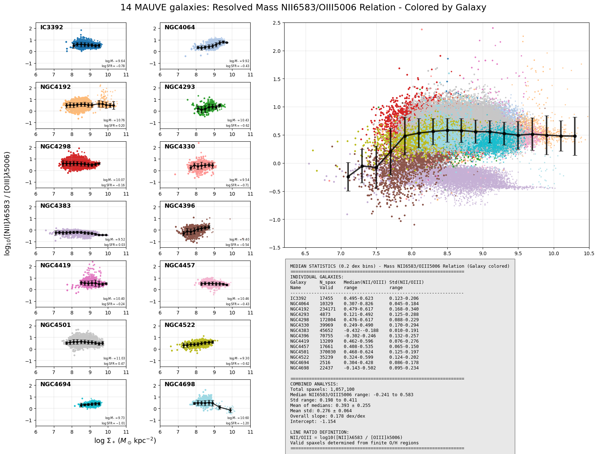

# 20250901 Could be NII6583

My feeling is that NII is the smoking gun that causes those 4 outliers in rMZR. Or more specifically, the NII/SII (the second last figure). 

I try some permutations of some simple line ratio to see if a single line ratio can reproduce the morphorlogy of rMZR.

4 outliers:

1. NGC4396: brown;
2. NGC4383: light mauve;
3. NGC4522: yellow green;
4. NGC4694: dark cyan.

## rMZR (D16)

## NII6583/H$\alpha$6562

Kind of raise the outliers back, but NGC4383 and NGC4395 are still in the bottom.

## NII6583/H$\beta$4861

Similar to H$\alpha$

## OIII5006/H$\beta$4861

Kind of inverse the y-axis of previous two plots.

## SII(6716+6730)/H$\beta$4861

The most consistent parameter space. 

## OIII5006/SII(6716+6730)

Also looks consistent.

## NII6583/SII(6716+6730)

Almost the imitation of rMZR!

## NII6583/OIII5006

NGC4383 is prominent in this case.

## Next step

I will also check complex line ratios like O3N2 and check the exact forms of those prescriptions mentioned in Groves+2023 and try to find if there exists a calibration that will not produce outliers, probably the ones that more dependent on SII/H$\beta$ and less dependent on NII/SII. 