# 20250909 Global MZR

I try to compare the global MZR with other previous work, I think all looks fine for me.

## N2S2-D16

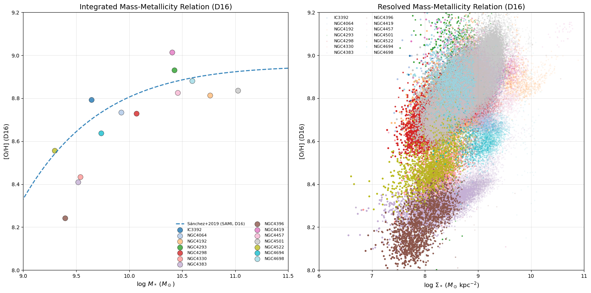

## Scal-PG16

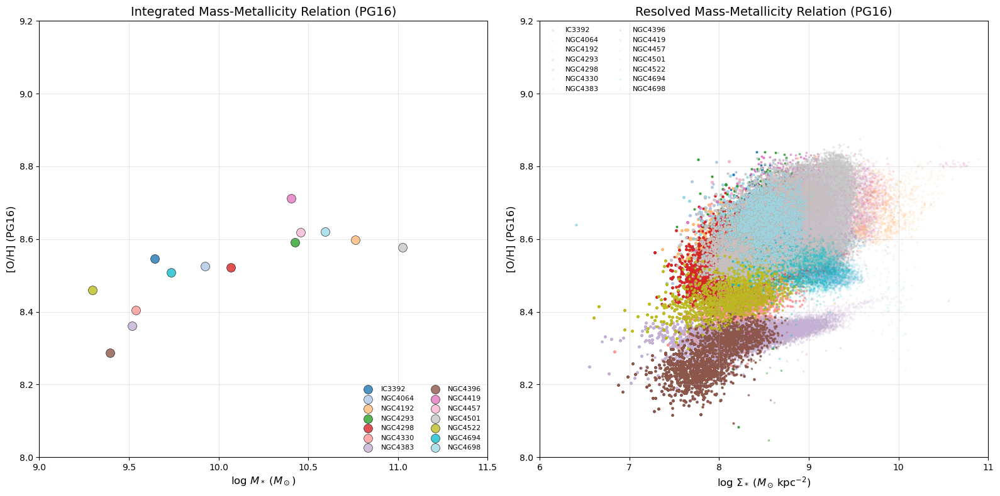

## O3N2-M13

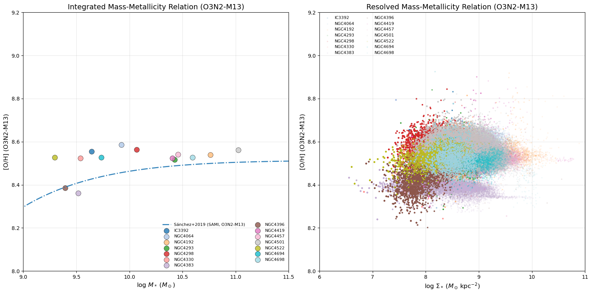

## N2-M13

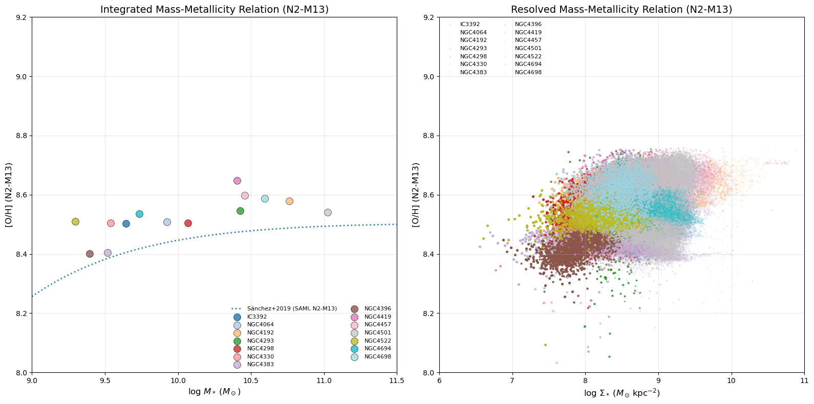

## O3N2-PP04

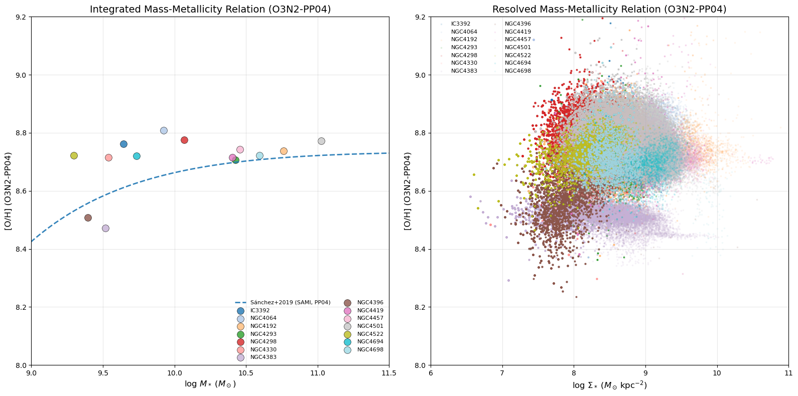

## N2-PP04

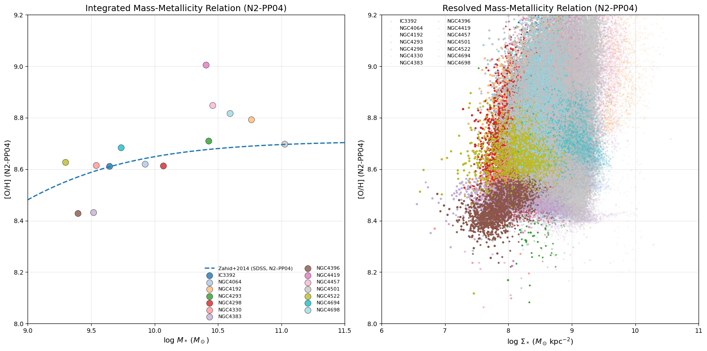

## Those C20

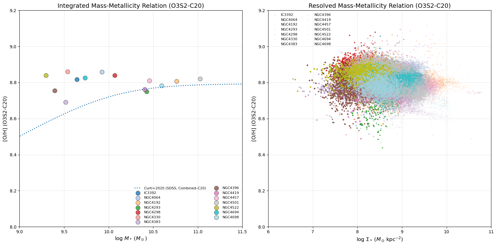

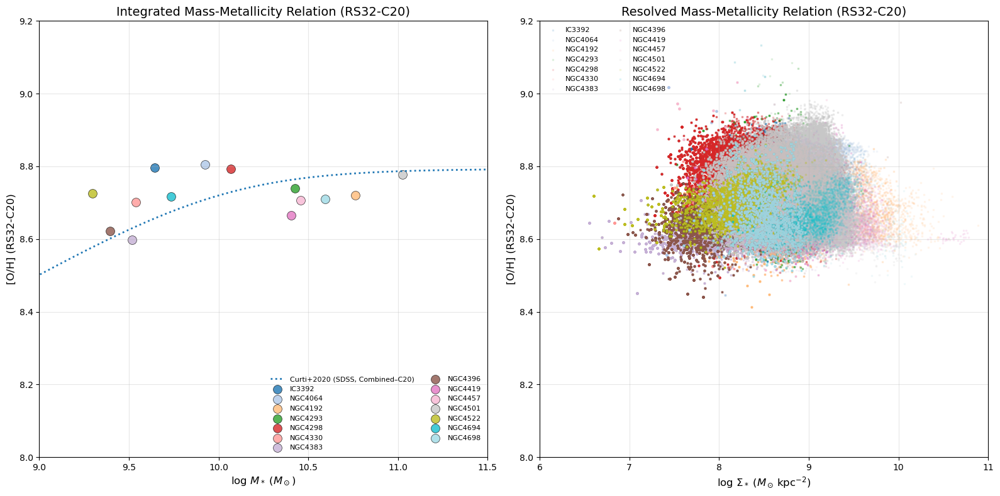

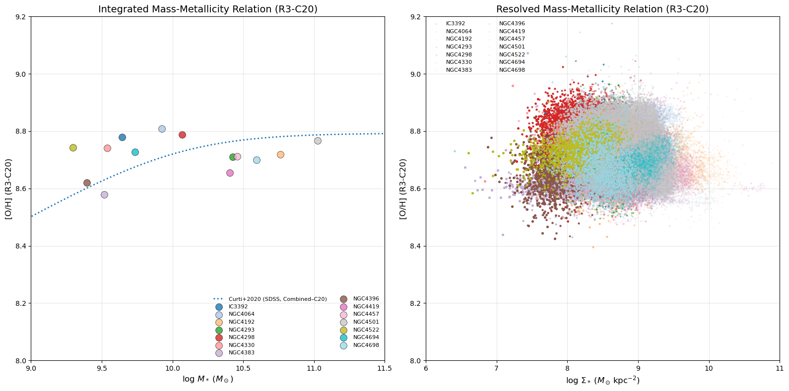

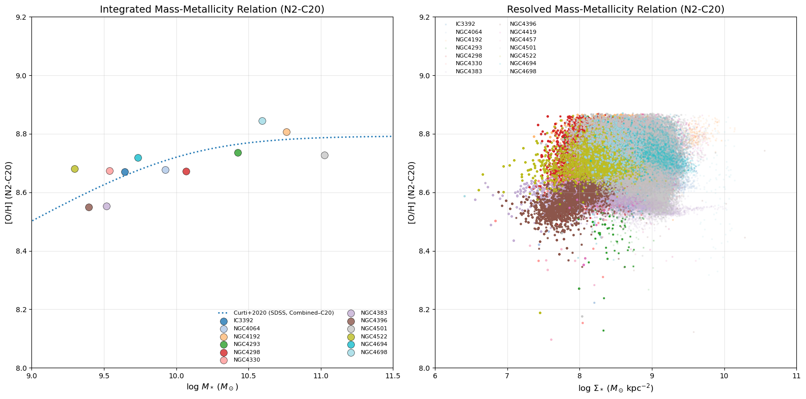

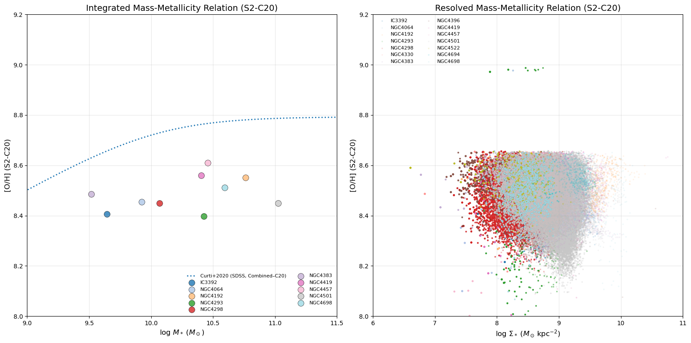

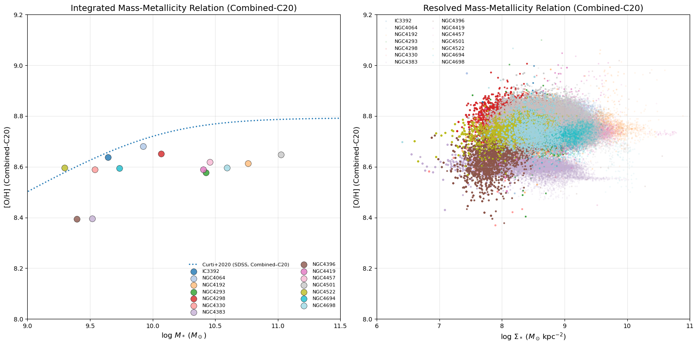