# 20250914 Metallicity Test

## ($\rm \log(SFR)+(12+\log(O/H))$) vs $\log(M_*)$

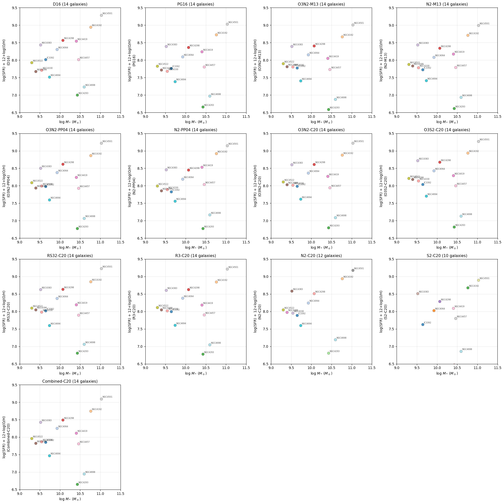

## Recreate Brazzinni+2024's Figure 7 to check diagnostics

### N2S2-D16

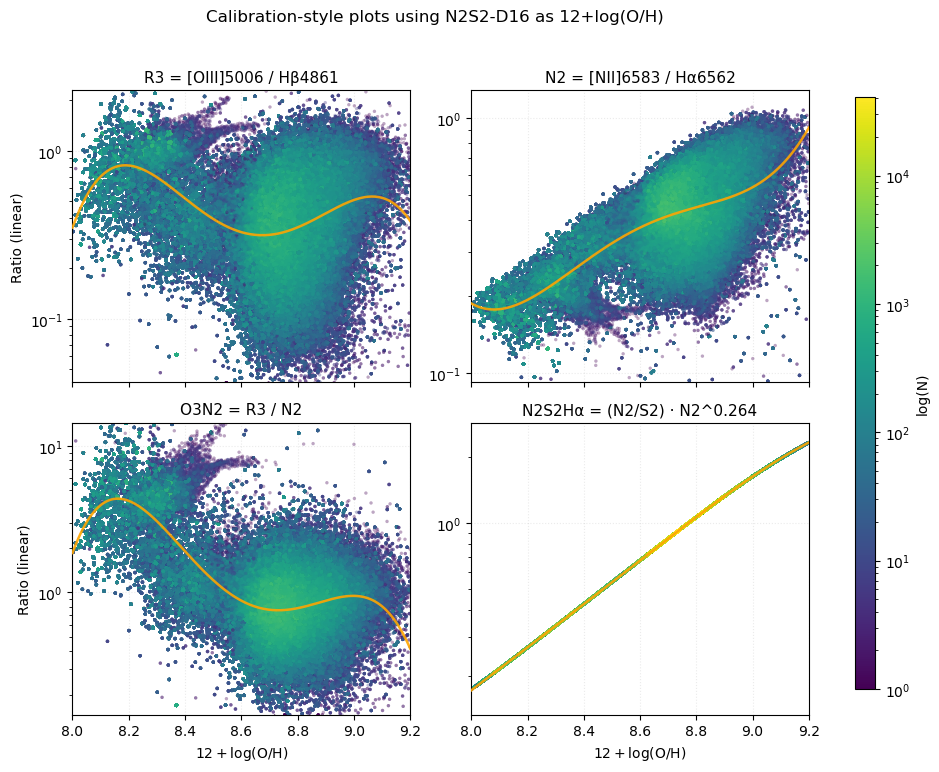

### Scal-PG16

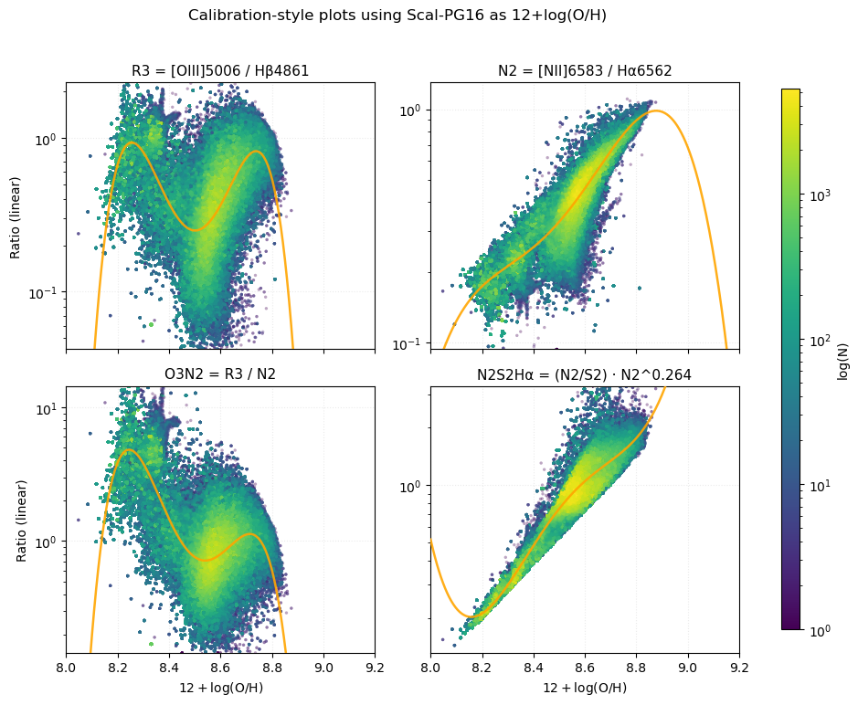

### O3N2-M13

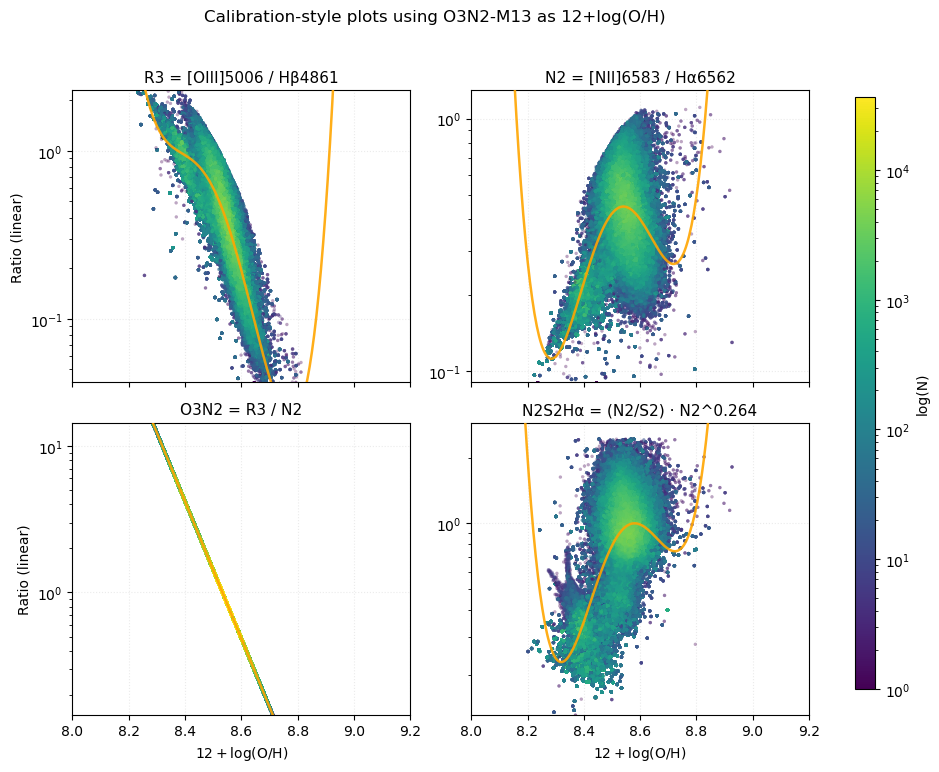

### N2-M13

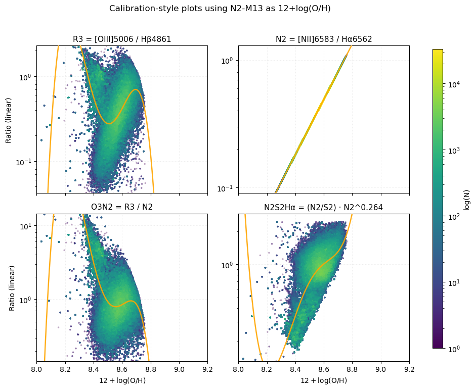

### O3N2-PP04

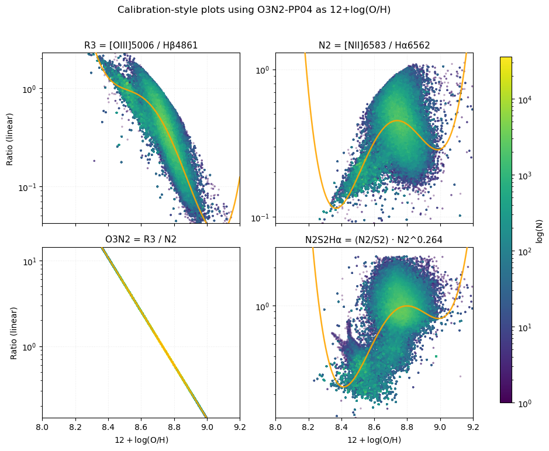

### N2-PP04

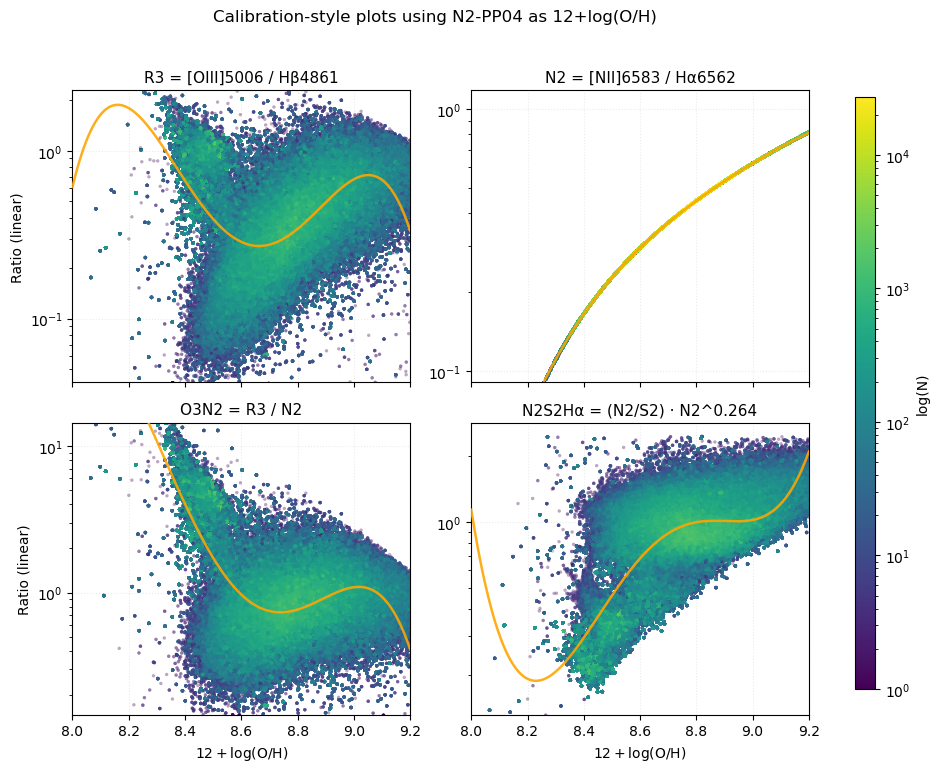

### O3N2-C20

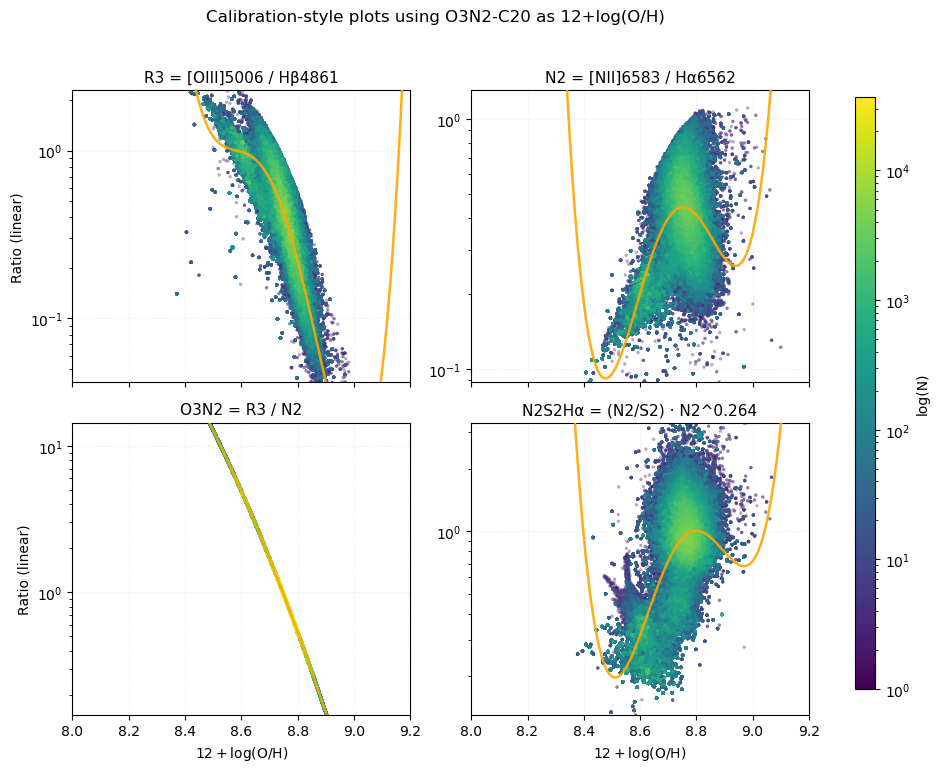

### O3S2-C20

### RS32-C20

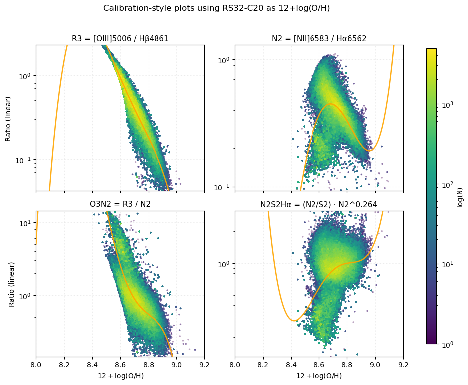

### R3-C20

### N2-C20

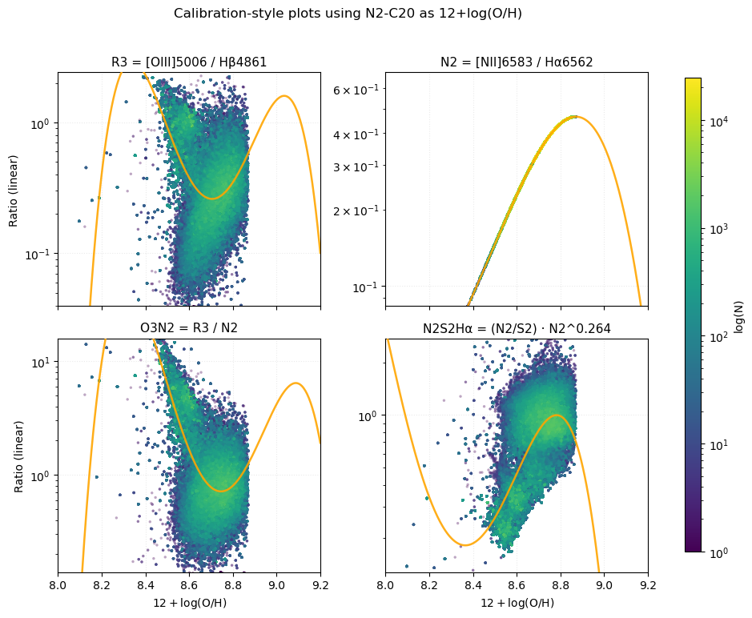

### S2-C20

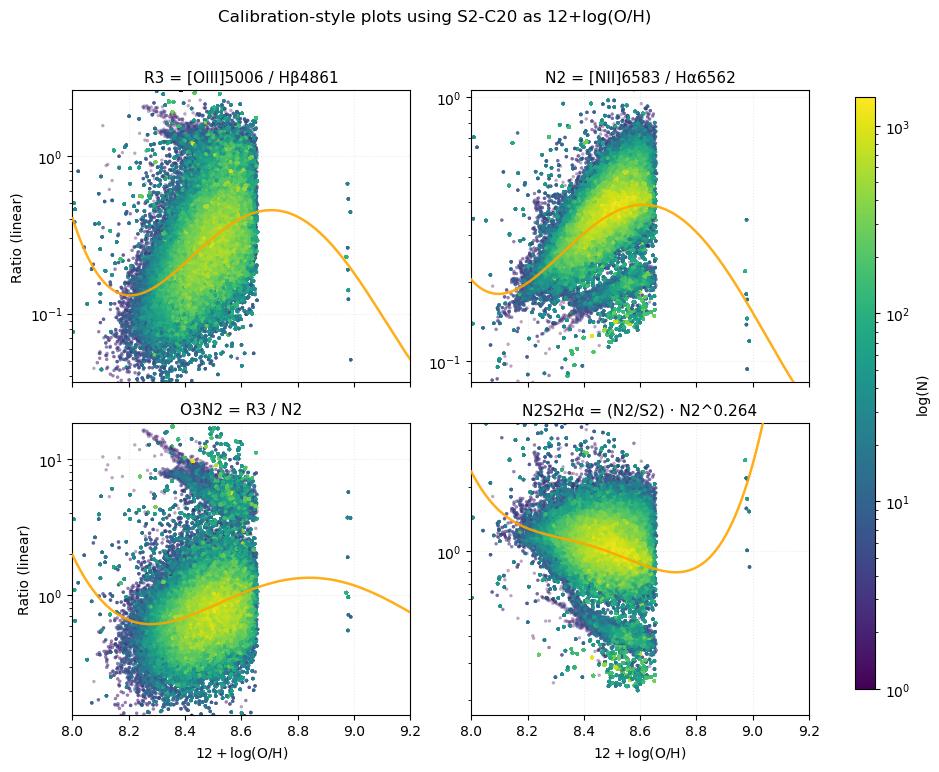

### Combined-C20

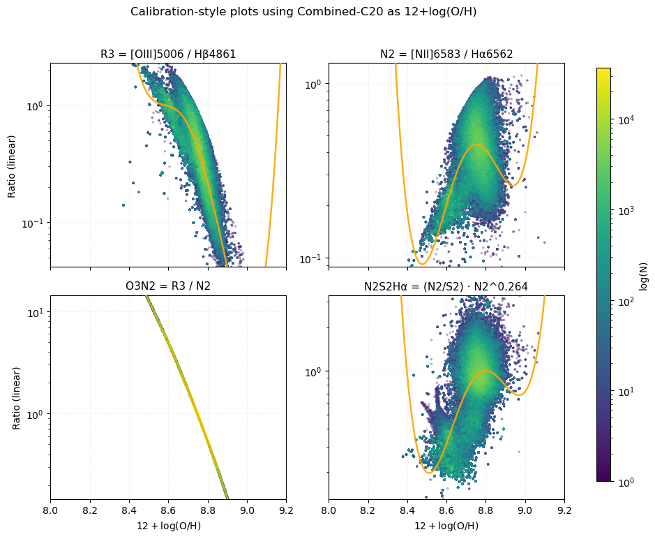