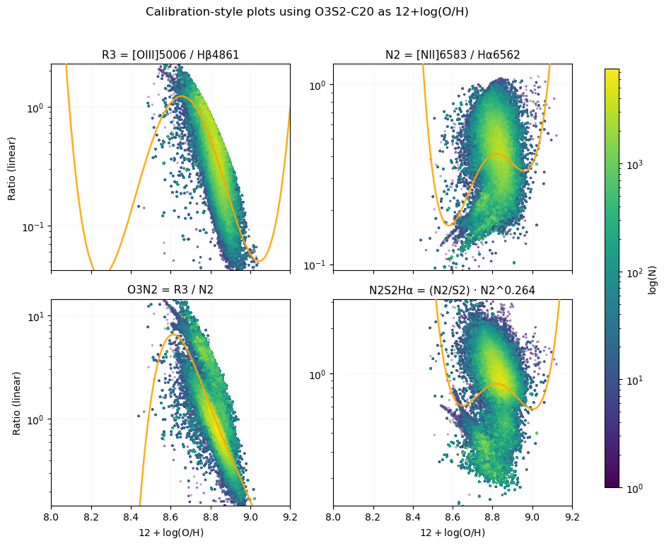
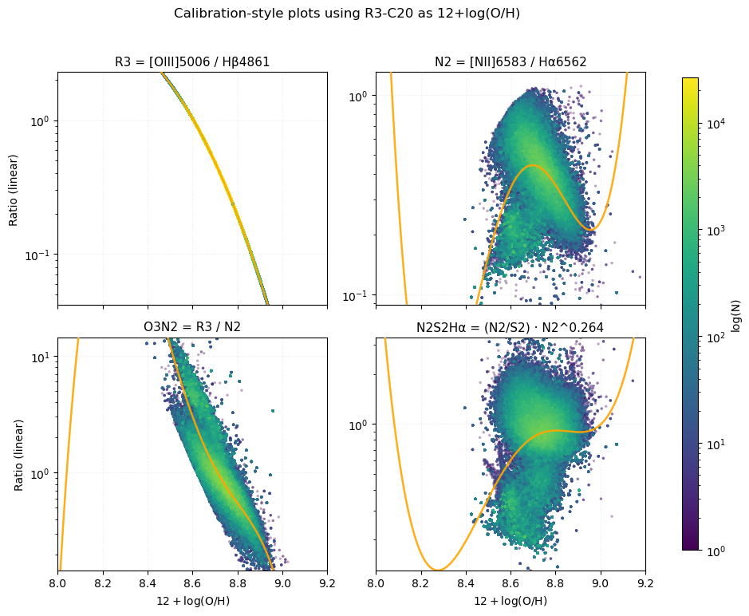

# 20250914 Metallicity Test

## ($\rm \log(SFR)+(12+\log(O/H))$) vs $\log(M_*)$

## Recreate Brazzinni+2024's Figure 7 to check diagnostics

### N2S2-D16

### Scal-PG16

### O3N2-M13

### N2-M13

### O3N2-PP04

### N2-PP04

### O3N2-C20

### O3S2-C20

### RS32-C20

### R3-C20

### N2-C20

### S2-C20

### Combined-C20

