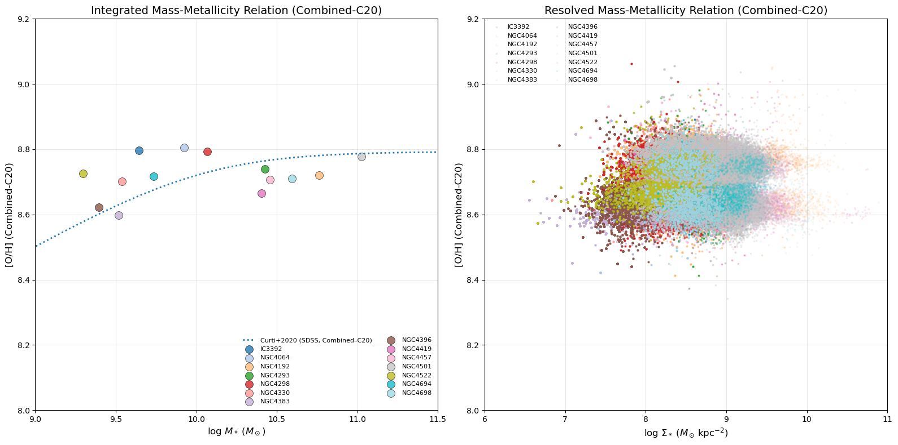
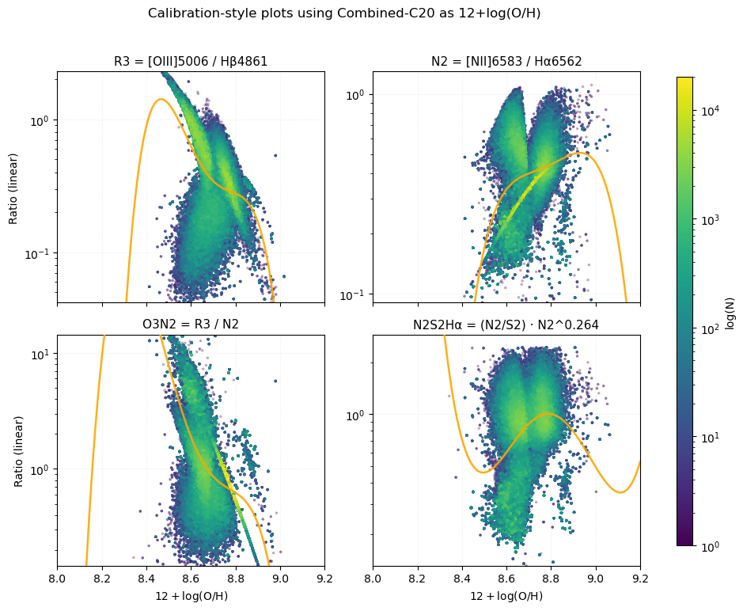
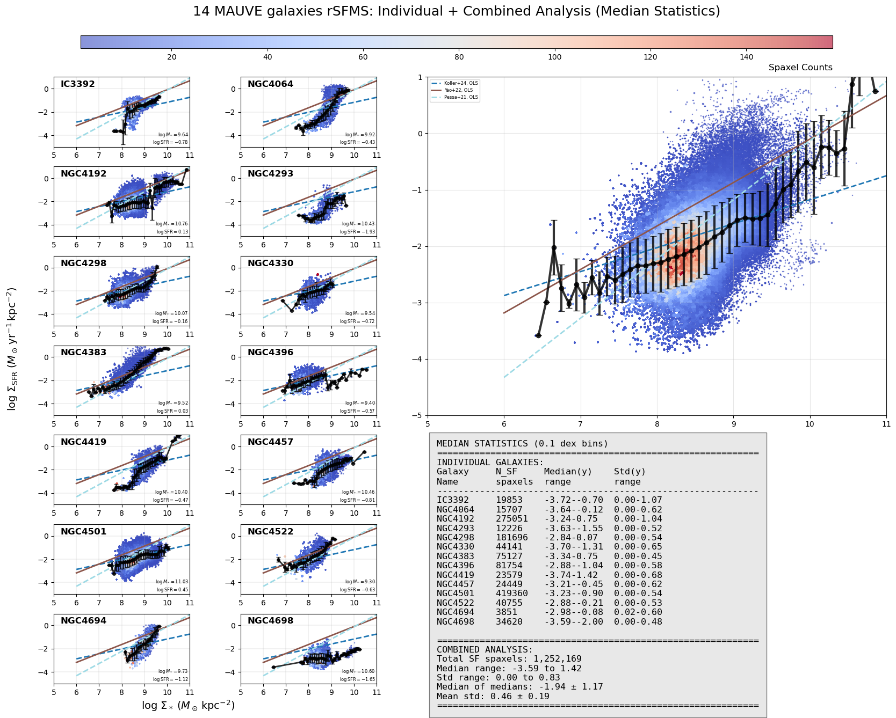
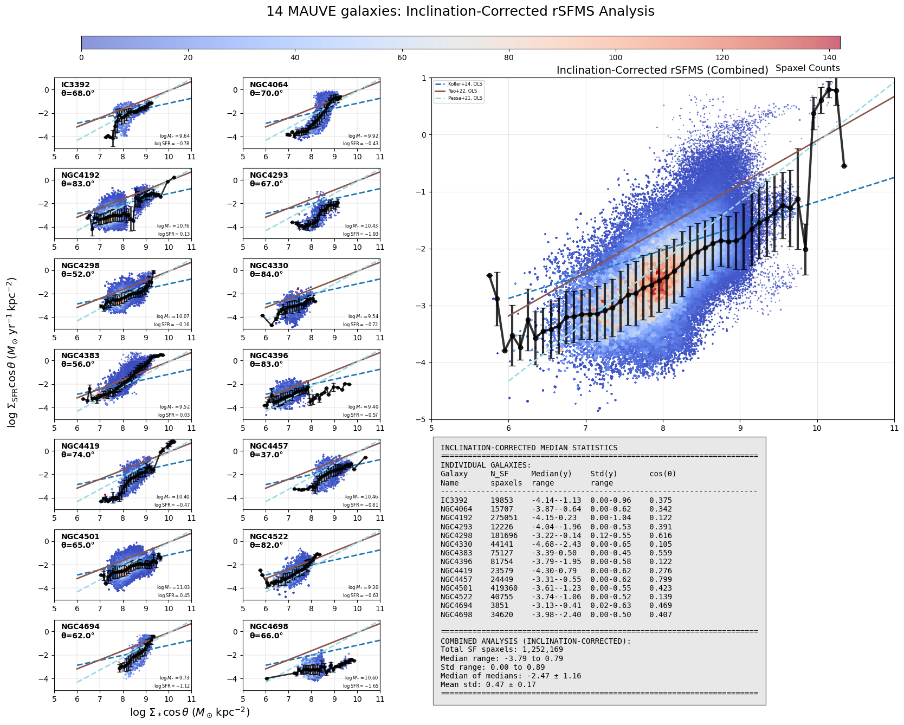
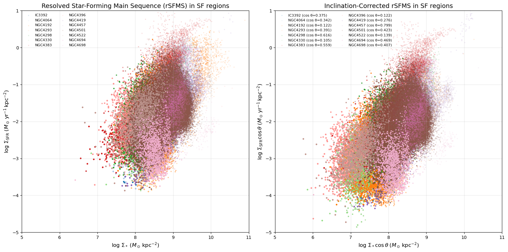
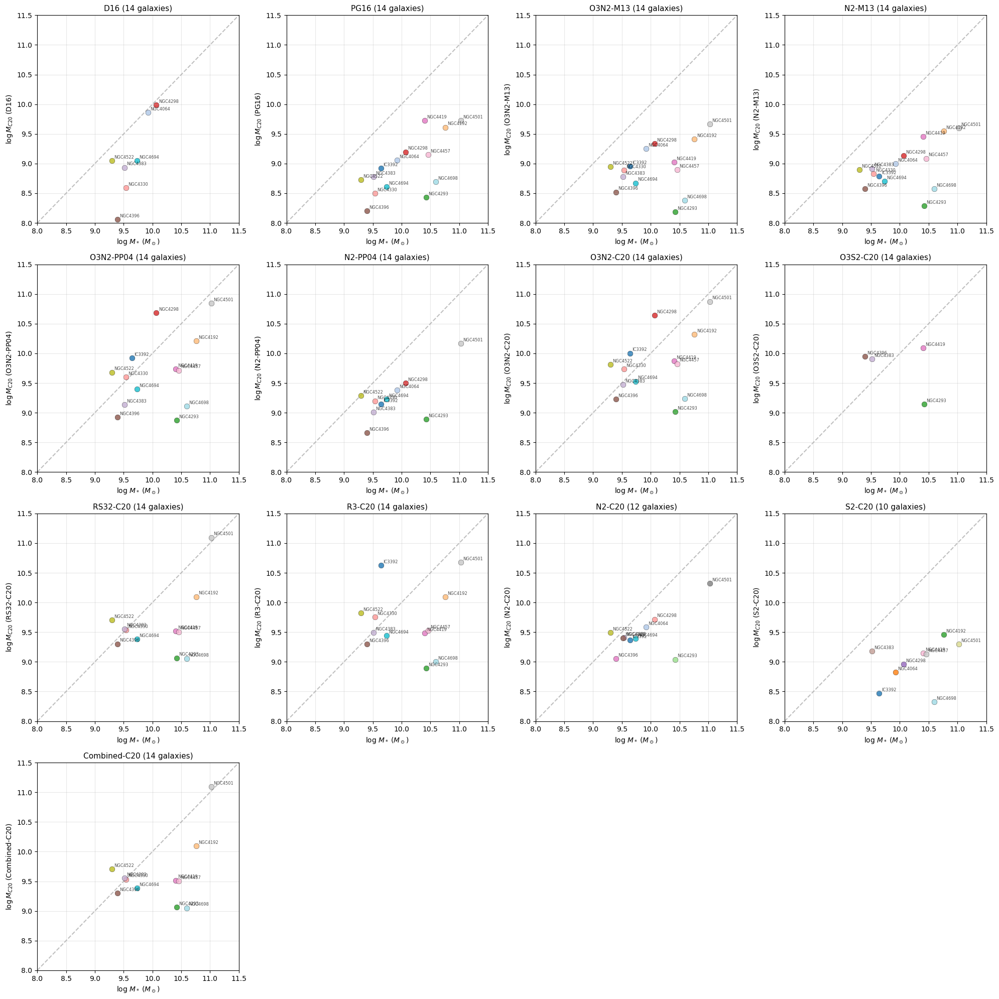

# 20250915 Inclination and Metallicity Test

## Minor fix at Combined-C20 method

I found that my previous way to get Combined-C20 metallicity is a bit wrong and i now fix it. But it doesn't affect out conclusion that Combined-C20 method is not applicable to our data as that will cause bimodality. 

Therefore, when checking the indicators with Combined-C20 metallicity, we can further see that it is not suitable. 

## Inclination correction on rSFMS

First the observed rSFMS:

Then simply assuming thin disc to get inclination corrected rSFMS

Comparison:

Looks like scatter is slightly larger. 

## Try parameters from Curti+2020

The FMR from Curti+2020 is 
$$
Z(M,\mathrm{SFR}) = Z_0-\gamma/\beta\log(1+(M/M_0(\mathrm{SFR}))^{-\beta}),
$$
where $\log(M_0(\mathrm{SFR})) = m_0+m_1\log(\mathrm{SFR})$ or $M_0(\mathrm{SFR}) = 10^{m_0}\mathrm{SFR}^{m_1}$.

Then, I can rewrite into 
$$
\log_{10}(M)_{\mathrm C20} = m_0+m_1\log_{10}(\mathrm{SFR})-\frac{1}{\beta}\log_{10}(10^{\frac{\beta}{\gamma}(Z_0-Z)}-1)
$$
with $Z_0 = 8.779$, $m_0 = 10.11$, $m_1 = 0.56$, $\gamma = 0.31$, $\beta = 2.1$ and so I can plot it in the y-axis. That means it should lie on the one-to-one dashed line if the data can perfectly recreate the Curti+2020 FMR surface. 

