# 20250916 Inclination

Inclinatons are determined from the SDSS r-band axis ratio ($b/a$) as
$$
\cos(i) = \sqrt{\frac{(b/a)^2-q_0^2}{1-q_0^2}}$$
$$
The inclination degree $i$ is provided by Table 1 of Brown+2021, and we choose the intrinsic thickness as $q_0 = 0.2$ for all galaxies with a clear disc component (Cortese+2016).

Then the inclination correction for observed surface density preperties
$$
\Sigma_{\rm corr} = \frac{b}{a}\Sigma_{\rm observed}
$$
Then I can make comparisons: left is uncorrected, while right is inclination corrected.

## rSFMS

As expected, it just moves diagonally. 

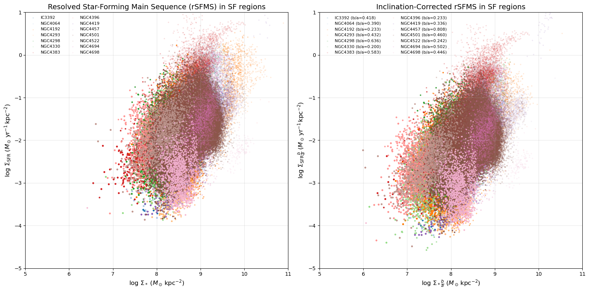

## rMZR

In short, just directly look at O3N2-M13 (the third figure, that Koller+24 and Yao+2022 used): if we ignore NGC4383, I would say we do reproduce the rMZR. 

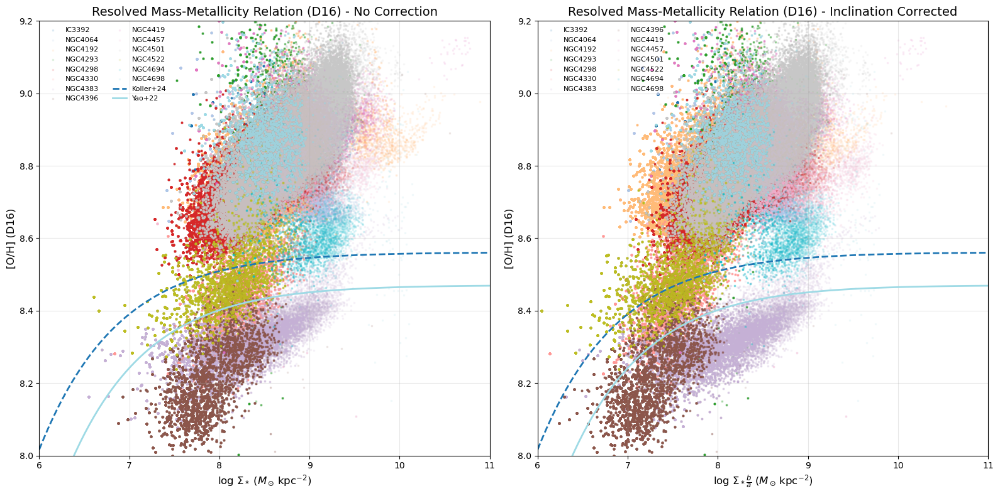

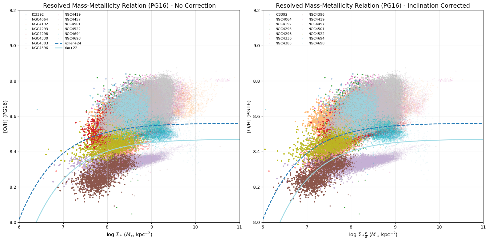

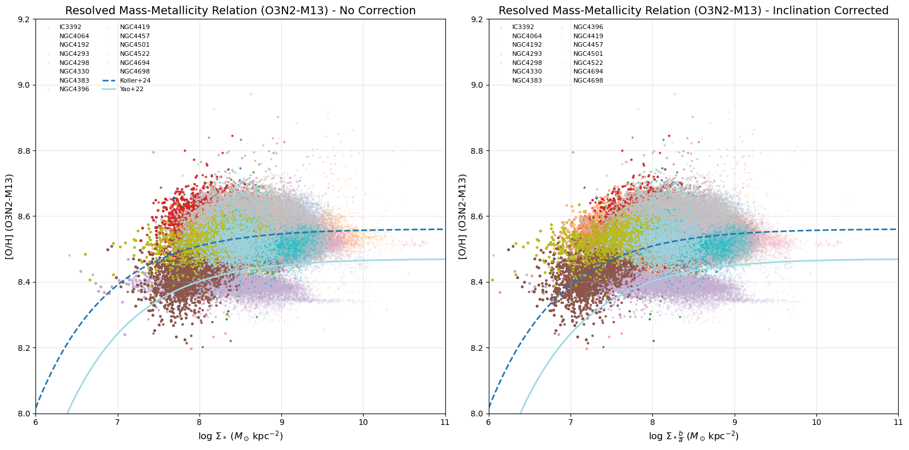

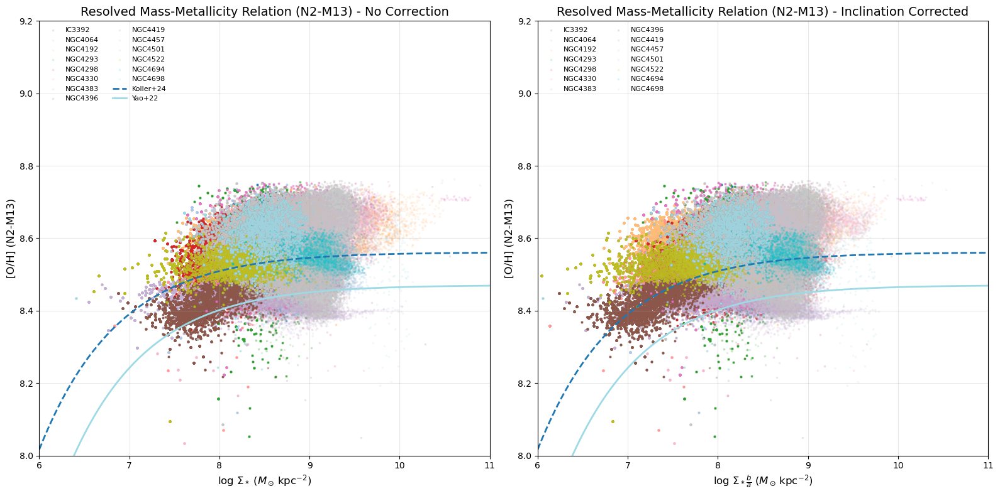

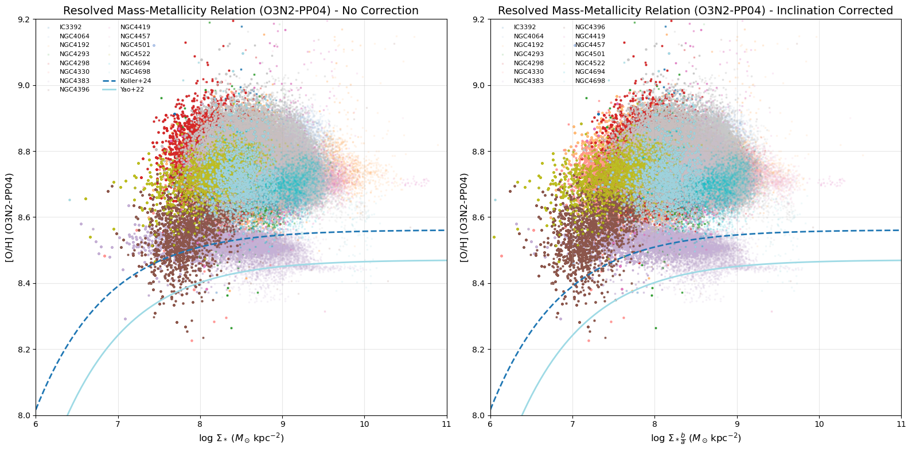

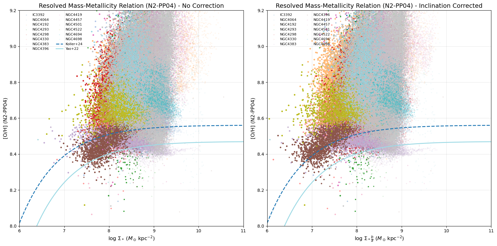

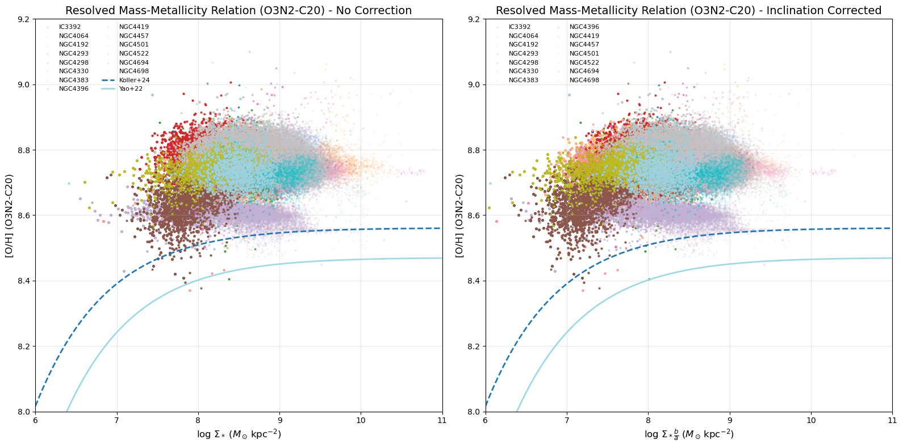

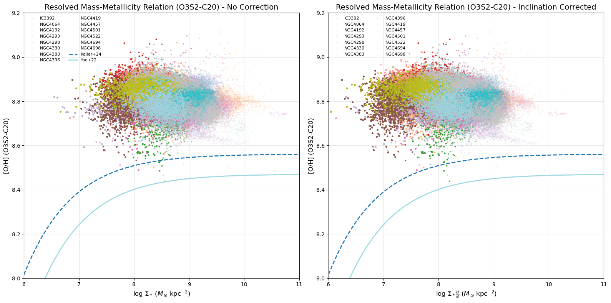

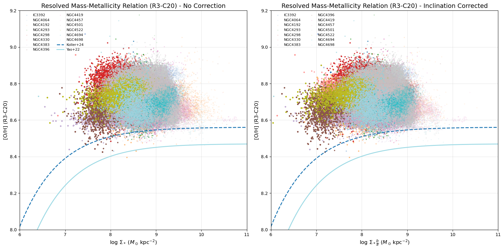

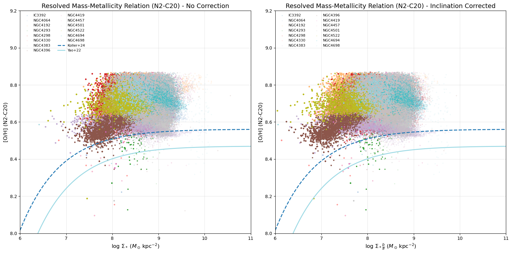

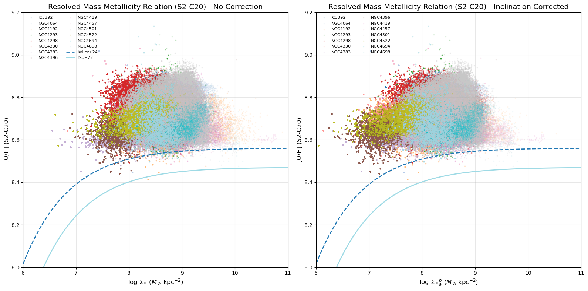

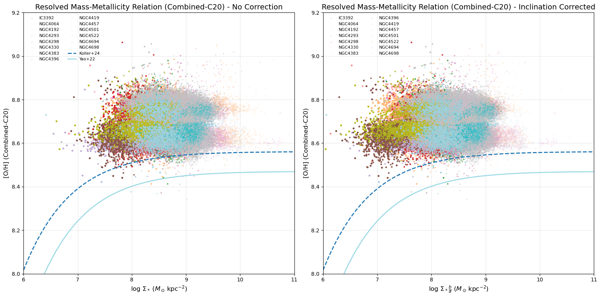