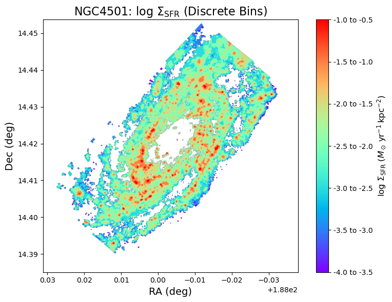
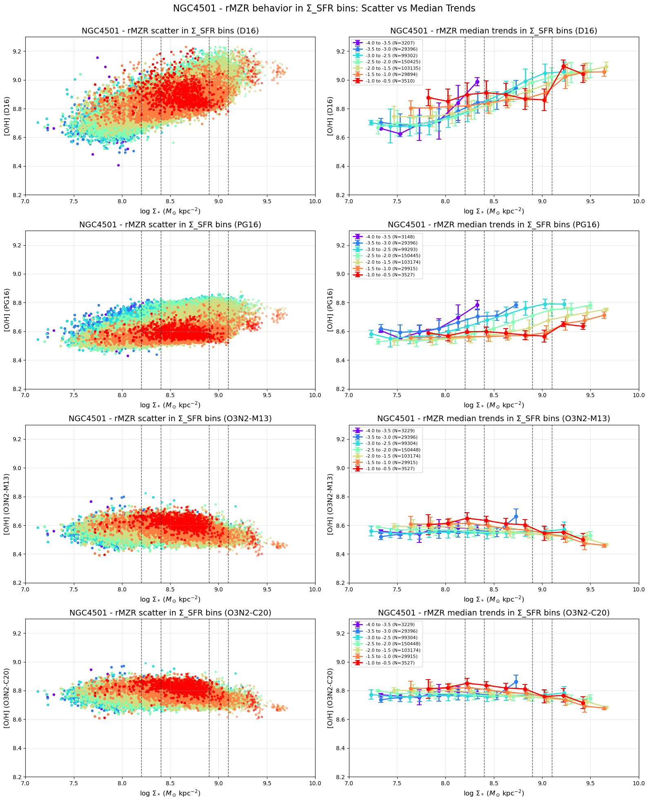
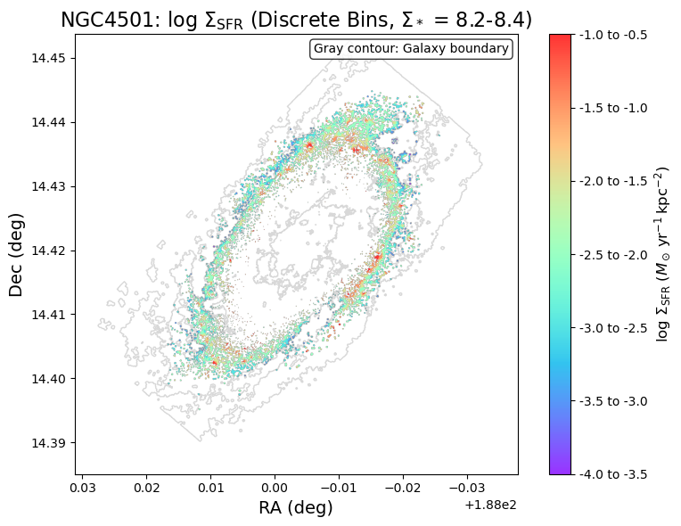
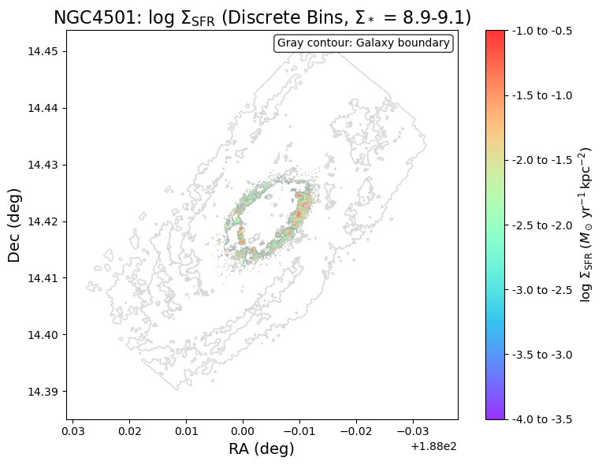

# 20250922 NGC4501 Large Metallicity Scatter in Mass Bin

Now we pick the NGC4501 and start to have a closer look. 

Here i Show the SFR map, but uniformaly divided $\Sigma_\mathrm{SFR}$ into 7 bin from -4 to -0.5 with binwidth at 0.5. 

Then i show 4 different calibrations (N2S2-D16, Scal-PG16, O3N2-M13 and O2N2-C20) of rMZR in both scatter plot and median trend, color coded by $\Sigma_\mathrm{SFR}$. The idea here is that we want to see if SFR drives the scatter in metallicity at fix stellar mass.  

I use vertical dashed line to highlight two ranges that looks interesting (for me). 

1. $8.2\leq\log(\Sigma_*)\leq8.4$: all calibrations show almost largest scatter in median trend. 
2. $8.9\leq\log(\Sigma_*)\leq9.1$: N2S2-D16 and Scal-PG16 still show almost largest scatter in median trend; while O3N2-M13 and O2N2-C20 show minimimal scatter. 

Next we can go back to the SFR map to see where are these two ranges. 

Ok, so they are two SF rings. Not that surprise me but still surprise me that they indeed from some structures. 

So at given fixed stellar mass surface density from 8.2-8.4, the outer SF ring, we see large scatter at both metallicity and SFR.  And looking at the SFR map, it looks like maybe indeed we are look at the inner and extended/outer part of HII regions, though they are both classified as SF regions in BPT. But I guess i still need to check by remaking the BPT color coded by SFR. 

For 8.9-9.1, the inner SF ring, no clear idea for now, but i will check the BPT as well. 