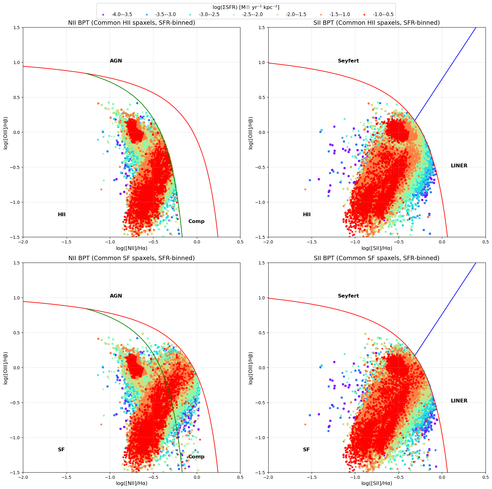
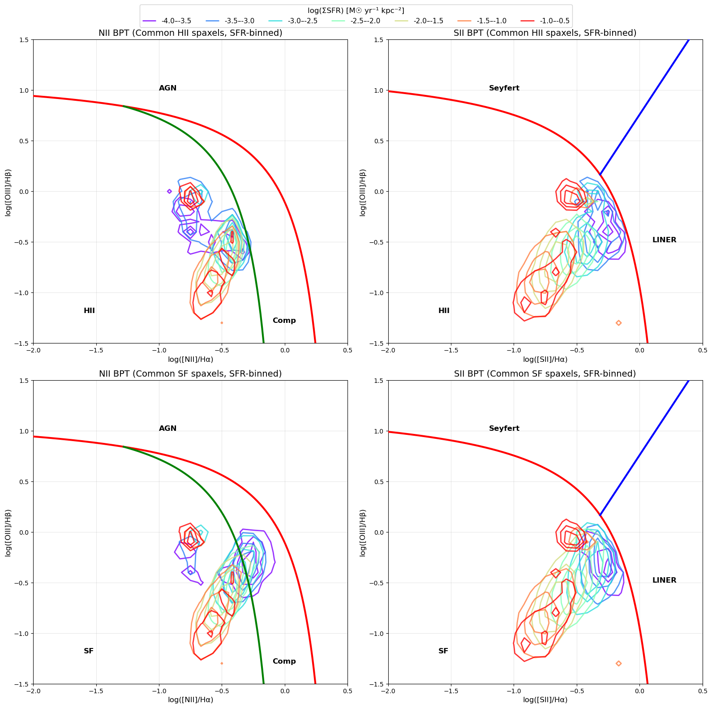
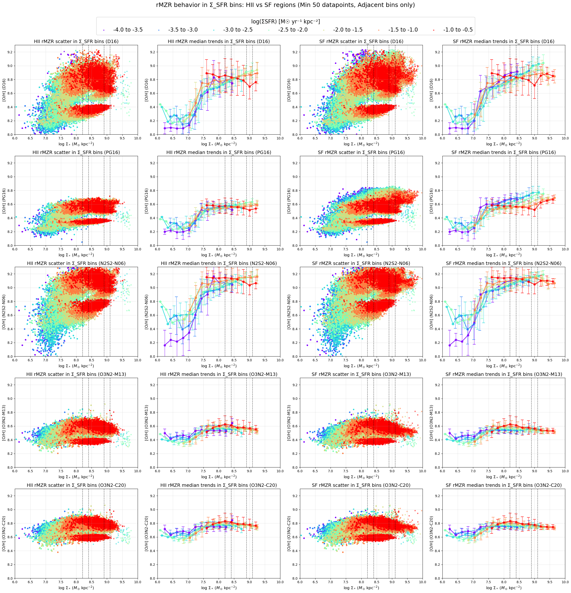
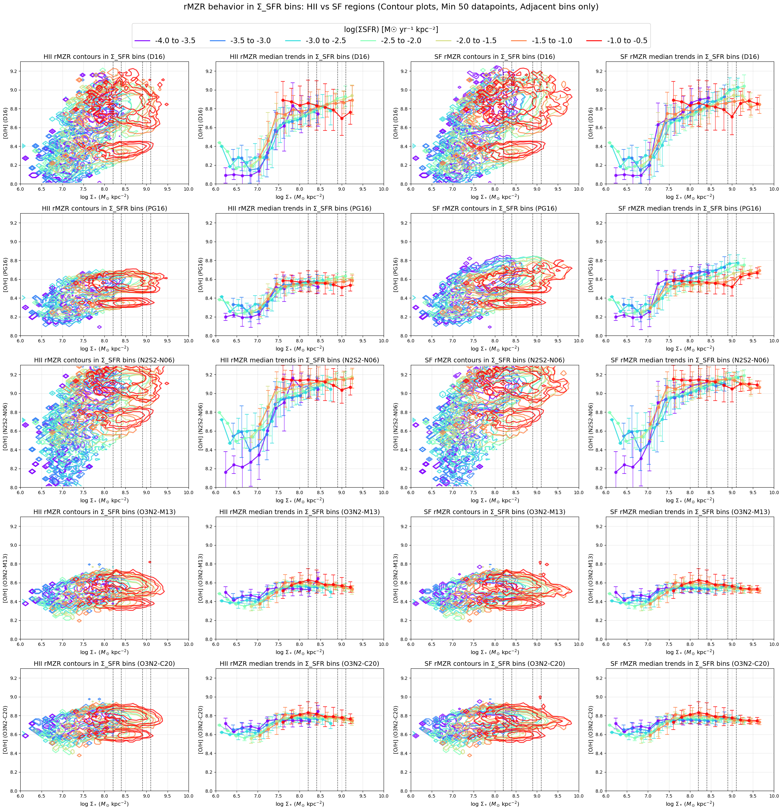
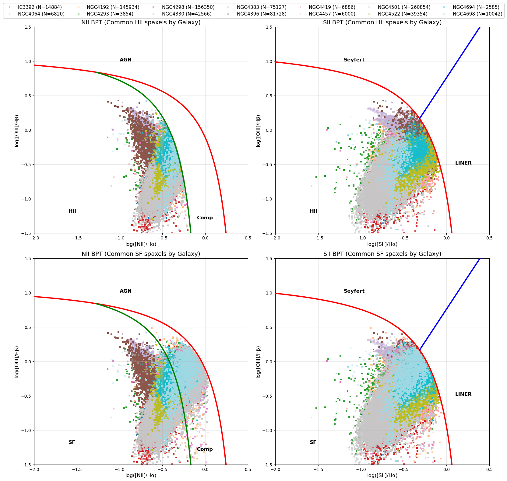
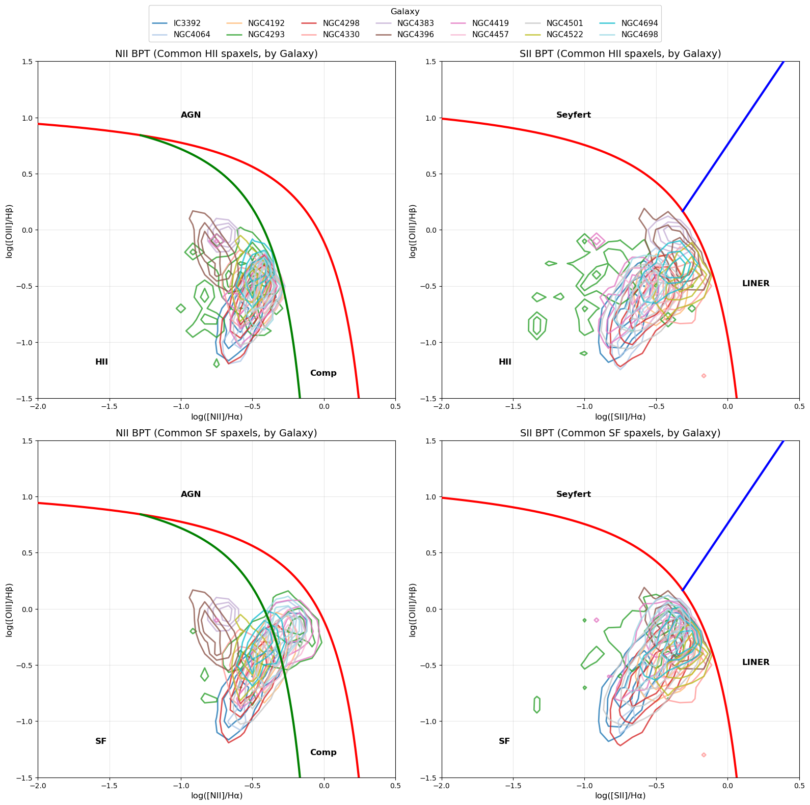
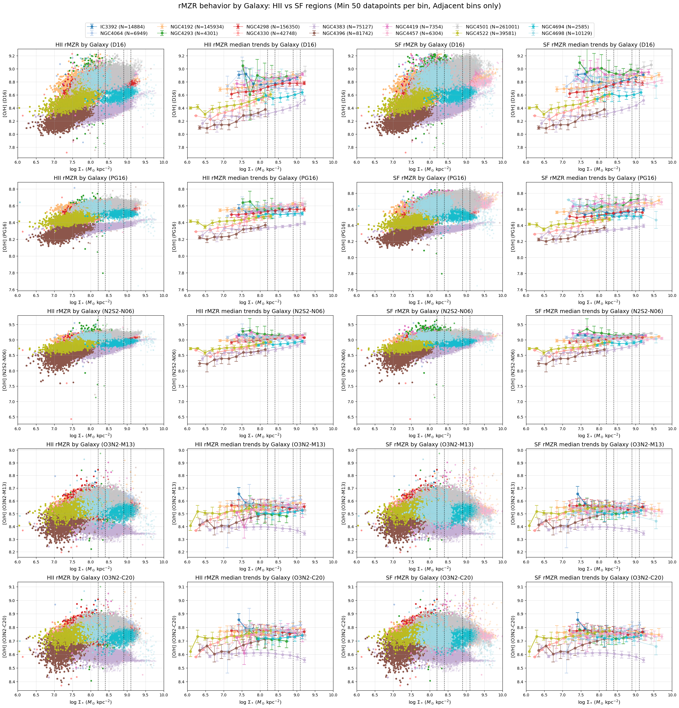
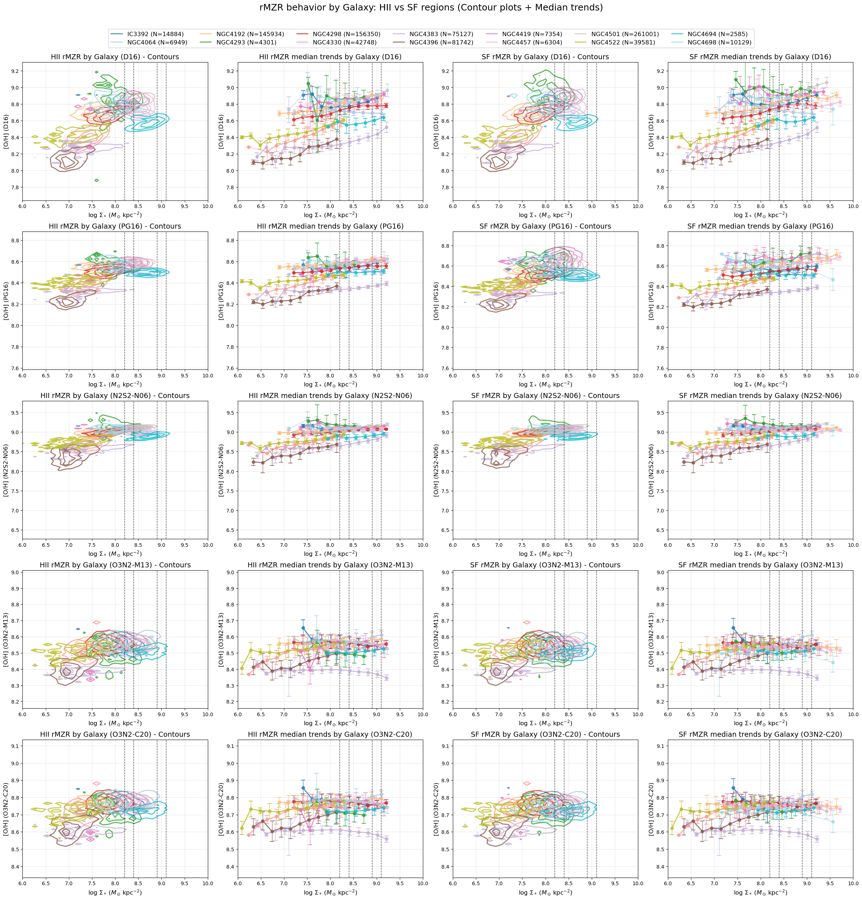

# 20251002 rBPT and rMZR in HII and SF

## 1. Still binning by $\Sigma_\mathrm{SFR}$

### 1.1 rBPT in HII and SF

### 1.2 rBPT in HII and SF (contour)

### 1.3 rMZR in HII and SF

### 1.4 rMZR in HII and SF (contour)

## 2. Then binning by individual galaxy

### 2.1 rBPT in HII and SF

### 2.2 rBPT in HII and SF (contour)

### 2.3 rMZR in HII and SF

### 2.4 rMZR in HII and SF (contour)

