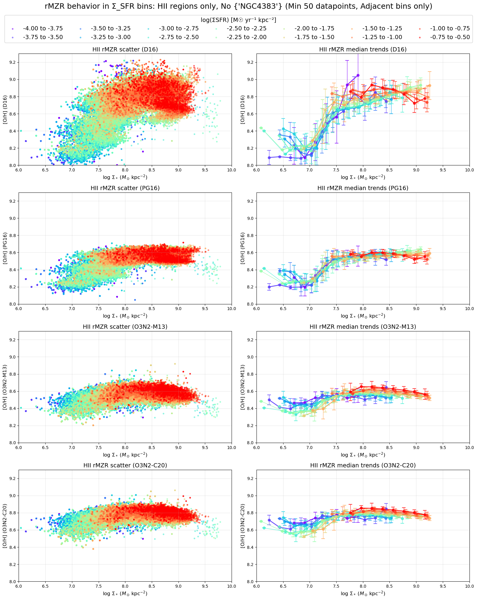

# 20251006 rMZR in HII But No NGC4383

Note.

1. Try removing the abnnormal NGC4383.  The reason is that it almost occupies the entire independent parameter space in rMZR.  So if we want to study the SFR dependence in rMZR, it will be biased by this single galaxy.  Therefore, we can try removing it and see how the results change.
2. Only spaxels from HII regions are included.
3. Update to 14 $\Sigma_\mathrm{SFR}$ bins, with binwidth 0.25 dex
4. Stick with these 4 indicators: D16, PG16, O3N2-M13 and O3N2-C20. 

Summary:

**Let's focus on O3N2 first (third and fourth rows). **

1. Kind of different SFR dependence in rMZR, maybe due to that indicators are more dependent on O abundance or N abundance? For D16 and PG16: higher $\Sigma_\mathrm{SFR}$ at higher metallicity up to at least $\Sigma_*\lesssim8.5$; while for both O3N2, we can see there is an inversion point at $\Sigma_*$ between 7.5 and 7.8 (lower metallicity shows higher $\Sigma_\mathrm{SFR}$ in low mass end; while metallicity positive-correlates with $\Sigma_\mathrm{SFR}$ in high mass end). 
2. 

## Combined

## Individual

