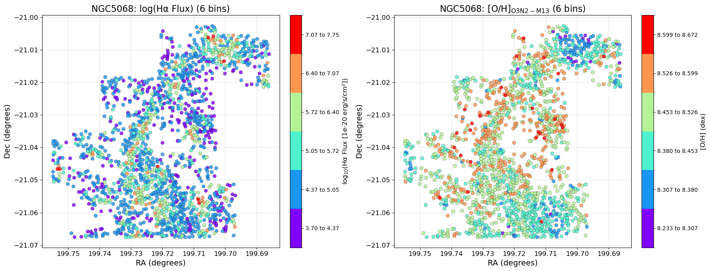
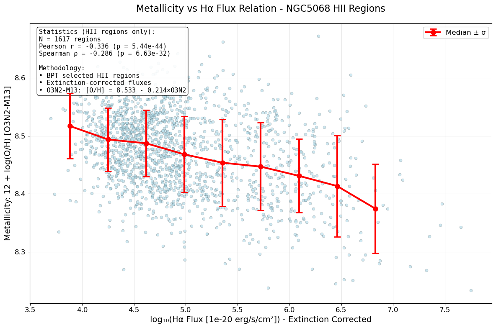

# 20251010 First Glance at PHANGS-MUSE NGC5068

PHAGNS-MUSE nebula catalog: https://www.eso.org/sci/publications/announcements/sciann17705.html

Description: https://www.eso.org/rm/api/v1/public/releaseDescriptions/235

I checked the PHANGS-MUSE's released catalog, and it turns out that they have some emission lines and BPT classification. So then I pick the low mass and face-on galaxy NGC5068 ($\log(M_*/M_\odot) = 9.40$, deg = 35.7$^\circ$) to have a look:

1. They dont provided information about the stellar mass surface density so we can not do rMZR or rSFMS. 
2. They provided corrected H$\alpha$ so we can may consider it as the $\Sigma_\mathrm{SFR}$. Afterall they are just offset by a coefficient inside single galaxy.  
3. They provided metallicity but it is calculated by Scal-PG16, so I recalculated the [O/H] by O3N2-M13. 
4. They also provided the BPT classification so I can make sure we only look at the HII region. 

And in short, I think the results here rule out the possibility that the inclination may cause negative correlation between metallicity and $\Sigma_\mathrm{SFR}$ in low mass galaxies. 

As usual, below is the H$\alpha$ and O3N2-M13 map, as well as the $Z_\mathrm{gas}$-H$\alpha$ relation. Again, if you consider that H$\alpha$ represents the $\Sigma_\mathrm{SFR}$, then we can clearly see the trend that higher $\Sigma_\mathrm{SFR}$ (redder on LHS), lower metallicity (bluer on RHS). And even though we dont have mass information to bin the $Z_\mathrm{gas}$-H$\alpha$ relation, we can still clearly see the nagative correlation. 

