# 20251013 Offset Map in HII

## Combined rMZR and $Z_\mathrm{gas}$-$\Sigma_\mathrm{SFR}$ relation in HII regions without NGC4383

Now I update to have 12 bins. 

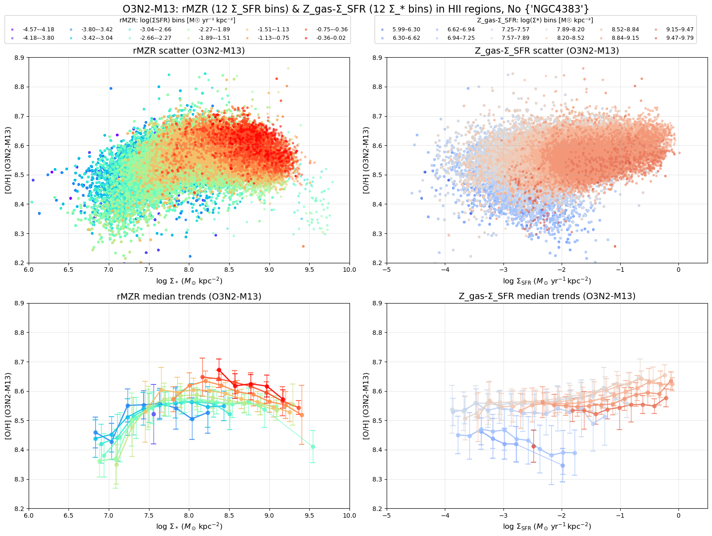

## NGC4501

NGC4501 shows a clear positive correlation between $Z_\mathrm{gas}$ and $\Sigma_\mathrm{SFR}$. 

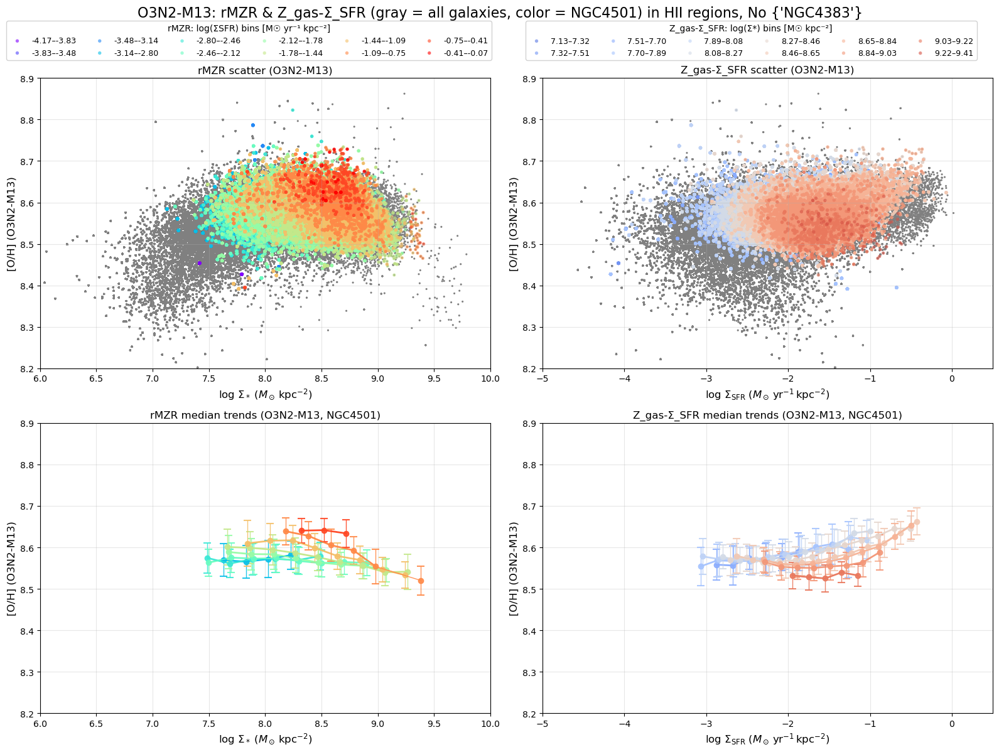

Here I try taking the median value as the standard (offset 0) and then perform the offset map to see how the $\Sigma_\mathrm{SFR}$ and $Z_\mathrm{gas}$ vary across the galaxy.  

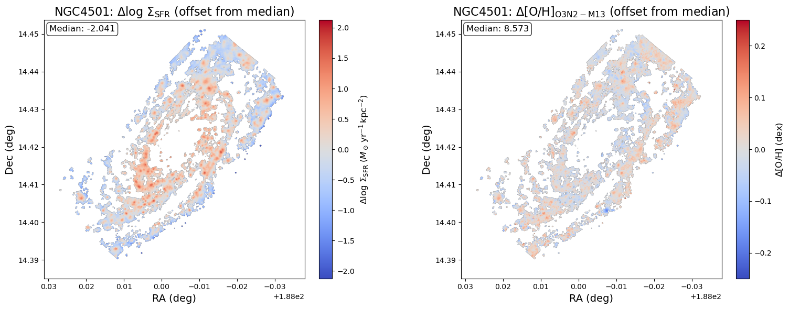

For NGC4501, we can see in general, redder on the LHS also shows redder on the RHS. However, we also notice that in the below green circle region, it shows spatial variation: the inverse correlation in this relatively low-mass HII regions. 

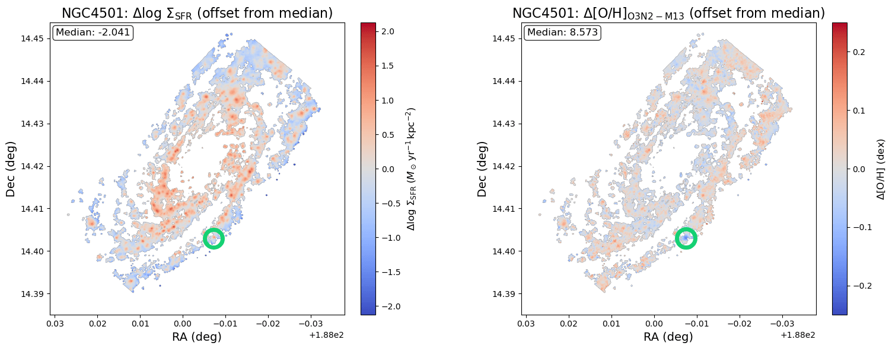

Below I also add two extra offset map: $\Sigma_*$ and stellar metallicity [M/H]. 

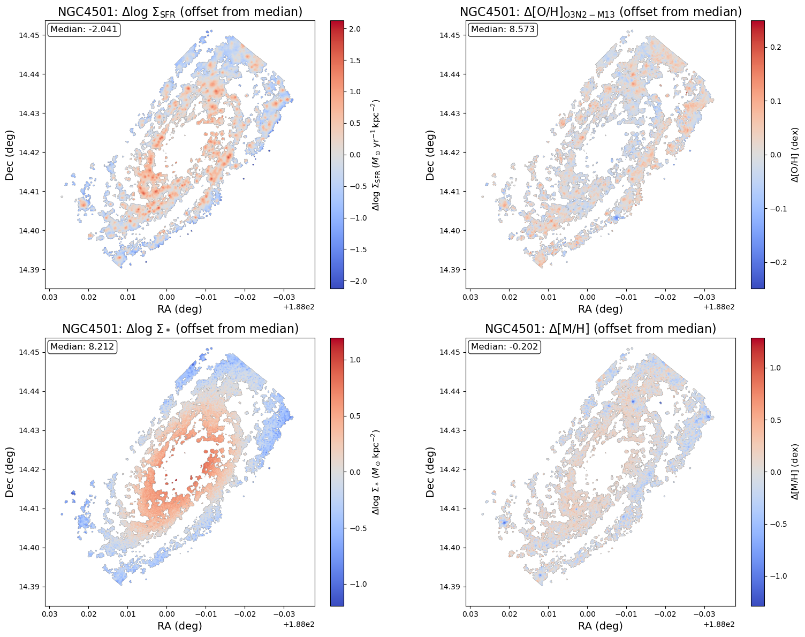

## NGC4396

NGC4396 shows a clear negative correlation between $Z_\mathrm{gas}$ and $\Sigma_\mathrm{SFR}$. 

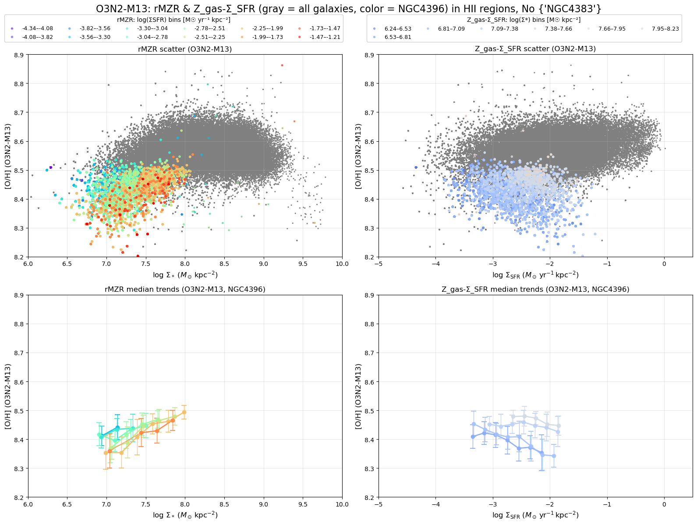

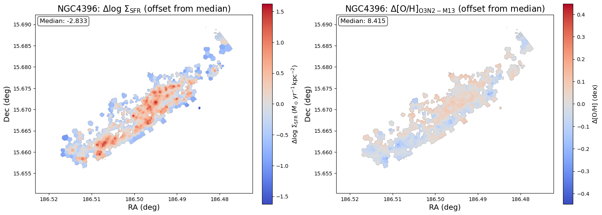

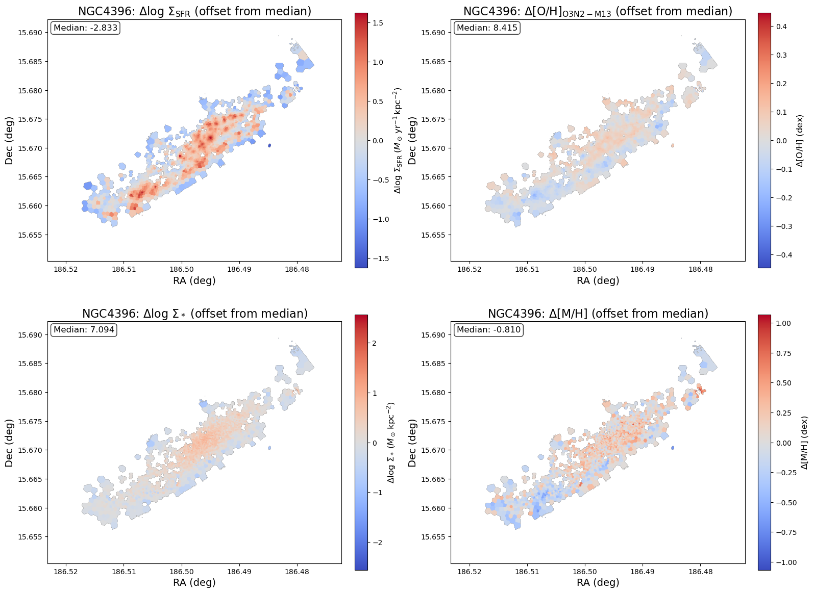

## NGC4192

NGC4192 shows an ambigus correlation between $Z_\mathrm{gas}$ and $\Sigma_\mathrm{SFR}$? 

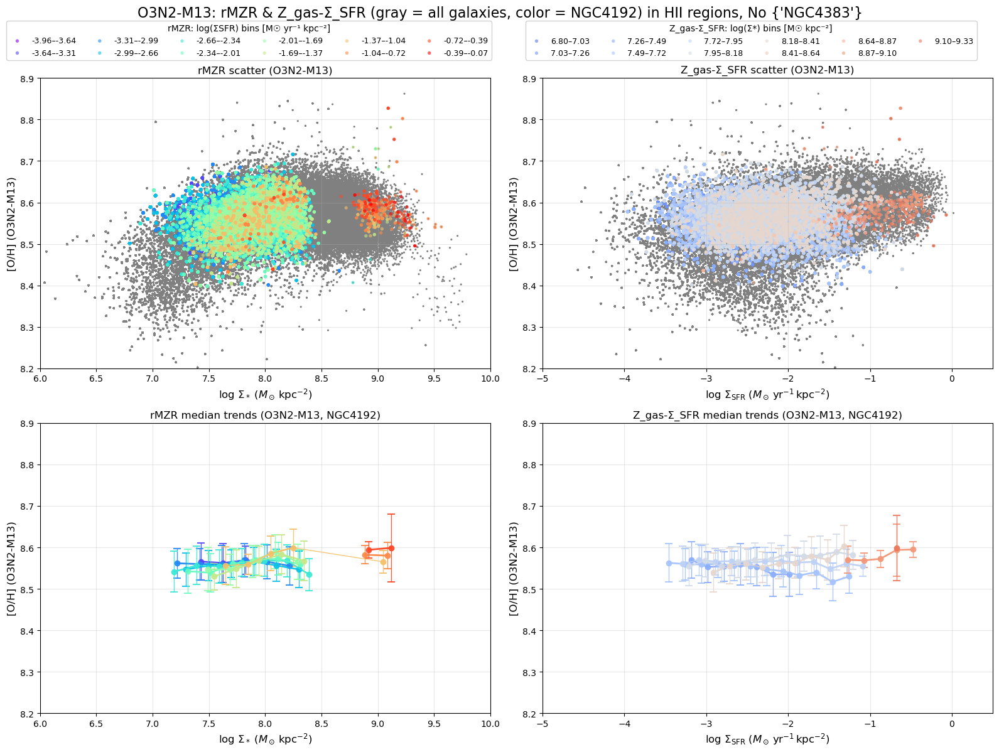

However, it shows a bit clearer inversion point at $\Sigma_*\sim7.7$. So like the red regions ($\Sigma_*\gtrsim7.7$) in $\Delta\log(\Sigma_*)$ map show a positive correlation (redder in $\Delta\log(\Sigma_\mathrm{SFR})$ also shows redder in $Z_\mathrm{gas}$); while the blue regions ($\Sigma_*\lesssim7.7$) in $\Delta\log(\Sigma_*)$ map show a positive correlation (redder in $\Delta\log(\Sigma_\mathrm{SFR})$ but shows bluer in $Z_\mathrm{gas}$). 

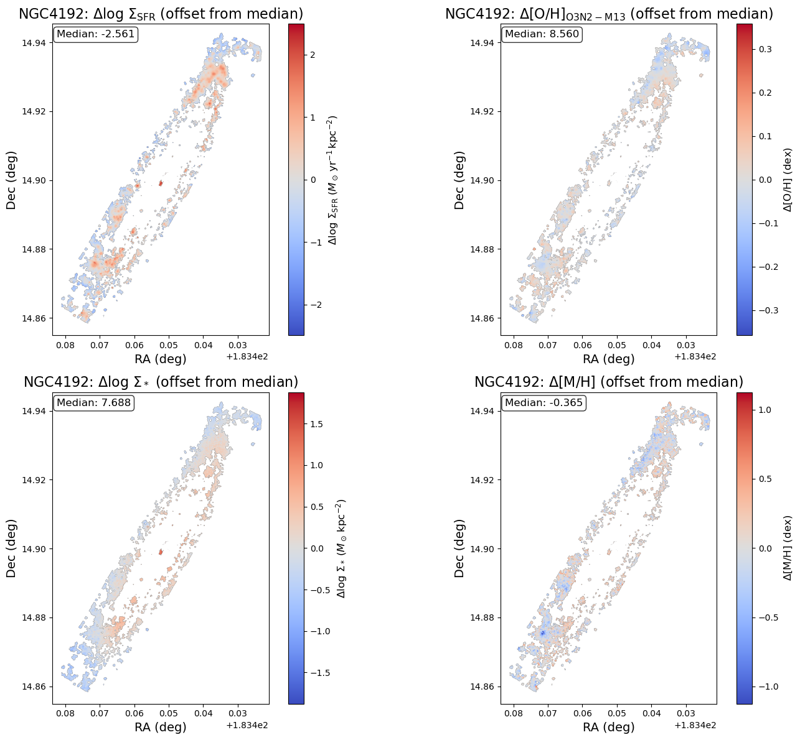

## NGC4330

NGC4330 shows a negative correlation between $Z_\mathrm{gas}$ and $\Sigma_\mathrm{SFR}$, though not that clear. 

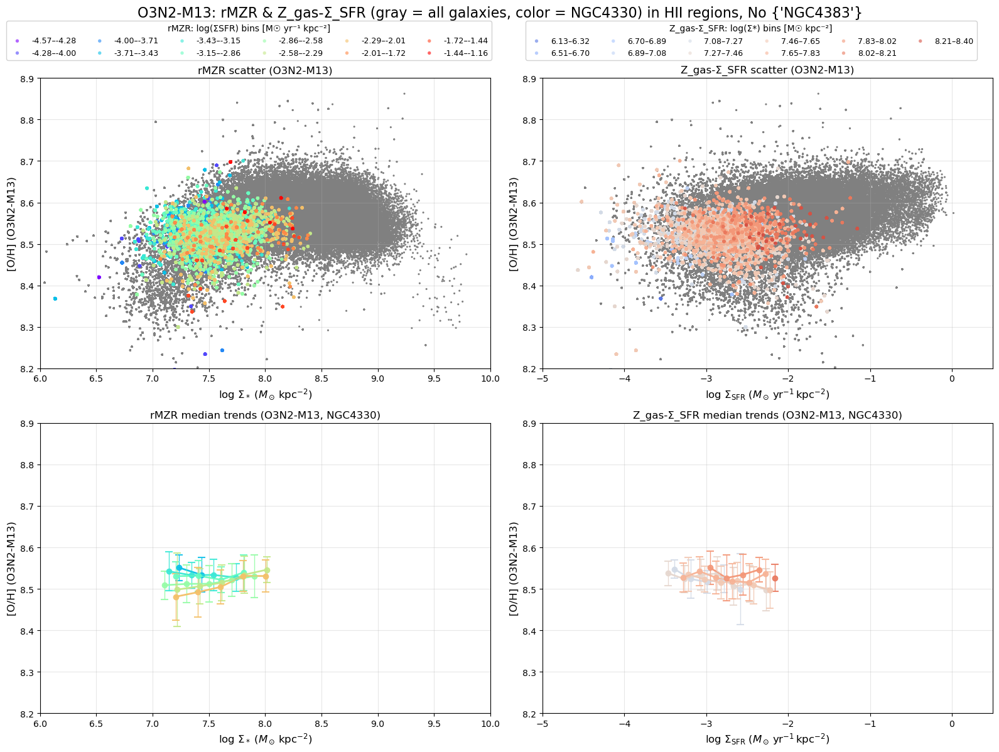

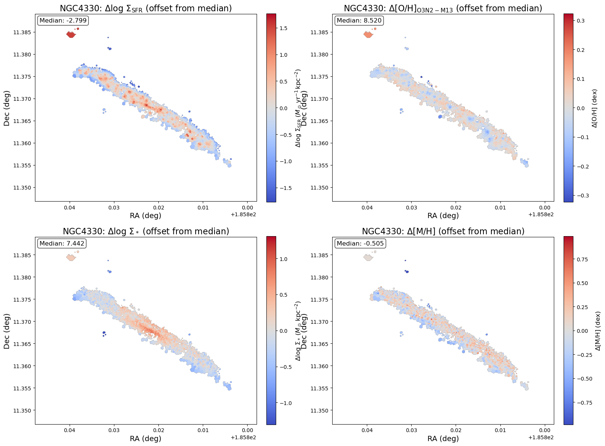