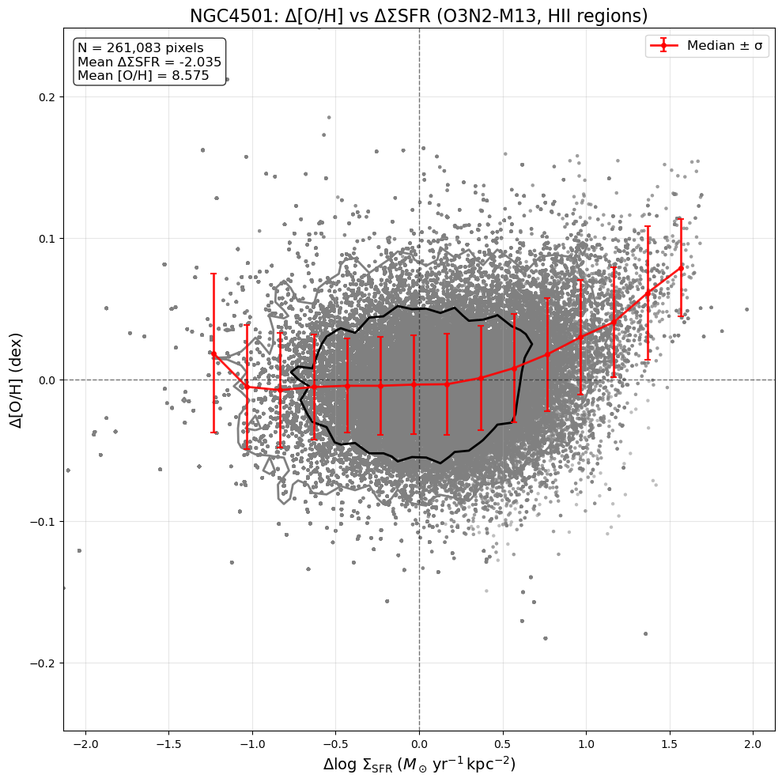
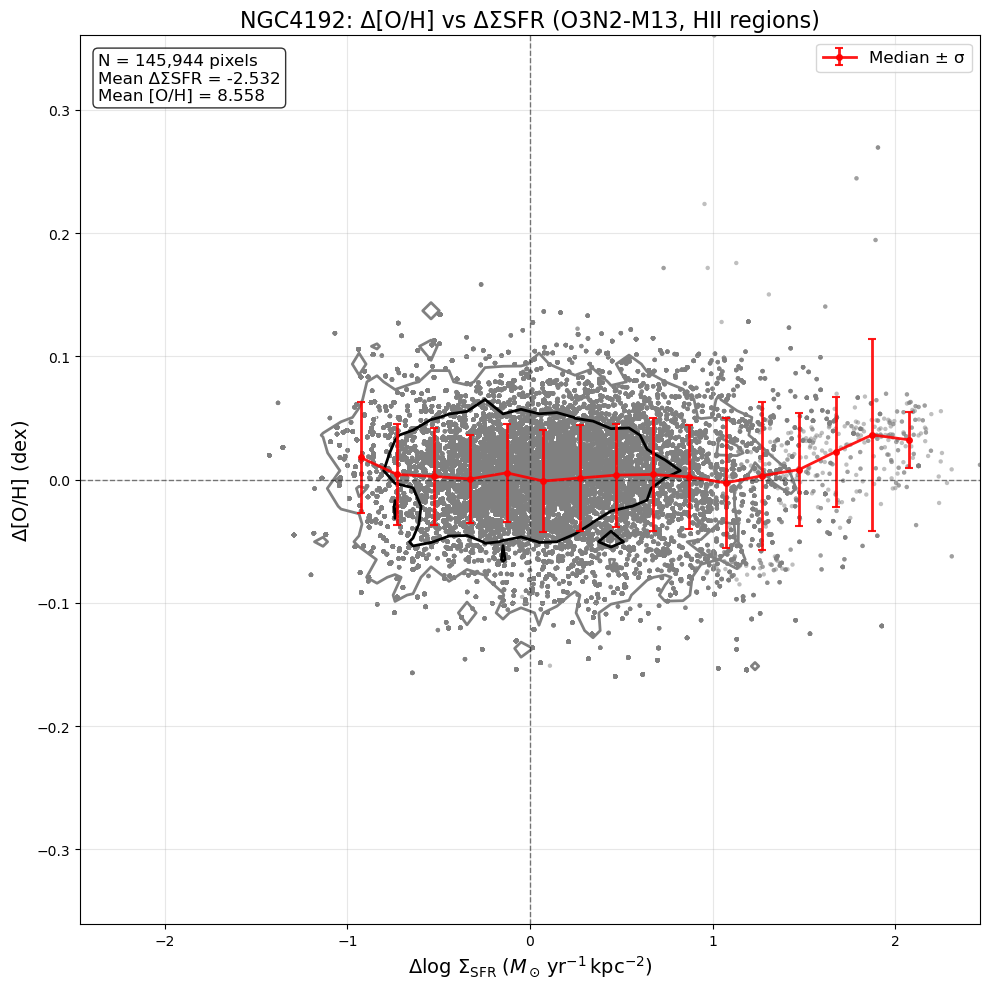
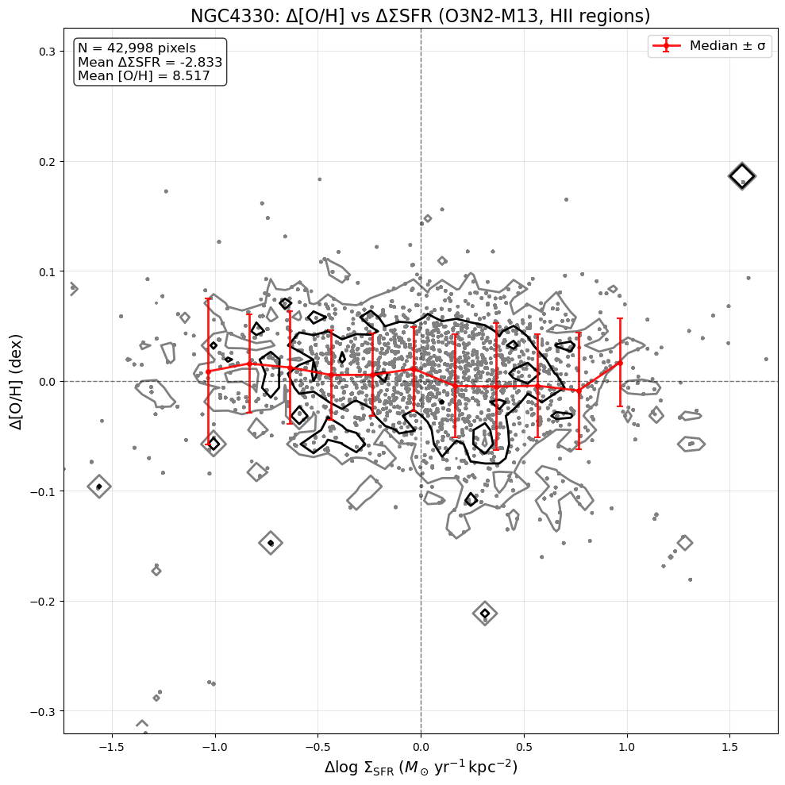
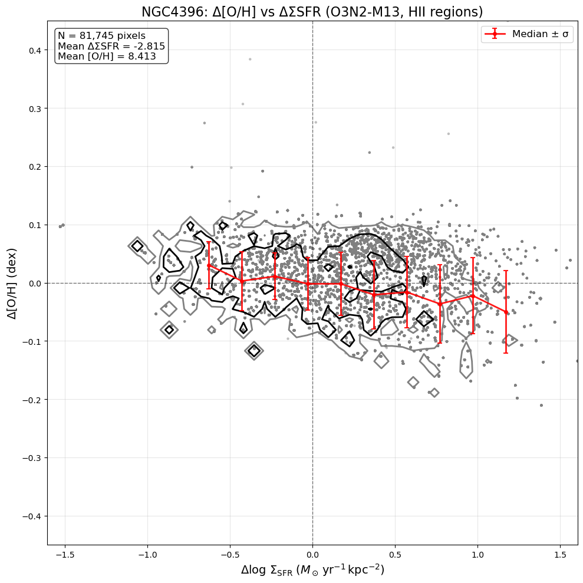
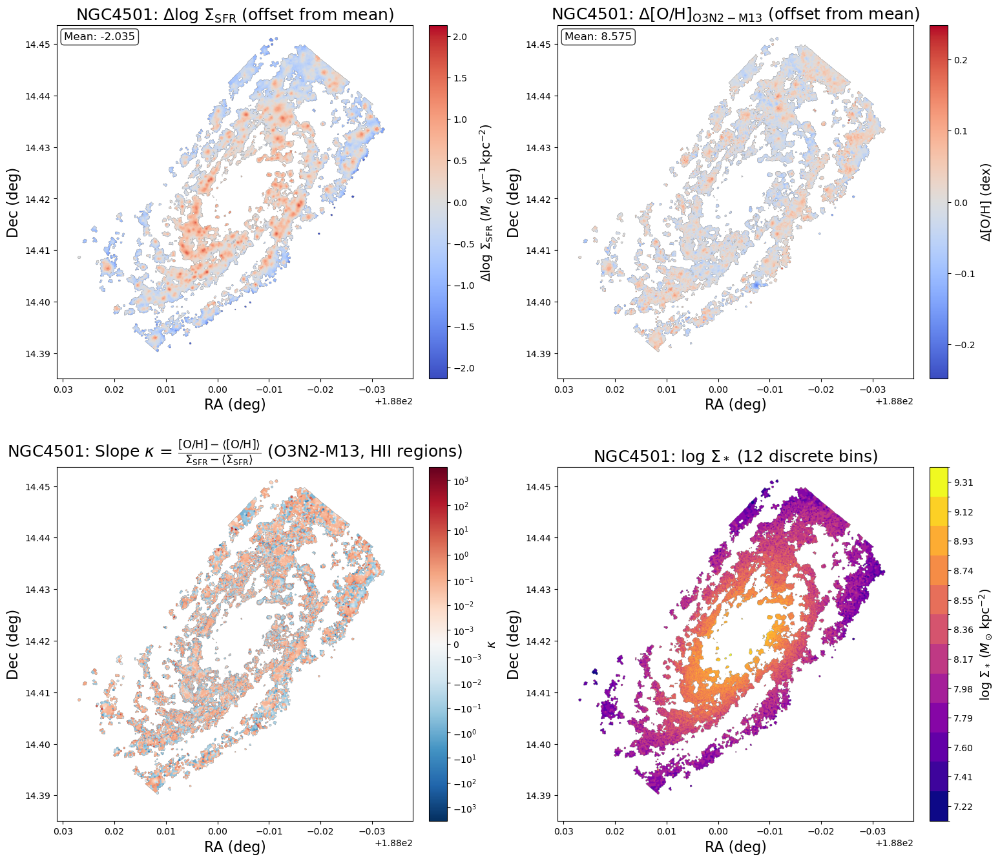
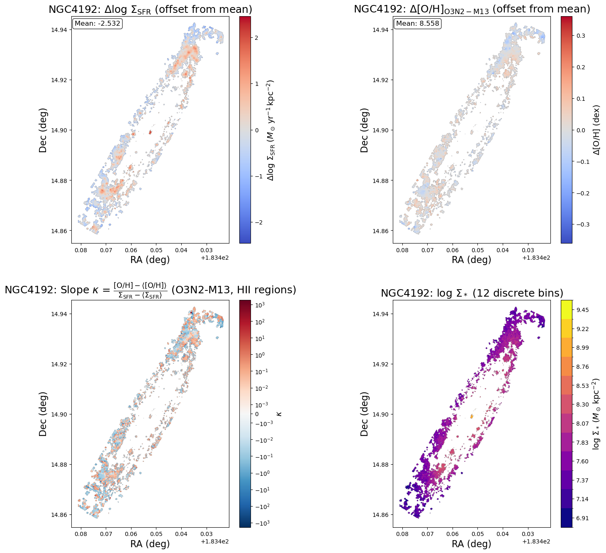
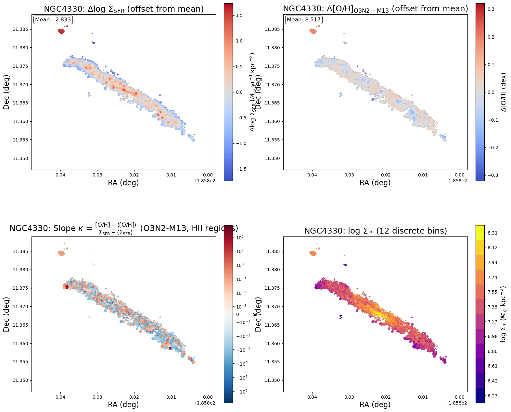
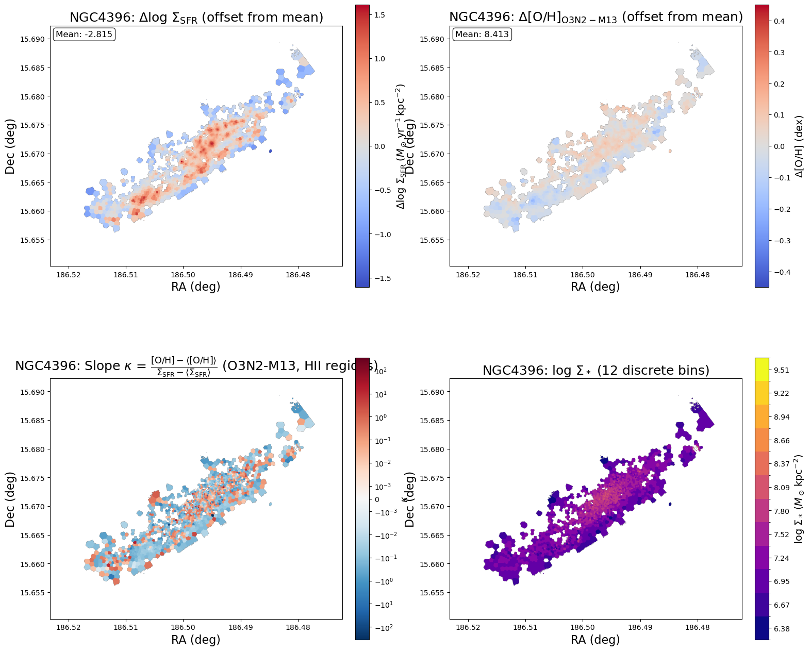

# 20251016 Slope Map from Bin Average in HII

## Offset relation: $\Delta\mathrm{[O/H]}$ vs $\Delta\Sigma_\mathrm{SFR}$

Note that the offset here is defined as the offset from the average of each $\Sigma_*$ bin. We first divide data into 12 equal-width $\Sigma_*$ bin. Then in each $\Sigma_*$ bin, we subtract $\Sigma_\mathrm{SFR}$ and $\mathrm{[O/H]}$ by the mean value to obtain the offset, $\Delta\Sigma_\mathrm{SFR}$ and  $\Delta\mathrm{[O/H]}$ . 

Below I show the $\Delta\mathrm{[O/H]}$ vs $\Delta\Sigma_\mathrm{SFR}$ relations for NGC4501, NGC4192, NGC4330 and NGC4396. 

## Slope or Ratio map

To further identify the correlation between $\mathrm{[O/H]}$ vs $\Sigma_\mathrm{SFR}$ after remove the $\Sigma_*$ dependence (or $\Delta\mathrm{[O/H]}$ vs $\Delta\Sigma_\mathrm{SFR}$), I define the slope or ratio from $\mathrm{[O/H]}$ vs $\Sigma_\mathrm{SFR}$ (or $\Delta\mathrm{[O/H]}$ vs $\Delta\Sigma_\mathrm{SFR}$) relation of each $\Sigma_*$ bin:
$$
\kappa = \frac{\mathrm{[O/H]}-\langle\mathrm{[O/H]}\rangle}{\Sigma_\mathrm{SFR}-\langle\Sigma_\mathrm{SFR}\rangle} = \frac{\Delta\mathrm{[O/H]}}{\Delta\Sigma_\mathrm{SFR}}
$$
But taking the slope or ratio, we can now:

1. positive or negative correlation by the sign of $\kappa$
2. how positive or negative the correlation is by the magnitude of $\kappa$ 

As usual, I show the $\kappa$ map in the bottom left for NGC4501, NGC4192, NGC4330 and NGC4396. 

