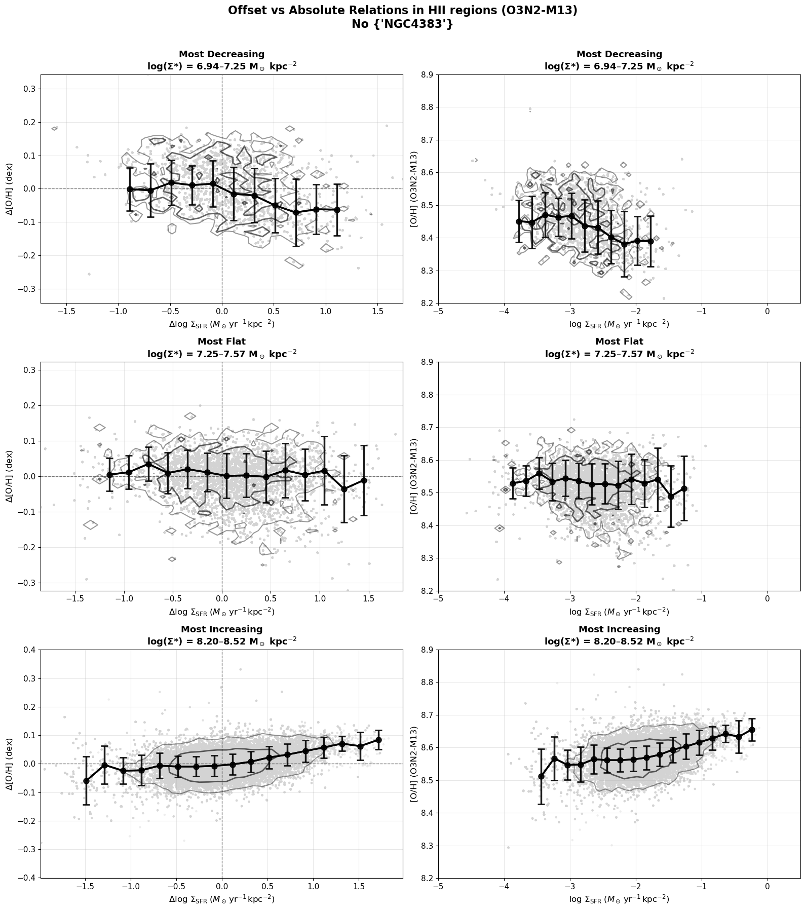

# 20251019 Offset and Absolute Relations in HII Regions

In short, the $\Sigma_*$-dependent increasing/decreasing trends in $\rm{[O/H]}$ vs $\Sigma_\mathrm{SFR}$ relation is real. The reason why we dont see it in the offset relation ($\Delta\rm{[O/H]}$ vs $\Delta\Sigma_\mathrm{SFR}$) is probably becuase they overlap each other when we putting each bin together. 

For example, if you pick the most decreasing, flat and increaing $\Sigma_*$ bins from the combined $\rm{[O/H]}$ vs $\Sigma_\mathrm{SFR}$ relation (right column), and create the associated $\Delta\rm{[O/H]}$ vs $\Delta\Sigma_\mathrm{SFR}$ relation (left column), then we can see that those offset relations are just renormalized in new parameter space and the trends are preserved. 

