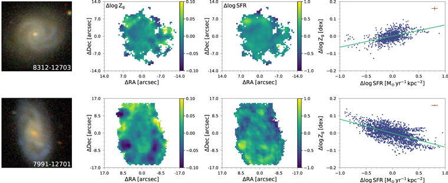

# 20251020 Reading some Zgas-SFR relation papers

## Teklu+2020

https://iopscience.iop.org/article/10.3847/1538-4357/ab94af

the local SFR–*Zg* slope varies with the average metallicity, with the more metal-poor galaxies presenting the lowest slopes (i.e., the strongest SFR–*Zg* anticorrelations), and reversing the relation for more metal-rich systems.

Yates et al. ([2012](https://iopscience.iop.org/article/10.3847/1538-4357/ab94af#apjab94afbib69)) presented the FMR projection, while the SFR anticorrelates to metallicity at lower stellar masses. Then the relationship inverts to a positive correlation at higher stellar masses. They argued that the inversion is the consequence of gas-rich mergers at higher stellar masses fueling a starburst. Later, Lara-López et al. ([2013](https://iopscience.iop.org/article/10.3847/1538-4357/ab94af#apjab94afbib37)) found a similar relation at higher mass; it gives the reversal of the FMR, and the higher SFR exhibits higher metallicity.

Kashino et al. (2016) find an anticorrelation between metallicity and SFR in FMR when using Mannucci et al. (2010) metallicity calibration; it retrieves a positive trend when using Dopita et al. (2016) metallicity calibration.

Cresci et al. (2019) demonstrated that at fixed mass the metallicity depends on SFR and shows an inversion in the high stellar mass region caused by the metallicity calibration and SFR estimation, which is similar to our result.

We confirm the dependence of the ratio of O32 on metallicity, which means that a higher ionization parameter is found at lower metallicity, and the lower ionization parameter tends to be found at higher metallicity.

## Sánchez-Menguiano+2019

Check their Fig.2, note that "In order to describe local spatial variations of these properties, their characteristic radial profiles must be removed. For each individual galaxy, we derive the residuals by subtracting the azimuthally averaged radial Zg (using the M13 calibration) and SFR distributions from the 2D maps."

We find that the local SFR–Zg slope varies almost linearly with the average gasphase metallicity, being that the more metal-poor galaxies present the lowest slopes (i.e., the strongest SFR–Zg anticorrelations).

We can therefore conclude that the characteristic oxygen abundance of a galaxy unambiguously determines the shape of its local SFR–Zg relation.

Various physical scenarios have been previously invoked to explain the observed anticorrelation between SFR and gas metallicity in dwarf galaxies (Sánchez Almeida et al. 2018). One scenario is the local infall of metal-poor gas that mixes with preexisting gas and triggers star formation bursts, provided that both the accreted and preexisting gas in each star-forming region have comparable masses. Our results suggest that this could be plausible for galaxies of low-to-intermediate mass  (<10–10.5 log M). On the contrary, for more massive systems, the preexisting gas mass may exceed the external gas mass, thus reversing the SFR–Zg relation from having a negative slope to a positive one. Alternatively, the authors also proposed that the anticorrelation could be the effect of self-enrichment due to stellar winds and supernovae. However, for this to occur, the outflows driving the metals out of the star-forming regions should be very intense, with mass-loading factors (i.e., the outflow rate in units of the SFR) larger than 10. Although large, it would still be consistent with some values found in local dwarf galaxies (e.g., Martin 1999; Veilleux et al. 2005; Olmo-García et al. 2017). 

Gas accretion of pristine gas was also proposed by Hwang et al. (2019) for the ALM regions found in a sample of late-type galaxies. These authors argued that the low-metallicity regions trace sites of recent accretion of gas that stimulates ongoing star formation, in support of our findings. Furthermore, they found that the incidence rate of these regions is higher in lower-mass galaxies. These results confirm our observations of a nonhomogeneous chemical distribution of star-forming regions driven by local infall of metal-poor gas that highly affects lowmass, metal-poor galaxies. 

Finally, some studies analyzing the presence of variations in the gas chemistry of disk galaxies have pointed to selfenrichment associated with the spiral arms (and/or gas flows driven by the spiral pattern) as the cause of the presence of more metal-rich gas around these structures (SánchezMenguiano et al. 2016b; Ho et al. 2017, 2018; Vogt et al. 2017). All analyzed galaxies correspond to quite massive  systems (>10.5 log M), which is in agreement with our findings of a positive SFR–Zg correlation at this mass range as a result of localized metal recycling by preexisting gas.

## Rosales-Ortega+2012

the flattening of the M–Z relation at the high-mass end could be explained as the combined observational effect of: (1) an intrinsic saturation of the enriched gas due to the low SSFR in the inner regions of the galaxies; (2) a deviation from linearity of the abundance gradients in the center of spiral galaxies, i.e., a flattening (or drop) in the metallicity gradient at the innermost radii as suggested by recent works (e.g., RosalesOrtega et al. 2011; Bresolin et al. 2012; S ́anchez et al. 2012b) and predicted from chemical evolution models (Molla et al. 1997); and (3) the depletion of the oxygen emission lines in the optical due to high efficiency of cooling in high-metallicity (12+log(O/H) > 8.7), low-temperature (Te < 104 K) H ii regions.

## Wang & Lilly+2012

Furthermore, by using the H II regions of eight nearby galaxies mapped by the Multi-Unit Spectroscopic Explore (MUSE), Kreckel et al. (2019) found that the regions with highest Hα luminosity tended to have higher gas-phase metallicity at a ∼100 pc scale, indicating a positive correlation between metallicity and sSFR. Similarly, Ho et al. (2018) found that the oxygen abundances are higher in the spiral arms than in the interarm regions for NGC 2997, at a similar spatial resolution. 

In particular, Davé et al. (2012) gave an analytic formalism that describes the evolution of the stellar mass, gas mass, and metallicity of galaxies, assuming an equilibrium state in which the mass of the gas reservoir is assumed to be  constant, i.e., M ~ 0  gas   . This scenario is also known as the “reservoir” or “bathtub” model (Bouché et al. 2010; Davé et al. 2012). Because the gas mass does not change, this model is not able to regulate the SFR. Lilly et al. (2013) released this restriction and allowed the mass of the gas reservoir to change, so that the SFR is regulated by the changing gas mass adjusting to the inflow rate. This is known as the “gas-regulator” model.

