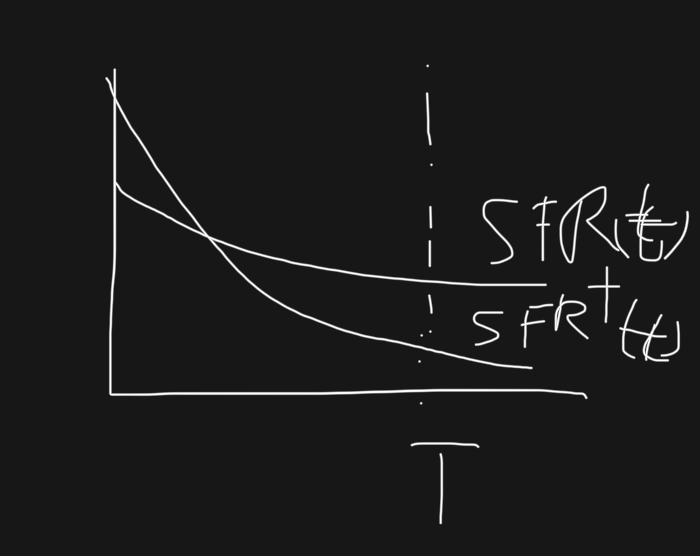
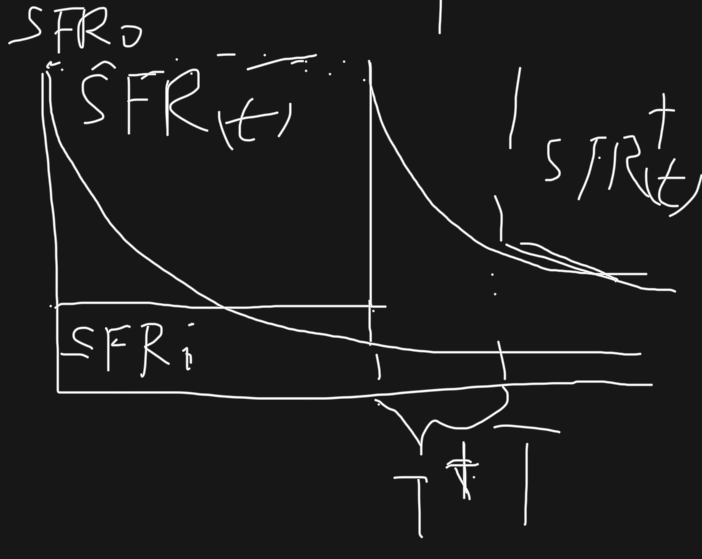
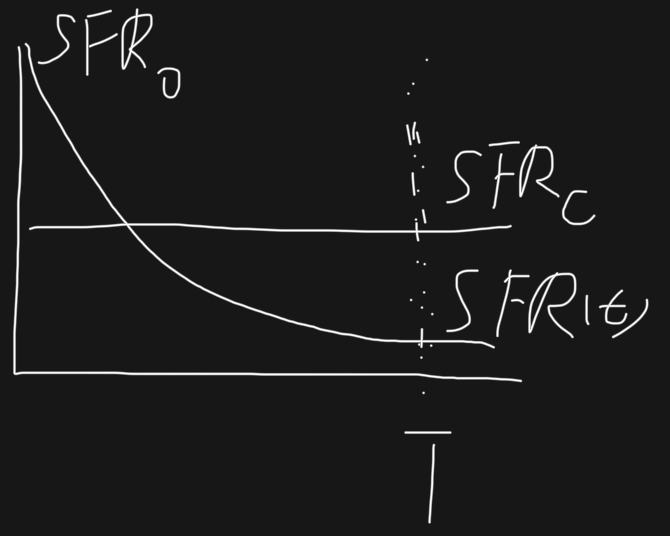
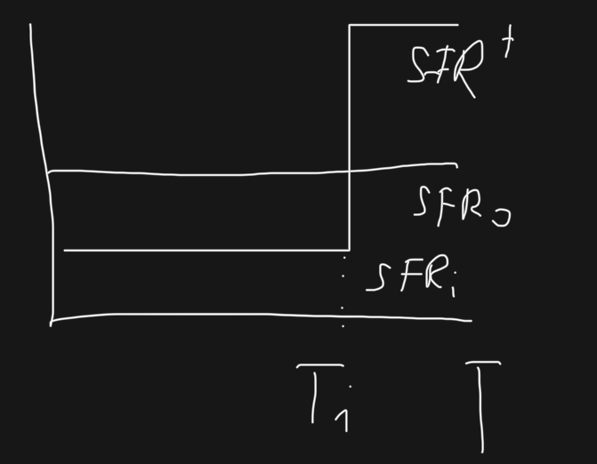
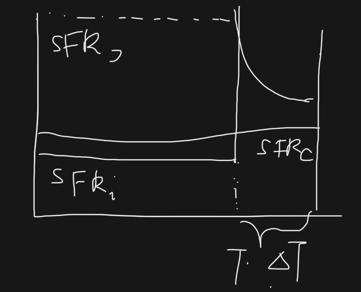

# 20251102 Only Anticorrelation in DFD13

In short, I believe under the assumptions and conditions made by [DFD13](https://doi.org/10.1093/mnras/stt083), there only exists anti-correlation between $\mathrm{SFR}$ and $Z$. The anti-correlation from DFD13 is independent on the SFH. However, [WL21](https://doi.org/10.3847/1538-4357/abe413) loosen some restrictions and produce both correlation and anti-correlation, so next week we should focus on the connection between DFD13 and WL21. 

## General bathtub model

Here we start with two continuity equations:
$$
\begin{split}
\frac{dM_\mathrm{g}[t]}{dt} &= \Phi[t] - (1-R)\rm{SFR}[t]-\lambda\mathrm{SFR}[t]  \\
&= \Phi[t] - (1-R+\lambda)\mathrm{SFR}[t]  \\
\label{eq:dMgdt}
\end{split}
$$
Here $M_\rm{g}[t]$ is the gas mass, $\Phi[t]$ is the inflow rate, $R$ is the returned fraction from stars and $\lambda$ is the mass loading factor. So these 3 terms are gas mass changes due to inflow, loss to star formation and loss to outflow. 
$$
\begin{split}
\frac{dM_Z[t]}{dt} = y(1-R)\mathrm{SFR}[t]-Z[t](1-R+\lambda)\mathrm{SFR}[t]+Z_\mathrm{in}\Phi[t]
\label{eq:dMZdt} \\
\end{split}
$$
Here $M_Z[t] = Z[t]\cdot M_\rm{g}[t]$ is the metal mass, y is the metal yield per stellar generation and $Z_\mathrm{in}$ is the metallicity of the inflow gas. Again, these 3 terms are metal mass changes due to gain from metal production, loss to star formation and gain from inflow. 

Now we can expand Eq. 2 by product rule to get
$$
\begin{split}
Z[t]\frac{dM_\mathrm{g}[t]}{dt}+M_\mathrm{g}[t]\frac{dZ[t]}{dt} = y(1-R)\mathrm{SFR}[t]-Z[t](1-R+\lambda)\mathrm{SFR}[t]+Z_\mathrm{in}\Phi[t] \\
\end{split}
$$
And substitute the Eq. 1 to equation above and simplify it to get $\frac{dZ[t]}{dt}$
$$
Z[t](\Phi[t] - (1-R+\lambda)\mathrm{SFR}[t])+M_\mathrm{g}[t]\frac{dZ[t]}{dt} = y(1-R)\mathrm{SFR}[t]-Z[t](1-R+\lambda)\mathrm{SFR}[t]+Z_\mathrm{in}\Phi[t] \\
M_\mathrm{g}[t]\frac{dZ[t]}{dt} = y(1-R)\mathrm{SFR}[t]+(Z_\mathrm{in}-Z[t])\Phi[t] \\
\frac{dZ[t]}{dt} = \frac{1}{M_\mathrm{g}[t]}(y(1-R)\mathrm{SFR}[t]+(Z_\mathrm{in}-Z[t])\Phi[t]) \\
\label{eq:dZdt}
$$
Therefore, we end up with the follwing equations for the general bathtub model:
$$
\left\{
\begin{split}
\frac{dM_*}{dt} &= \mathrm{SFR}[t] = \epsilon[t] M_\mathrm{g}[t] \\
\frac{dM_\mathrm{g}}{dt} &= \Phi[t] - (1-R+\lambda)\mathrm{SFR}[t] \\
\frac{dZ[t]}{dt} &= \frac{1}{M_\mathrm{g}[t]}(y(1-R)\mathrm{SFR}[t]+(Z_\mathrm{in}-Z[t])\Phi[t]) \\ 
\end{split}
\right.
$$

## DFD13

In DFD13, they make some the assumptions: 

1) The inflow rate $\Phi[t]$ is proportional to $\mathrm{SFR}[t]$  by a constant $a$:

$$
\begin{split}
\Phi[t] = a\mathrm{SFR}[t] \\
\end{split}
$$

2. The star formation efficiency ($\epsilon$), return fraction (R), mass loading factor ($w$, note that they use $w$ rather than $\lambda$)  and metal yield per stellar ($y$) are also constant.

3. The inflow metallicity is set to be 0:
   $$
   \begin{split}
   Z_\mathrm{in} = 0 \\
   \end{split}
   $$

Thus, the equations of DFD13 becomes
$$
\left\{
\begin{split}
\frac{dM_*}{dt} &= \mathrm{SFR}[t] = \epsilon M_\mathrm{g} \\
\frac{dM_\mathrm{g}}{dt} &=  (R-1+a-w)\mathrm{SFR}[t] \\
\frac{dZ[t]}{dt} &= y(1-R)\epsilon-aZ[t]\epsilon \\ 
\end{split}
\right.
$$
First, we check the analytical solution of $\mathrm{SFR}[t]$:
$$
\begin{split}
\frac{dM_\mathrm{g}}{dt} &=  (R-1+a-w)\mathrm{SFR}[t] \\
\Leftrightarrow \frac{1}{\epsilon}\frac{d\mathrm{SFR}[t]}{dt} &=  (R-1+a-w)\mathrm{SFR}[t] \\
\Leftrightarrow \frac{d\mathrm{SFR}[t]}{\mathrm{SFR}[t]} &=  \epsilon(R-1+a-w)dt \\
\Leftrightarrow \mathrm{SFR}[t] &= \mathrm{SFR}_0e^{\epsilon(R-1+a-w)t} \\
&= \mathrm{SFR}_0e^{-kt} \\
\end{split}
$$
Here we define 
$$
\begin{split}
k = \epsilon(1-R+w-a) \\
\end{split}
$$
and $\mathrm{SFR}_0$ is the initial $\mathrm{SFR}$ at $t=0$. 

Then, we check analytical solution of $Z[t]$:
$$
\begin{split}
\frac{dZ[t]}{dt} &= y(1-R)\epsilon-aZ[t]\epsilon \\ 
\Leftrightarrow Z[t] &= \frac{y(1-R)}{a}+(Z_0-\frac{y(1-R)}{a})e^{-a\epsilon t} \\
\end{split}
$$
Therefore, under the assumptions from DFD13, $\mathrm{SFR}$ and $Z$ have to statisfy the following forms
$$
\left\{
\begin{split}
\mathrm{SFR}[t] &= \mathrm{SFR}_0e^{-kt} \\
Z[t] &= \frac{y(1-R)}{a}+(Z_0-\frac{y(1-R)}{a})e^{-a\epsilon t} \\
\end{split}
\right.
$$
Clearly, we have exponential accumulation of $Z$. 

Since $k$ is normally negative, this leads to exponential decay of SFH. 

Under a special condition that 
$$
\begin{split}
k=0\Leftrightarrow a=1-R+w \\
\end{split}
$$
this leads to constant $\mathrm{SFR}$. 

Also, we further assume the initial metallicity is 0, we have
$$
\left\{
\begin{split}
\mathrm{SFR}[t] &= \mathrm{SFR}_0e^{-kt} \\
Z[t] &= \frac{y(1-R)}{a}(1-e^{-a\epsilon t}) \\
\end{split}
\right.
$$
Now with these two equations, we can construct different SFHs to explore the relations between $\mathrm{SFR}$ and $Z$. The idea is that, given two different $\mathrm{SFR}_1[t]$ and $\mathrm{SFR}_2[t]$, under the condition that at moment $T$ they build up same stellar mass
$$
\begin{split}
\int_0^T\mathrm{SFR}_1[t]dt=M_*=\int_0^T\mathrm{SFR}_2[t]dt
\end{split}
$$
then we want to check $\mathrm{SFR}_1[T]$ & $\mathrm{SFR}_2[T]$ and $Z_1[T]$ & $Z_2[T]$ . 

Below I describe 5 different scenarios, which I believe should include all the possible cases of SFH. 

### DFD13 Case 1

Consider the case that we have two exponential decay SFH. Compared to the default $\mathrm{SFR}[t]= \mathrm{SFR}_0e^{-kt}$, we define a more expotential decay SFH that
$$
\begin{split}
\mathrm{SFR}^\dagger[t] = \alpha\mathrm{SFR}_0e^{-\beta kt} \\
\end{split}
$$
with $1<\alpha<\beta$, so that they satisfy 
$$
\begin{split}
M_* = \int_0^T\mathrm{SFR}[t]dt &= \int_0^T\mathrm{SFR}^\dagger[t]dt \\
\Leftrightarrow \int_0^T\mathrm{SFR}_0e^{-kt}dt &= \int_0^T\alpha\mathrm{SFR}_0e^{-\beta kt}dt \\
\Leftrightarrow \frac{\mathrm{SFR}_0}{k}(1-e^{-kT}) &= \frac{\alpha\mathrm{SFR}_0}{\beta k}(1-e^{-kT}) \\
\Leftrightarrow 1-e^{-kT} &= \frac{\alpha}{\beta}(1-e^{-kT}) \\
\end{split}
$$
Obviously, we have $\mathrm{SFR}[T]>\mathrm{SFR}^\dagger[T]$. 

For metallicity, we can express $a$ with $k$ for default case: 
$$
\begin{split}
Z[t] &= \frac{y(1-R)}{a}(1-e^{-a\epsilon t}) \\
&= \frac{y(1-R)}{1-R+w-\frac{k}{\epsilon}}(1-e^{-(1-R+w-\frac{k}{\epsilon})\epsilon t}) \\
\end{split}
$$
Then for the more exponential decay case, we can simpily replace $k$ with $\beta k$:
$$
\begin{split}
Z^\dagger[t] &= \frac{y(1-R)}{1-R+w-\frac{\beta k}{\epsilon}}(1-e^{-(1-R+w-\frac{\beta k}{\epsilon})\epsilon t}) \\
&= \frac{y(1-R)}{1-R+w-\beta(1-R+w-a)}(1-e^{-(1-R+w-\beta(1-R+w-a))\epsilon t}) \\
&= \frac{y(1-R)}{a\beta-(\beta-1)(1-R+w)}(1-e^{-(a\beta-(\beta-1)(1-R+w))\epsilon t}) \\
\end{split}
$$
Now we define 
$$
\left\{
\begin{split}
x &= \epsilon t>0 \\
z &= a\beta-(\beta-1)(1-R+w) \\
\end{split}
\right.
$$
Thus, we can simplify both metallicity to be
$$
\left\{
\begin{split}
Z(T) &= \frac{1-e^{-ax}}{a} \\
Z^\dagger(T) &= \frac{1-e^{-zx}}{z} \\
\end{split}
\right.
$$
Since we have 
$$
\begin{split}
(\beta-1)(1-R+w-a)&>0 \\
\Leftrightarrow (\beta-1)(1-R+w)&>a(\beta-1) \\
\Leftrightarrow a&>a\beta-(\beta-1)(1-R+w) \\
\Leftrightarrow a&>z
\end{split}
$$
Then we also get 
$$
\begin{split}
Z^\dagger(T) &= \frac{1-e^{-zx}}{z} > \frac{1-e^{-ax}}{a} = Z(T) \\
\end{split}
$$
Therefore, in case 1, we have the anti-correlation:
$$
\left\{
\begin{split}
\mathrm{SFR}[T]&>\mathrm{SFR}^\dagger[T] \\
Z^\dagger(T) &> Z(T) \\
\end{split}
\right.
$$

### DFD13 Case 2

In the case, we keep the default $\mathrm{SFR}[t]= \mathrm{SFR}_0e^{-kt}$, and then we create a SFH that experiences a constant $\mathrm{SFR_i}<\mathrm{SFR}_0$ first and then a delay exponential decay:
$$
\mathrm{SFR}^\dagger[t] = \left\{
\begin{split}
\mathrm{SFR}_i,\ t <T-T^\dagger  \\
\mathrm{SFR}_0e^{-kt},\ t \geq T-T^\dagger \\
\end{split}
\right.
$$
Note that 
$$
\left\{
\begin{split}
\mathrm{SFR}_i &= \epsilon_iM_\mathrm{g,0} \\
\mathrm{SFR}_0 &= \epsilon_0M_\mathrm{g,0} \\
\end{split}
\right.
$$
where $M_\mathrm{g,0}$ is the initial gas mass.

Surpose that at the time $t=T$, they both reach the same $M_*$:
$$
\begin{split}
M_* = \int_0^T\mathrm{SFR}[t]dt &= \int_0^T\mathrm{SFR}^\dagger[t]dt \\
\Leftrightarrow \int_0^T\mathrm{SFR}_0e^{-kt}dt &= \mathrm{SFR}_i(T-T^\dagger)+\int_0^{T^\dagger}\mathrm{SFR}_0e^{-kt}dt \\
\Leftrightarrow \frac{\mathrm{SFR}_0}{k}(1-e^{-kT}) &= \mathrm{SFR}_i(T-T^\dagger)+\frac{\mathrm{SFR}_0}{k}(1-e^{-kT^\dagger}) \\
\Leftrightarrow e^{-kT^\dagger}-e^{-kT} &= \frac{k\mathrm{SFR}_i(T-T^\dagger)}{\mathrm{SFR}_0} \\
&= \frac{k\epsilon_i(T-T^\dagger)}{\epsilon_0} \\
\end{split}
$$
Obviously, we have $\mathrm{SFR}[T]<\mathrm{SFR}^\dagger[T]$. 

Then we look at the metallicity in the delay case. During the period that $t\in[0,T-T^\dagger]$, a constant SFR implies
$$
\begin{split}
\frac{dM_\mathrm{g}}{dt} &= 0 \\
\Leftrightarrow a &= 1-R+w \\
\end{split}
$$
Hence, the metallicity of the constant SFH will be
$$
\begin{split}
Z_i[t] &= \frac{y(1-R)}{1-R+w}(1-e^{-(1-R+w)\epsilon_i t}) \\
\end{split}
$$
Then, the metallicity for delay case at $t=T$ will be
$$
\begin{split}
Z^\dagger[T] &= \frac{y(1-R)}{a}+(Z_i[T]-\frac{y(1-R)}{a})e^{-a\epsilon_0T^\dagger} \\
&= \frac{y(1-R)}{a}+(\frac{y(1-R)}{1-R+w}(1-e^{-(1-R+w)\epsilon_i(T-T^\dagger)})-\frac{y(1-R)}{a})e^{-a\epsilon_0T^\dagger} \\
\end{split}
$$
Again, we now compare the default $Z[T]$ with $Z^\dagger[T]$, let's say we expect $Z[T]>Z^\dagger[T]$:
$$
\begin{split}
Z[T] &> Z^\dagger[T] \\
\Leftrightarrow \frac{y(1-R)}{a}(1-e^{-a\epsilon_0 T}) &> \frac{y(1-R)}{a}+(\frac{y(1-R)}{1-R+w}(1-e^{-(1-R+w)\epsilon_i(T-T^\dagger)})-\frac{y(1-R)}{a})e^{-a\epsilon_0T^\dagger} \\
\Leftrightarrow \frac{1}{a}-\frac{1}{a}e^{-a\epsilon_0 T} &> \frac{1}{a}+(\frac{1}{1-R+w}-\frac{1}{1-R+w}e^{-(1-R+w)\epsilon_i(T-T^\dagger)}-\frac{1}{a})e^{-a\epsilon_0T^\dagger} \\
\Leftrightarrow -\frac{1}{a}e^{-a\epsilon_0 (T-T^\dagger)} &> \frac{1}{1-R+w}-\frac{1}{1-R+w}e^{-(1-R+w)\epsilon_i(T-T^\dagger)}-\frac{1}{a} \\
\Leftrightarrow \frac{1}{a}(1-e^{-a\epsilon_0 (T-T^\dagger)}) &> \frac{1}{1-R+w}(1-e^{-(1-R+w)\epsilon_i(T-T^\dagger)}) \\
\Leftarrow \frac{1}{a}(1-e^{-a\epsilon_i (T-T^\dagger)}) &> \frac{1}{1-R+w}(1-e^{-(1-R+w)\epsilon_i(T-T^\dagger)}) \\
\Leftarrow a &< 1-R+w \\
\end{split}
$$
Which is the relation we define previously, so we indeed have $Z[T]>Z^\dagger[T]$. 

Therefore, in case 2, we also have the anti-correlation:
$$
\left\{
\begin{split}
\mathrm{SFR}[T]&<\mathrm{SFR}^\dagger[T] \\
Z(T) &> Z^\dagger(T) \\
\end{split}
\right.
$$

### DFD13 Case 3

In this case, we compare the default exponential decay SFH with the constant SFH.

Agian, we have $\mathrm{SFR}[T]<\mathrm{SFR}_c<\mathrm{SFR}_0$, and thus $\epsilon_c<\epsilon_0$. 

Similarly, at $t=T$, we have
$$
\begin{split}
M_* = \int_0^T\mathrm{SFR}[t]dt &= \int_0^T\mathrm{SFR}_cdt \\
\Leftrightarrow \frac{\mathrm{SFR}_0}{k}(1-e^{-kT}) &= \mathrm{SFR}_cT \\
\Leftrightarrow \frac{\epsilon_0}{k}(1-e^{-kT}) &= \epsilon_cT \\
\end{split}
$$
Then, we compare the default $Z[T]$ with $Z_c[T]$. let's say we expect $Z[T]>Z_c[T]$:
$$
\begin{split}
Z[T] &> Z_c[T] \\
\Leftrightarrow \frac{y(1-R)}{a}(1-e^{-a\epsilon_0 T}) &> \frac{y(1-R)}{1-R+w}(1-e^{-(1-R+w)\epsilon_c T}) \\
\Leftrightarrow \frac{1}{a}(1-e^{-a\epsilon_0 T}) &> \frac{1}{1-R+w}(1-e^{-(1-R+w)\epsilon_c T}) \\
\Leftarrow \frac{1}{a}(1-e^{-a\epsilon_c T}) &> \frac{1}{1-R+w}(1-e^{-(1-R+w)\epsilon_c T}) \\
\Leftarrow a &< 1-R+w
\end{split}
$$
Which is the relation we define previously, so we indeed have $Z[T]>Z_c[T]$. 

Therefore, in case 3, we also have the anti-correlation:
$$
\left\{
\begin{split}
\mathrm{SFR}[T]&<\mathrm{SFR}_c \\
Z(T) &> Z_c \\
\end{split}
\right.
$$

### DFD13 Case 4

In this case, we porpose a constant SFH and and step function SFH:
$$
\mathrm{SFR}^\dagger[t] = \left\{
\begin{split}
\mathrm{SFR}_i,\ t <T_i  \\
\mathrm{SFR}_f,\ t \geq T_i \\
\end{split}
\right.
$$
Agian, we have $\mathrm{SFR}_i<\mathrm{SFR}_0<\mathrm{SFR}_f$ and thus $\epsilon_i<\epsilon_0<\epsilon_f$. 

Similarly, at $t=T$, we have
$$
\begin{split}
M_* = \mathrm{SFR}_0T &= \mathrm{SFR}_iT_i+\mathrm{SFR}_f(T-T_i) \\
\Leftrightarrow (\mathrm{SFR}_f-\mathrm{SFR}_i)T_i &= (\mathrm{SFR}^\dagger-\mathrm{SFR}_0)T \\
\Leftrightarrow (\epsilon_f-\epsilon_i)T_i &= (\epsilon_f-\epsilon_0)T \\
\end{split}
$$
Then, we compare the constant SFH's $Z[T]$ with step function SFH's $Z^\dagger[T]$. let's say we expect $Z[T]=Z_c[T]$:
$$
\begin{split}
Z[T] &= Z^\dagger[T] \\
\Leftrightarrow \frac{y(1-R)}{1-R+w}(1-e^{-(1-R+w)\epsilon_0 T}) &= \frac{y(1-R)}{1-R+w}+(\frac{y(1-R)}{1-R+w}(1-e^{-(1-R+w)\epsilon_iT_i})-\frac{y(1-R)}{1-R+w})e^{-(1-R+w)\epsilon_f(T-T_i)} \\
\Leftrightarrow 1-e^{-(1-R+w)\epsilon_0 T} &= 1+(1-e^{-(1-R+w)\epsilon_iT_i}-1)e^{-(1-R+w)\epsilon_f(T-T_i)} \\
\Leftrightarrow e^{-(1-R+w)\epsilon_0 T} &= e^{-(1-R+w)\epsilon_iT_i-(1-R+w)\epsilon_f(T-T_i)} \\
\Leftrightarrow -\epsilon_0 T &= -\epsilon_iT_i-\epsilon_f(T-T_i) \\
\Leftrightarrow (\epsilon_i-\epsilon_f)T_i &= (\epsilon_0-\epsilon_f)T \\
\end{split}
$$
Which is the relation we define previously, so we indeed have $Z[T]=Z_c[T]$. 

Therefore, in case 4, we will have the no correlation:
$$
\left\{
\begin{split}
\mathrm{SFR}[T]&<\mathrm{SFR}^\dagger[T] \\
Z(T) &= Z^\dagger[T] \\
\end{split}
\right.
$$

### DFD13 Case 5

In this case, we have a constant SFH and a delay exponential decay SFH:
$$
\mathrm{SFR}^\dagger[t] = \left\{
\begin{split}
\mathrm{SFR}_i,\ t <T  \\
\mathrm{SFR}_0e^{-kt},\ t \geq T \\
\end{split}
\right.
$$
Agian, we have $\mathrm{SFR}_i<\mathrm{SFR}_c<\mathrm{SFR}_0$ and thus $\epsilon_i<\epsilon_c<\epsilon_0$. 

Similarly, at $t=T+\Delta T$, we have
$$
\begin{split}
M_* = \mathrm{SFR}_c(T+\Delta T) &= \mathrm{SFR}_iT+\int_0^{\Delta T}\mathrm{SFR}_0e^{-kt}dt \\
&= \mathrm{SFR}_iT+\frac{\mathrm{SFR}_0}{k}(1-e^{-k\Delta T}) \\
\Leftrightarrow \epsilon_c(T+\Delta T) &= \epsilon_iT+(1-R+w-a)(1-e^{-(1-R+w-a)\epsilon_0\Delta T}) \\
\end{split}
$$
Then, we compare the constant SFH's $Z[T]$ with the delay SFH's $Z^\dagger[T]$. let's say we expect $Z[T] > Z^\dagger[T]$:
$$
\begin{split}
Z[T] &> Z^\dagger[T] \\
\Leftrightarrow \frac{y(1-R)}{1-R+w}(1-e^{-(1-R+w)\epsilon_c (T+\Delta T)}) &> \frac{y(1-R)}{a}+(\frac{y(1-R)}{1-R+w}(1-e^{-(1-R+w)\epsilon_i T})-\frac{y(1-R)}{a})e^{-a\epsilon_0\Delta T} \\
\Leftrightarrow \frac{1}{1-R+w}(1-e^{-(1-R+w)\epsilon_c (T+\Delta T)}) &> \frac{1}{a}+(\frac{1}{1-R+w}(1-e^{-(1-R+w)\epsilon_i T})-\frac{1}{a})e^{-a\epsilon_0\Delta T} \\
\Leftarrow \frac{1}{1-R+w}(1-e^{-(1-R+w)\epsilon_c (T+\Delta T)}) &> \frac{1}{a}+(\frac{1}{1-R+w}(1-e^{-(1-R+w)\epsilon_i T})-\frac{1}{a}) \\
\Leftarrow \frac{1}{1-R+w}(1-e^{-(1-R+w)\epsilon_c T}) &> \frac{1}{1-R+w}(1-e^{-(1-R+w)\epsilon_i T}) \\
\Leftrightarrow 1-e^{-(1-R+w)\epsilon_c T} &> 1-e^{-(1-R+w)\epsilon_i T} \\
\Leftrightarrow \epsilon_c &> \epsilon_i \\
\end{split}
$$
Which is the relation we define previously, so we indeed have $Z[T]>Z^\dagger[T]$. 

Therefore, in case 5, we also have the anti-correlation:
$$
\left\{
\begin{split}
\mathrm{SFR}[T]&<\mathrm{SFR}^\dagger[T] \\
Z(T) &> Z^\dagger(T) \\
\end{split}
\right.
$$

## WL21

In DFD13, they assume that the star formation efficiency $\epsilon$ is constant and the inflow rate $\Phi$ is liearly propotional to SFR. However, WL21 porpose 2 cases: 1) constant $\epsilon$ and time-variant $\Phi$ can lead to negative correlation; 2) time-variant $\epsilon$ and constant $\Phi$ can lead to positive correlation. 

However, I notice that their positive or negative correlations emerge based on sampling the pairs of SFR and metallicity without assuming the same $M_*$ condition. I think I need to go through their derivation and verify this point. I presonally want to take the time-variant $\epsilon$ and constant $\Phi$ case as the standard and ignore the other case. 
