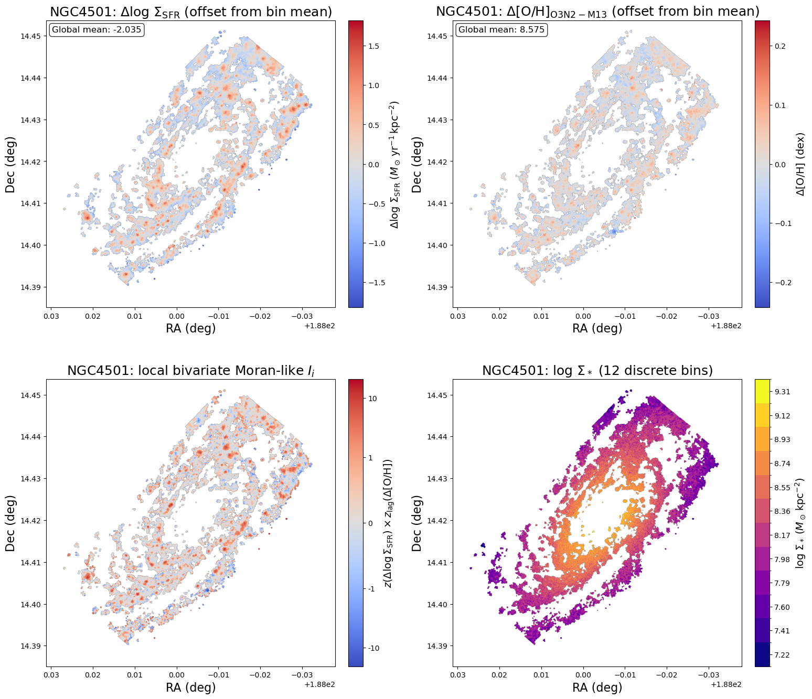
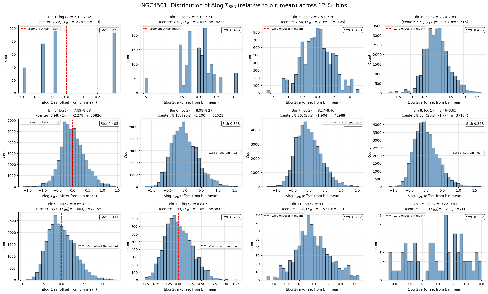
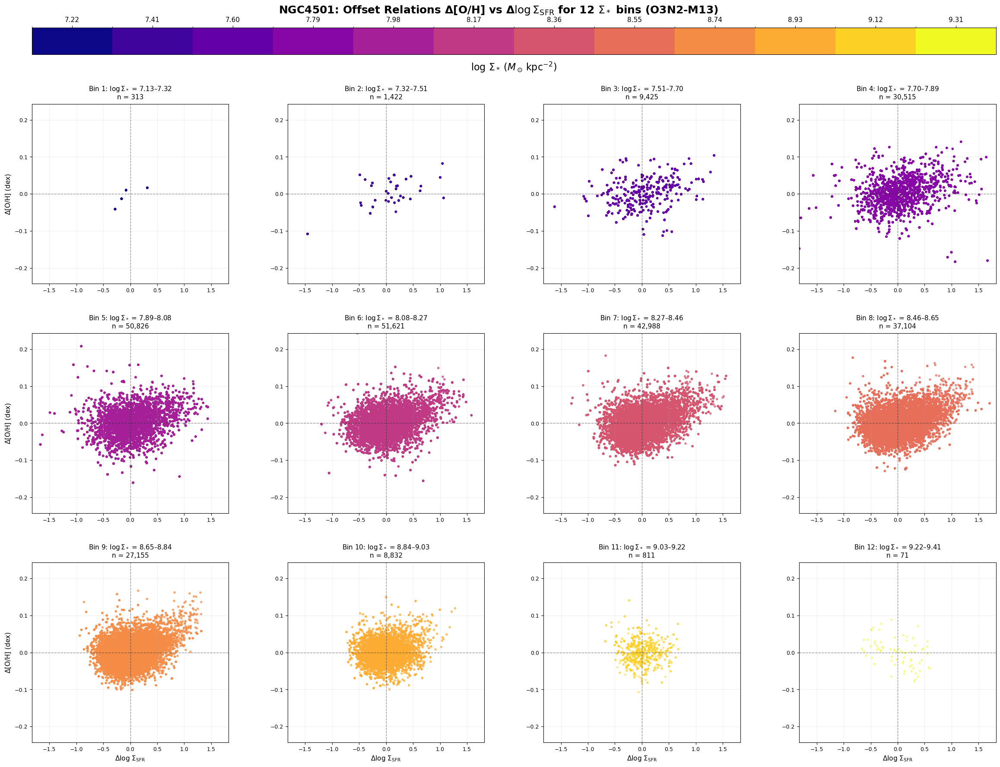
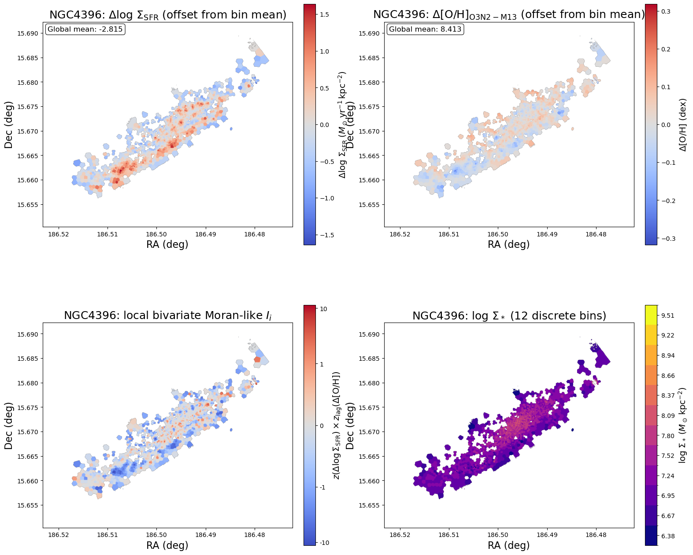
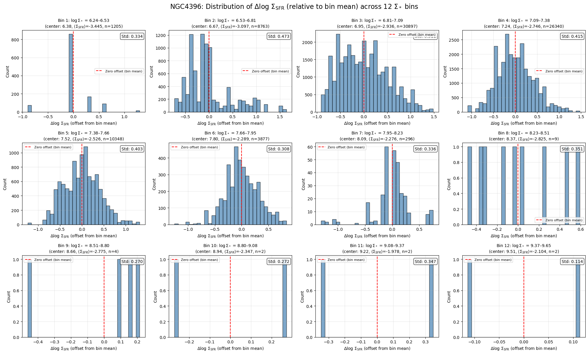
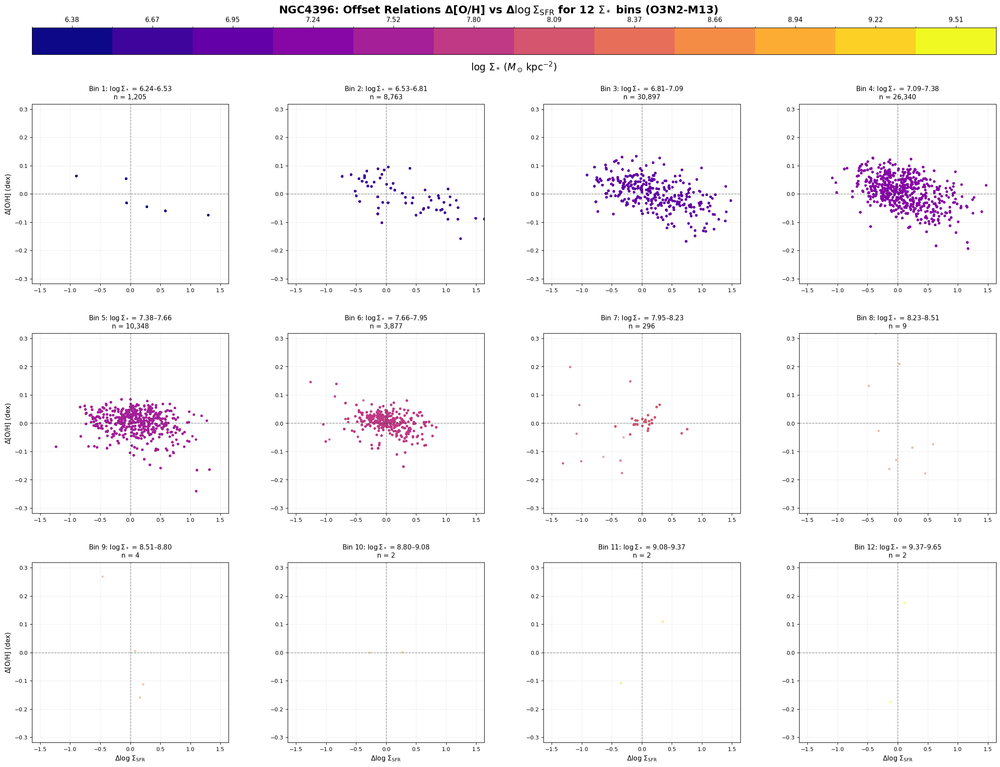
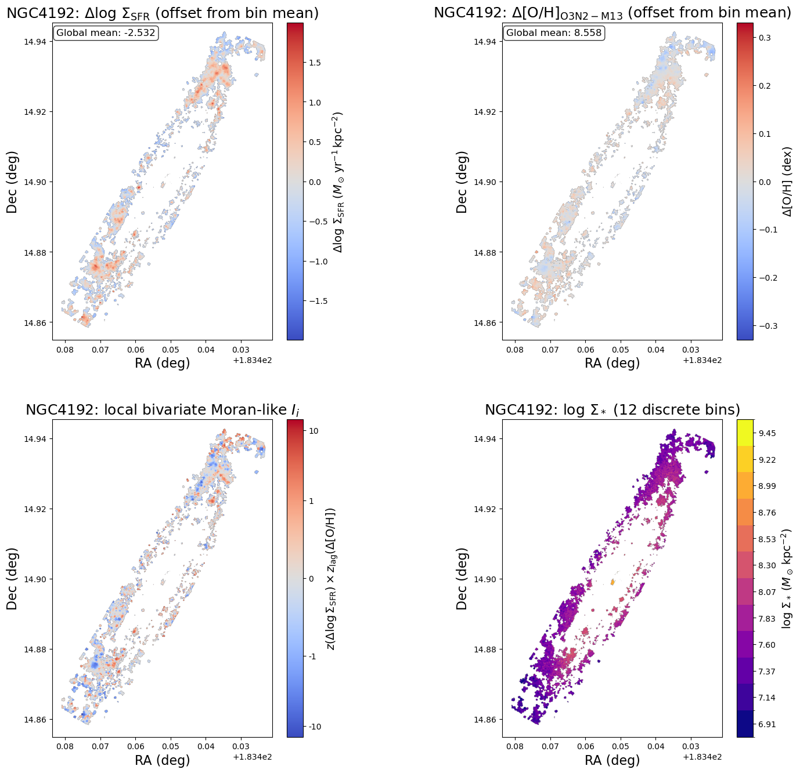
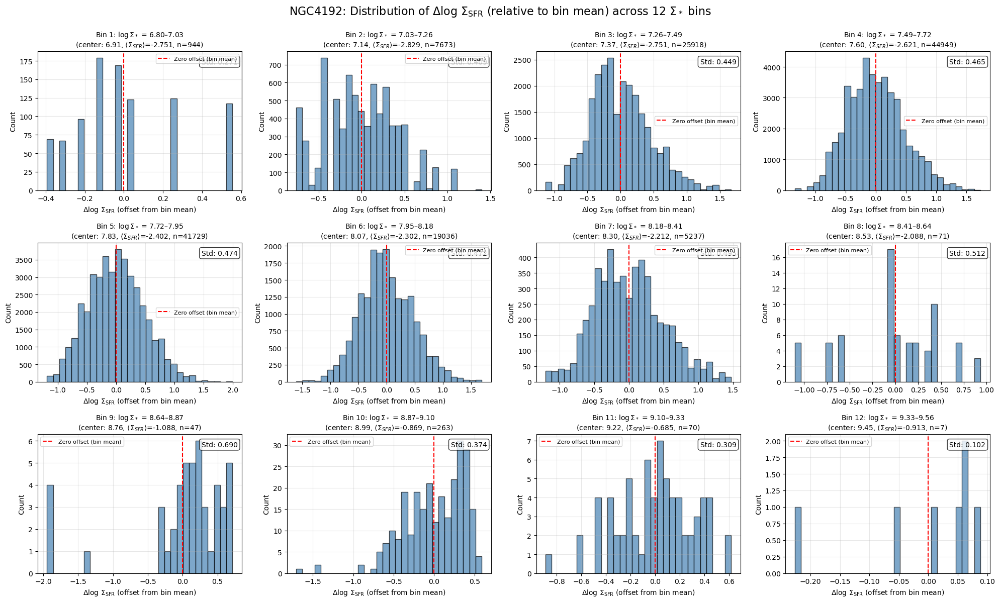
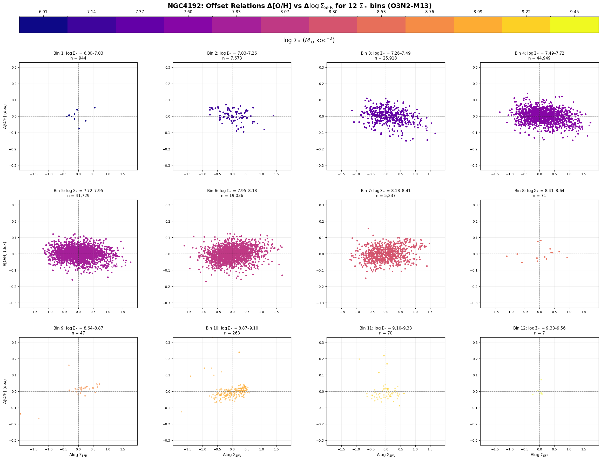

# 20251117 Local Moran Like Correlation Coefficient

First i have to admit that the previous offset calcualtion is wrong (i.e., it was subtracted by the global mean values rather than the mean of each $\Sigma_*$ bin), but now i have fixed it and our conclusion is still unchanged: such correlation or anticorrelation are still spatially varying. Here, I want to show how I calculate the local Moran-like correlation coefficient $I$ of individual spaxel. 

## Moran-like product $I_i$

We start with two maps:

- $A(i)$ = $\Delta \log \Sigma_{\rm SFR}$ at spaxel $i$  
- $B(i)$ = $\Delta{\rm [O/H]}$ at spaxel $i$

Take all valid spaxels and compute the mean and standard deviation in each $\Sigma_*$ Bin:

$$
\mu_A = \text{mean of }A,\quad \sigma_A = \text{std of }A
$$
$$
\mu_B = \text{mean of }B,\quad \sigma_B = \text{std of }B
$$

Define $z$-scores:

$$
z_A(i) = \frac{A(i) - \mu_A}{\sigma_A},\qquad
z_B(i) = \frac{B(i) - \mu_B}{\sigma_B}.
$$

Here, 

- $z_A(i) > 0$: SFR offset at $i$ is above the galaxy mean (in units of $\sigma$).  
- $z_A(i) < 0$: SFR offset at $i$ is $$below$$ the mean.  

The same holds for metallicity: $z_B(i)$.

For each spaxel $i$, look at its neighbours $j$ and average their $z$-values of $$B$$:

$$
z_{\rm lag,B}(i)
\equiv \frac{1}{N_i} \sum_{j\in N(i)} z_B(j),
$$

where $N(i)$ is the set of neighbouring spaxels and $N_i$ is its size, which is 8 here.

Here, $z_{\rm lag,B}(i)$ tells us whether the local metallicity environment around $i$ is above or below the global mean (kind of spatial lag of property B at position $i$), in units of $\sigma$:

- $z_{\rm lag,B}(i) > 0$: neighbours of $i$ tend to have high $\Delta{\rm [O/H]}$.  
- $z_{\rm lag,B}(i) < 0$: neighbours of $i$ tend to have low $\Delta{\rm [O/H]}$.

After this step, at each location we know:

- the value for the point itself: $z_A(i)$, and  
- the value for its environment in B: $z_{\rm lag,B}(i)$.

Now we can define the Moran-like product:

$$
I_i = z_A(i)\; z_{\rm lag,B}(i).
$$

This product encodes agreement vs. disagreement between the point and its environment:

- If both are positive  ($z_A(i) > 0$ and $z_{\rm lag,B}(i) > 0$), then we have high $\Delta\log\Sigma_{\rm SFR}$ at $i$ and a high-metallicity environment around it:  High–High (HH), so $I_i > 0$.
  
- If both are negative ($z_A(i) < 0$ and $z_{\rm lag,B}(i) < 0$), then we have low $\Delta\log\Sigma_{\rm SFR}$ at $i$ and a low-metallicity environment:  Low–Low (LL), again $I_i > 0$.
  
- If the signs are opposite  ($z_A(i) > 0$, $z_{\rm lag,B}(i) < 0$ or vice versa), then we have a high-SFR offset surrounded by low metallicity, or a low-SFR offset surrounded by high metallicity:  High–Low (HL) or Low–High (LH), yielding $I_i < 0$.

So:

- The sign of $I_i$ tells you whether the spaxel is *consistent* with its local metallicity environment (HH/LL) or *inverted* relative to it (HL/LH).  
- The magnitude $|I_i|$ tells you how strong that pattern is.

Therefore, $I_i$ map shows where $\Delta\log \Sigma_{\rm SFR}$ is locally positively or negatively correlated with the surrounding $\Delta{\rm [O/H]}$ field.

Below, I will show 1) $\Delta\log \Sigma_{\rm SFR}$, $\Delta{\rm [O/H]}$, Moran-like product $I_i$ and discrete $\Sigma_*$ maps; 2) histograms of $\Delta\log(\Sigma_\mathrm{SFR})$ to check calculation of offset; and 3) offset relations in 12 $\Sigma_*$ bins of NGC4501 (mostly positive correlation), NGC4396 (mostly negative correlation) and NGC4192 (seems to accross both low and high $\Sigma_*$ regimes, so you will have a sense of the offset relations go from a bit decreasing trends to a bit increasing trends), respectively. 

## NGC4501

## NGC4396

## NGC4192

