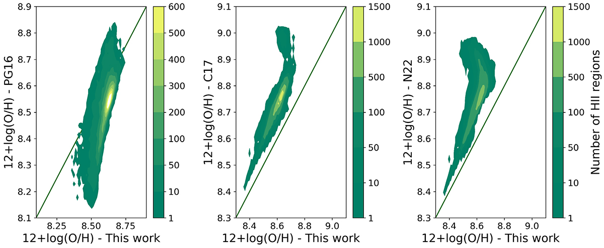
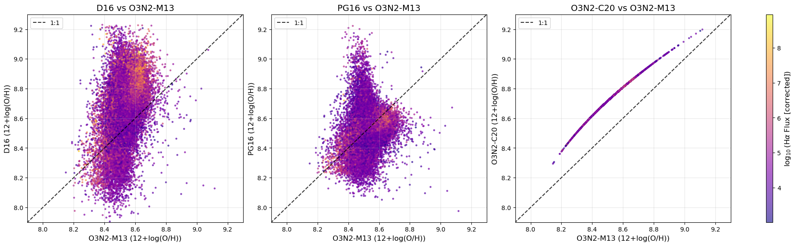
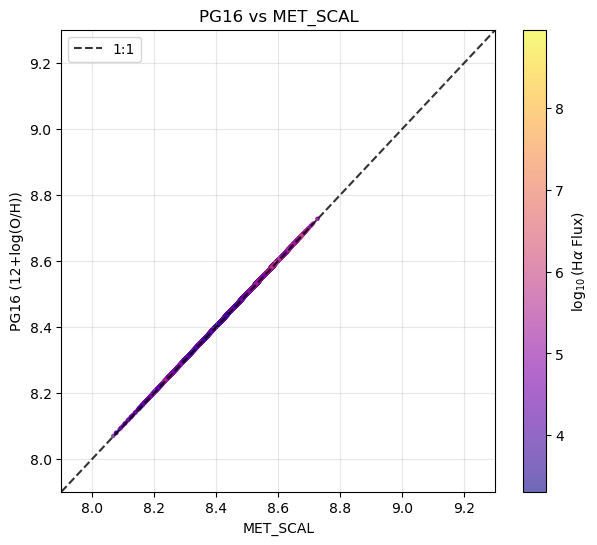

# 20251127 Check PHANGS Metallicity

I first copied the Figure 12 of [Brazzini+2024](https://doi.org/10.1051/0004-6361/202451007), and then created the similar plot as it: here I show D16, PG16 and O3N2-C20 vs O3N2-M13 of HII spaxels of 19 PHANGS-MUSE galaxies, color-coded by corrected H$\alpha$. 

Also as a sanity check, I plot my PG16 estimation vs their (`MET_SCAL`). 

