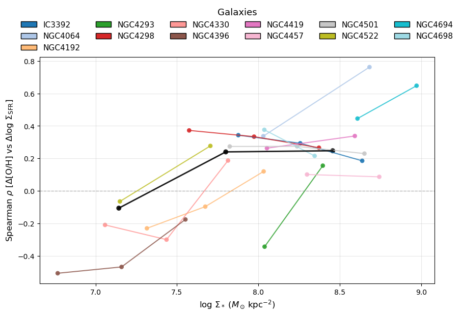
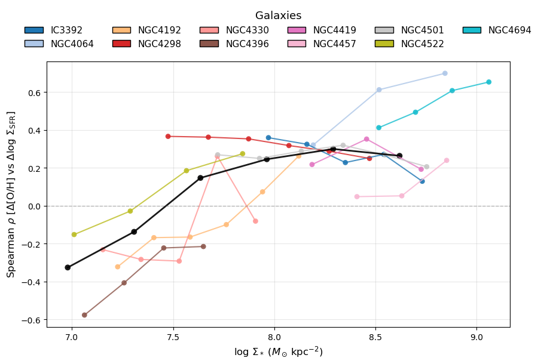
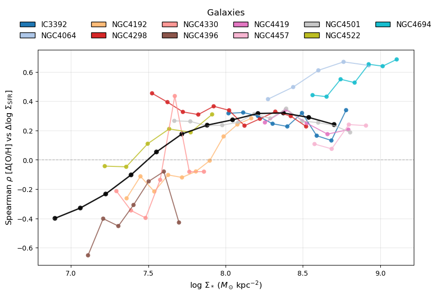
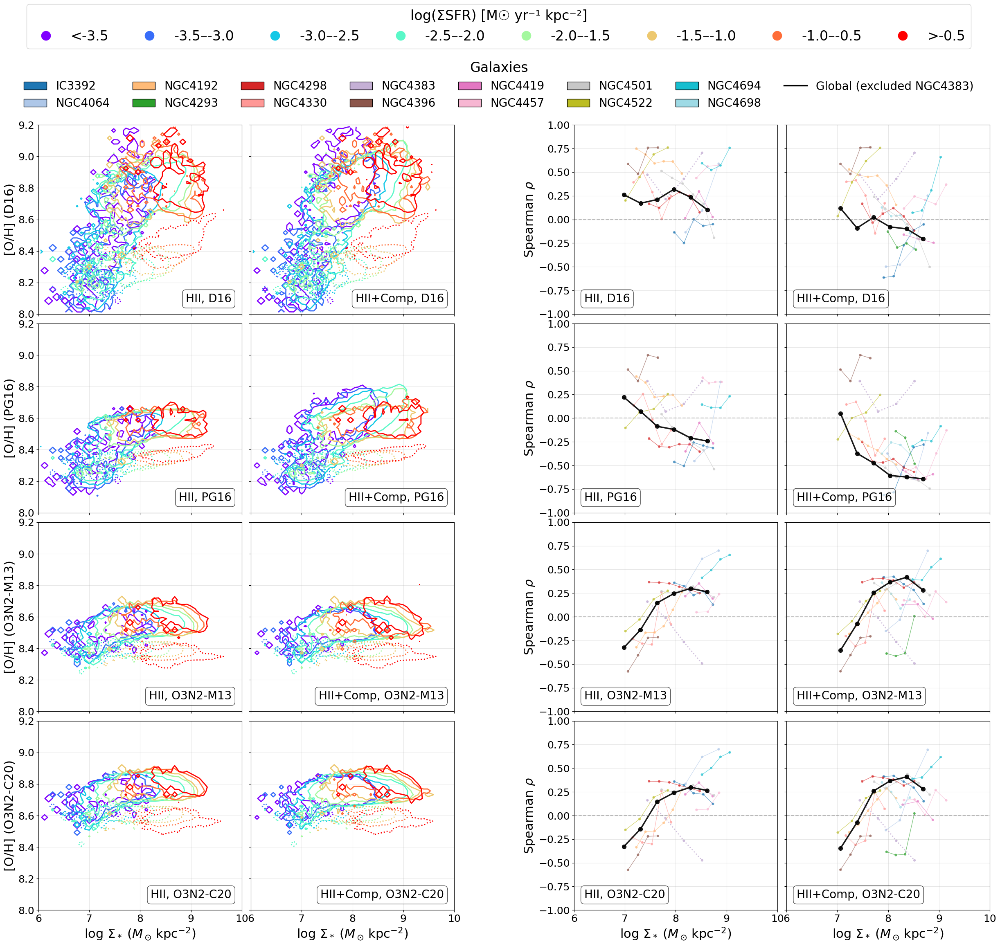
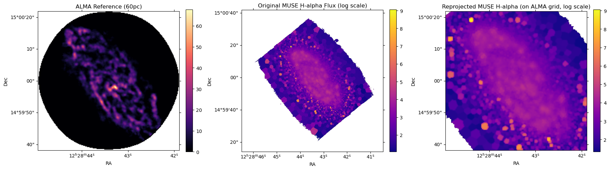

# 20251201 Spearman Trend Binning Effect and First Glance at ALMA Data

For each galaxy and the stacked case, I equally split into $n$ equal-width bins based on the 95% completeness of $\Sigma_*$. 

## $n=3$

As a quick check, we have to admit that the positive point in MGC4330 is real. NGC4293 is back here, but it is stil not reliable due to not enough statistics. 

 

## $n=6$

I will say we may present this one in our draft. Note that NGC4698 is also absent. 

## $n=12$

This is the case that I showed in current draft (but note that now I have 12 bins based on the 99% completeness of $\Sigma_*$). 

## Other indicators

Now we can also recreate the plot for our Discussion section. 

## First Glance at ALMA Data

I reproject the H$\alpha$ map into the same grid of ALMA 60 pc moment 0 map for IC3392.

