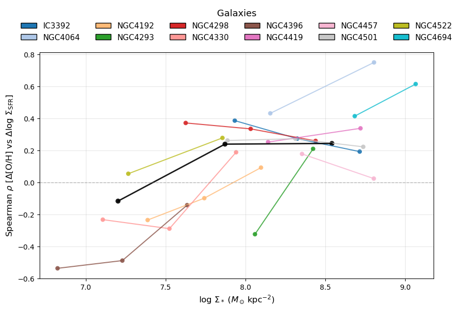
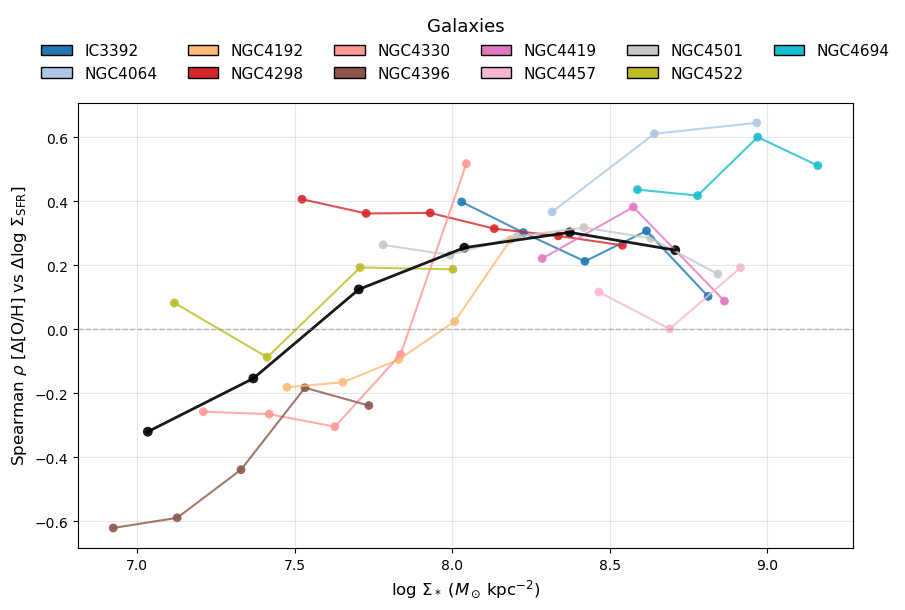
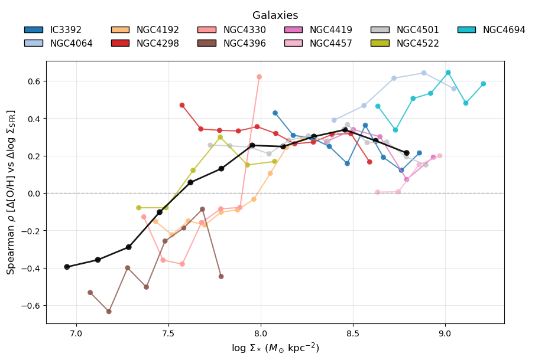
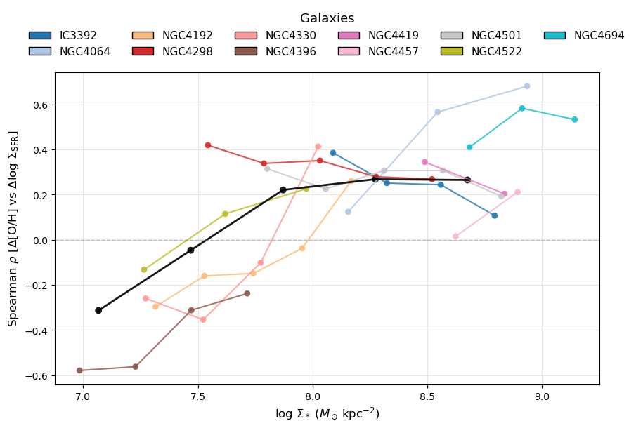
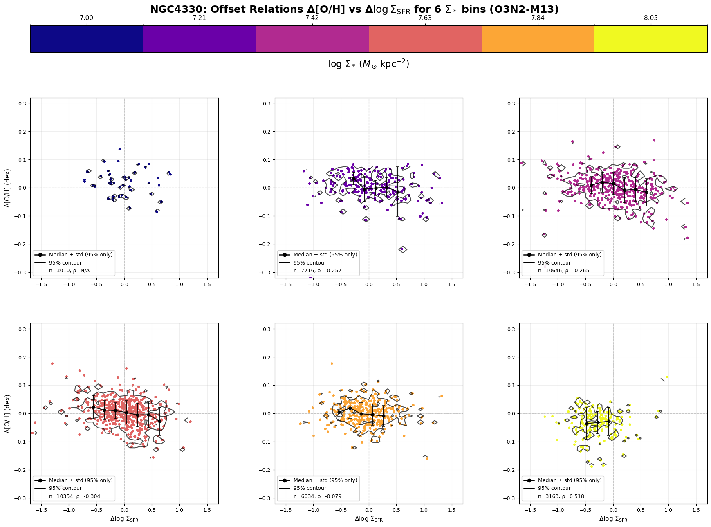

# 20251202 Redo Spearman Trend Binning Effect and a Closer Look at NGC4330

Now I have update the extinction correction in `Mass.py` to use the same Calzetti (2000) attenuation curve at `SFR+Z.py`. Interestingly, NGC4330 is no longer jumping up and down in Spearman trends.

## $n=3$

## $n=6$

But now seems NGC4522 is a bit problematic. 

## $n=12$

## $n=5$

So finally I think I find the sweet point at 5. 

## NGC4330

But actually if we look at NGC4330, we can still see that the highest mass bin is still biased by soem extreme points?

