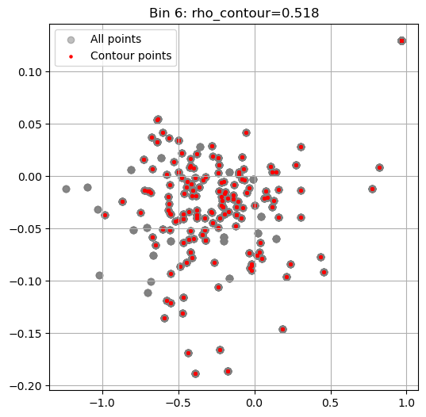
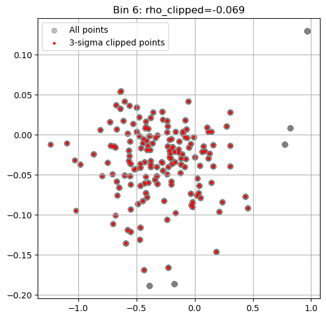
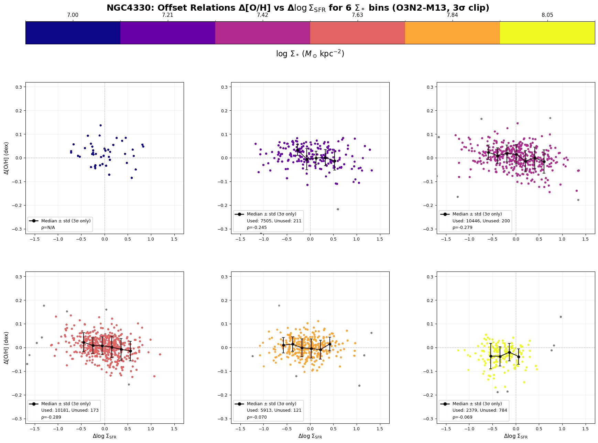
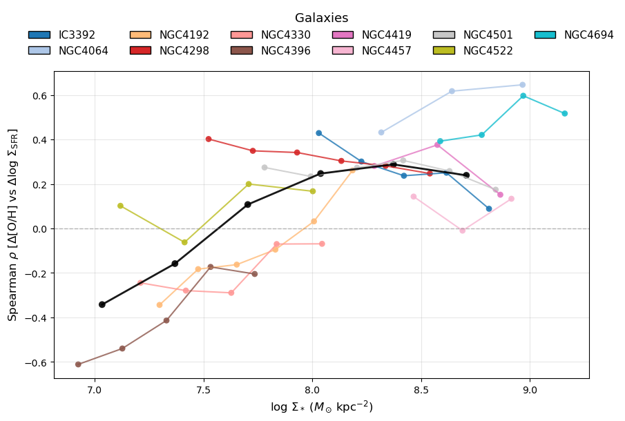
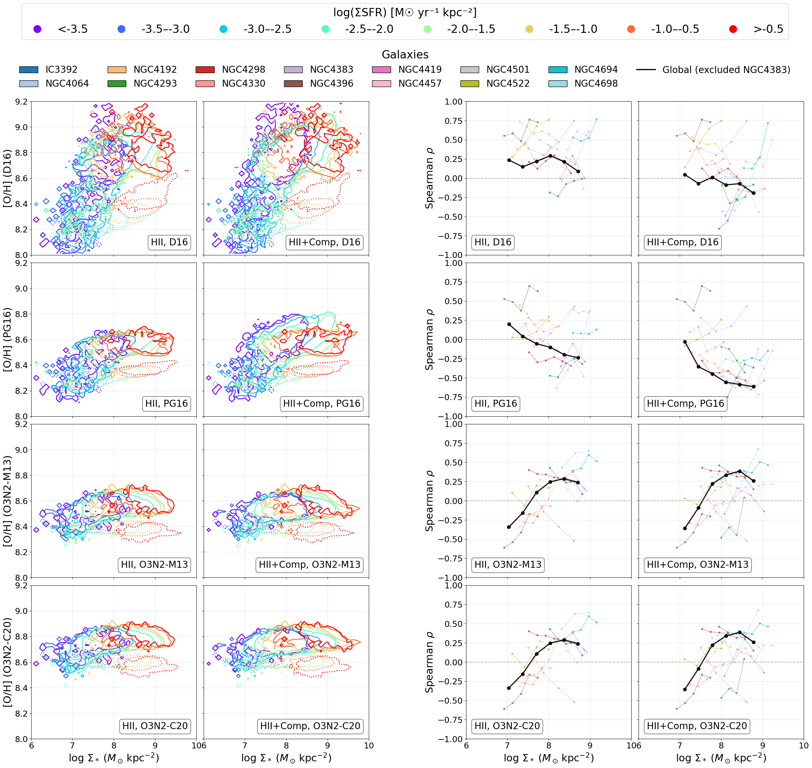

# 20251204 Updated Range of Spearman Calculation in Each Mass Bin

So previously, we have only selected data within 95% contour to do Spearman test and hope that can remove some bias. 

So yes the last mass bin still looks problematic.

And I check that we still get 0.518 just because the extreme outliers. Particacularly, the top right red dots: that bin represents 36 spaxels. 

Hence, instead of select by 95% contour, I clip the data out of 3$\sigma$ in both SFR and O/H, and the result looks as expected.

 

And when I update to other mass bins, results are still similar.

And so i think we can update to all the galaxies:

And all indicators:

