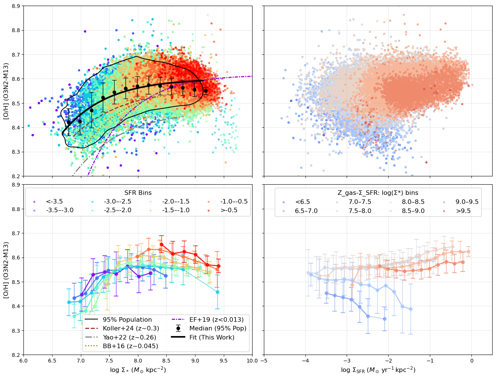
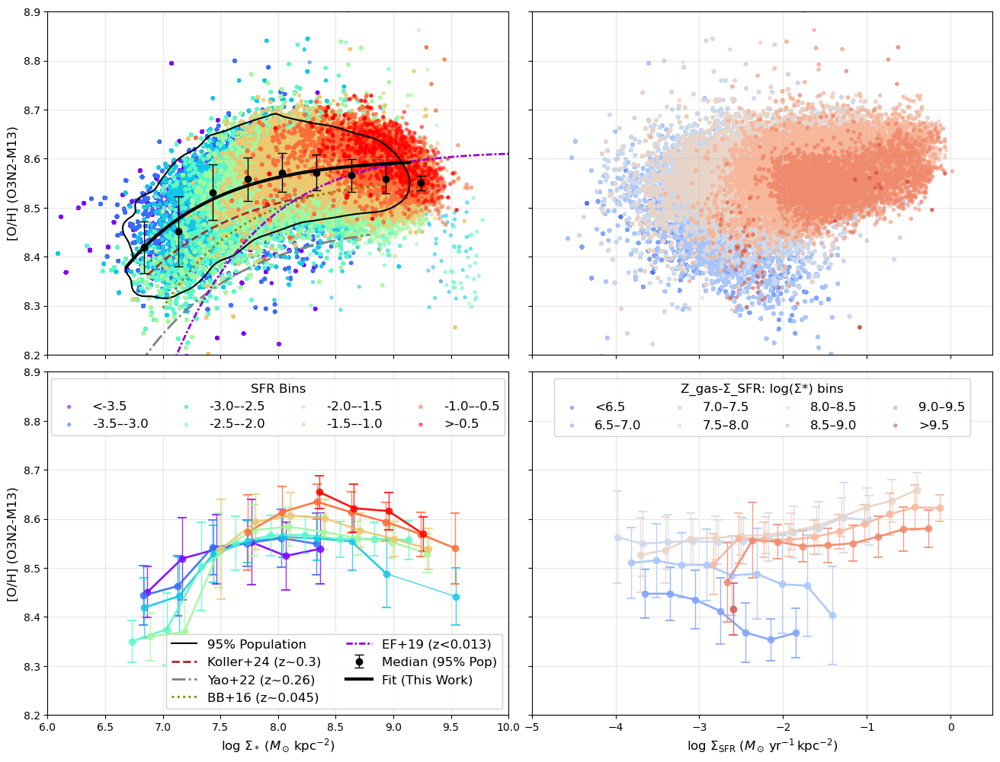
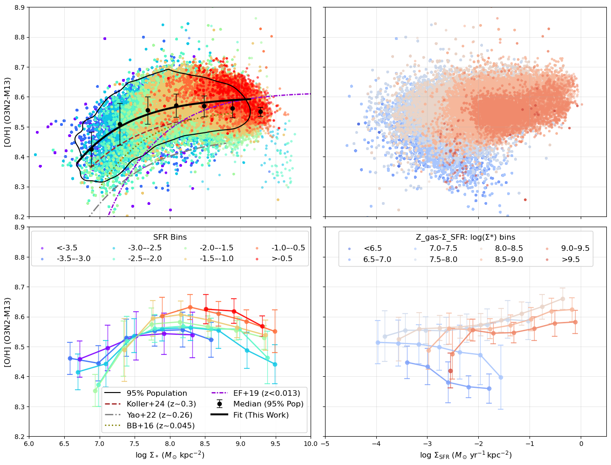
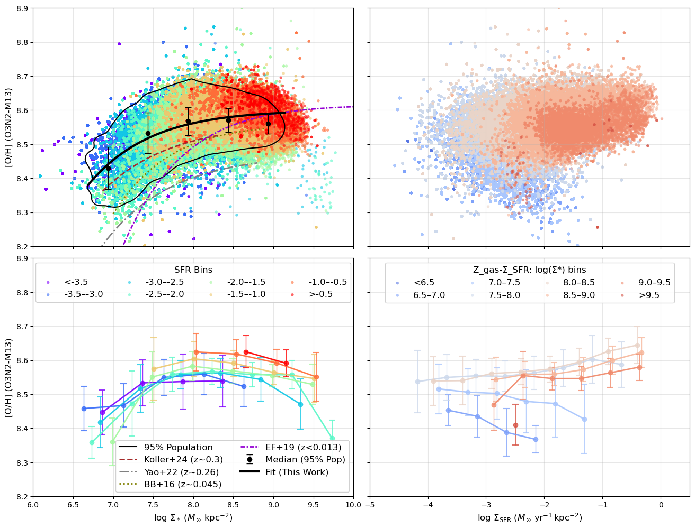

# 20251206 Other rMZR in Local Universe and Binwidth

First, I add some other rMZR works in local universe:

1. [Barrera-Ballesteros+16](https://doi.org/10.1093/mnras/stw1984): MaNGA data at $z\sim0.045$.
2. [Erroz-Ferrer+19](https://doi.org/10.1093%2Fmnras%2Fstz194): MAD data at $z<0.013$.

Note that all these 4 fitting curves use the O3N2-M13 prescription. And it turns out our sample is 1) the most metal-rich; 2)similar curvature as higher redshift cases and shallower than other local universe works. 

Then I increase the binwidth from 0.2 to 0.3, 0.4 and 0.5 in the following plots:

