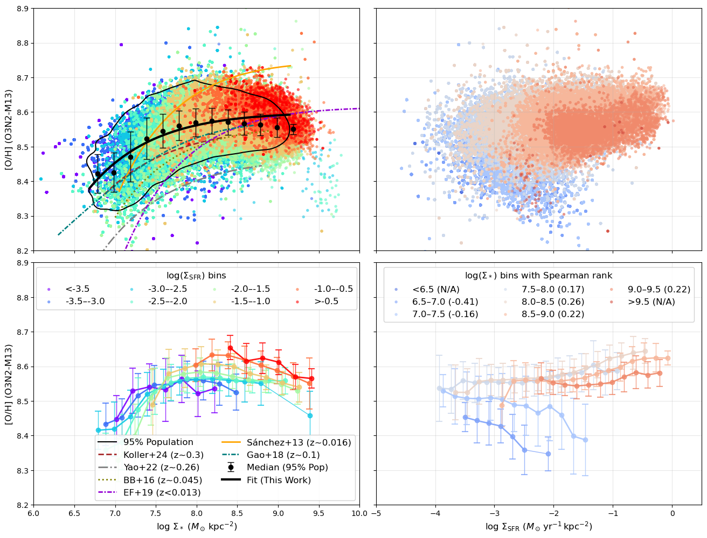
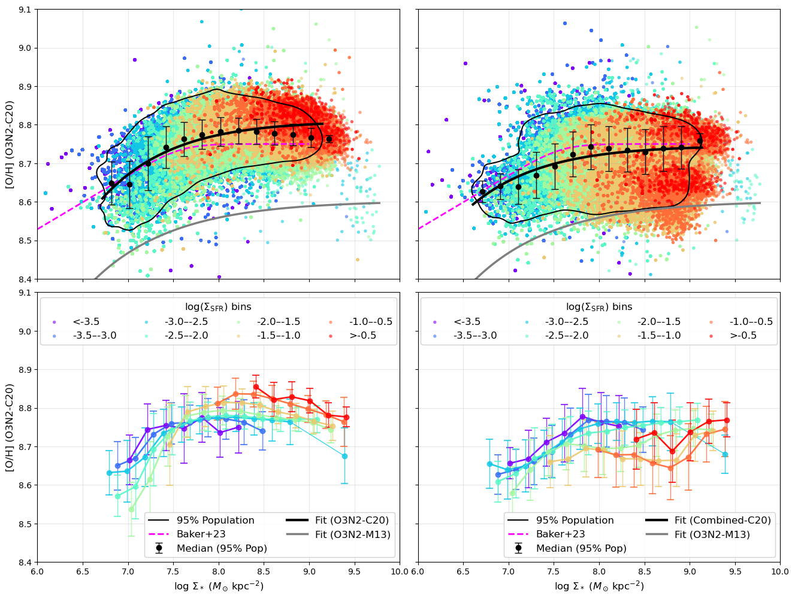

# 20251208 Further rMZR Comparison

Somehow, I don't know why Sancheze+2013 also give some non-sense parameters, so I still manage to show it as the orange curve here.
As you can see, no that exactly between Sancheze+2013 (orange solid curve) and EF17 (darkviolet dot-dashed curve), but i think it should be sufficient to claim that different shape of rMZR is due to combined effects of sample selection, including the range of $\Sigma_\mathrm{SFR}$ and the total $M_*$ of sample galaxies. 
Hence, I think we can only show 3 local universe curves in our paper: Sancheze+2013, EF17 and BB16 (oval dotted curve).

Now, below i show the O3N2-C20 and Combined-C20. I show curve from Baker+2023 as the magenta curve. As reference, i show the above O3N2-M13 curve as gray curve (the bottom one). As expected, both C20 rMZR match Baker's curve. 

