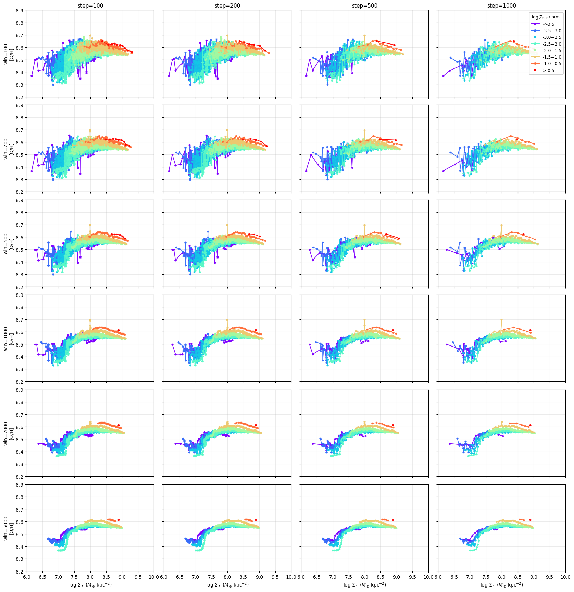
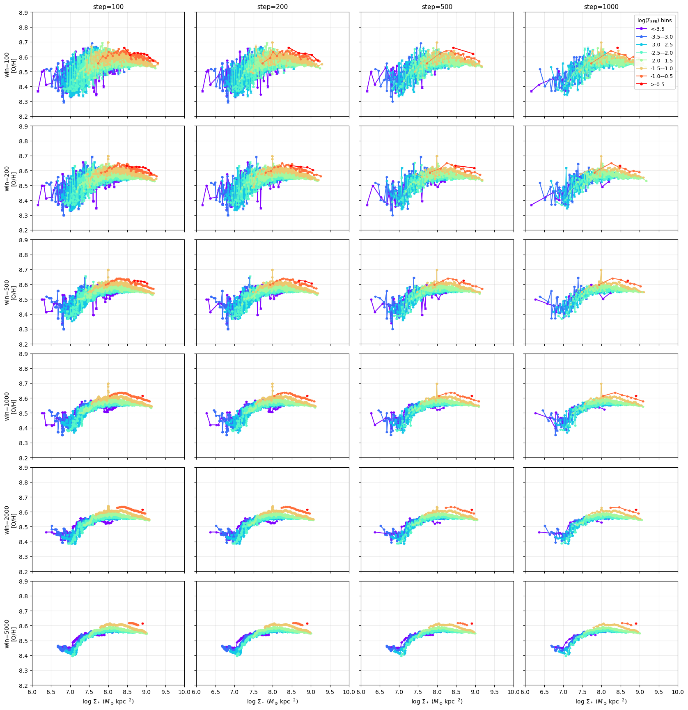

# 20251214 Window Size and Step Size of Running Median

Here i test the running median of rMZR under different configurations of `windown_size` and `step_size`. Note that the cases that `windown_size` < `step_size` is meaningless as that is no more "running" median. 
Here I still calcualate within 95% contour.

Also provide the case that using 3$\sigma$ clip instead of 95% population

