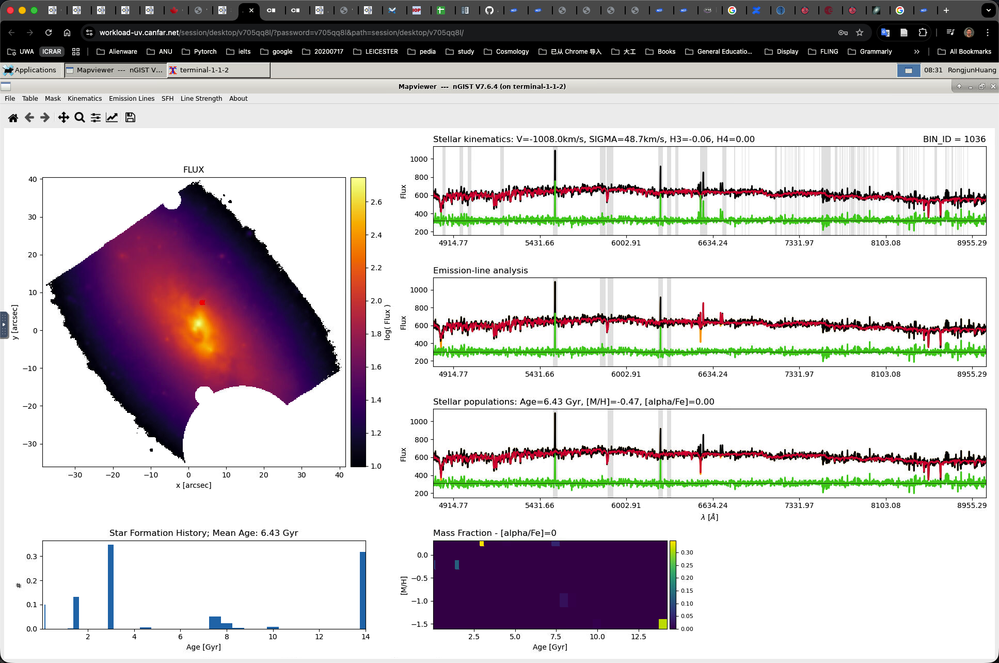

# 20260126 nGIST Tasks

## 1. Extend from $7000\AA$ to $9000\AA$

I start with rerunning the IC3392 with the updated `nGIST`'s `dev-branch`'. 

Since `MILES` only supports the wavelength up to $7500\AA$, then I downloaded the `EMILES_baseFe` templates (i.e. `EMILES_BASTI_BASE_CH_FITS.tar.gz` from https://research.iac.es/proyecto/miles/pages/spectral-energy-distributions-seds/e-miles.php) and also create the `_EMLINES` and `_safe` subsets as we did for `MILES`. Here, only fitting ranges and templates are updated, while everything else remains unchanged.

Below I show the $4800-9000\AA$ of the `KIN` fitting results at the same faint spaxel as the previous $4800-7000\AA$ figure.

Then we zoom in to the $7000-9000\AA$ range.

I check some other spaxels and also further zoom in to see the residual curve. 

I think most of the sky lines are masked properly (according to `specMask_KIN` file, the widths of sky lines are $5\AA$), so no siginificant residuals outside the gray regions. However, since they look so noisy  even in some inner regions of the galaxy, I am concerned that what emission lines we can extract from it (e.g., for ionization parameter and direct measurement of metallicity). 

## 2. Foreground/Background masking (`make_ngist_masks_from_catalogs.py`)

## Spatial masking overview (nGIST-compatible)

This script produces a binary spatial mask aligned to the input cube/image WCS:

- **mask = 0**: keep (target galaxy + sky)
- **mask = 1**: mask (foreground stars + confirmed/background objects)

Masking is performed in two sequential layers: **foreground stars (Gaia)**, then **background galaxies (Legacy Surveys DR9)**.

------

## 1) Foreground stars (Gaia DR3)

### Catalog + query

- The script queries **Gaia DR3** sources within the MUSE field of view (plus a small edge padding) using an ADQL cone search.
- It selects Gaia sources with a valid **G-band magnitude** and applies an upper limit:
   `phot_g_mean_mag < gaia_gmag_max` (default **21.0**).

### Foreground selection logic (“foreground” mode)

Gaia can detect some compact extragalactic sources, and it cannot meaningfully measure parallaxes at Virgo distance. To avoid masking galaxy substructure (e.g., HII regions / clusters), the script defaults to **kinematic foreground selection**, i.e., it masks only objects that look like **Milky Way stars** by requiring **either** significant parallax **or** significant proper motion:

- **Parallax criterion**
  - `parallax / parallax_error ≥ gaia_parallax_snr_min`
  - `parallax ≥ gaia_parallax_min_mas`

**OR**

- **Proper-motion criterion**
  - `pm / pm_error ≥ gaia_pm_snr_min`, where `pm = sqrt(pmra^2 + pmdec^2)`
  - `pm ≥ gaia_pm_min_masyr`

Objects failing both criteria are treated as *not confidently foreground* and are not masked under this mode.

### Star mask size model (radius in arcsec)

Each foreground star is masked as a **circle** centered at the Gaia position, using a magnitude-dependent radius:
$$
r(G) \;=\; \mathrm{clip}\Big(r_{\rm ref}\,10^{-0.2\,(G-G_{\rm ref})},\; r_{\min},\; r_{\max}\Big)
$$
with defaults:

- `r_min = 1.5"`, `r_ref = 5.0"`, `G_ref = 15.0`, `r_max = 25.0`

Additional safeguards:

- Radius is enforced to be at least **~seeing scale** (`≥ 1×FWHM`).
- A **bright-star boost** increases radii for very bright stars (e.g., `G < 10` or `G < 14`) to better capture halos/wings.

### Rasterization into the mask

- The sky coordinates are converted to pixel coordinates via the FITS WCS.
- Each star circle is rasterized into the 2D mask array (efficient local cutout fill).
- Objects that do **not intersect** the image footprint are skipped (prevents edge artifacts and wasted work).

------

## 2) Background galaxies (Legacy Surveys DR9; photo-z gated)

For background galaxies, the script’s primary (and usually sufficient) strategy is a **Legacy Surveys DR9** query with **photo-z gating**. If this layer succeeds (i.e., it masks at least one object), the script **skips** other background-catalog fallbacks.

### Catalog + join strategy

Using the NOIRLab Data Lab TAP service (via `pyvo`), the script queries:

- `ls_dr9.tractor` for positions, object type, and (when available) **Tractor shape parameters** (`shape_r`, `shape_e1`, `shape_e2`)
- `ls_dr9.photo_z` for photometric redshift constraints (`z_phot_l95`, `z_phot_u95`, `z_phot_mean`)

These tables are joined by `ls_id`.

### Selection: “definitely background” via conservative photo-z cuts

The intent is to mask only objects that are confidently behind Virgo. A Legacy object is masked if:

1. It is **not PSF-like** (reject `type == "PSF"`), and
2. Its **lower 95% redshift bound** exceeds a minimum threshold:

$$
z_{\rm l95} \;>\; z_{\rm l95,min}
$$

(default `legacy_z_l95_min = 0.01`), and

3. The photo-z posterior is not excessively broad (optional), and passes a **significance / SNR** requirement derived from the 95% interval width:

- Define width: `Δz = z_u95 - z_l95`

- Approximate scatter: `σ_z ≈ Δz / 3.92`

- Compute an SNR-like metric (default form uses a reference cut):
  $$
  {\rm SNR}_z \;=\; \frac{z_{\rm mean} - z_{\rm cut}}{\sigma_z}
  $$

- Require: `SNR_z ≥ legacy_z_snr_min` (default **5.0**)

This combination is designed to reduce false positives from uncertain photo-zs.

### Size/shape model (Tractor morphology)

If Tractor shape parameters exist:

- **Semi-major axis** is derived from `shape_r` (in arcsec, scaled by `legacy_shape_r_scale`), floored at `legacy_r_min_arcsec` and capped at `legacy_r_max_arcsec`.
- If ellipse masking is enabled and valid `(e1, e2)` exist:
  - ellipticity magnitude: $e=\sqrt{e1^2+e2^2}$ (clipped for stability)
  - axis ratio: $q = \frac{1-e}{1+e}$ (clipped to sensible bounds)
  - semi-minor: $b = a\,q$
  - orientation angle: $\theta = \frac{1}{2}\arctan2(e2,e1)$ (degrees)

A small padding margin (`gaia_margin_arcsec`) is added to both axes.

If Tractor sizing is missing/invalid:

- the object is masked with a conservative seeing-based circular radius (still respecting minimum size floors).

### Rasterization into the mask

- Legacy positions are converted to pixel space using the cube WCS.
- If ellipse masking is used, the script can **sample the ellipse in the local sky tangent plane** (east/north offsets) and map those samples through the WCS to build a polygon, then rasterize that polygon into the mask. This approach is robust to rotated WCS and avoids common position-angle convention pitfalls.
- Objects that do **not intersect** the image footprint are skipped.

------

## Output products

- **`{base}_mask.fits`**: the final nGIST-compatible binary mask (same spatial WCS/dimensions as the input).
- **`{base}_combined_R_mask.png`**: diagnostic overlay showing star and galaxy mask outlines for visual validation.

Here I show the images for 26 galaxies before and after masking in combined VRI bands photometry. Green circles are foreground stars while brown circles/ellipses are background galaxies. 

And finally, I try run NGC4606 to test `_mask.fits`. 

