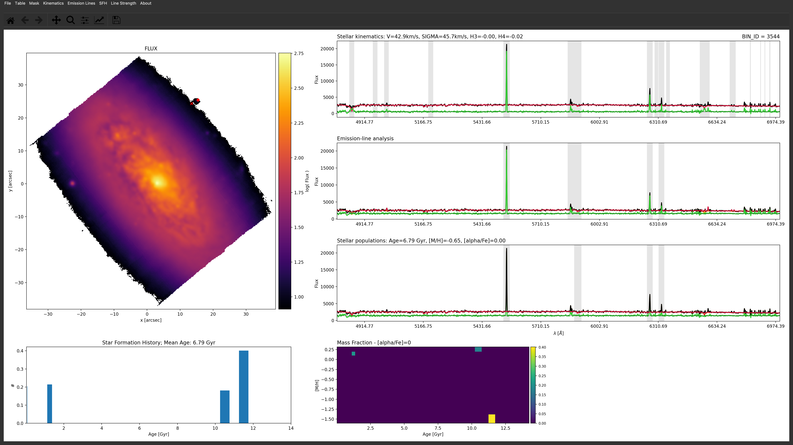
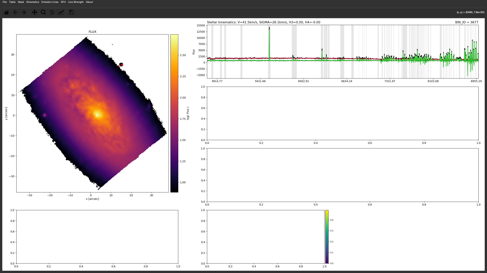
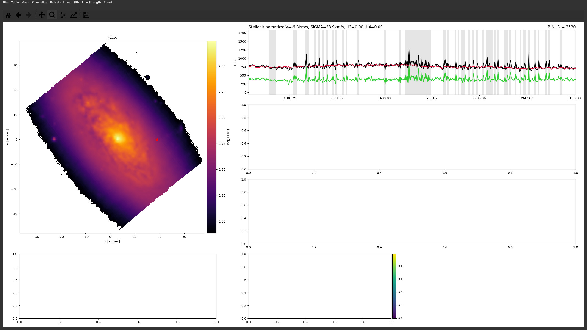
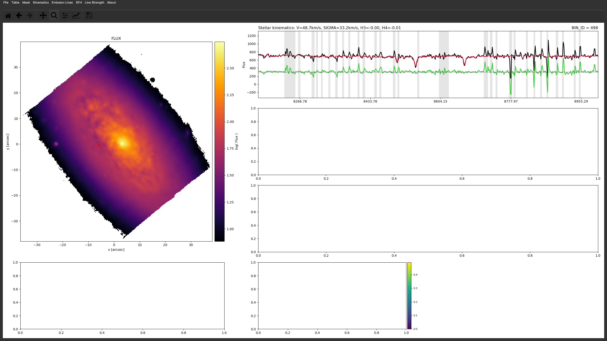
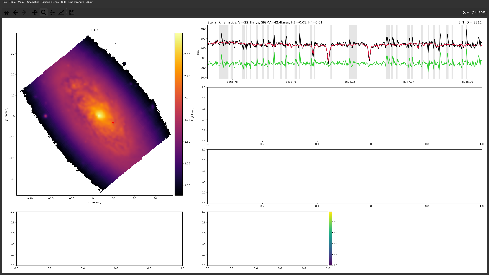

# 20260127 nGIST Tasks

## 1. Extend from $7000\AA$ to $9000\AA$

I start with rerunning the IC3392 with the updated `nGIST`'s `dev-branch`'. 

Since `MILES` only supports the wavelength up to $7500\AA$, then I downloaded the `EMILES_baseFe` templates (i.e. `EMILES_BASTI_BASE_CH_FITS.tar.gz` from https://research.iac.es/proyecto/miles/pages/spectral-energy-distributions-seds/e-miles.php) and also create the `_EMLINES` and `_safe` subsets as we did for `MILES`. Here, only fitting ranges and templates are updated, while everything else remains unchanged.

Below I show the $4800-9000\AA$ of the `KIN` fitting results at the same faint spaxel as the previous $4800-7000\AA$ figure.

Then we zoom in to the $7000-9000\AA$ range.

I check some other spaxels and also further zoom in to see the residual curve. 

I think most of the sky lines are masked properly (according to `specMask_KIN` file, the widths of sky lines are $5\AA$), so no siginificant residuals outside the gray regions. However, since they look so noisy  even in some inner regions of the galaxy, I am concerned that what emission lines we can extract from it (e.g., for ionization parameter and direct measurement of metallicity). 

## 2. Foreground stars masking
