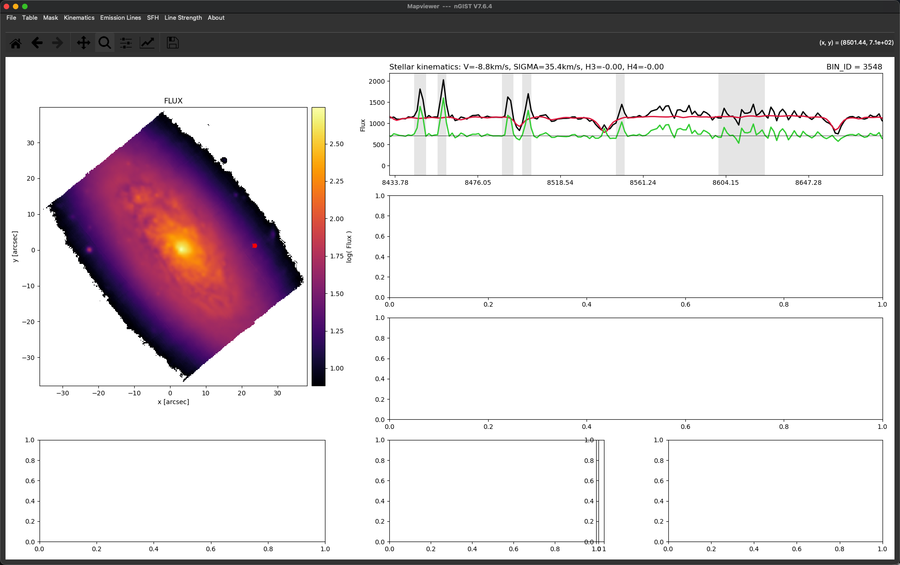
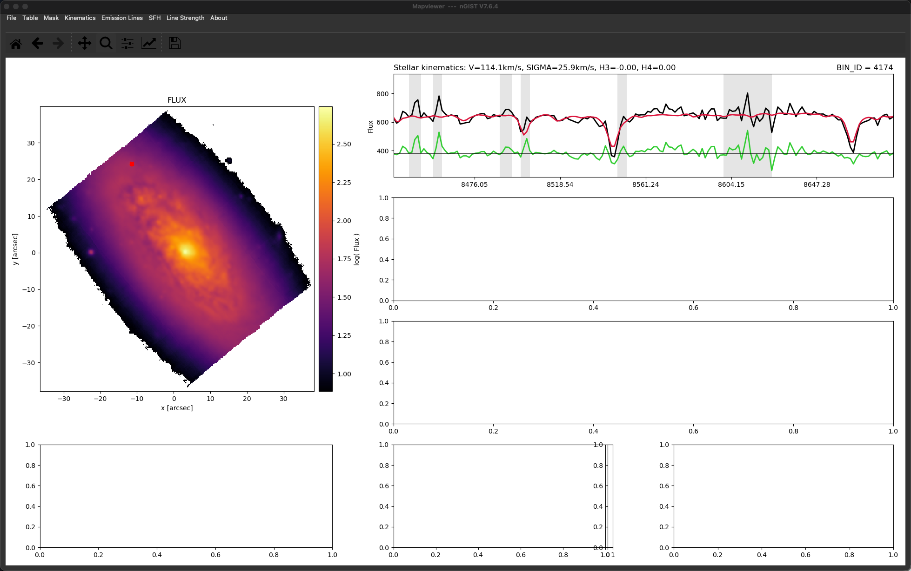
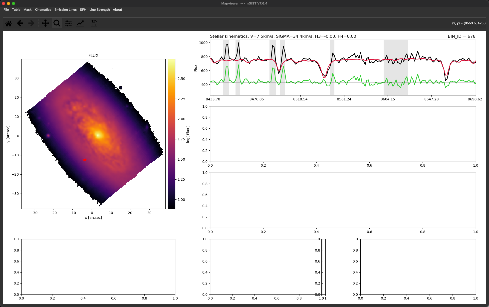
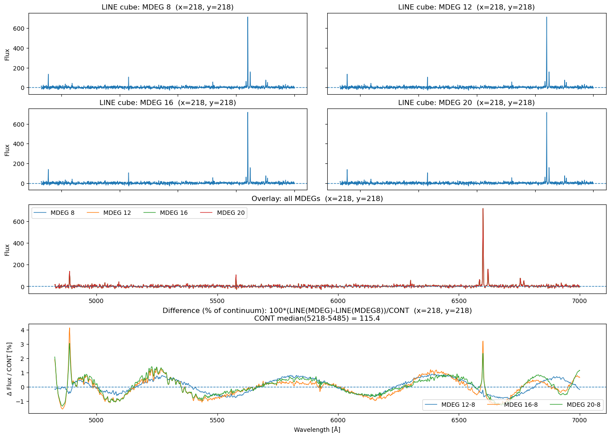
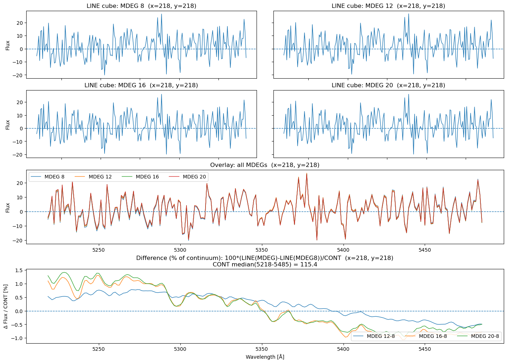
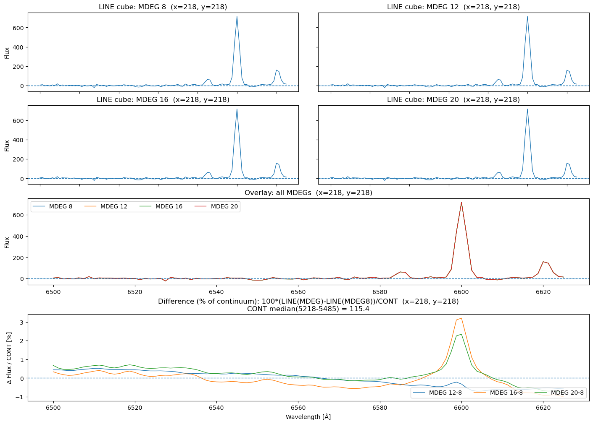
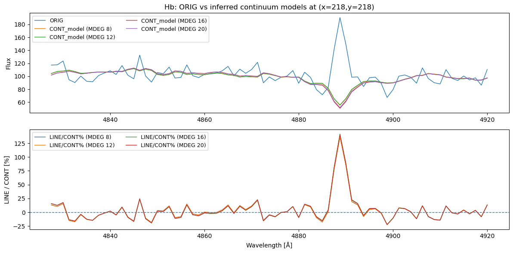
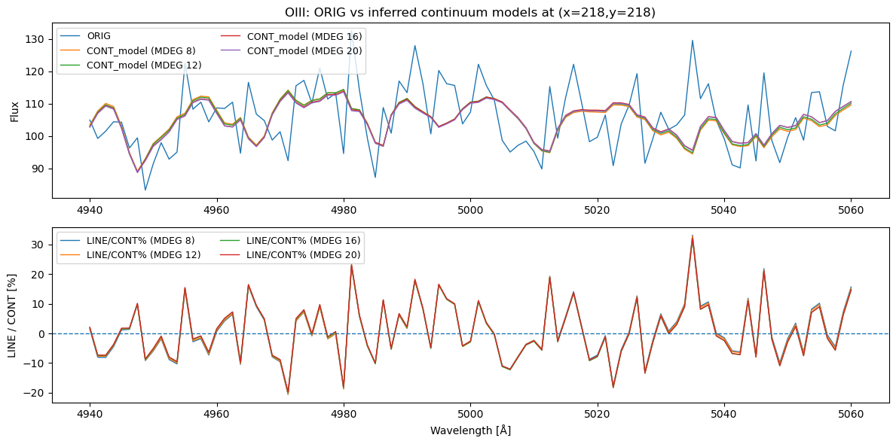
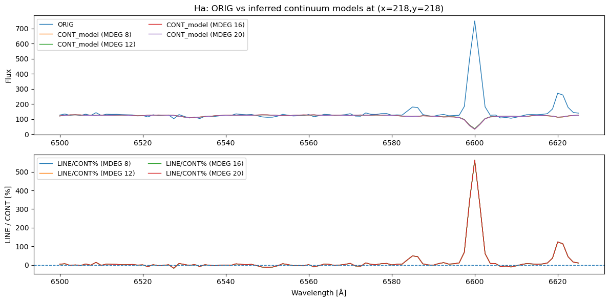
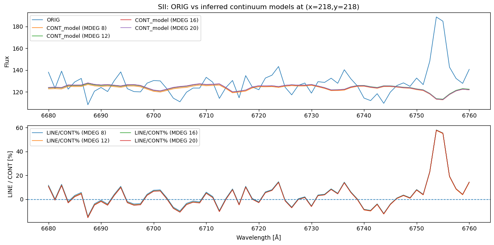

# 20260201 nGIST Tasks

## Spectral Masking

Here i pick the CaT window and choose some spaxels to inspect the sky line masking. I agree that the masking range for each line should be increased a bit. However, for the sky lines near the 8498$\AA$ and 8542$\AA$ (first and second Ca II dips) should be careful. 

Also, currently in $>7000\AA$, only the [Ar III]$\lambda7135$ is masked in `specMASK_KIN.txt`. Should we also add [O II]$\lambda\lambda7320, 7330$ and [S III]$\lambda9069$?  

Also I am curious about how these sky lines are determined? I feel like their positions been blueshifted a bit in spetrum. 

## Spatial Masking

Now for the foreground stars that (its 5'' region) partially enter the MUSE FoV, we just simply create a min{5'' circle, magnitude-dependent circle} to mask it. Checkout NGC4606 and NGC4698. 

Blue contours are R-band 26 mag isophote and yellow lines are MUSE FoV. Again, green and red circles will be masked. 

## `MDEG` test

Now for the bottom panel, I update to use the differences of line cube divided by continuum level ($\Delta$LINE/CONT). Here i show 4800-7000$\AA$, continuum window at 5218-5485$\AA$ and H$\alpha$+[N II] window at 6500-6625$\AA$. 

Here we can see smooth wiggles at the ~sub-percent to ~percent level of the continuum, plus two narrow spike 3~4% at H$\beta$ and H$\alpha$ for MDEG=12 and 20.  

To test for overfitting directly, I compute an inferred continuum model for each MDEG via: CONT_model(MDEG) = ORIG_cube − LINE(MDEG). Here i focus on emission line windows: H$\beta$, [O III], H$\alpha$+[N II] and [S II]. It seems that the inferred continuum models overlap closely across 4 MDEGs, and so no obvious overfitting with higher MDEG in this test. But based on the previous figures, I feel like maybe choose to use MDEG=12?

 

