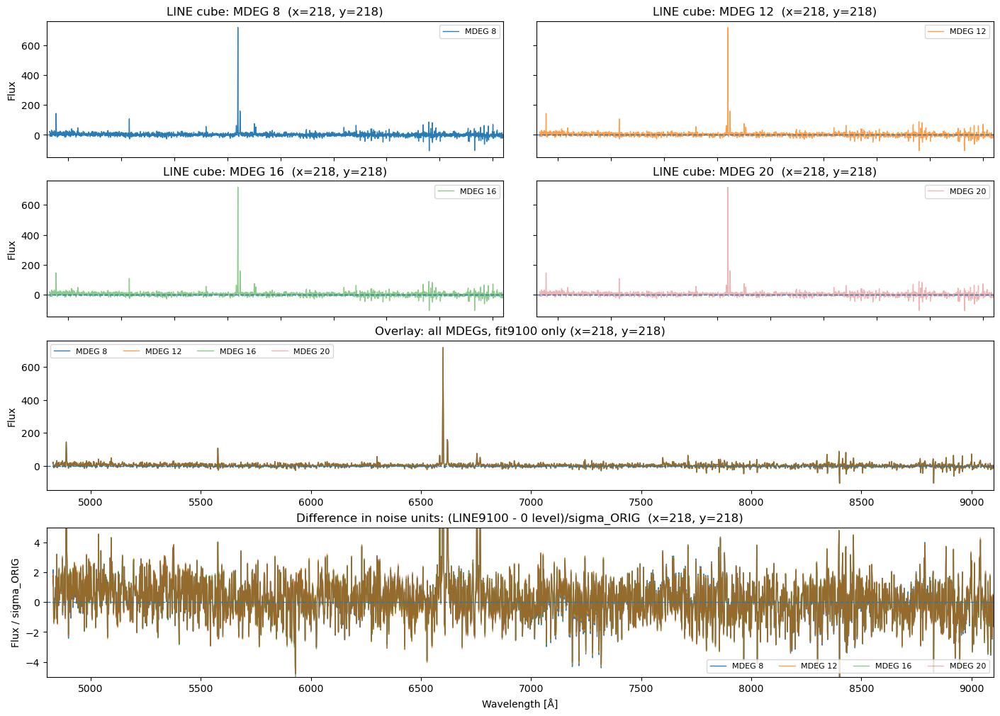
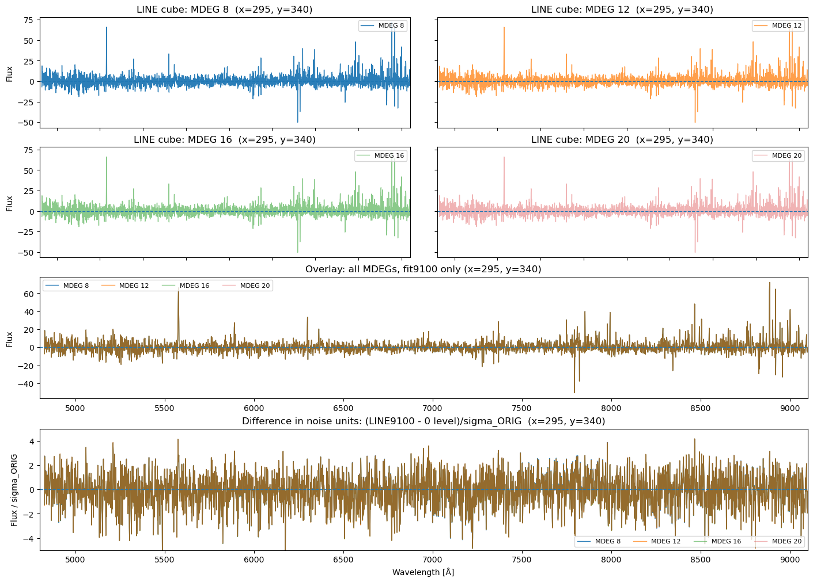
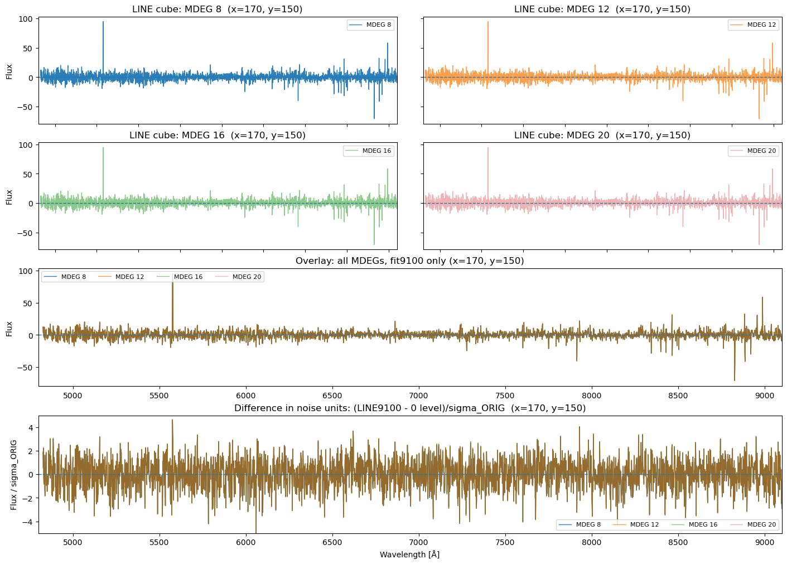
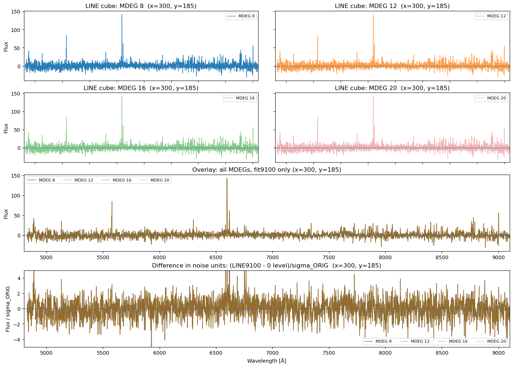
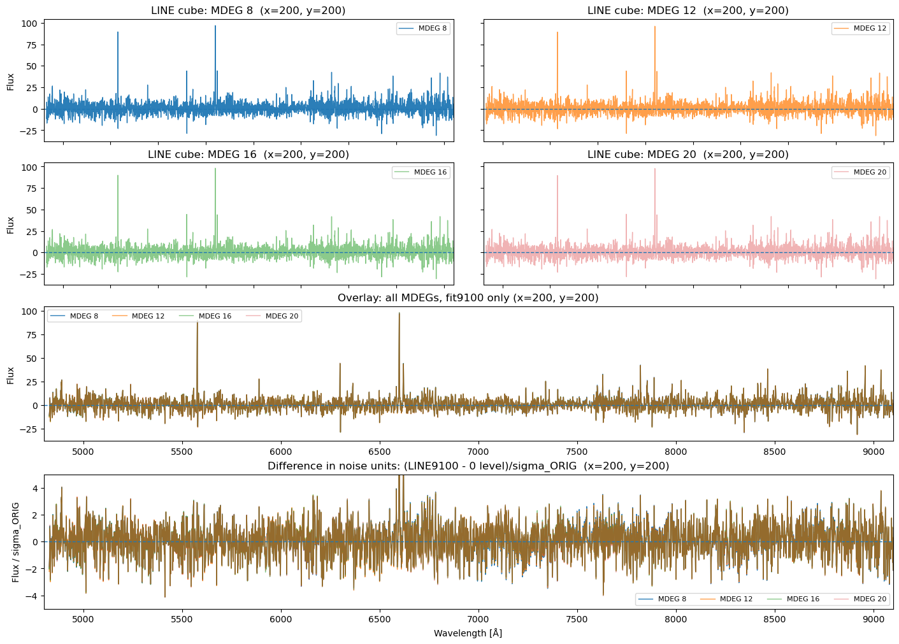
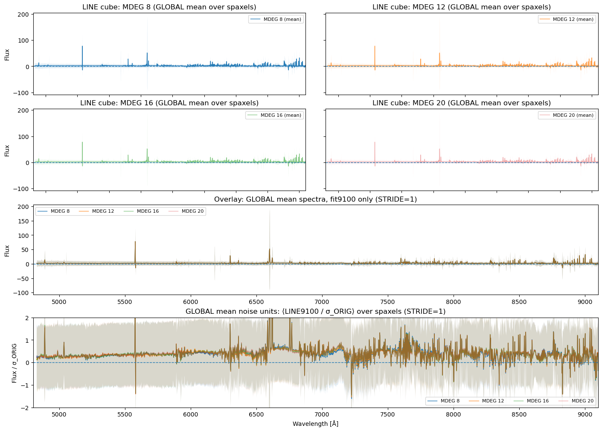
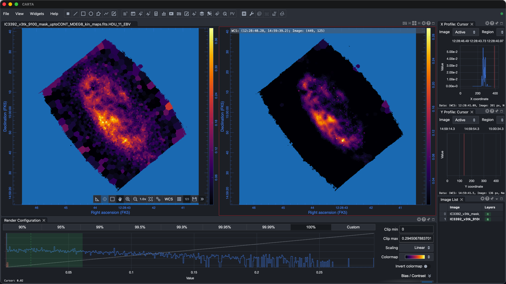

# 20260303 No ASCONA

## 1. Elevated blue end when fitting longer wavelengths?

At first, we pick the central spaxel `(218,218)`, and it seems that no matter how we change the `MDEG=8, 12, 16, 20`, the continuum-subtracted spectra seem to fluctuate on the positive side while vibrate around 0 for the rest. 

 

**However, this is not the case for other spaxels.** Below I try pick 2 other very faint spaxels and 2 other inner spaxels:

Actually, when i show the mean spectra over all the spaxels, they seem to be positive?

 

## 2. How about the E(B-V) maps?

Here is the comparison of E(B-V) maps between fitting upto $7000\AA$ (left) and $9100\AA$ (right) at fixed `MDEG=8`. Obviously, they are already huge different: when fitting upto $9100\AA$, the E(B-V) map is systmetically lower (~0.1?). Then, I am thinking if it is primary due to the fact that we switched the template library from `MILES` to `EMILES`? So i am running the $7000\AA$ run at fixed `MDEG=8` with `EMILES` to check what E(B-V) map we will get. We will see tomorrow. 

