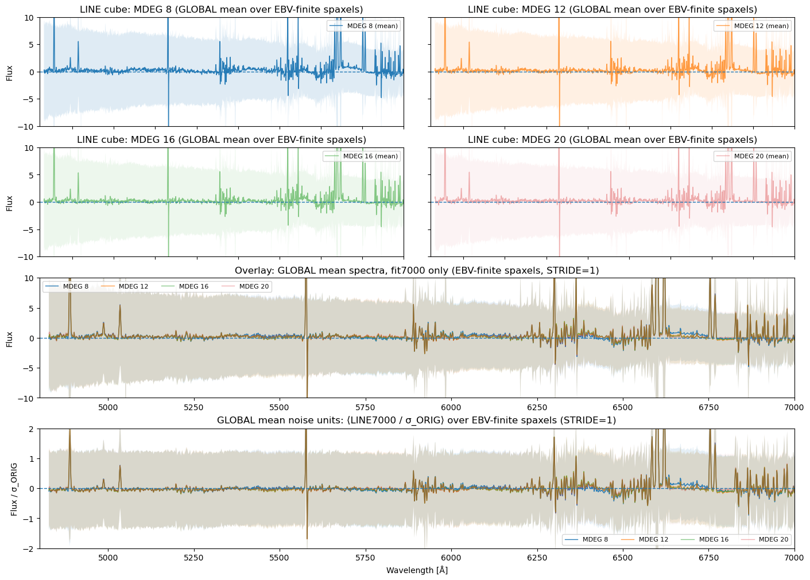
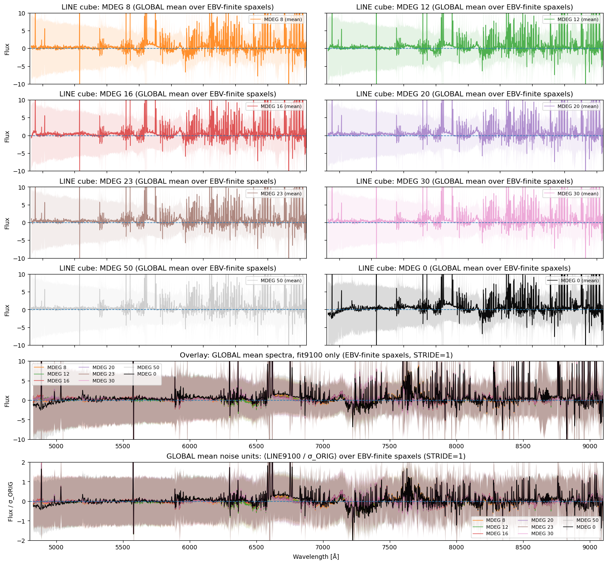

# 20260304 MDEG=30

This afternoon we found that for 7000 case, it seems that at `MDEG`=16 or 20 can fix the unknown bump under H$\alpha$ and [S II] lines in continuum-subtracted spectra. 

So the idea here is to see in what `MDEG` we can get rid of that unknown bump in 9100 case?

From 7000 to 9100 case, the fitting wavelength range increases from 2200 to 4300, so almost double. Then I rerun the 9100 case with `MDEG` = 30 and 40, which should roughly correspond to 16 and 20 in 7000 case. While `MDEG` = 40 is still running, i show the `MEDG` = (8, 12, 16, 20, 23, 30, 50, 0) for 9100 case. 

So the idea here is that, if you look at the worst case that `MDEG` = 0 here (black curve), we notice the biggest bump (i.e., the unknown bump under H$\alpha$ and [S II] lines) is roughly $6800-6500=300\AA$. **And so to let polynormial to "destroy" this bump, we should have at least $150\AA$ per degree.** Hence, for 9100 case that have 4300$\AA$ wavelength range, we require $4300/150 \approx 28.67$. Here i adopt `MDEG` = 30 in pink spectrum, which looks like already largely remove that bump (at lease no that visible). Of course, we still see some smaller bump remaining, so we can always increase to higher `MDEG` like 50 in gray spectrum, but feel like that is already overfitting?

Similarly, if we apply this $150\AA$ per degree to 7000 case, we except `MDEG` = 15. And so that is why in 16 and 20, that bump is gone. 

Also, we can check out the `MDEG` = 40 tomorrow. As for the full `MILES` test for 7000 case, it runs so slowly so also still waiting.