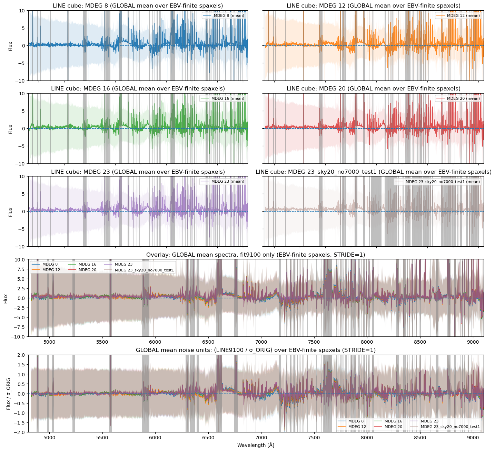
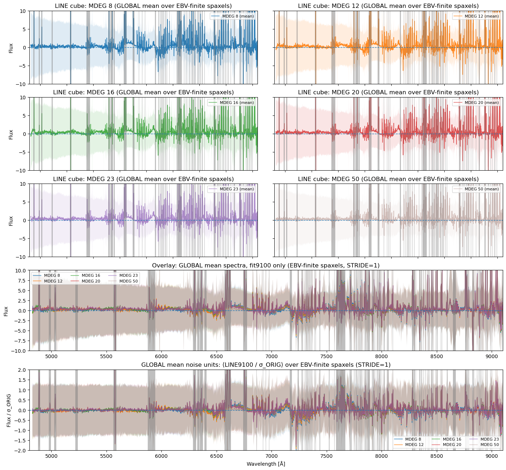

# 20260308 Need more tests around ArIII

I use `MDEG` = 23 and still mask the $6900-7300\AA$ window but keep $7100-7200\AA$ open for [Ar III] but the bump under H$\alpha$ and [S II] is back. 

As for the annoying second bump at $7100\sim7150\AA$ (just before the Argon line) that affects the first bump, it is still there even we do `MDEG=50` overfitting. 

So looks like this second bump is unavoidable and we should find a better masking region. Now I am testing another mask with $6900-7130\AA$ and $7200-7300\AA$ to see if any improvements. 

I will also look at the sky spectrum to determine our skyline spectral mask $>7000\AA$. 