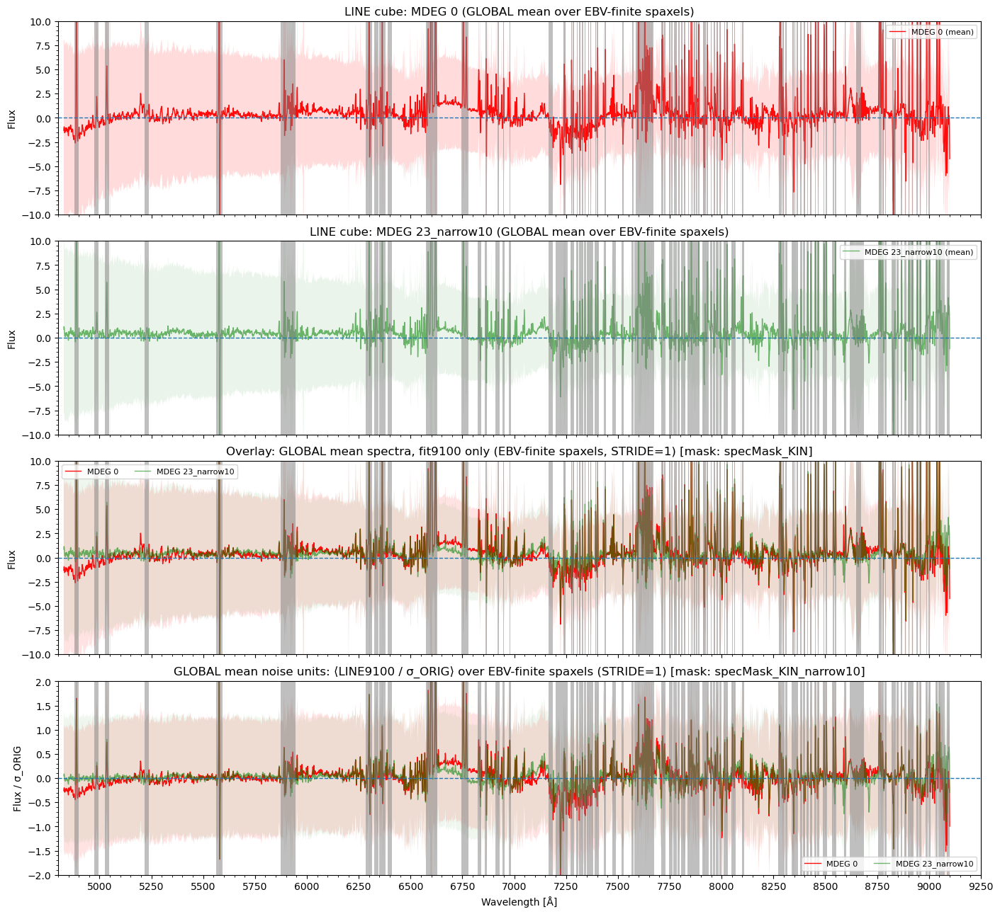
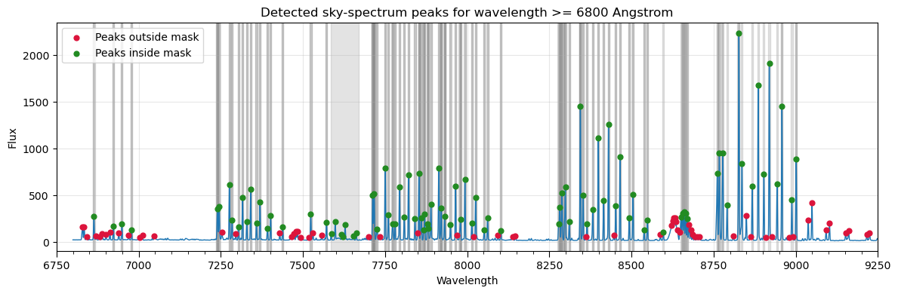
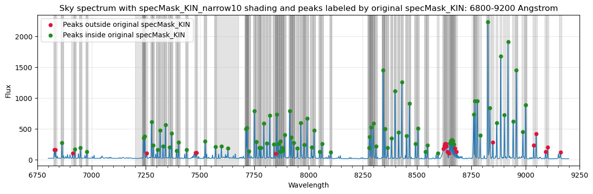
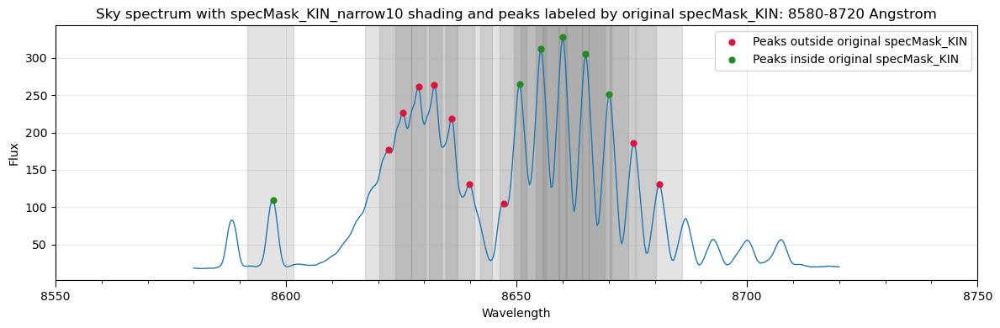
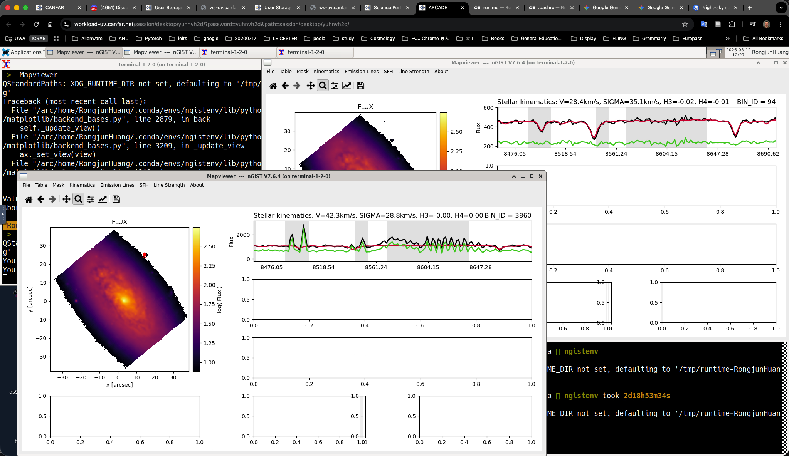

# 20260312 END of MDEG and Skyline Spectral Masking

## 1. Choice of `MDEG` or `ADEG` = 23

Although we fix the polynomial degree (either `MDEG` or `ADEG`) at 23 same as GECKOS, which corresponds to polynomial degree per $190\AA$ for our $4800-9100\AA$ wavelength coverage, I want to give a sense of theoritical reason why we choose 23 here. 

The reason why we need polynomial is to correct the continuum shape of the model to match the observed data. And so by looking at the `pPXF` fitting results of line cube without polynomial (`MDEG` = 0, red spectra), we can clearly see two prominent mismatch structures: a cavity under H$\beta$ ($4800\sim5180\AA$) and a bump under H$\alpha$ ($6500\sim6880\AA$), so both have width at $380\AA$. In order to let polynomial to capture these two mismatches, it is better to require the average distance of  polynomial is no greater than half of the width of these features, which is $190\AA$. That means we require one polynomial degree per $190\AA$, and in our $4800-9100\AA$ it is 23 degrees. 

 It is also interesting to flag that `MDEG` can also change the depth of CaT absorptions. So i check the `MDEG` = 8 case, the depths of CaT are surpressed; while for `MDEG` $\geq$ 40 the feature will become weaker again. 



## 2. Skyline Spectral Masking

I select the peaks with flux $\geq100$ in sky spectrum to be the position of skylines. 

The reason why I choose 100 is that the background level of sky spectrum is 40, with standard deviation at 3. And so we require 20$\sigma$ detection to select skylines. 

Then I fix the width of skyline masking to be $10\AA$. The reason is below:

According to MUSE manual, the spectral resolution at $9350\AA$ is $R=3590$. Then the observed FWHM is $\frac{9350\AA}{3590}=2.60\AA$. Assuming a Gaussian distribution, the standard deviation is $\sigma= \frac{2.60\AA}{2.355} = 1.11\AA$. If we want to capture $99.73\%$ of flux from a skyline, we need $6\sigma = 6.66\AA$. However, considering the there may be some instrumental mismatches due to different pointings, we also need to accout for it by adding the 2 times the spectral sampling rate ($1.5\AA$). Therefore, we require the width of skyline to be $6.66\AA+2\times1.5\AA \approx 10\AA$. 



Below is my way to create the Skyline Spectral Masking for $\geq 6800\AA$: 

1. detect all the peaks in the sky spectrum with flux >= 100 at $6800-9200\AA$

2. then we distinguish two groups of peaks: green is already masked in `specMask_KIN`, while red is not masked yet.

3. For green peaks, then use the existing `specMask_KIN` to determine the masking, while for red peaks, use the detected peak wavelength as the center. As for the width, we widen all the $5\AA$ linewidth to $10\AA$ (including the exising ones in `specMask_KIN` and the newly detected ones). 

4. As for the special `7628.00             84             sky` (telluric feature) in `specMask_KIN`, update its range from $84\AA$ to $96\AA$.

5. We further mask the noisy $7200-7240\AA$ region, which seems to minimise the bump right before [Ar III]$\lambda7135$. 

6. The original `specMask_KIN` only contains [Ar III]$\lambda7135$ for those emission lines $\geq 6800\AA$. So I checkout the `emissionLinesPHANGS_full.config` (my modified version that turn on the fitting for all emissioin lines $\geq 6800\AA$ in original `emissionLinesPHANGS.config`), and add those gas lines, with their widths all set to $20\AA$ as existing lines:

   ```python
       ("OII", 7318.92),
       ("OII", 7319.99),
       ("OII", 7329.67),
       ("OII", 7330.73),
       ("HPa11", 8862.89),
       ("HPa10", 9015.3),
       ("SIII", 9068.6),
   ```

So now I have `specMask_KIN_narrow10`. 



Now we zoom in to check the messy sky+telluric features at $8580-8720\AA$​ that can block the second and third CaT absorptions. these two gray shaded masking regions range from $8591.688\AA$ to $8675.9376\AA$, which is in width of $84\AA$; while the gap between the second and third CaT absorption features are $8662\AA-8542\AA=120\AA$, so there should be enough space to make sure we have at least one for fitting. 



The fitting results from central (0, 0) spaxel and a faint bin can confirm this:



## 3. `EMILES` library

```python
Age of MILES_EMLINES (10): 0.15, 0.25, 0.4, 0.7, 1.25, 2, 3, 5, 8.5, 14
[M/H] of MILES_EMLINES (4): -1.49, -0.35, 0.06, 0.4

Age of MILES_safe (53): 0.03, 0.04, 0.05, 0.06, 0.07, 0.08, 0.09, 0.1, 0.15, 0.2, 0.25, 0.3, 0.35, 0.4, 0.45, 0.5, 0.6, 0.7, 0.8, 0.9, 1, 1.25, 1.5, 1.75, 2, 2.25, 2.5, 2.75, 3, 3.25, 3.5, 3.75, 4, 4.5, 5, 5.5, 6, 6.5, 7, 7.5, 8, 8.5, 9, 9.5, 1E+1, 10.5, 11, 11.5, 12, 12.5, 13, 13.5, 14
[M/H] of MILES_safe (9): -1.49, -1.26, -0.96, -0.66, -0.35, -0.25, 0.06, 0.15, 0.26

Age of EMILES_baseFe_EMLINES (10): 0.15, 0.25, 0.4, 0.7, 1.25, 2, 3, 5, 8.5, 14
[M/H] of EMILES_baseFe_EMLINES (4): -1.49, -0.35, 0.06, 0.4

Age of EMILES_baseFe_safe (53): 0.03, 0.04, 0.05, 0.06, 0.07, 0.08, 0.09, 0.1, 0.15, 0.2, 0.25, 0.3, 0.35, 0.4, 0.45, 0.5, 0.6, 0.7, 0.8, 0.9, 1, 1.25, 1.5, 1.75, 2, 2.25, 2.5, 2.75, 3, 3.25, 3.5, 3.75, 4, 4.5, 5, 5.5, 6, 6.5, 7, 7.5, 8, 8.5, 9, 9.5, 1E+1, 10.5, 11, 11.5, 12, 12.5, 13, 13.5, 14
[M/H] of EMILES_baseFe_safe (9): -1.49, -1.26, -0.96, -0.66, -0.35, -0.25, 0.06, 0.15, 0.26
```

