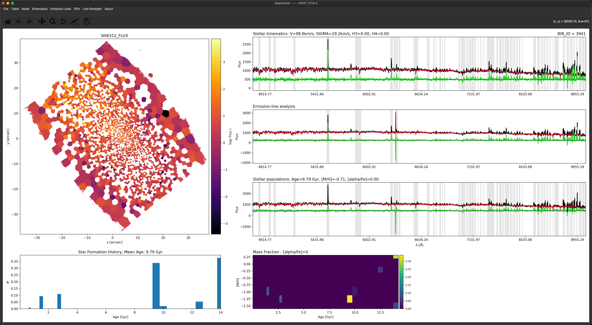
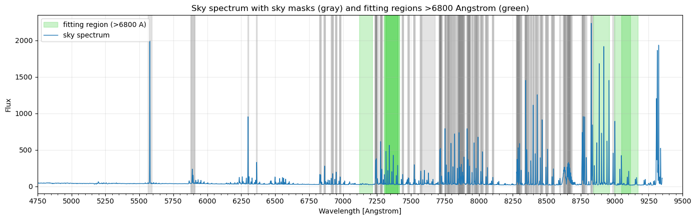

# 20260317 Make `specMask_GAS_narrow10`

The default spectral mask for `GAS` module is `specMask_GAS`:

```bash
# This file defines spectral ranges that are masked during the analysis of the
# SFH module.  Note that all masks are defined in restframe wavelength ranges.
# If you intend to mask sky-lines, please use the keyword 'sky' in the comment
# column. 
#
# Lambda [Angst.]    Width [Angst.]    Comment
5577.00              30                sky
5890.00              30                sky
5896.00              30                sky
5890.00              30                NaD
5896.00              30                NaD
6300.00              30                sky
6363.00              30                sky  
```

So clearly we need to adding the skyline masks for $>6800\AA$. Also, as mentioned before, the skyline masks at $6300\AA$ and $6300\AA$ may be too wide. For [S III]$\lambda6312\AA$, it is coincidently shifted to the edge of $6363\AA$ skyline mask. So in `ppxf`, it seems to fit some "illusion". For example, below is a crazy bright [S III] spaxel, but the observed spectrum is actually flat.



Below is how i create the mask:

1. Change sky masks at 6300 and 6363 from width 30 to width 10.
2. Copy all `sky` masks with `Lambda > 6800` from `specMask_KIN_narrow10`.
3. Keep target fitting regions unmasked for lines:
   - ArIII 7135.79
   - OII 7318.92, 7319.99, 7329.67, 7330.73
   - HPa11 8862.89
   - HPa10 9015.30
   - SIII 9068.60
4. Fitting regions use width 20 Angstrom and redshift range z in [-0.001, 0.01].
5. Any new sky mask that overlaps these fitting regions (even partially) is dropped.

