# 20260329 Null Test and EW Selection

## 1. Null Hypothesis: Simple Gaussian Simulation

**Goal**: Assess if the observed SFR-Metallicity rank correlations ($\rho$) could simply result from random, independent sampling of their underlying un-correlated distributions within each stellar mass bin.

**Methodology**:
1. **Empirical Statistics**: For each shared stellar mass bin ($\log\,\Sigma_*$), we calculate the sample mean ($\mu$) and standard deviation ($\sigma$) of the observed Star Formation Rate ($\log\,\Sigma_{\mathrm{SFR}}$) and Metallicity ($\text{[O/H]}$).
2. **Independent Random Draws**: We generate a large mock dataset ($N=1,000,000$ draws per bin). Crucially, SFR and Metallicity are drawn independently from two un-correlated, normally distributed populations based on our observed parameters: $\mathcal{N}(\mu_{\mathrm{SFR}}, \sigma_{\mathrm{SFR}})$ and $\mathcal{N}(\mu_{\mathrm{O/H}}, \sigma_{\mathrm{O/H}})$.
3. **Correlation Check**: Next, we compute the Spearman rank correlation coefficient ($\rho$) on the simulated datasets in each bin. Since the random variables are drawn independently, this acts as our expected null-correlation baseline.
4. **Comparison**: By comparing the simulated correlations (which should bounce around zero) with the true observed ensemble trend, we can confidently determine whether the observed relations are driven by actual physical dependence between SFR and O/H.

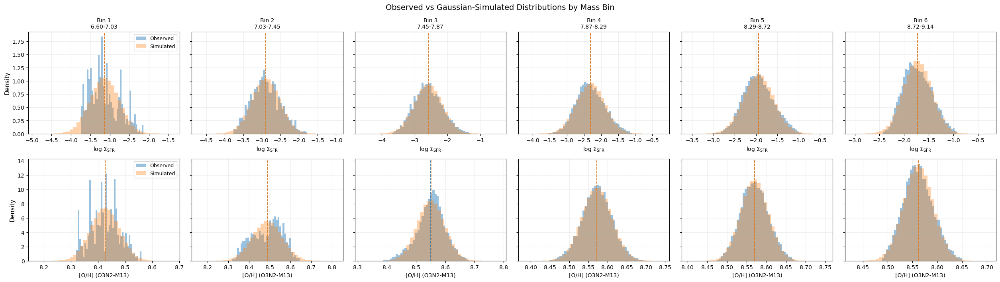

A null model in which metallicity and $\Sigma_{\rm SFR}$ are independently drawn from their observed distributions at fixed $\Sigma_*$ produces $\rho \sim 0$ across all stellar-mass bins, and does not reproduce the observed mass-dependent inversion. So this supports the claim that the real trend is not just an artifact from conditioning on $\Sigma_*$.

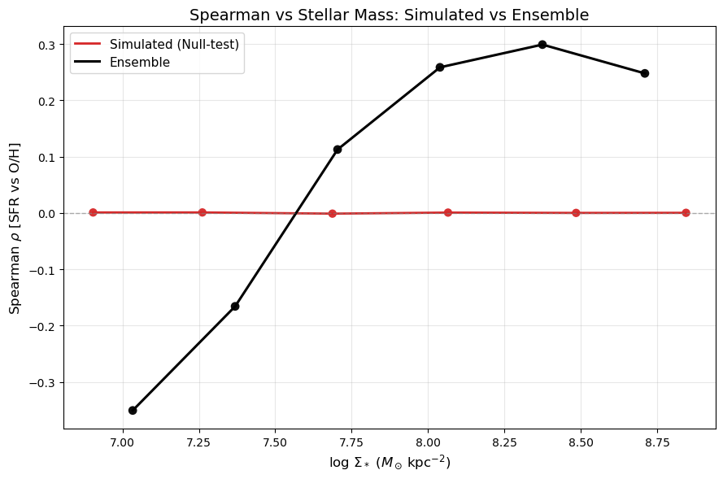

## 2. Strict EW(H$\alpha$) cut

Copy below is the message from Toby:

```bash
Yes absolutely, there are some preliminary products here for the 14 galaxies on CANFAR: /arc/projects/mauve/toby_sandbox/products
 
I will stress that these are test products only and I haven’t done a proper QA. You, Luca, and I should probably have a chat before they get used.
```

It seems that NGC4698's gas fitting product is missing. Anyway, it is a LINER galaxy so we can simply skip it here. 

### 2.1 EW(H$\alpha$) maps

Green contours here indicate the `strict` SF cut at $\mathrm{EW(H}\alpha)\geq6\AA$. 

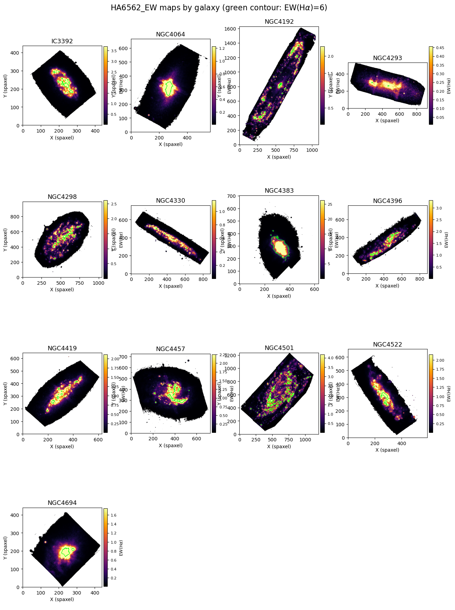

### 2.2 rMZR with strict EW(H$\alpha$) cut

Now we can apply this `strict` SF selection together with BPT `HII` selection, and this will obviously reduce out sample size, espically in low-mass end.

It turns out we now have a steeper low-mass tail. 

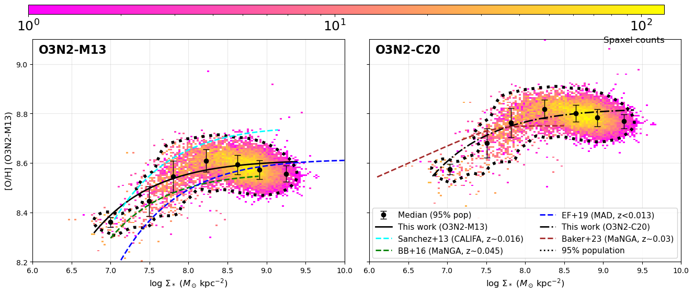

As a result, we almost only probe the positive correlation. 

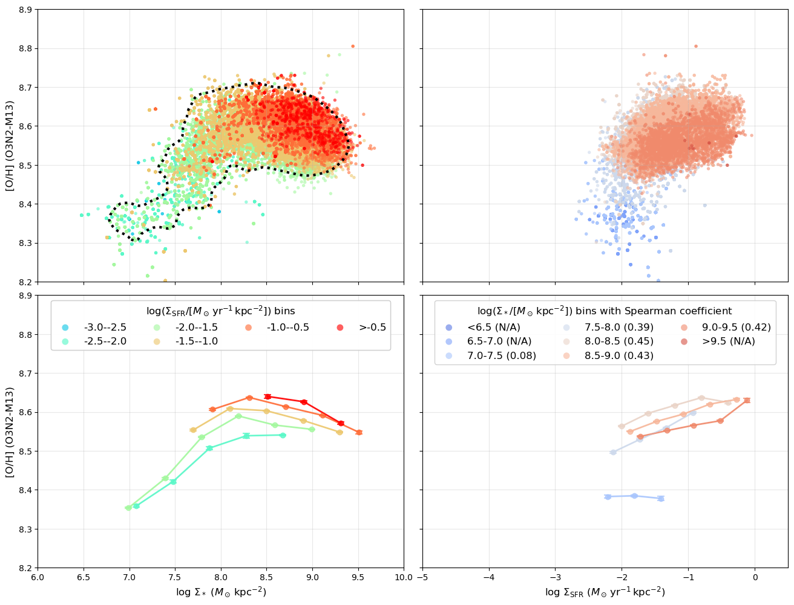

### 2.3 Moran Maps with strict EW(H$\alpha$) cut

Now I try to reconstruct the Moran maps.

#### 2.3.1 NGC4501

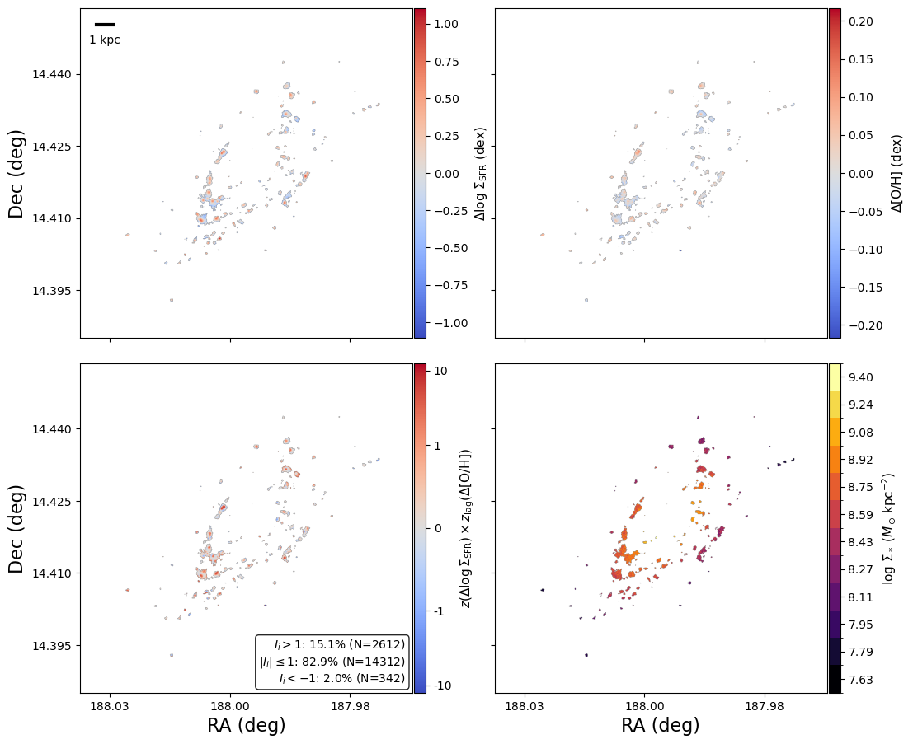

#### 2.3.2 NGC4192

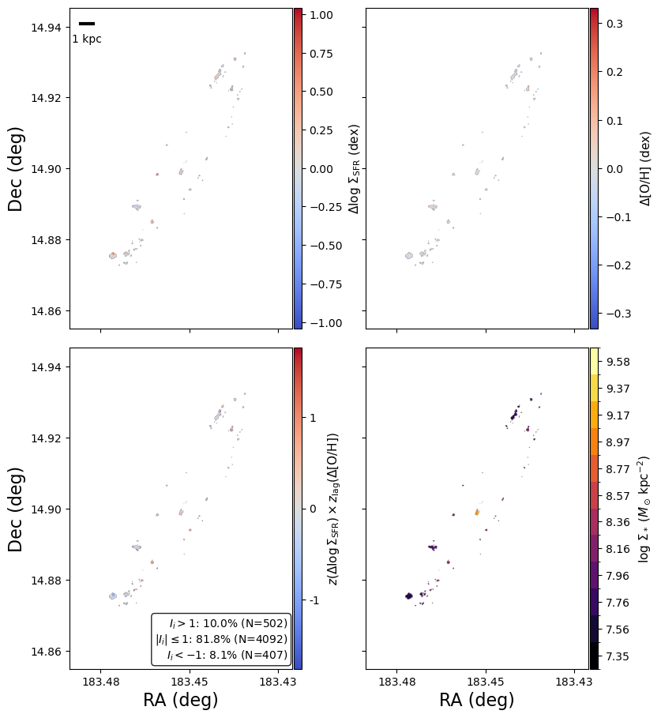

#### 2.3.3 NGC4330

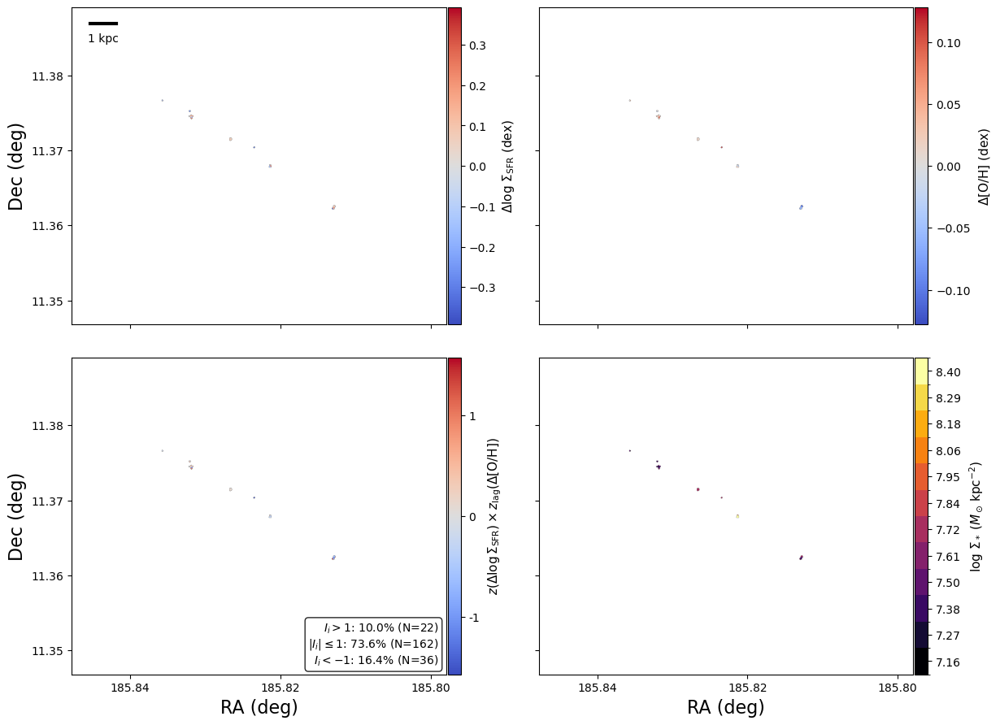

#### 2.3.4 NGC4396

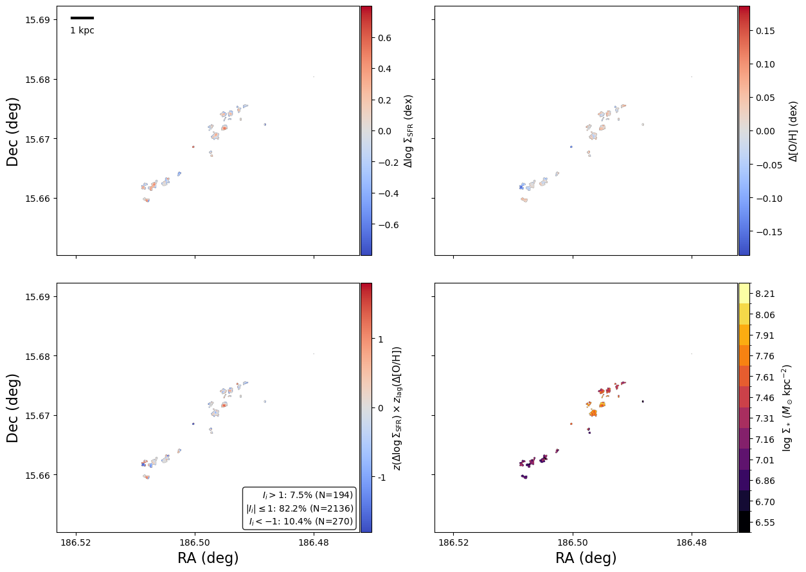

#### 2.3.5 NGC4522

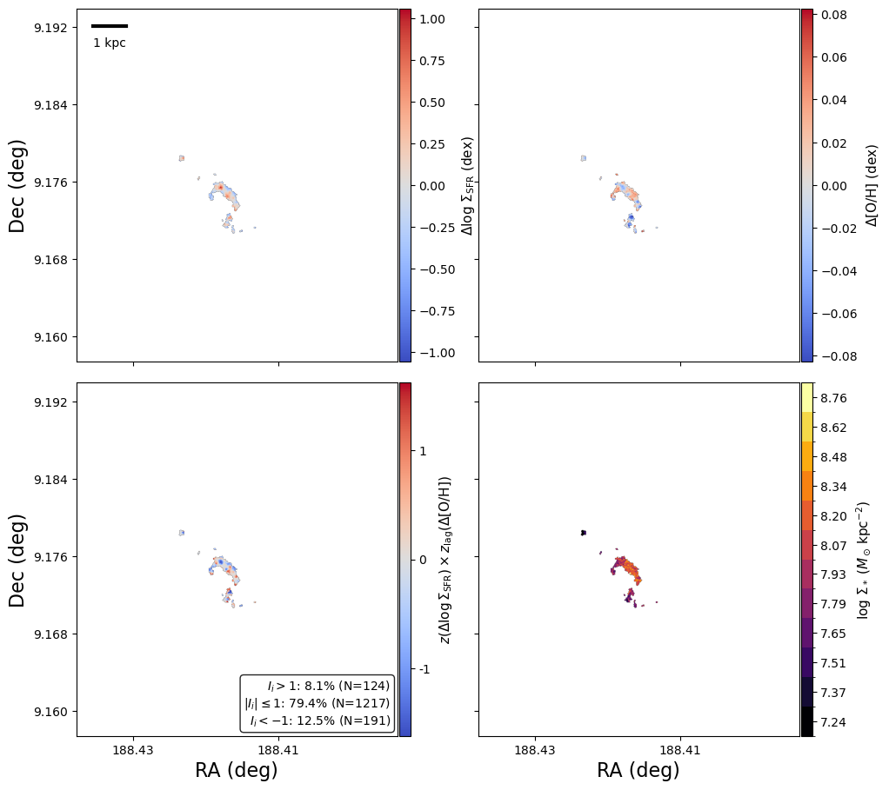

#### 2.3.6 NGC4694

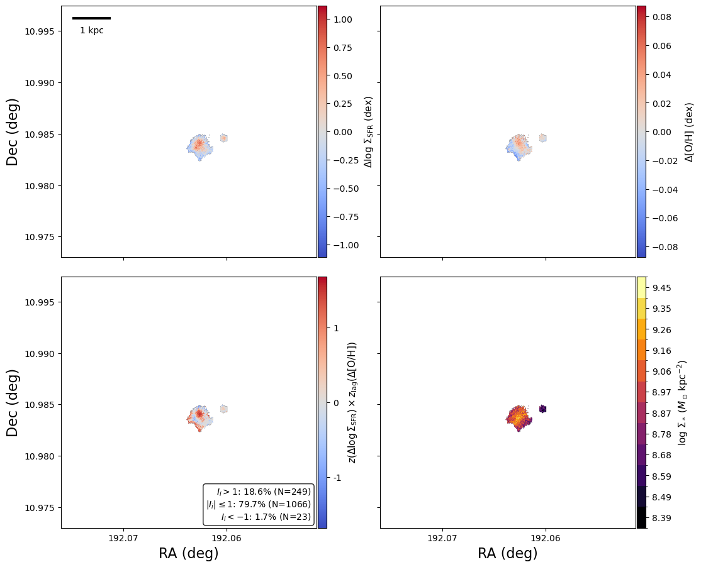

### 2.4 Spearman trends with strict EW(H$\alpha$) cut

Based on this new Spearman trend plot, we can still say that there is a flip sign with the inversion point at $\log_{10}(\Sigma_*/\mathrm{M_\odot kpc^{-2}})\sim7.5-8.0$. And NGC4192 is still the only one that show the flip sign across its disc. 

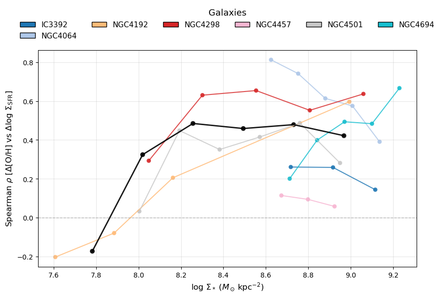

Finally, I also show the plot for other metallicity calibrations and `HII+Comp` selection

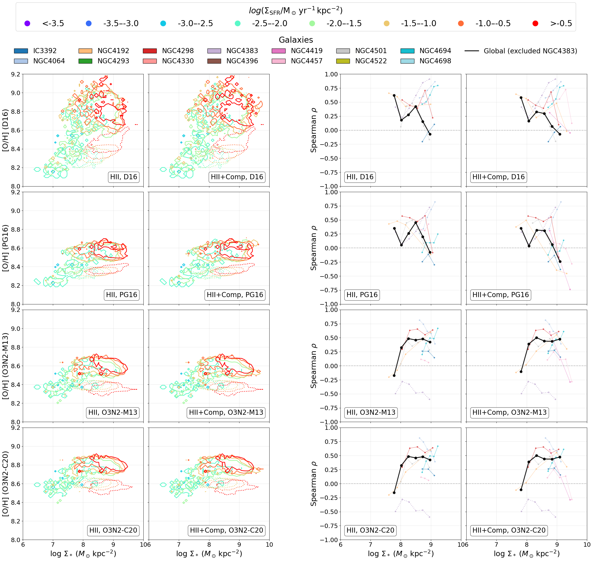
