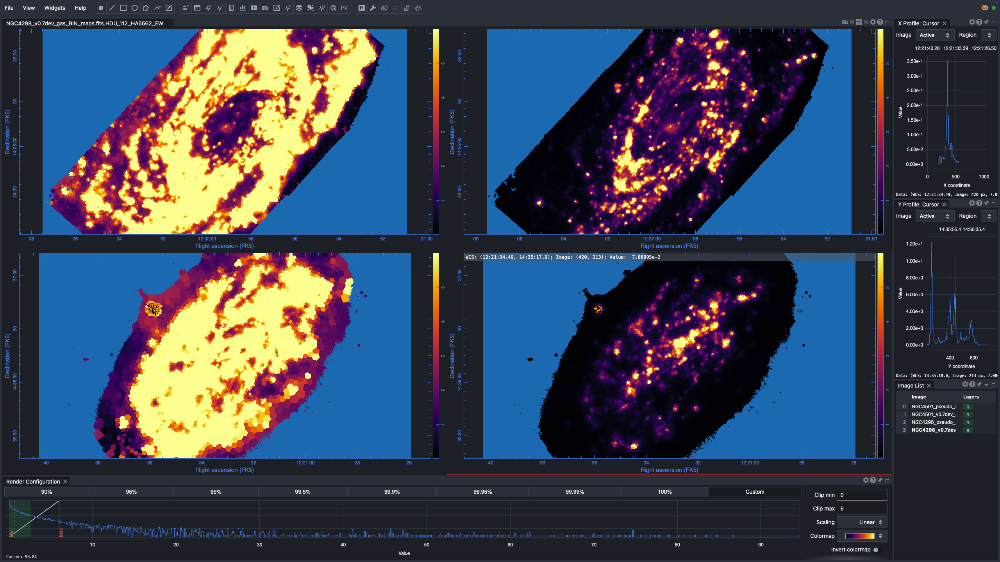
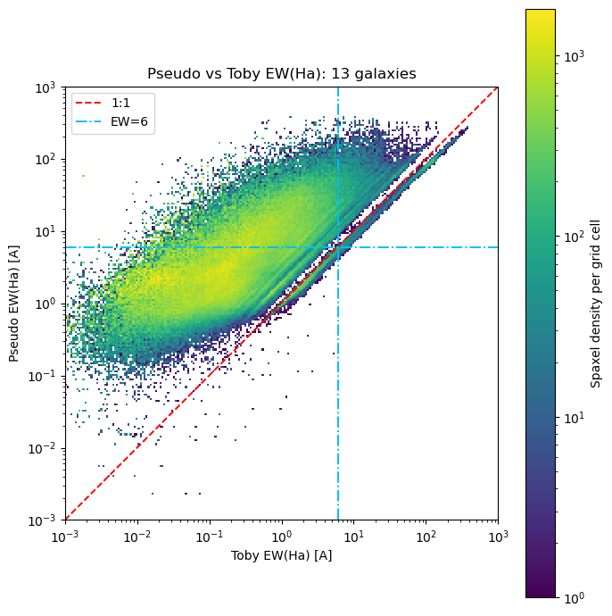
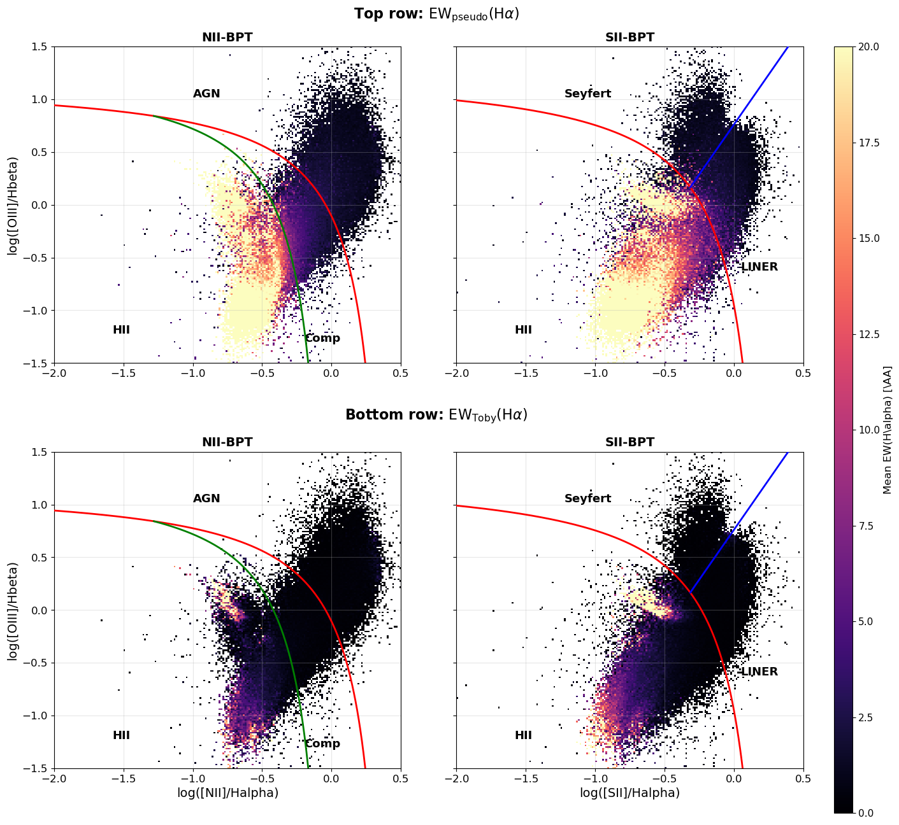
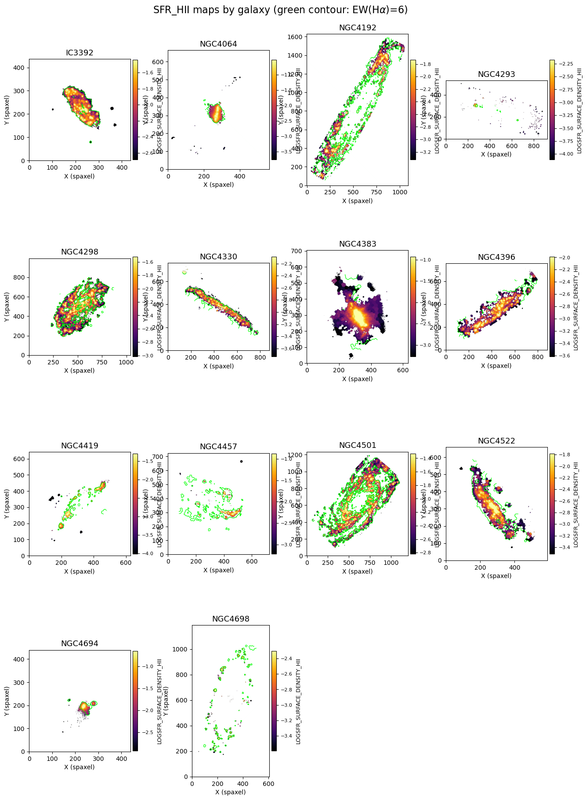
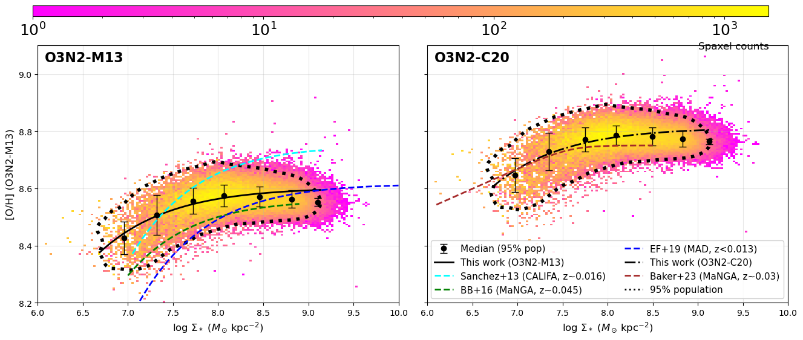
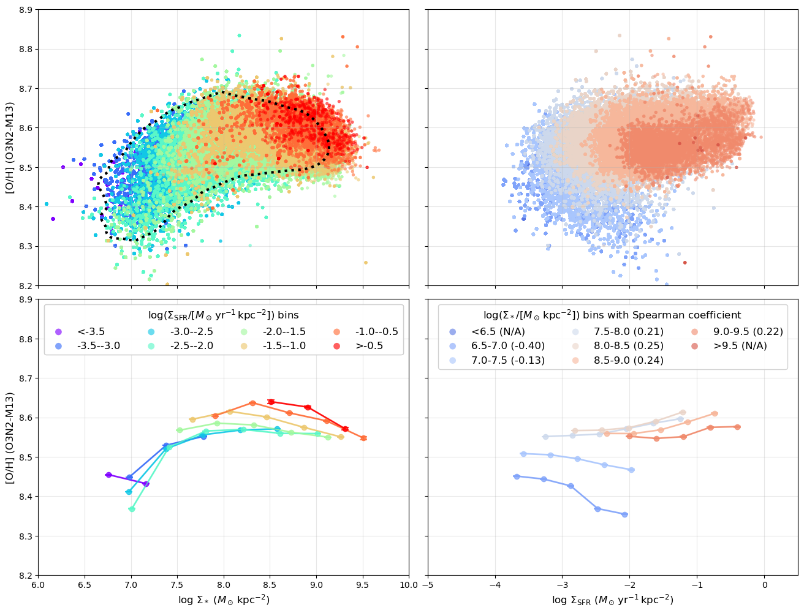
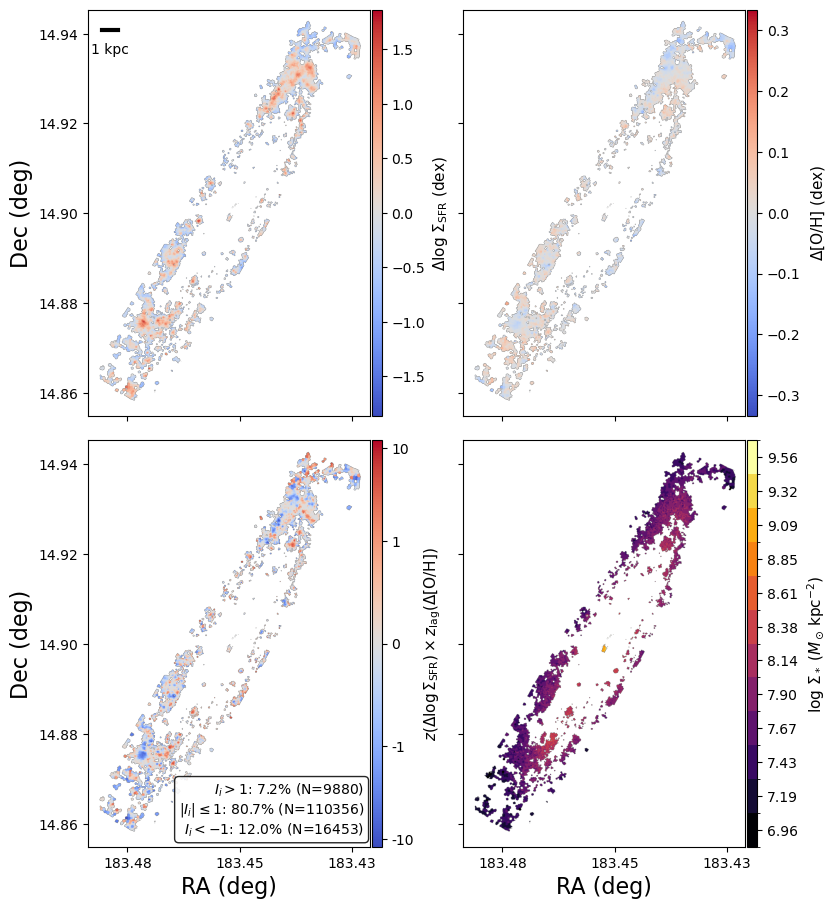
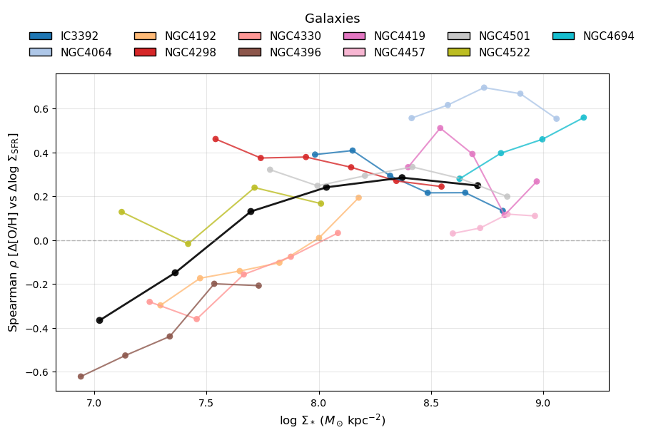
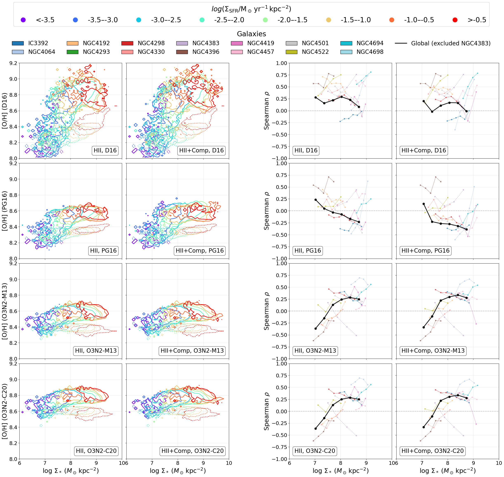

# 20260330 Pseudo EW(H$\alpha$)

## 1. Calculation of $\mathrm{EW}_{\rm pseudo}(\mathrm{H}\alpha)$

Here we compute a proxy EW(H$\alpha$) using the observed H$\alpha$ line flux and the broadband $R$-band flux. 

The pseudo equivalent width is defined as   
$$
\mathrm{EW}_{\rm pseudo}(\mathrm{H}\alpha) = F_{\mathrm{H}\alpha} / f_{\lambda}(6562.8\,\AA)
$$
where $F_{\mathrm{H}\alpha}$ is the observed H$\alpha$ flux in $[\mathrm{erg\ s^{-1}\ cm^{-2}}]$, and $f_{\lambda}(6562.8\,\AA)$ is the continuum flux density at H$\alpha$ in $[\mathrm{erg\ s^{-1}\ cm^{-2}\ \AA^{-1}}]$. 

The observed $R$-band magnitude is stored as `MAGNITUDE_R_UNCORRECTED` in `*_SPATIAL_BINNING_maps_extended.fits`, so we calculate the observed $R$-band flux in nanomaggy first
$$
R_{\rm nanomaggy} = 10^{(22.5 - m_{R,\mathrm{obs}}) / 2.5}
$$
$R$-band flux is then converted to flux density per unit frequency (or Jansky) as
$$
f_{\nu} = R_{\rm nanomaggy} \times 3.631\times10^{-29}[\mathrm{erg\ s^{-1}\ cm^{-2}\ Hz^{-1}}]
$$
This is then converted to flux density per unit wavelength at $6562.8\,\AA$ through
$$
f_{\lambda} = f_{\nu}\, c / \lambda^2[\mathrm{erg\ s^{-1}\ cm^{-2}\ \AA^{-1}}]
$$
The resulting $\mathrm{EW}_{\rm proxy}(\mathrm{H}\alpha)$ is therefore expressed in $\AA$. Again, this quantity is a broadband-based proxy rather than a direct spectroscopic EW measurement.

## 2.Comaprison with Toby's EW(H$\alpha$)

First glance in Carta confirms our idea that Toby's values may be underestimated. Here all the colorbars are set to [0, 6] and the left column is $\mathrm{EW}_{\rm pseudo}(\mathrm{H}\alpha)$ of NGC4501 and NGC4298; while the right column is $\mathrm{EW}_{\rm Toby}(\mathrm{H}\alpha)$. Obviously, Toby's values show much less saturation (SF spaxels). 

And the one-to-one plot confirms this

Also a comparison on BPT diagrams colocoded by EW(H$\alpha$)

Clearly, $\mathrm{EW}_{\rm pseudo}(\mathrm{H}\alpha)\geq6\AA$ cut mostly trace our previous `HII` selection 

## 3. Plots in paper with new $\mathrm{EW}_{\rm pseudo}(\mathrm{H}\alpha)$

Mostly they remain unchanged visually. 

