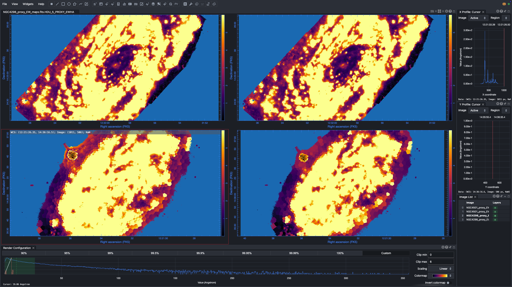
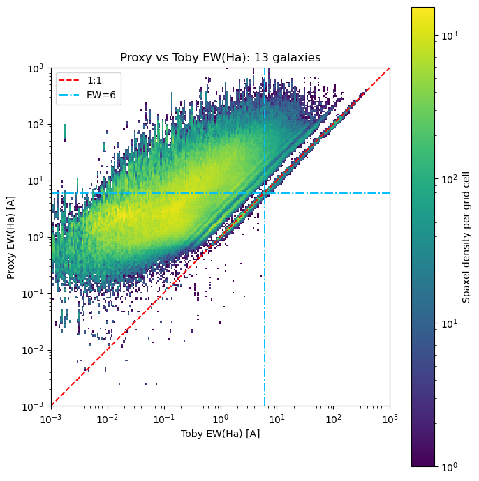
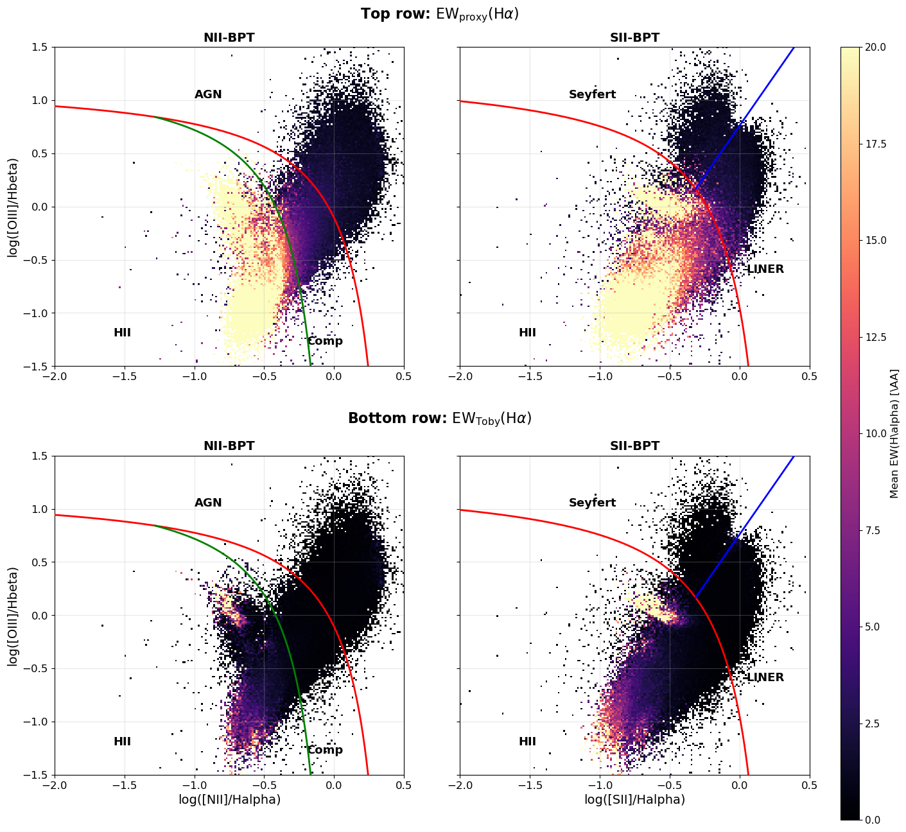
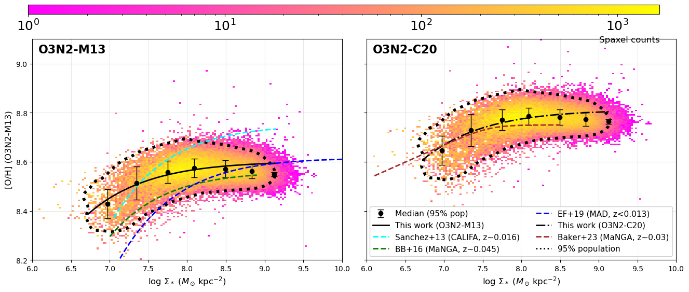
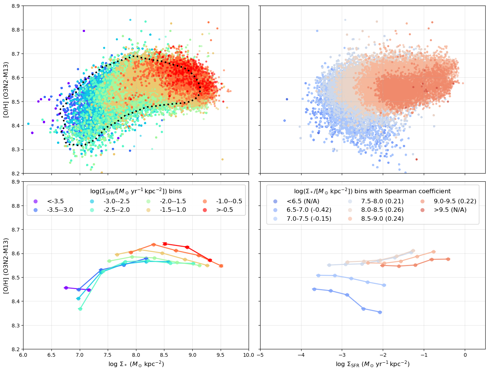
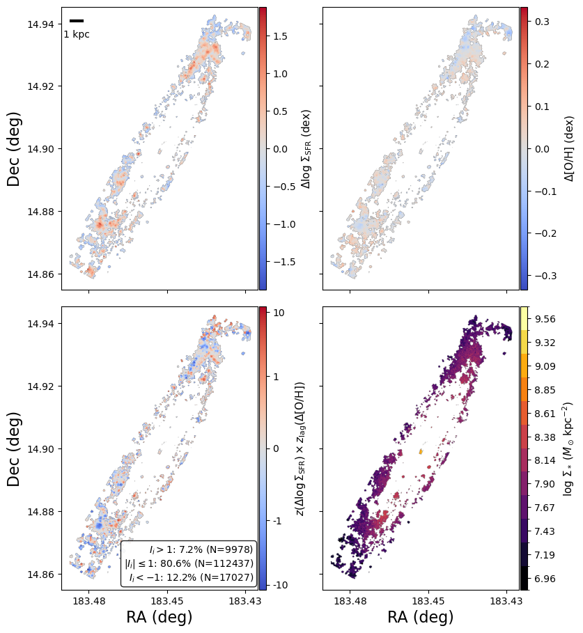
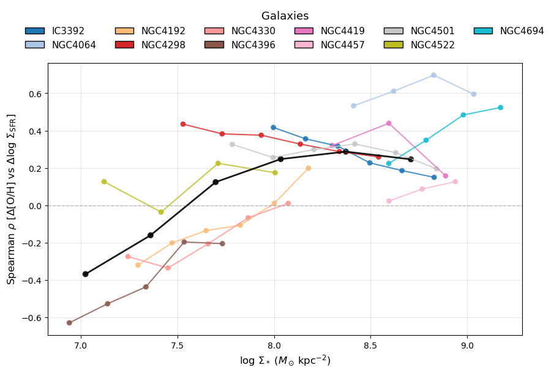
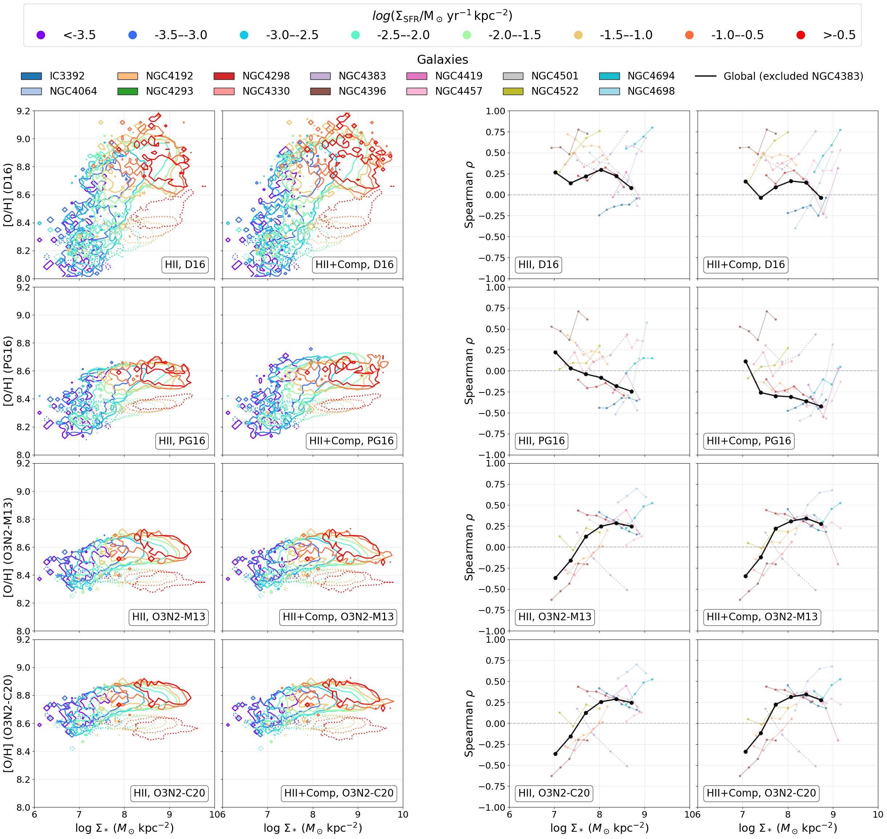

# 20260331 Proxy EW(H$\alpha$)

## 1. Calculation of $\mathrm{EW}_{\rm proxy}(\mathrm{H}\alpha)$

Here we now compute $\mathrm{EW}_{\rm proxy}(\mathrm{H}\alpha)$ from the observed H$\alpha$ line flux and the continuum-only cube `*_CONTcube.fits`, instead of using only the broadband $R$-band flux.

The observed H$\alpha$ flux map is taken from the `HA6562_FLUX` extension in either `*_gas_BIN_maps_extended.fits` or `*_gas_BIN_maps.fits`. 

For the continuum window, we follow the [MaNGA DAP](https://sdss-mangadap.readthedocs.io/en/latest/emissionlines.html#id38) H$\alpha$ EW passband in vacuum,
$$
\lambda_{\rm vac,low} = 6557.6\,\AA,\qquad
\lambda_{\rm vac,high} = 6571.6\,\AA,
$$
with the H$\alpha$ Ritz wavelength
$$
\lambda_{\rm vac,ref} = 6564.608\,\AA.
$$
Because the local continuum cube wavelength axis is in standard air wavelength, these values are converted from vacuum to air using the NIST ASD / Peck & Reeder (1972) refractive-index formula,
$$
\lambda_{\rm air} = \lambda_{\rm vac}/n,
$$
with
$$
(n-1)\times 10^8 = 8060.51
+ \frac{2480990}{132.274-\sigma^2}
+ \frac{17455.7}{39.32957-\sigma^2},
$$
where $\sigma$ is the vacuum wavenumber in inverse microns. 

The Ritz wavelength $\lambda_\mathrm{vac}$ in vacuum is equal to the inverse of $\sigma$. If $\sigma$ is in units of $\mathrm{cm}^{−1}$, and *λ* is in nanometers, then
$$
\lambda_\mathrm{vac}\ \mathrm{[nm]} = \frac{10^7}{(\sigma\ [\mathrm{cm}^{−1}])}.
$$
This gives the rest-frame air H$\alpha$ reference wavelength and EW window used by the code.

The continuum cube is then shifted from observed frame to rest frame using the galaxy redshift $z$ from `new_redshifts`:
$$
\lambda_{\rm rest} = \frac{\lambda_{\rm obs}}{1+z}.
$$
At the same time, the observed continuum flux density is converted to rest-frame flux density per unit wavelength as
$$
f_{\lambda,{\rm rest}} = (1+z)\,f_{\lambda,{\rm obs}}.
$$

The mean continuum flux density in the H$\alpha$ EW window is measured from all continuum-cube planes whose rest-frame wavelengths fall inside the selected air passband:
$$
\bar{f}_{\lambda,{\rm cont}}
= \frac{1}{\Delta\lambda}
\int_{\lambda_1}^{\lambda_2} f_{\lambda,{\rm rest}}(\lambda)\,d\lambda.
$$
In practice, this is evaluated as the sampled mean of the finite continuum-cube values inside the rest-frame H$\alpha$ window.

The new proxy equivalent width is therefore
$$
\mathrm{EW}_{\rm proxy}(\mathrm{H}\alpha)
= \frac{F_{\mathrm{H}\alpha}}{\bar{f}_{\lambda,{\rm cont}}},
$$
For comparison, the old broadband-based pseudo EW is still preserved in a separate HDU. In that legacy approach, the observed $R$-band magnitude `MAGNITUDE_R_UNCORRECTED` from `*_SPATIAL_BINNING_maps_extended.fits` is first converted to nanomaggies,
$$
R_{\rm nanomaggy} = 10^{(22.5 - m_{R,\mathrm{obs}}) / 2.5},
$$
then to flux density per unit frequency,
$$
f_{\nu} = R_{\rm nanomaggy} \times 3.631\times10^{-29}
\quad [\mathrm{erg\ s}^{-1}\ \mathrm{cm}^{-2}\ \mathrm{Hz}^{-1}],
$$
and then to a single-wavelength continuum estimate at $6562.8\,\AA$,
$$
f_{\lambda,\ {\rm legacy}} = f_{\nu}\,c/\lambda^2.
$$
The old pseudo EW is therefore
$$
\mathrm{EW}_{\rm pseudo}(\mathrm{H}\alpha)
= \frac{F_{\mathrm{H}\alpha}}{f_{\lambda,{\rm legacy}}}.
$$

Note that $\mathrm{EW}_{\rm proxy}(\mathrm{H}\alpha)$ is now based on the continuum-only spectrum measured directly across the H$\alpha$ EW window in the rest frame, whereas $\mathrm{EW}_{\rm pseudo}(\mathrm{H}\alpha)$ is the older single-band approximation from the broadband $R$ flux.

## 2.Comaprison with $\mathrm{EW}_{\rm pseudo}(\mathrm{H}\alpha)$

So the visual check looks fine. Both $\mathrm{EW}_{\rm proxy}(\mathrm{H}\alpha)$ and $\mathrm{EW}_{\rm pseudo}(\mathrm{H}\alpha)$ are very identical. 

## 3. Comaprison with Toby's EW(H$\alpha$)

## 4. Plots in paper with new $\mathrm{EW}_{\rm proxy}(\mathrm{H}\alpha)$

