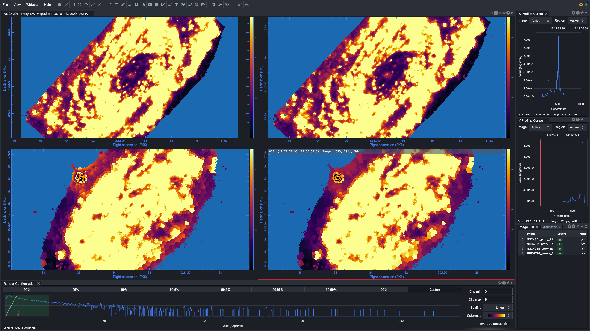
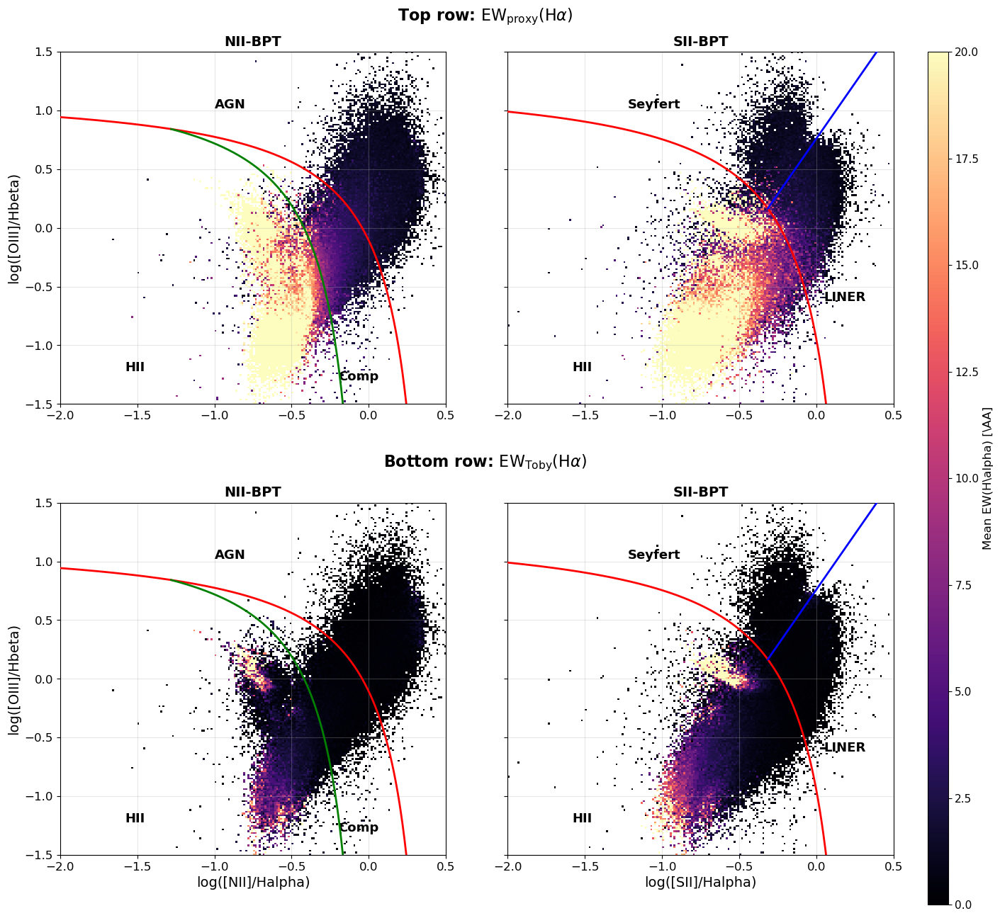
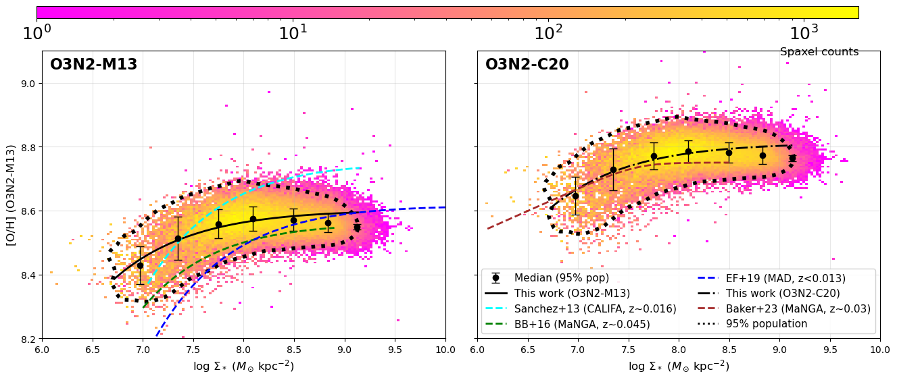
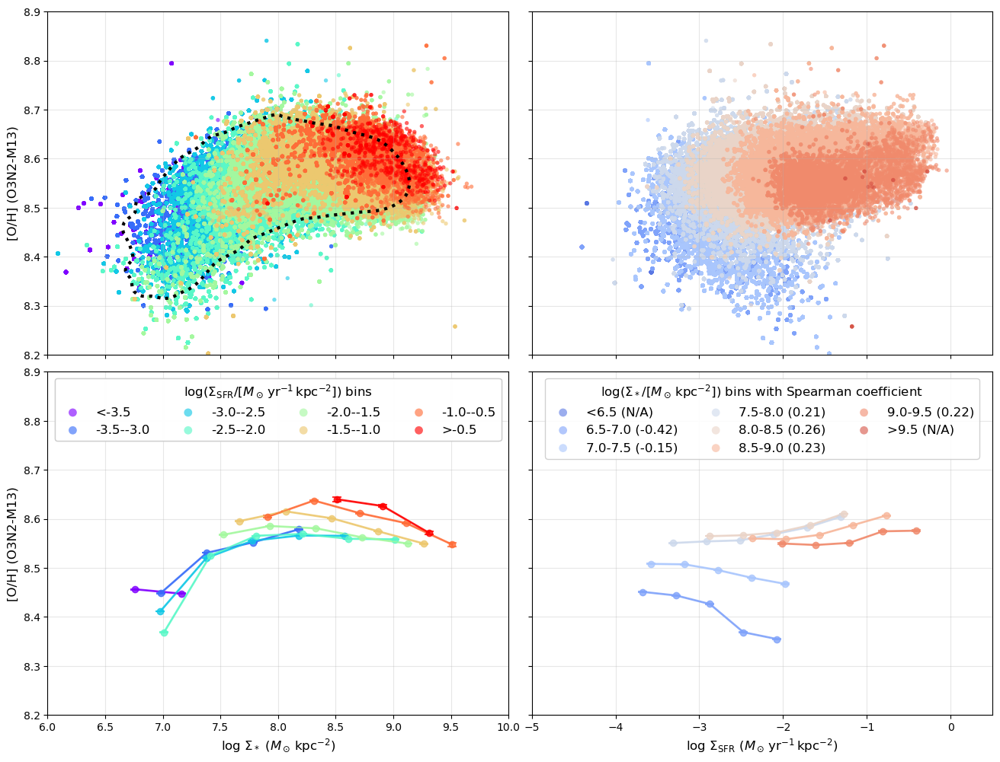
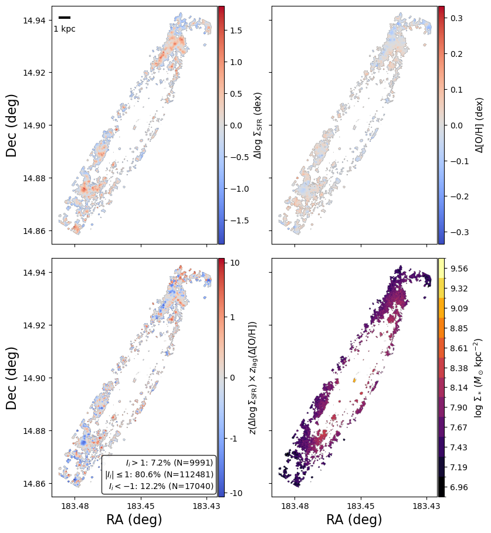
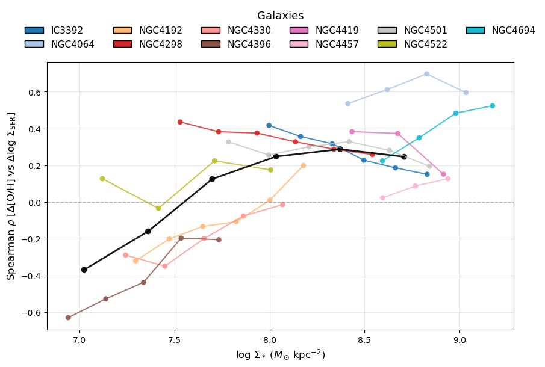
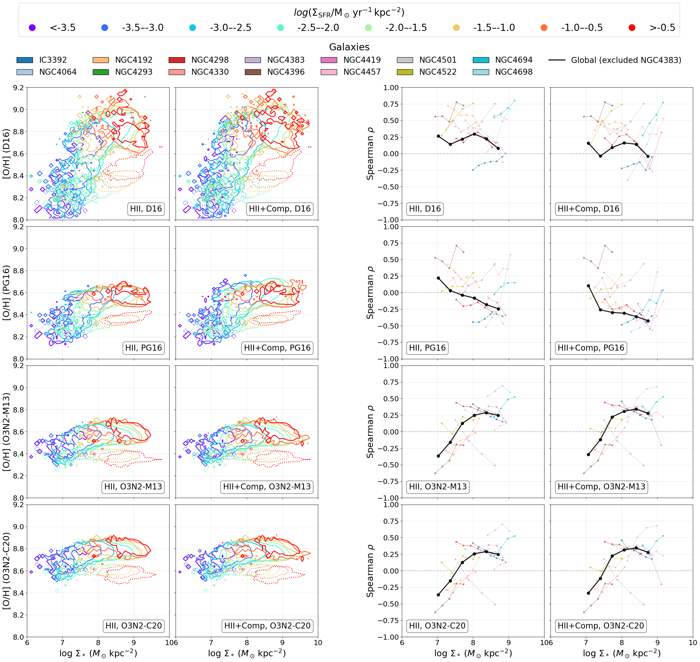

# 20260401 Updated Proxy EW(H$\alpha$)

## 1. Updated calculation of $\mathrm{EW}_{\rm proxy}(\mathrm{H}\alpha)$

Here we now compute $\mathrm{EW}_{\rm proxy}(\mathrm{H}\alpha)$ from the observed H$\alpha$ line flux and the continuum-only cube `*_CONTcube.fits`, instead of using only the broadband $R$-band flux.

The observed H$\alpha$ flux map is taken from the `HA6562_FLUX` extension in either `*_gas_BIN_maps_extended.fits` or `*_gas_BIN_maps.fits`. The line-of-sight H$\alpha$ velocity map is taken from the corresponding `HA6562_VEL` extension in the same gas file.

For the continuum window, we follow the [MaNGA DAP](https://sdss-mangadap.readthedocs.io/en/latest/emissionlines.html#id38) H$\alpha$ EW passband in vacuum,
$$
\lambda_{\rm vac,low} = 6557.6\,\AA,\qquad
\lambda_{\rm vac,high} = 6571.6\,\AA,
$$
with the H$\alpha$ Ritz wavelength
$$
\lambda_{\rm vac,ref} = 6564.608\,\AA.
$$
Because the local continuum cube wavelength axis is in standard air wavelength, these values are converted from vacuum to air using the NIST ASD / Peck & Reeder (1972) refractive-index formula,
$$
\lambda_{\rm air} = \lambda_{\rm vac}/n,
$$
with
$$
(n-1)\times 10^8 = 8060.51
+ \frac{2480990}{132.274-\sigma^2}
+ \frac{17455.7}{39.32957-\sigma^2},
$$
where $\sigma$ is the vacuum wavenumber in inverse microns. The Ritz wavelength in vacuum is related to wavenumber through
$$
\lambda_{\rm vac}\,[\mathrm{nm}] = \frac{10^7}{\sigma\,[\mathrm{cm}^{-1}]},
$$
which gives the rest-frame air H$\alpha$ reference wavelength and EW window used by the code.

Therefore, we have

```python
Halpha window (vacuum, rest) : 6557.600 - 6571.600 A
Halpha window (air, rest)    : 6555.789 - 6569.785 A
Halpha lambda (air, rest)    : 6562.795 A
Halpha Delta lambda (air)    : 13.996 A
```

The **key update** in the current implementation is that the continuum window is no longer shifted using only a single galaxy redshift. Instead, the galaxy redshift $z_{\rm gal}$ from `new_redshifts` is first converted to a systemic relativistic velocity,
$$
\beta_{\rm gal} = \frac{(1+z_{\rm gal})^2 - 1}{(1+z_{\rm gal})^2 + 1},
\qquad
v_{\rm gal} = c\,\beta_{\rm gal}.
$$
Then, for each spaxel $(x,y)$, the observed H$\alpha$ velocity is added on top of the systemic velocity,
$$
v_{\rm spaxel}(x,y) = v_{\rm gal} + v_{\mathrm{H}\alpha}(x,y).
$$
This total velocity is converted back to a relativistic spaxel redshift,
$$
\beta_{\rm spaxel}(x,y) = \frac{v_{\rm spaxel}(x,y)}{c},
\qquad
z_{\rm spaxel}(x,y) = \sqrt{\frac{1+\beta_{\rm spaxel}(x,y)}{1-\beta_{\rm spaxel}(x,y)}} - 1.
$$

Using this spaxel-dependent redshift, the H$\alpha$ EW window is re-adjusted separately for every spaxel in the observed frame:
$$
\lambda_{\rm obs,1}(x,y) = \lambda_{\rm rest,1}\,[1+z_{\rm spaxel}(x,y)],
$$
$$
\lambda_{\rm obs,2}(x,y) = \lambda_{\rm rest,2}\,[1+z_{\rm spaxel}(x,y)].
$$
At the same time, the observed continuum flux density is converted to rest-frame flux density per unit wavelength as
$$
f_{\lambda,{\rm rest}}(x,y) = [1+z_{\rm spaxel}(x,y)]\,f_{\lambda,{\rm obs}}(x,y).
$$

The mean continuum flux density in the H$\alpha$ EW window is therefore measured separately for each spaxel from all continuum-cube planes whose observed wavelengths fall inside that spaxel's shifted H$\alpha$ bandpass:
$$
\bar{f}_{\lambda,{\rm cont}}(x,y)
= \frac{1}{\Delta\lambda}
\int_{\lambda_1}^{\lambda_2} f_{\lambda,{\rm rest}}(x,y;\lambda)\,d\lambda.
$$
In practice, this is evaluated as the sampled mean of the finite continuum-cube values inside the spaxel-dependent H$\alpha$ window.

The new proxy equivalent width is therefore
$$
\mathrm{EW}_{\rm proxy}(\mathrm{H}\alpha)(x,y)
= \frac{F_{\mathrm{H}\alpha}(x,y)}{\bar{f}_{\lambda,{\rm cont}}(x,y)}.
$$

For comparison, the old broadband-based pseudo EW is still preserved in a separate HDU. In that legacy approach, the observed $R$-band magnitude `MAGNITUDE_R_UNCORRECTED` from `*_SPATIAL_BINNING_maps_extended.fits` is first converted to nanomaggies,
$$
R_{\rm nanomaggy} = 10^{(22.5 - m_{R,\mathrm{obs}}) / 2.5},
$$
then to flux density per unit frequency,
$$
f_{\nu} = R_{\rm nanomaggy} \times 3.631\times10^{-29}
\quad [\mathrm{erg\ s}^{-1}\ \mathrm{cm}^{-2}\ \mathrm{Hz}^{-1}],
$$
and then to a single-wavelength continuum estimate at $6562.8\,\AA$,
$$
f_{\lambda,{\rm legacy}} = f_{\nu}\,c/\lambda^2.
$$
The old pseudo EW is therefore
$$
\mathrm{EW}_{\rm pseudo}(\mathrm{H}\alpha)
= \frac{F_{\mathrm{H}\alpha}}{f_{\lambda,{\rm legacy}}}.
$$

Note that $\mathrm{EW}_{\rm proxy}(\mathrm{H}\alpha)$ is now based on the continuum-only spectrum measured directly across the H$\alpha$ EW window, with the observed window re-centered separately for each spaxel using `HA6562_VEL`, whereas $\mathrm{EW}_{\rm pseudo}(\mathrm{H}\alpha)$ is the older single-band approximation from the broadband $R$ flux.


## 2.Comaprison with $\mathrm{EW}_{\rm pseudo}(\mathrm{H}\alpha)$

So the visual check looks fine. Both $\mathrm{EW}_{\rm proxy}(\mathrm{H}\alpha)$ and $\mathrm{EW}_{\rm pseudo}(\mathrm{H}\alpha)$ are very identical. 



## 3. Comaprison with Toby's EW(H$\alpha$)




## 4. Plots in paper with new $\mathrm{EW}_{\rm proxy}(\mathrm{H}\alpha)$









