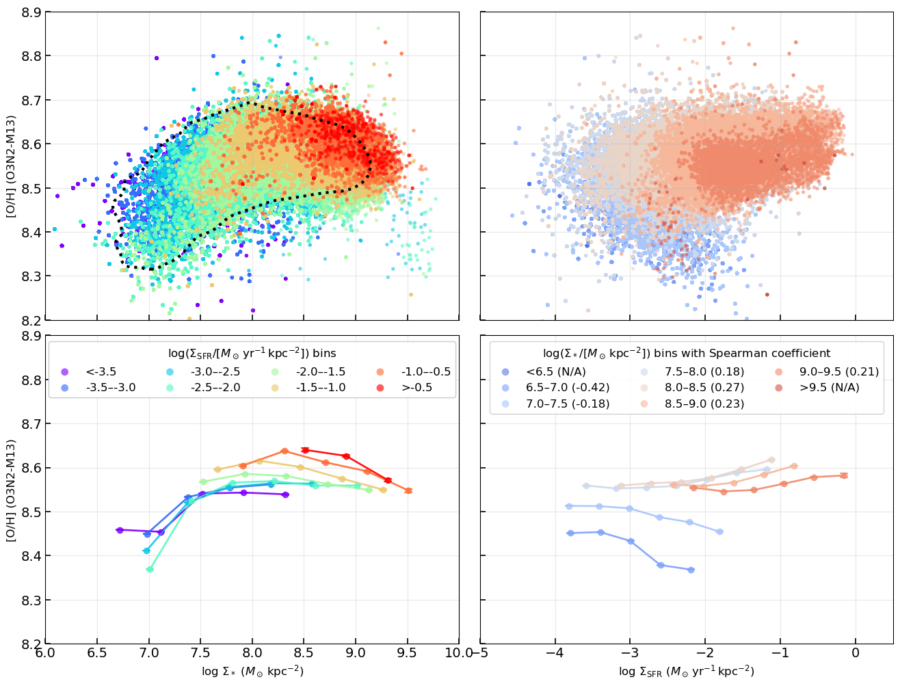
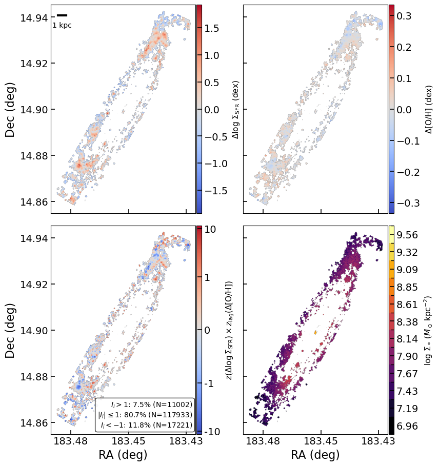
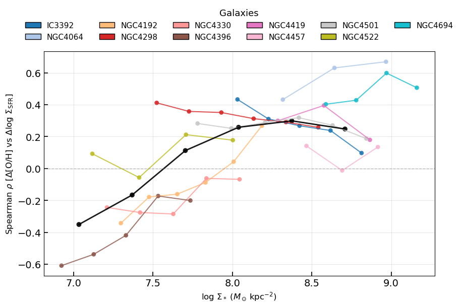
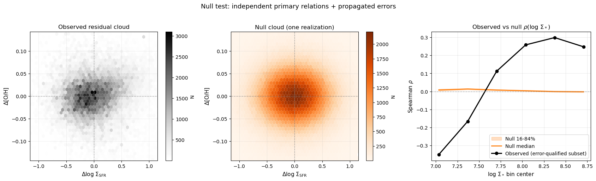
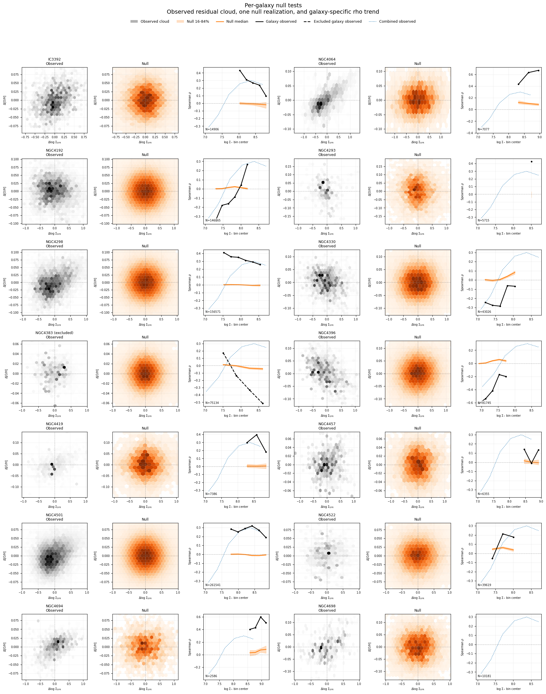
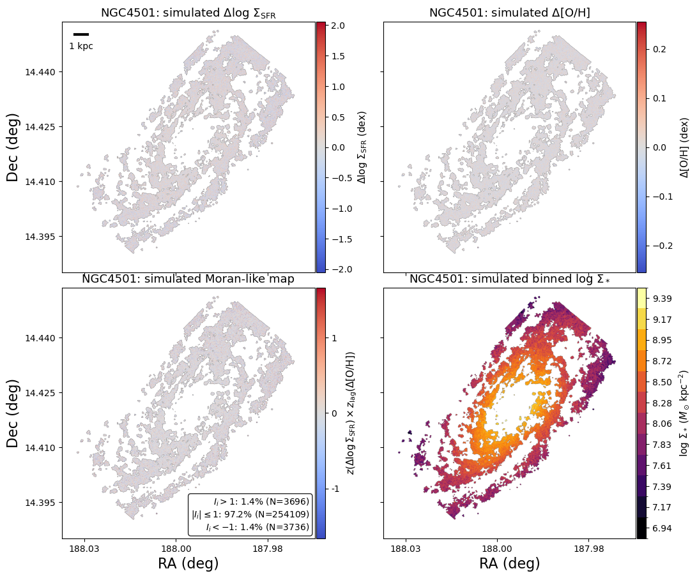
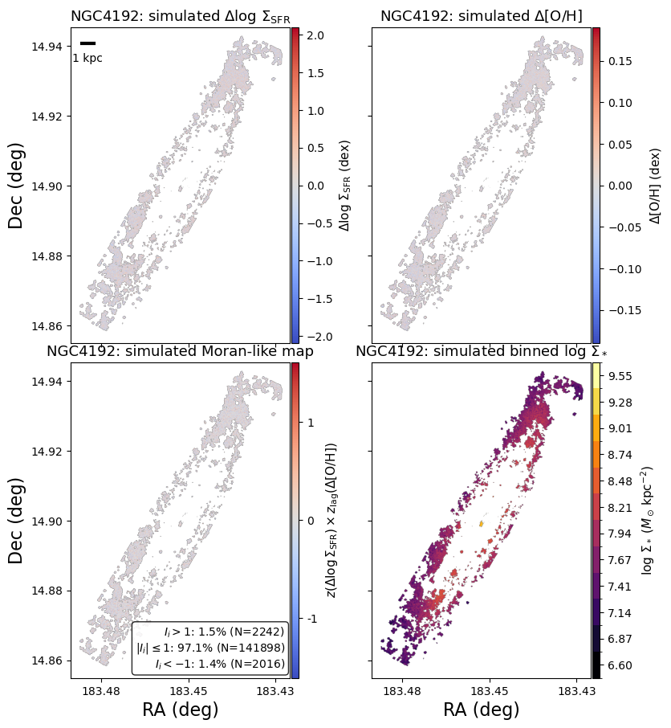
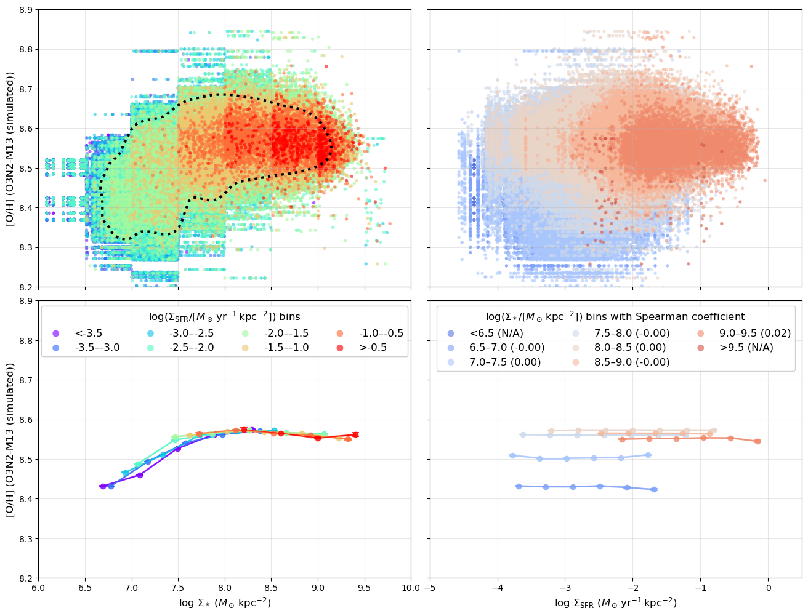
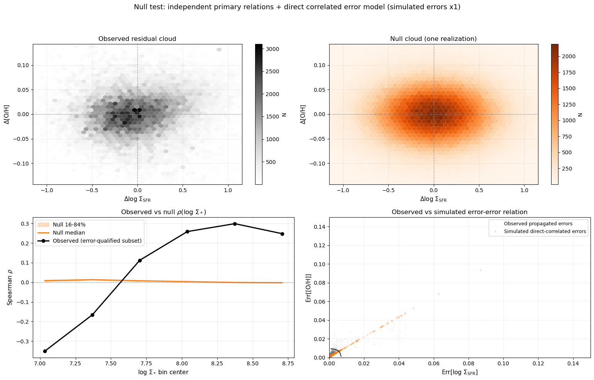

# 20260410 Secondary Relation Is Real

## 0. Original plots in my paper

## 1. Why the referee is concerned, and what they are asking us to test

The referee’s concern is about our claimed secondary relation (Figure 3), namely the correlation between the residuals $\Delta \log_{10} \Sigma_{\rm SFR}$ and $\Delta {\rm [O/H]}$ after removing the primary dependence of both quantities on $\Sigma_*$. 

In other words, the referee is asking whether our observed mass-dependent trend in $\rho\!\left(\Delta \log_{10} \Sigma_{\rm SFR}, \Delta {\rm [O/H]}\right)$ could appear even if there is no true physical coupling between star formation and metallicity at fixed stellar mass density, and the data are instead generated only by two independent primary relations:
1. the rSFMS, $\log_{10} \Sigma_{\rm SFR}$ versus $\log_{10} \Sigma_*$, and
2. the rMZR, ${\rm [O/H]}$ versus $\log_{10} \Sigma_*$. 

The key issue is that once one subtracts the primary trends to define residuals, the residual quantities can inherit combinations of measurement errors and fitted trends. Therefore, even if the underlying physical model contains only independent primary relations, apparent residual correlations may still be induced by noise, heteroscedastic uncertainties. The referee therefore requests a null simulation in which only the primary relations are present, followed by the exact same residual analysis as for the real data, to test whether the observed secondary relation can be reproduced artificially. 

Our previous simple Gaussian simulation already addressed the most basic version of this concern: within each stellar-mass bin, $\log_{10} \Sigma_{\rm SFR}$ and ${\rm [O/H]}$ were drawn independently from Gaussian distributions matched to the observed mean and scatter, and the resulting mock Spearman coefficients remained close to zero across all mass bins, failing to reproduce the observed mass-dependent inversion. This showed that the sign flip is not a consequence of conditioning on $\Sigma_*$. 

However, that first null test did not explicitly propagate the observed per-spaxel uncertainties through the same residual-analysis pipeline used for the real data. We therefore constructed a strengthened, Sanchez+2021 Sec.~3.4-style null test that more directly addresses the referee’s concern by including propagated observational errors and re-running the full residual pipeline as we did in paper. 

## 2. Strengthened Sec. 3.4-style null test

### 2.1 Construction of the observed sample with propagated uncertainties

We first build the observed HII-region sample using the same fiducial selection as in the main analysis, excluding NGC4383 and keeping only spaxels with finite values of $\log_{10} \Sigma_*$, $\log_{10} \Sigma_{\rm SFR}$, and ${\rm [O/H]}$. For each retained spaxel, we also compute propagated observational uncertainties for both $\log_{10} \Sigma_{\rm SFR}$ and ${\rm [O/H]}$. 

### 2.2 Null hypothesis and primary-bin model

The null hypothesis of this strengthened test is
\[
P\!\left({\rm [O/H]}, \log_{10} \Sigma_{\rm SFR} \mid \log_{10} \Sigma_*\right)
=
P\!\left({\rm [O/H]} \mid \log_{10} \Sigma_*\right)
\,
P\!\left(\log_{10} \Sigma_{\rm SFR} \mid \log_{10} \Sigma_*\right),
\]
that is, metallicity and star formation are independent once the local stellar mass surface density is fixed.

To implement this, we divide the sample into the same set of global stellar-mass bins used in the observed residual analysis. Within each bin, we measure:
- the mean $\log_{10} \Sigma_{\rm SFR}$,
- the mean ${\rm [O/H]}$,
- the observed scatter in $\log_{10} \Sigma_{\rm SFR}$,
- the observed scatter in ${\rm [O/H]}$,
- and the RMS propagated observational uncertainty in each quantity. 

We then estimate an intrinsic scatter for each quantity in each stellar-mass bin by subtracting the RMS measurement uncertainty in quadrature from the total observed scatter:
\[
\sigma_{\rm int}^2
=
\sigma_{\rm obs}^2 - \sigma_{\rm err,rms}^2.
\]
### 2.3 Insert the observed errors into the simulation data

For each observed spaxel, we keep its stellar-mass bin assignment. Then, using the mean relation and intrinsic scatter of that bin, we generate latent true values:
\[
\log_{10} \Sigma_{\rm SFR,true}
=
\mu_{\rm SFR}(\Sigma_*)
+
\mathcal{N}(0,\sigma_{\rm int,SFR}),
\]
\[
{\rm [O/H]}_{\rm true}
=
\mu_{\rm [O/H]}(\Sigma_*)
+
\mathcal{N}(0,\sigma_{\rm int,[O/H]}).
\]
The two draws are made independently at fixed $\Sigma_*$, so the latent mock sample contains no intrinsic secondary coupling between star formation and metallicity. 

After generating the latent true values, the code adds observational noise back on a spaxel-by-spaxel basis:
\[
\log_{10} \Sigma_{\rm SFR,mock}
=
\log_{10} \Sigma_{\rm SFR,true}
+
\mathcal{N}(0,\sigma_{\log_{10} \Sigma_{\rm SFR}}),
\]
\[
{\rm [O/H]}_{\rm mock}
=
{\rm [O/H]}_{\rm true}
+
\mathcal{N}(0,\sigma_{\rm [O/H]}).
\]
Here, $\sigma_{\log_{10} \Sigma_{\rm SFR}}$ and $\sigma_{\rm [O/H]}$ are the propagated uncertainties measured from the real data for that exact spaxel. 

In addition, we perturb the stellar-mass axis itself using a simple mass-error proxy:
\[
\log_{10} \Sigma_{*,\rm mock}
=
\log_{10} \Sigma_{*,\rm true}
+
\mathcal{N}(0,\sigma_{\log_{10} \Sigma_*}),
\]
where $\sigma_{\log_{10} \Sigma_*} = 0.01$ as the observed errors of $\log_{10} \Sigma_*$ are less than 0.01 dex. 

### 2.4 Re-running the full residual-analysis pipeline

For each null realization, the mock dataset is processed through the same residual-analysis pipeline as the observed sample. Specifically:
1. the same stellar-mass bin edges are used;
2. within each mass bin, the mean $\log_{10} \Sigma_{\rm SFR}$ and mean ${\rm [O/H]}$ are subtracted to define $\Delta \log_{10} \Sigma_{\rm SFR}$ and $\Delta {\rm [O/H]}$;
3. the same 3$\sigma$ clipping procedure is applied to remove extreme outliers;
4. the same Spearman rank coefficient is computed in each mass bin. 

### 2.5 Ensemble of realizations and comparison to the data

We repeat this procedure for $N_{\rm real}=1000$ realizations to get the robust simulated trend. For each stellar-mass bin we then compute: the median null Spearman coefficient, the 16th percentile, and the 84th percentile.

## 3. Results and interpretation

### 3.1 Ensemble residual cloud and  $\rho(\log_{10} \Sigma_*)$ trend

First, the observed residual distribution in the $\Delta \log_{10} \Sigma_{\rm SFR}$-$\Delta {\rm [O/H]}$ plane is substantially broader and more structured than the null distribution. The observed cloud shows an extended and non-random morphology, whereas the null cloud is compact, approximately symmetric, and centered close to $(0,0)$. This is the expected behaviour if the null model contains only two independent primary relations, ${\rm [O/H]}(\Sigma_*)$ and $\Sigma_{\rm SFR}(\Sigma_*)$, with propagated observational errors but no intrinsic secondary coupling between metallicity and star formation at fixed $\Sigma_*$. In that case, subtracting the primary trends produces a largely roundish residual cloud, rather than the structured distribution seen in observed data.

Second, the observed mass-dependent Spearman trend is not reproduced by the null simulations. In the six global stellar-mass bins, the observed values are
\[
\rho = (-0.351,\,-0.166,\,+0.113,\,+0.259,\,+0.299,\,+0.248).
\]
By contrast, the null trend remains close to zero in all bins:
\[
\rho_{\rm null,med} = (+0.008,\,+0.014,\,+0.008,\,+0.004,\,-0.001,\,-0.002),
\]
with a very narrow 16th--84th percentile band. Thus, the null model does not recover either the amplitude or the sign pattern of the observed inversion.

This mismatch is particularly informative at the low-mass end. In the two lowest-$\Sigma_*$ bins, the observed correlations are significantly negative, while the null simulations produce small positive values. At intermediate and high $\Sigma_*$, the observed data turn to form a strong positive correlation, whereas the null model remains near zero or slightly negative. Therefore, the mass-dependent sign reversal is not reproduced by a model in which ${\rm [O/H]}$ and $\log_{10} \Sigma_{\rm SFR}$ are independent at fixed $\log_{10} \Sigma_*$ and are only broadened by the propagated observational uncertainties included here.

### 3.2 Per-galaxy behaviour

Third, the per-galaxy tests support the same conclusion. In nearly all galaxies, the null residual clouds remain compact and approximately symmetric, while the observed residual clouds frequently show visibly tilted or asymmetric structures. Likewise, the galaxy-by-galaxy null $\rho(\log_{10} \Sigma_*)$ curves remain close to zero with modest scatter, whereas several observed galaxies show strong departures from the null envelope, particularly in the same mass regime where the ensemble trend flips sign. This indicates that the ensemble inversion is not being driven solely by the propagation of formal uncertainties through the residual-analysis pipeline.

### 3.3 Simulated Moran-like maps

We also used one simulated realization to construct Moran-like maps for representative galaxies. In these null maps, the residual structures are overwhelmingly weak: for example, in both NGC~4192 and NGC~4501, more than $97\%$ of spaxels satisfy $|I_i|\leq 1$, and only $\sim 1.4-1.5\%$ lie in either strong positive or strong negative tails. This is qualitatively different from the observed maps ($\sim20\%$ of spaxels have $|I_i|> 1$), where coherent locally correlated and anti-correlated structures are present. The null model therefore does not naturally generate the level of spatially resolved residual behaviour seen in the data. 

### 3.4 Simulated rMZR and $Z_\mathrm{gas}$-$\Sigma_\mathrm{SFR}$ relation

### 3.5 Conclusion

These results show that the observed $\Delta \log_{10} \Sigma_{\rm SFR}$-$\Delta {\rm [O/H]}$ correlation is not reproduced by the null model containing only the primary $\Sigma_*$-dependent relations plus propagated observational errors. In particular, the simulations fail to recover:
1. the extended and structured observed residual cloud,
2. the strong negative correlations at low $\Sigma_*$,
3. the strong positive correlations at high $\Sigma_*$, and
4. the coherent local structures traced by the Moran-like statistic.

With this null model, the reported mass-dependent inversion in our paper therefore cannot be explained as a trivial artifact of subtracting the primary relations in the presence of the propagated uncertainties included here, and so the observed secondary relation is real.

## 4.0 Further test with "direct" corrected errors

In this additional stress test, we make the error-correlation assumption even more direct. We first measure the observed propagated errors in $\log_{10}\Sigma_{\rm SFR}$ and ${\rm [O/H]}$ for the real HII-region spaxels, then fit a straight line in the error-error plane, ${\rm Err}({\rm [O/H]}) = a + b\,{\rm Err}(\log_{10}\Sigma_{\rm SFR})$. The null mock data are still generated from the same independent primary relations at fixed $\Sigma_*$ as above, but the injected mock errors are forced to follow this fitted line: the mock ${\rm Err}(\log_{10}\Sigma_{\rm SFR})$ values keep the observed per-spaxel distribution, while the mock ${\rm Err}({\rm [O/H]})$ values are computed from the fitted relation. We then rerun the identical residual-analysis pipeline and $\rho(\log_{10}\Sigma_*)$ measurement.

We also repeat the test after multiplying these directly correlated mock errors by a factor of 10. This is an intentionally conservative stress test: it greatly exaggerates the amplitude of the same directly correlated uncertainty pattern before injecting the noise into the mock $\log_{10}\Sigma_{\rm SFR}$ and ${\rm [O/H]}$ values.

As shown in the two panels above, neither the direct correlated-error case nor the $\times 10$ boosted-error case reproduces the observed residual structure or the observed mass-dependent sign reversal in $\rho$. Therefore, this more conservative treatment of correlated measurement errors does not change the conclusion: the observed secondary relation is not an artifact of the propagated uncertainties.
