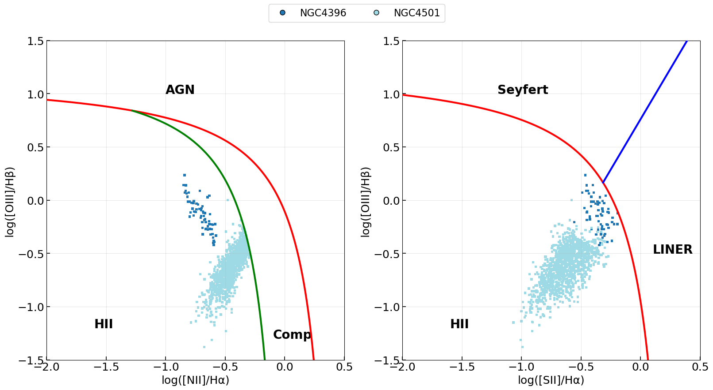
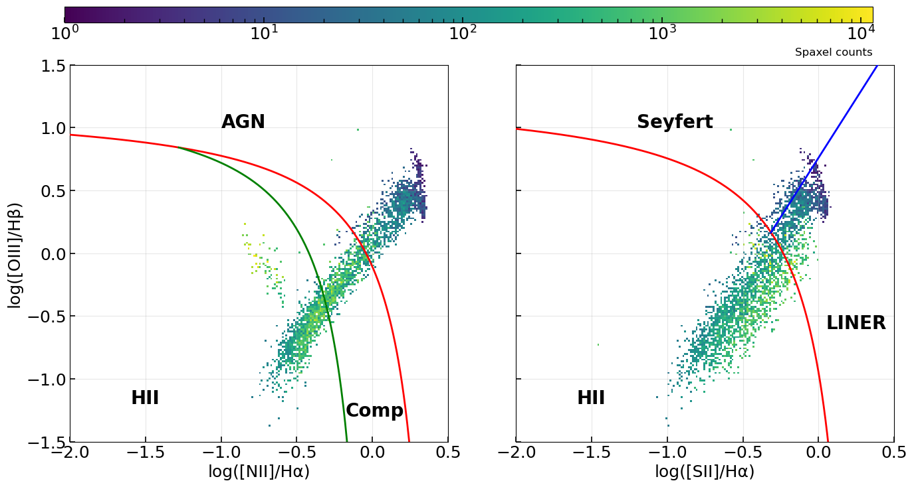
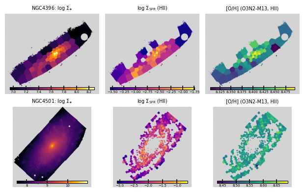
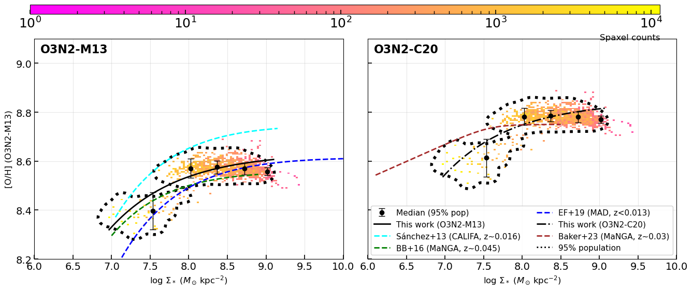
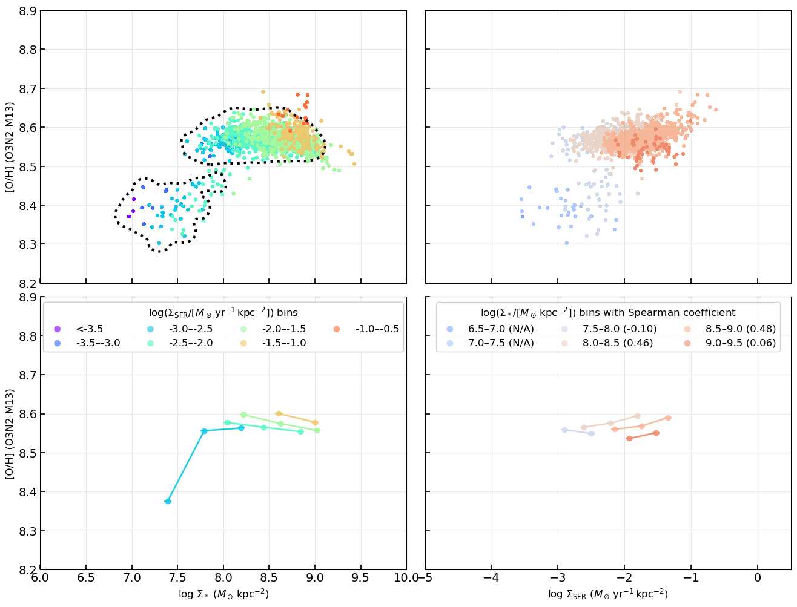
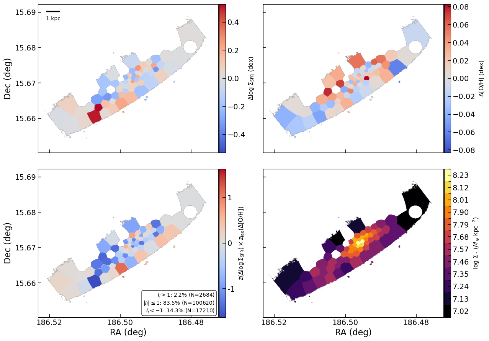
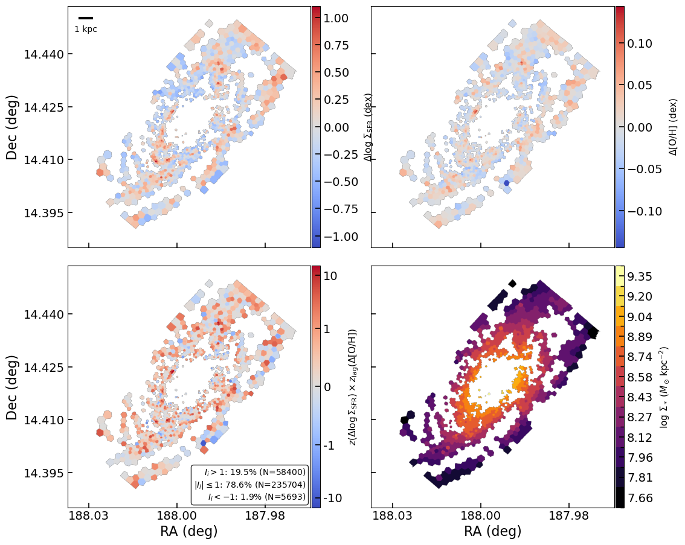
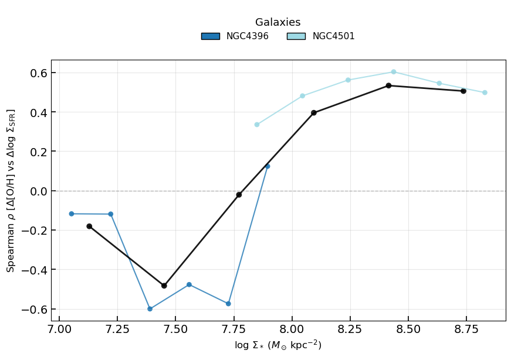
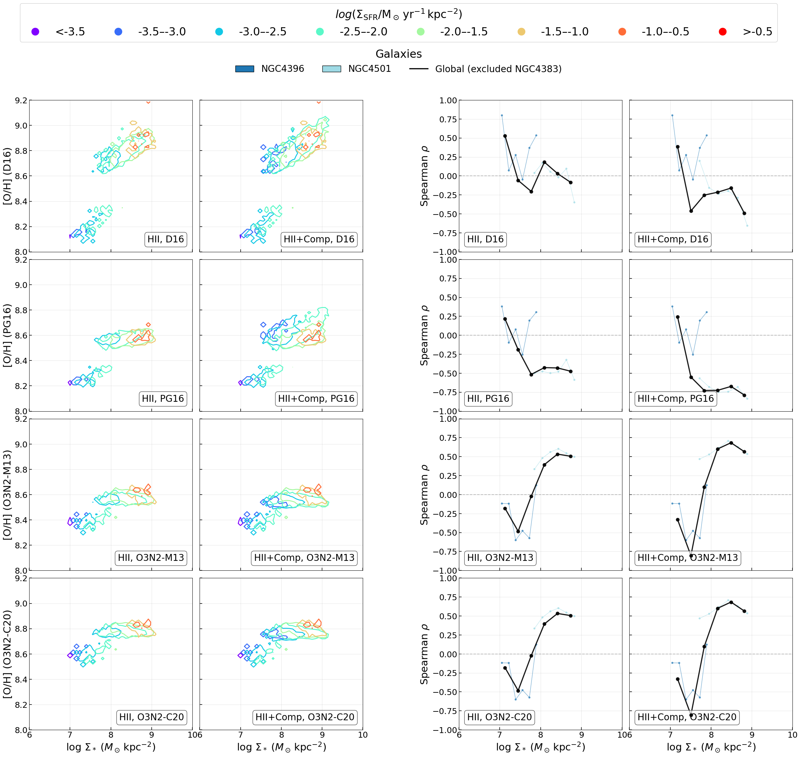

# 20260412 SNR200

I rerun the `nGIST` with $\mathrm{S/N}\geq200$ for NGC4396 (low-mass) and NGC4501 (high-mass) so that they are now in a more coarse resolution of $\sim 500$ pc, as requested by the referee. As expected, nothing changes. 

